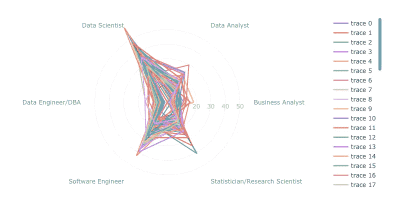

# 如何创建获奖的数据可视化

> 原文：<https://towardsdatascience.com/how-to-create-award-winning-data-visualizations-518127fc30ef?source=collection_archive---------3----------------------->

## 如何创建出色的数据可视化的分步指南。让您的数据脱颖而出的技巧和想法！

Chart from award-winning kernel from Kaggle competition. Let’s learn how to create it from scratch!

本周早些时候，我带着我的笔记本[在 Kaggle 的](https://www.kaggle.com/andresionek/is-there-any-job-out-there-kaggle-vs-glassdoor)[机器学习和数据科学调查竞赛](https://www.kaggle.com/c/kaggle-survey-2019)中获得了三等奖(6000 美元)【外面有工作吗？Kaggle vs 玻璃门。

虽然竞赛评估了我作品的几个方面，但我认为我展示信息的方式是获奖的关键。**在这里，我想分享一点构建数据可视化背后的思考过程，一步一步地说明。**

# 要绘制的数据

我的想法是衡量不同国家有多少人在不同的岗位(职称)上工作。

Data that I want to plot!

# 第一个情节

我选择使用 [Plotly](https://plot.ly/python/) 主要是因为我已经习惯了它，也因为我喜欢它提供的开箱即用的交互性。然而，我所应用的概念，以及我将要演示的概念，可以用于任何其他图形库或软件，与语言无关。

First attempt to plot data

First attempt to plot data by country

# 选择更好的绘图类型

我对这个可视化的条形图不满意。我想显示相同的信息，但允许比较不同的国家。为各个国家添加多个条形图看起来一点也不好。然后我试了一个折线图，因为添加多条线比多列效果更好。

Choosing a Line Plot

好多了…现在让我们尝试添加国家，而不是所有国家的总和。

Trying a line plot per country.

比栅栏看起来好多了。但还是不对。我的下一个想法是把 x 轴转换成径向。

Radial plot by country

这看起来很有趣！我想我可以继续使用这种图表类型。

# 将要绘制的数据从绝对数据更改为相对数据

一些国家比其他国家有更多的绝对行。这在图表中造成了失真，因此我将改变指标，绘制每个国家每个职位的相对百分比。它应该允许我们比较它们！

Plotting relative values (percentages)

确实！现在所有国家的规模都一样。按比例比较比绝对值比较好得多。

# 关闭线路

这有点棘手。要在 Plotly 上“关闭”雷达图，您需要将第一个数据点再次添加到末尾。

Radar chart, with all lines closed

# 在轴标题中创建层次结构

如果你看看轴，他们目前没有一个层次或任何特定的顺序。我想通过从最不专业到最专业的相似的职位名称来创建一个。对我来说，按照以下顺序组织是有意义的:

> 商业分析师< Data Analyst < Data Scientist < Data Engineer/DBA < Software Engineer < Statistician/Research Scientist

Adding a hierarchy to the axis

# Decluttering

This is the most important part of any good data visualization. Remove any noise that is not directly contributing to how people are reading and interpreting data.

## Turning background to white

Now that the background is white, we also need to change some other elements, such as grids, ticks and lines. Here my choices were:

*   Turn all text and chart elements to a light grey
*   Hide any chart grid and axis lines that are not essential. I only kept radial axis grid (the circles), because they are important for readers to understand the magnitude of the values displayed.

Declutter background

It looks much better now, doesn’t it?

## Smoothing all lines, and making them grey and thinner

Now we will transform all lines to grey, reduce their width and also make them less sharp by applying some smoothing.

Bringing lines to background

This is **好多了**！因为现在我们实际上可以“看到”每一行了！但正如他们所说，细节决定成败。让我们继续改进它吧！

## 删除图例，调整网格和范围

*   现在，我认为有太多的网格线(0，10，20，…，50)塞满了图表。我不喜欢它，相反，我将只创建三行(25%和 50%)。
*   我也不喜欢为一个传奇人物设定那么多的值，它们除了让我们的形象变得更糟之外，没有任何帮助。让我们把它藏起来！
*   有一行几乎超过了**数据科学家**轴标题，我将稍微增加一点范围以避免这种情况。

Hiding legends and adjusting grid

# 调整悬停信息

Hover does not look good

当我们将鼠标悬停在数据点上时，我们会看到 **r** 和**θ**值。这对于查看图表的任何人来说都没有信息。让我们在那里调整一些事情。

*   添加国家名称(这样无需多种颜色或图例，就可以轻松将该系列与国家联系起来)
*   添加数据点(这样很容易将每个数据点的值与每一行相关联)
*   将数据点格式化为不带小数点的百分比(不需要任何小数点，因为分析更加定性)

After adjusting hover information

# 讲故事

现在，我们将重点介绍一些我们想讲述的特定国家。在这张图表中，我选择美国对中国。我们将做什么:

*   为突出显示的国家/地区线条增添色彩
*   从国旗颜色中选择颜色(红色代表中国，蓝色代表美国)
*   增加突出显示的国家线的宽度
*   增加突出显示的国家线的不透明度
*   仅对突出显示的国家显示图例

Highlighting data to tell a story

现在我们用这些数据来讲述一些故事！我们能够看到中国和美国之间的差异！从这张图表中我们可以很容易地得出一些结论！

# 添加有意义的标题

现在，我们将向图表添加一个有意义的标题和数据源。

*   标题字体更大
*   源的较小字体
*   两者都是灰色的，不会引起太多注意

Adding title and source

# 将所有要素更紧密地联系在一起

使用 Plotly 的标准自动调整大小会导致所有元素彼此之间的间隔过大，让我们通过定义图表的高度和宽度大小来拉近它们。

另外对图例也做了一些小的调整:

*   将颜色更改为灰色
*   单击并双击时更改行为

Legend is now grey, all elements are more close together

# 为什么它是好的？

这个图表很容易让我们比较两个不同的国家。同时，它还保留了未被纳入相关报道的所有其他国家的数据，从而为报道提供了更多的背景信息。

读者的注意力会被吸引到数据本身，而不是其他图表元素。故事/比较突出显示且清晰，标题与故事相关。这个图表只讲述了一个故事。

颜色是明智的选择，也有意义(国旗颜色)。所有其他不属于故事的元素都以灰色背景。

这个消息来源被清楚地引用，并没有引起太多的关注。

# 关于如何进行出色的数据讲述的更多提示

## 保持所有图表相似

显示多个图表时，请坚持使用几种不同的图表类型。这样做的目的是让读者的生活更轻松，因为他们不需要学习如何阅读每一个新图表——在学习如何解释一个图表之后，阅读所有其他图表将是自动的。

## 在每个图表中坚持使用几种颜色

如果你突出显示的数据颜色没有任何意义(不像这个例子，他们对国旗的颜色进行编码)，那么你就不应该使用很多不同的颜色。尽量减少。

## 每个图表只讲一个故事

在一张图表中突出多种事物可能很有诱惑力。相反，创建各种图表来突出不同的东西，每个图表一个独特的故事。

# 请参阅构建这些图表的完整代码

[查看笔记本，其中包含用于创建此逐步指南的所有代码和数据。](https://www.kaggle.com/andresionek/how-to-create-award-winning-data-visualizations)