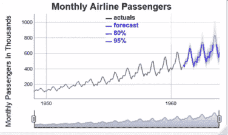
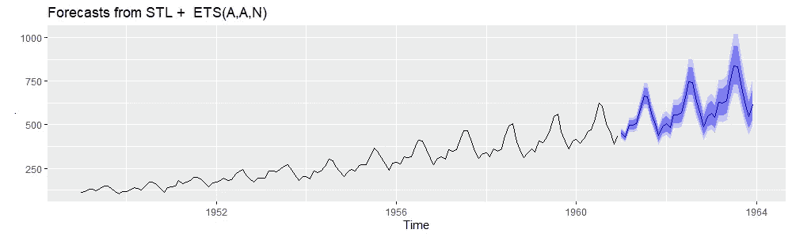
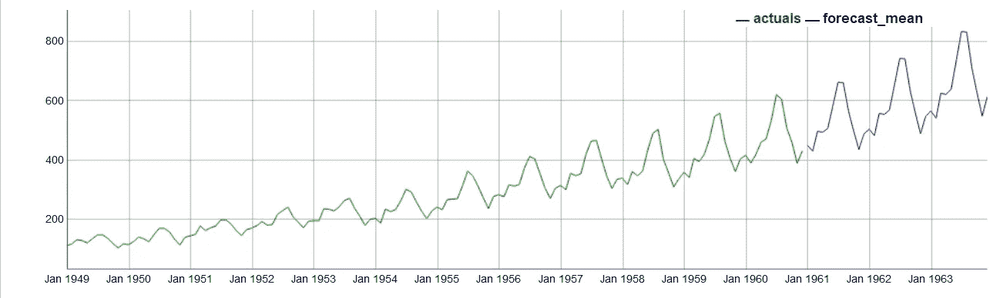
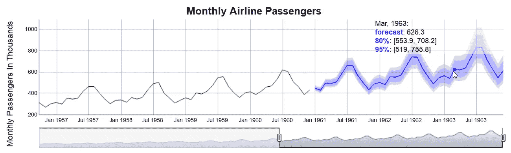

# 如何使用 R 和 dygraph 创建更好的交互式预测图

> 原文：<https://towardsdatascience.com/how-to-create-better-interactive-forecast-plots-using-r-and-dygraph-29bdd7146066?source=collection_archive---------19----------------------->

如果你对 R 和时间序列感兴趣，你一定会偶然发现罗伯·海曼的伟大的[预测包](http://pkg.robjhyndman.com/forecast/)。除了用于分析时间序列的各种工具和方法之外，它还扩展了 ggplot 以使用 autoplot 可视化预测对象。虽然这几乎不用代码就能产生很好的结果，但它不提供交互功能。在本文中，您将了解到…

*   如何使用交互式功能(如缩放、平移和鼠标悬停信息)绘制预测
*   如何在绘图中包含 80%和 95%的区间预测
*   如何编写 JavaScript 格式化程序来调整图例

这是结果的样子…

# 对预测对象使用自动批次

让我们先看看预测对象的基本自动绘图功能的结果。在经典的[航空公司数据集](https://stat.ethz.ch/R-manual/R-devel/library/datasets/html/AirPassengers.html)上创建一个 3 年预测，并绘制出结果，只需要三行代码。

code that forecasts and plots the air passenger time series

autoplot of a forecast object

你可以看到黑色的实际时间序列和蓝色的预测。预测区间(80%和 95%)也显示为蓝色区域。虽然这对于三行代码来说无疑是一个好结果，但是可以通过交互特性来改善这个结果。

# 将 dygraph 用于预测对象

JavaScript 库 [dygraph](http://dygraphs.com/) 可以创建交互式绘图，R 的这个库的接口也可以通过[dy graph 包](https://rstudio.github.io/dygraphs/)获得。

将上面的例子转换成使用 dygraph 只是增加了一行来绑定来自 forecast 对象的时间序列。

simple dygraph for a forecast object

basic dygraph showing actuals and point forecast

现在，虽然我们获得了 dygraph 的交互特性，但突然之间预测区间丢失了。在 dygraph 中，可以用所谓的误差线来绘制时间序列，以解决这个问题。由于 dygraph 只支持每个时间序列一个误差线，我们只是简单地为每个时间间隔添加一个时间序列。

*adding error bars for the interval forecasts*

dygraph showing actuals, point and interval forecasts

那看起来相当好，但是有一点东西不见了。如果将鼠标悬停在图表上，您将只能看到图例中的点预测值(上图中的 569.93)，而看不到相应的区间。

# 为预测间隔编写自定义格式化程序

使用`dyAxis`函数的`valueFormatter`参数，自定义 JavaScript 函数可以覆盖 dygraph 图例中值的格式。对于每个时间序列，将在鼠标悬停时调用 JavaScript 函数，该函数将接受六个参数:

*   `num`:当前时间序列鼠标悬停位置的值
*   `opts`:当前动态图的选项值
*   `seriesName`:当前时间序列的名称
*   `g`:实际的 dygraph 对象
*   `row`:鼠标当前所在位置的原始数据的行索引
*   `col`:当前时间序列的原始数据列索引

将传递给函数的值`num`不包括间隔值。但是，给定行和列索引的值可以从 dygraph 对象(函数`getValue`)中获得，并且将包含这个预测间隔。然后，我们可以根据自己的喜好对其进行格式化。重用内置的`Dygraph.numberValueFormatter`函数来格式化和传递选项值将保持对选项的支持，例如控制要显示的位数(参见`dyOptions`中的选项`digitsAfterDecimal`)。

请注意，dygraph 返回的值将是一个长度为 3 的向量，即使对于像实际时间序列这样只有一个值的时间序列也是如此。因此，在格式化为一个区间之前，我添加了检查上限值和下限值是否实际不同。

*custom JavaScript for formatting values in the legend*

此外，我对图表进行了一些额外的调整:

*   点预测的专用时间序列，用于将间隔预测与图例中的点预测分开
*   使用`dyLegend`函数中的选项`labelsSeparateLines`将每个标签放在一个单独的行上，这使得结果更具可读性
*   `dyRangeSelector`函数在图的底部放置了一个漂亮的选择器
*   使用选项`digitsAfterDecimal`将位数减少到一位
*   一个小的 CSS 保持图例半透明，以避免覆盖图形

*final code using dygraph for plotting forecast objects* plot

dygraph showing actuals, point and interval forecasts and custom legend

感谢您的阅读！