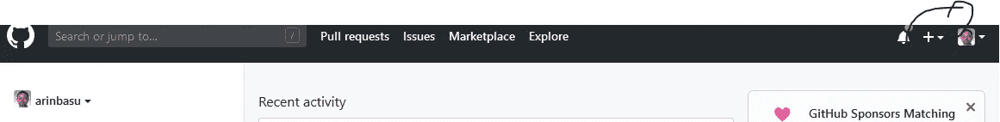
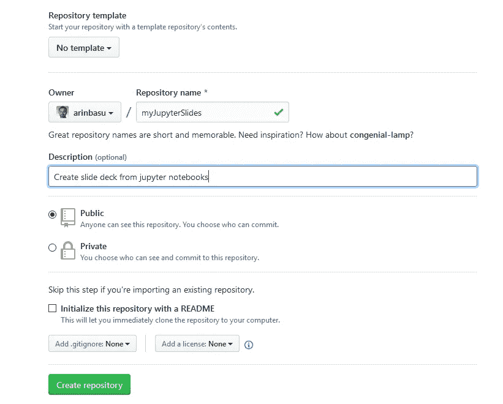
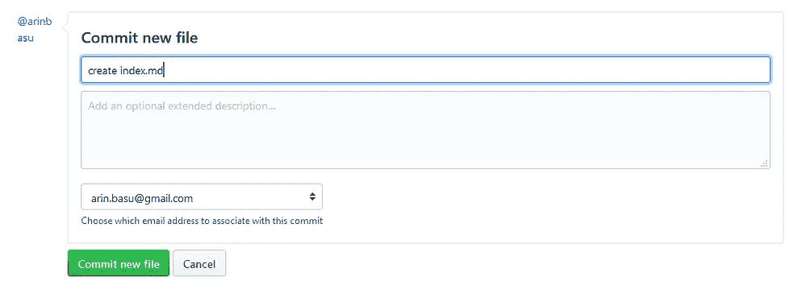
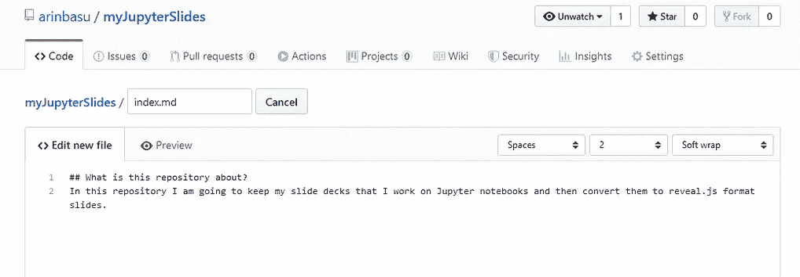
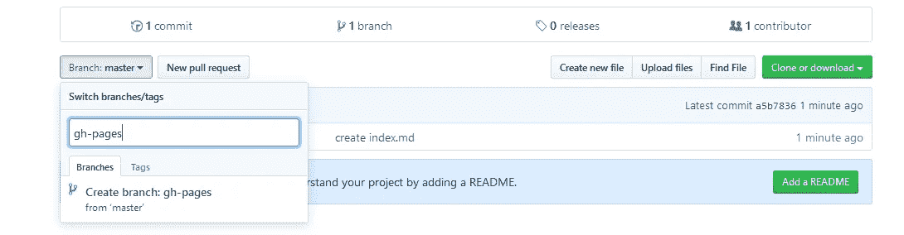
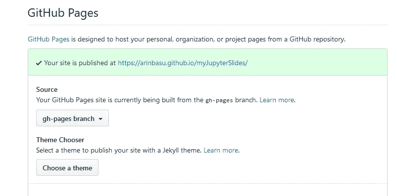

# 如何使用 jupyter 笔记本、reveal.js、github 上的主机创建数据驱动的演示文稿，并向世界展示:第一部分—制作基本的幻灯片

> 原文：<https://towardsdatascience.com/how-to-create-data-driven-presentations-with-jupyter-notebooks-reveal-js-e7a42a1fb7d7?source=collection_archive---------12----------------------->

…其中我讨论了一个工作流程，您可以开始在 jupyter 笔记本上写内容，创建 reveal.js 幻灯片，并将其放在 github 上进行演示。这是一个非常简单的演示，你可以完全控制自己


A first simple slide deck

第一部分:基本幻灯片组
第二部分:使用备注的基本幻灯片组
第三部分:高级技术

## 逐步地

**建立 github repo 并添加子模块**

***第一步*** 。首先创建一个 github 存储库来存放您的幻灯片。要做到这一点，请访问[https://www.github.com](https://www.github.com)并启动一个存储库，您还需要安装 git。我在 Vultr 上使用了一个托管实例，它附带了一个预装的 git。如果您使用 Windows、Mac 或 Linux，您可能希望安装 git，或者在您的终端中检查您已经安装了 git，方法是发出如下命令:

```
git --version
```



Click on the + sign to add a repository

***第二步*** 。添加存储库。例如，我创建了一个名为 *myJupyterSlides 的存储库，*请看下面的截图:



Created an empty repository to host jupyter notebook based slides

***第三步*** 。(仍然使用 web 界面)最好在主分支中创建一个 index.md 文件，并说明您将在此存储库中保存您的幻灯片。为此，您也可以使用“README.md”。现在让我们创建一个文件。下面您可以看到文件是这样创建的:



In step 3 create a new file labelled as index.md

***第四步*** 。(仍然使用 web 界面)，使用 web 界面，创建一个名为 gh-pages 的新“分支”(参见下面的截图，了解如何创建 gh-pages 分支)



Create gh-pages branch

一旦你创建了 gh-pages 分支，github 会自动为你创建一个网站。如果你在你的 github 储存库(“github repo”)上点击“设置”，就会显示你的站点已经发布。例如，如果下面的屏幕截图显示了我的站点在 github repo 中的发布位置:



Your site is published!

如果我点击这个链接，它会显示一个简单的网页。

您现在已经建立了一个发布幻灯片的网站。在接下来的步骤中，我们将使用 git repo 为我们的计算机(可以是本地计算机、实例或虚拟机)创建一个文件夹，我们将在其中构建幻灯片所需的文件。以下是步骤:

***第五步*** 。现在，在您的终端上，“克隆”git repo。首先，做一个目录(或者文件夹)。比如我做了一个名为“jupyterslides”的目录。我从当前目录切换到此目录(1)。然后初始化 git 文件夹(2)。之后，将 github repo 作为子文件夹添加到这个文件夹中(3)。您将看到添加了一个文件夹，其名称与您的 github repo 名称相同。

```
~$ cd jupyterslides (1)
~$ git init (2)
~$ git submodule add <your github https repo address> (3)
```

## 启动 Jupyter 笔记本/Jupyter 实验室并添加内容

***第六步*** 。现在您已经设置了 github repo，并且已经将该 repo 作为子模块添加到您的计算机或实例中，让我们开始构建幻灯片的内容。当您完成本教程时，您将从 Jupyter 笔记本中构建一个简单的演示文稿，并在 web 上显示。稍后，您将看到您可以为该演示文稿构建交互性以及更多高级功能。与 Keynote、Powerpoint 或 OpenOffice/LibreOffice Impress 不同，您将不会使用任何基于点击的系统来构建此类内容；相反，您将使用纯文本工具来构建演示文稿。因此，

*   第一步是开发 Jupyter 笔记本中的内容。
*   第二步是以编程方式将该笔记本转换为降价文档
*   第三步是使用' [pandoc](https://pandoc.org/index.html) '(一种通用文档转换器，也称为文档转换的瑞士军刀)将文档转换为一组幻灯片
*   第四步是将内容“推送”到 github repo，以便在互联网上显示

***第七步*** :在 Jupyter 笔记本中创建内容。—对于本教程，让我们创建一个包含五张幻灯片的演示文稿(这是为了演示)，其中包含:

*   标题幻灯片(我们稍后将添加标题幻灯片)
*   包含项目符号的幻灯片
*   包含图像的幻灯片
*   包含链接的幻灯片
*   包含表格的幻灯片

稍后我将向您展示，您可以使用这四个元素(项目符号、图像、链接和表格)来创建不同类型的演示。我还将向您展示如何为这些元素添加交互性。你可以使用 markdown 或用 R、Python 或 Julia(实际上还有许多其他语言)编写的代码在 Jupyter 笔记本上创建图像和表格。因此，现在是讨论四个相关问题的好时机:如何在 markdown 中创作内容，什么是 reveal.js 以及我们为什么使用它(还有其他问题)，以及幻灯片制作指南。

## 如何在 markdown 中创作内容

Markdown 是一个内容创作系统，设计用于在 web 上编写结构化文档。文档中的以下元素构成了 markdown 语法:

```
The following is an example of a table written in Markdown and will be rendered as a table in github flavoured markdown| Element of text    | Equivalent Markdown syntax        |
|--------------------|-----------------------------------|
| Heading levels     | Usually with ##                   |
| First level header | # Example of a first level header |
| Second level header| ## Second level header            |
| Paragraphs         | Text separated by two line spaces |
| Unnumbered list    | * this is an element              |
| Numbered list      | 1\. This is the first element      |
| Tables             | This is a markdown table          |
| Formula            | $\formula$                        |
| Images             |            |
| Hyperlinks         | [Link text](URL to be linked)     |
| References         | [@bibtex_entry_ID]                |
| Codes              | backticks (`code goes here`)      |
| Italic             | *text to be italicised*           |
| Bold               | **text to be in bold font**       |
| Underline          | _text to be underlined_           |
| Blockquote         | > Text to be blockquoted          |
```

在上面的代码块中，我已经为您提供了一个常用的降价惯例列表。关于 github 风味减价的更长列表和备忘单，[参见以下链接](https://github.com/adam-p/markdown-here/wiki/Markdown-Cheatsheet)

[](https://github.com/adam-p/markdown-here/wiki/Markdown-Cheatsheet) [## 亚当-p/markdown-这里

### Google Chrome、Firefox 和 Thunderbird 扩展，可以让你用 Markdown 编写电子邮件，并在发送前呈现。…

github.com](https://github.com/adam-p/markdown-here/wiki/Markdown-Cheatsheet) 

在 Jupyter 笔记本中，您可以在 markdown 中创作文档。Jupyter 笔记本使用 github flavoured markdown，这也是我们将使用的。此外，如果您想使用参考文献和引文，并且如果您想将文档转换为包含引文和参考文献列表的其他格式，我建议您使用 pandoc 将文档从 markdown 格式转换为所需格式。您可以在此了解更多关于 pandoc 以及如何使用 pandoc 传输文档的信息。以下 youtube 视频为您提供了更多关于 pandoc 的信息:

How to use pandoc, a video you can use to learn more about pandoc

我们将在本文档的单独一节中讲述如何使用 pandoc 创建幻灯片。现在，我们将使用 markdown 来编写幻灯片。我们将使用 next reveal.js 来设计我们的幻灯片。

## 什么是 reveal.js，为什么你会使用它

将 reveal.js 视为一个工具，您将使用它来呈现您创建的幻灯片。Revealjs 由三个元素组成:

*   CSS(呈现文档外观的级联样式表)
*   javascript 引擎(呈现幻灯片)，以及
*   您将创建的 HTML5 文档将显示为幻灯片

考虑您将展示的包含在`<section> and \<section>`元素中的每张“幻灯片”。所以，事情是这样的:

```
<html>
CSS statements
<section>
Your slide data will go here ...</section>
<javacript file>
</html>
```

这是基本结构。还有其他工具和框架，请查看。在本教程中，我们将介绍 revealjs，在后续教程中，我将介绍其中的几个。一些常见和流行的框架是:

*   [Impress.js](https://impress.js.org/#/bored)
*   [Shower.js](https://shwr.me/)
*   [Deck.js](http://imakewebthings.com/deck.js/)
*   [Remarkjs](https://github.com/gnab/remark) (我们将在下一个教程中介绍这一点)

我将在随后的帖子中涉及这些，所以这是我们将重点关注 revealjs 的一个帖子。

## 要让 revealjs 正常运行，您需要做些什么

***第八步*** 。从他们的 github repo 中获取一份 **reveal.js** 的副本，并在 Jupyter 笔记本的终端中使用 ***wget*** 命令，如下所示:

```
~$ cd myjupyterslides (1)
~$ wget [https://github.com/hakimel/reveal.js/archive/master.zip](https://github.com/hakimel/reveal.js/archive/master.zip) (2)
~$ unzip master.zip (3)
# this will create a folder named 'reveal.js-master'
# rename the folder to 'revealjs' with:
~$ mv reveal.js-master revealjs (4)
```

对上述代码块的解释:

1.  光盘 myjupyterslides (1)。—您将更改目录以进入 myjupyterslides，其中 myjupyterslides 是您之前创建的 github 存储库，因此当您添加 git 子模块时，它将作为文件夹添加到您当前的目录中
2.  wget <url>(2) wget 是一个帮助您下载 web 内容的实用程序，在这里是 revealjs 存储库的主分支</url>
3.  unzip master.zip (3)是不言自明的，它将解压文件并在当前目录中添加一个文件夹“reveal.js-master”
4.  mv reveal.js-master revealjs 是一种“重命名”文件夹的方法，所以现在你的文件夹被重命名为 revaljs。

在这一步的最后，您将使用 revealjs 创建幻灯片的本地副本。但是在我们开始整理内容之前，让我们学习一些关于创建幻灯片和数据可视化的良好实践。这是我将在本系列的后续文章中讨论的内容的高度浓缩版本，但将服务于本教程的目的。

## 关于创建幻灯片和数据可视化的说明

关于创建幻灯片和数据可视化的一些事情是有序的。

首先，牢记数据墨水五定律从[爱德华·塔夫特](https://www.edwardtufte.com/tufte/)，

1.  最重要的是，展示数据
2.  最大化数据油墨比率(每个油墨流更多数据)
3.  擦除非数据墨迹
4.  擦除多余的数据墨迹
5.  修订和编辑

有关上述概念的更详细解释，请查阅以下资料:

[](https://medium.com/plotly/maximizing-the-data-ink-ratio-in-dashboards-and-slide-deck-7887f7c1fab) [## 最大化仪表板和幻灯片中的数据-墨迹比率

### “最重要的是，展示数据。”

medium.com](https://medium.com/plotly/maximizing-the-data-ink-ratio-in-dashboards-and-slide-deck-7887f7c1fab) 

其他一些技巧包括:

*   编一个有开头、中间和结尾的故事
*   使用故事板来发展你的想法(参见 Garr Reynolds 和 Cliff Atkinson 的作品)

## 如何使用 Jupyter 笔记本从数据中绘制图表、曲线图和表格

让我们在 jupyter 笔记本中创建一个简单的五张幻灯片演示文稿。语法很简单，我们将创建如下的东西(你可以通过[访问这个链接](https://github.com/arinbasu/myJupyterSlides/blob/gh-pages/test5.ipynb)看到它看起来像一个 jupyter 笔记本)

```
## This is the first slide (1)
- We will create simple set of slides
- Let's analyse some data
- Create a figure from the data
- Create a tablelibrary(tidyverse) (2)mtcars1 <- mtcars %>% (3)
             head() 
mtcars1 # produces the first five rows in the form of a tablemtcars %>% (4)
  ggplot(aes(x = disp, y = mpg)) +
  geom_point() +
  geom_smooth(method = "loess", colour = "blue", se = FALSE) +
  geom_smooth(method = "lm", colour = "red", se = FALSE) +
  labs(x = "Engine size",
      y = "Miles per gallon",
      title = "Relationship between engine size and milage for cars") +
  theme_bw() +
  theme(panel.grid.major = element_blank(),
          panel.grid.minor = element_blank()) +
  ggsave("test5.png")
```

上述代码的解释:

(1)这是记录在降价模块中的第一张幻灯片。你可以移动这些块，这样你就可以在 Jupyter
中构建一个故事板(2)这是在代码窗口中编写的，并调用 R
中的 tidyverse 库(3) mtcars1 是从 mtcars 创建的数据子集，这是一个关于汽车的大型数据集；我们将使用它来演示以编程方式创建表格
(4)我们使用此代码以编程方式生成一个图

***第九步*** 。在我们使用 jupyter notebook 和在 jupyter notebook 中使用 R 生成这些图形和表格之后，我们将这个 Jupyter notebook 导出到 markdown 文档中。我们可以使用 jupyter notebook 本身来创建一组 reveal.js 幻灯片，但是首先导出到 markdown 会让您对幻灯片创建元素的某些方面有更多的控制。使用以下代码将 jupyter 笔记本转换为 markdown 文档:

```
~$ jupyter nbconvert -t markdown mynotebook.ipynb (1)
# generates mynotebook.md (2)
```

解释:

(1) mynotebook.ipynb 是我要转换的 jupyter 笔记本的名称
(2)这将生成 mynotebook.md markdown 文档

现在我们的减价文件看起来如下:

```
## This is the first slide
- We will create simple set of slides
- Let's analyse some data
- Create a figure from the data
- Create a table```R
library(tidyverse)
```── [1mAttaching packages[22m ─────────────────────────────────────── tidyverse 1.2.1 ──
    [32m✔[39m [34mggplot2[39m 3.1.1     [32m✔[39m [34mpurrr  [39m 0.3.2
    [32m✔[39m [34mtibble [39m 2.1.3     [32m✔[39m [34mdplyr  [39m 0.8.1
    [32m✔[39m [34mtidyr  [39m 0.8.3     [32m✔[39m [34mstringr[39m 1.4.0
    [32m✔[39m [34mreadr  [39m 1.3.1     [32m✔[39m [34mforcats[39m 0.4.0
    ── [1mConflicts[22m ────────────────────────────────────────── tidyverse_conflicts() ──
    [31m✖[39m [34mdplyr[39m::[32mfilter()[39m masks [34mstats[39m::filter()
    [31m✖[39m [34mdplyr[39m::[32mlag()[39m    masks [34mstats[39m::lag()```R
mtcars1 <- mtcars %>%
             head() 
mtcars1 # produces the first five rows in the form of a table
```<table>
<caption>A data.frame: 6 × 11</caption>
<thead>
 <tr><th></th><th scope=col>mpg</th><th scope=col>cyl</th><th scope=col>disp</th><th scope=col>hp</th><th scope=col>drat</th><th scope=col>wt</th><th scope=col>qsec</th><th scope=col>vs</th><th scope=col>am</th><th scope=col>gear</th><th scope=col>carb</th></tr>
 <tr><th></th><th scope=col>&lt;dbl&gt;</th><th scope=col>&lt;dbl&gt;</th><th scope=col>&lt;dbl&gt;</th><th scope=col>&lt;dbl&gt;</th><th scope=col>&lt;dbl&gt;</th><th scope=col>&lt;dbl&gt;</th><th scope=col>&lt;dbl&gt;</th><th scope=col>&lt;dbl&gt;</th><th scope=col>&lt;dbl&gt;</th><th scope=col>&lt;dbl&gt;</th><th scope=col>&lt;dbl&gt;</th></tr>
</thead>
<tbody>
 <tr><th scope=row>Mazda RX4</th><td>21.0</td><td>6</td><td>160</td><td>110</td><td>3.90</td><td>2.620</td><td>16.46</td><td>0</td><td>1</td><td>4</td><td>4</td></tr>
 <tr><th scope=row>Mazda RX4 Wag</th><td>21.0</td><td>6</td><td>160</td><td>110</td><td>3.90</td><td>2.875</td><td>17.02</td><td>0</td><td>1</td><td>4</td><td>4</td></tr>
 <tr><th scope=row>Datsun 710</th><td>22.8</td><td>4</td><td>108</td><td> 93</td><td>3.85</td><td>2.320</td><td>18.61</td><td>1</td><td>1</td><td>4</td><td>1</td></tr>
 <tr><th scope=row>Hornet 4 Drive</th><td>21.4</td><td>6</td><td>258</td><td>110</td><td>3.08</td><td>3.215</td><td>19.44</td><td>1</td><td>0</td><td>3</td><td>1</td></tr>
 <tr><th scope=row>Hornet Sportabout</th><td>18.7</td><td>8</td><td>360</td><td>175</td><td>3.15</td><td>3.440</td><td>17.02</td><td>0</td><td>0</td><td>3</td><td>2</td></tr>
 <tr><th scope=row>Valiant</th><td>18.1</td><td>6</td><td>225</td><td>105</td><td>2.76</td><td>3.460</td><td>20.22</td><td>1</td><td>0</td><td>3</td><td>1</td></tr>
</tbody>
</table>```R
mtcars %>%
  ggplot(aes(x = disp, y = mpg)) +
  geom_point() +
  geom_smooth(method = "loess", colour = "blue", se = FALSE) +
  geom_smooth(method = "lm", colour = "red", se = FALSE) +
  labs(x = "Engine size",
      y = "Miles per gallon",
      title = "Relationship between engine size and milage for cars") +
  theme_bw() +
  theme(panel.grid.major = element_blank(),
          panel.grid.minor = element_blank()) +
  ggsave("test5.png")
```Saving 6.67 x 6.67 in image```R```
```

***第十步。*** 我们将使用以下两个文档中的提示和原则来编写本文档，并使其“值得滑动”:

*   Reveal.js 文档(参见 https://github.com/hakimel/reveal.js#markdown[):从这个文档中，这几行对我们很有用:](https://github.com/hakimel/reveal.js#markdown)

```
It's possible to write your slides using Markdown. To enable Markdown, add the data-markdown attribute to your <section>elements and wrap the contents in a <textarea data-template> like the example below. You'll also need to add the plugin/markdown/marked.js and plugin/markdown/markdown.js scripts (in that order) to your HTML file.<section data-markdown>
	<textarea data-template>
		## Page title

		A paragraph with some text and a [link](http://hakim.se).
	</textarea>
</section>
```

我们会看到潘多克会为我们做到这一点。但是文件还在继续，

```
Special syntax (through HTML comments) is available for adding attributes to Markdown elements. This is useful for fragments, amongst other things.<section data-markdown>
	<script type="text/template">
		- Item 1 <!-- .element: class="fragment" data-fragment-index="2" -->
		- Item 2 <!-- .element: class="fragment" data-fragment-index="1" -->
	</script>
</section>
```

这部分需要解释一下。在这里，revealjs 开发人员将您的注意力引向您决定包含在幻灯片中的“降价元素”,并给出了一个列表元素的示例。还有其他元素(注意上面的列表)。你可以用这些类定义来控制每一个元素。但接下来会有一些关于幻灯片组中所有幻灯片行为的问题。这是他们谈论控制元素的地方，比如改变背景颜色，添加一个背景图片而不是一个有标题的图片，等等。以下是相关文档:

```
Slide AttributesSpecial syntax (through HTML comments) is available for adding attributes to the slide <section> elements generated by your Markdown.<section data-markdown>
	<script type="text/template">
	<!-- .slide: data-background="#ff0000" -->
		Markdown content
	</script>
</section>
```

我们将在本系列的后面部分利用这些信息来生成具有交互性的漂亮幻灯片。现在，我们会让 Pandoc 产生它能产生的东西。以下是 pandoc 文档中的更多信息:

*   关于创建幻灯片组的 Pandoc 文档(参见[https://pandoc . org/manual . html # producing-slide-shows-with-pandoc](https://pandoc.org/MANUAL.html#producing-slide-shows-with-pandoc))

从 pandoc 文档中，请注意:

```
By default, the *slide level* is the highest heading level in the hierarchy that is followed immediately by content, and not another heading, somewhere in the document. In the example above, level-1 headings are always followed by level-2 headings, which are followed by content, so the slide level is 2\. This default can be overridden using the [--slide-level](https://pandoc.org/MANUAL.html#option--slide-level) option.The document is carved up into slides according to the following rules:
* A horizontal rule always starts a new slide.
* A heading at the slide level always starts a new slide.
* Headings *below* the slide level in the hierarchy create headings *within* a slide.
* Headings *above* the slide level in the hierarchy create “title slides,” which just contain the section title and help to break the slide show into sections. Non-slide content under these headings will be included on the title slide (for HTML slide shows) or in a subsequent slide with the same title (for beamer).
* Headings *above* the slide level in the hierarchy create “title slides,” which just contain the section title and help to break the slide show into sections. Non-slide content under these headings will be included on the title slide (for HTML slide shows) or in a subsequent slide with the same title (for beamer).
* A title page is constructed automatically from the document’s title block, if present. (In the case of beamer, this can be disabled by commenting out some lines in the default template.)
```

遵循这些规则，就有可能构建一系列幻灯片，这些幻灯片可以根据我们的大多数需求进行修改。在本教程中，我们将创建一组简单的幻灯片，因此我们不会深入研究不同的选项。在随后的文章中，我们将探索多种方式来“调整”幻灯片的外观，并为幻灯片添加交互性。

这里，简而言之，至少:

*   我们将添加一个标题页
*   我们将插入一些滑动分隔器
*   我们将删除代码块

在这些更改完成后，最终的 markdown 文档如下所示:

```
--- (1)
title: A first simple slide deck
author: Me Myself
date: 9th August, 2019
---## This is the first slide (2)
- We will create simple set of slides
- Let's analyse some data
- Create a figure from the data
- Create a table---------- (3)
<table>
<caption>A data.frame: 6 × 11</caption>
<thead>
 <tr><th></th><th scope=col>mpg</th><th scope=col>cyl</th><th scope=col>disp</th><th scope=col>hp</th><th scope=col>drat</th><th scope=col>wt</th><th scope=col>qsec</th><th scope=col>vs</th><th scope=col>am</th><th scope=col>gear</th><th scope=col>carb</th></tr>
 <tr><th></th><th scope=col>&lt;dbl&gt;</th><th scope=col>&lt;dbl&gt;</th><th scope=col>&lt;dbl&gt;</th><th scope=col>&lt;dbl&gt;</th><th scope=col>&lt;dbl&gt;</th><th scope=col>&lt;dbl&gt;</th><th scope=col>&lt;dbl&gt;</th><th scope=col>&lt;dbl&gt;</th><th scope=col>&lt;dbl&gt;</th><th scope=col>&lt;dbl&gt;</th><th scope=col>&lt;dbl&gt;</th></tr>
</thead>
<tbody>
 <tr><th scope=row>Mazda RX4</th><td>21.0</td><td>6</td><td>160</td><td>110</td><td>3.90</td><td>2.620</td><td>16.46</td><td>0</td><td>1</td><td>4</td><td>4</td></tr>
 <tr><th scope=row>Mazda RX4 Wag</th><td>21.0</td><td>6</td><td>160</td><td>110</td><td>3.90</td><td>2.875</td><td>17.02</td><td>0</td><td>1</td><td>4</td><td>4</td></tr>
 <tr><th scope=row>Datsun 710</th><td>22.8</td><td>4</td><td>108</td><td> 93</td><td>3.85</td><td>2.320</td><td>18.61</td><td>1</td><td>1</td><td>4</td><td>1</td></tr>
 <tr><th scope=row>Hornet 4 Drive</th><td>21.4</td><td>6</td><td>258</td><td>110</td><td>3.08</td><td>3.215</td><td>19.44</td><td>1</td><td>0</td><td>3</td><td>1</td></tr>
 <tr><th scope=row>Hornet Sportabout</th><td>18.7</td><td>8</td><td>360</td><td>175</td><td>3.15</td><td>3.440</td><td>17.02</td><td>0</td><td>0</td><td>3</td><td>2</td></tr>
 <tr><th scope=row>Valiant</th><td>18.1</td><td>6</td><td>225</td><td>105</td><td>2.76</td><td>3.460</td><td>20.22</td><td>1</td><td>0</td><td>3</td><td>1</td></tr>
</tbody>
</table>------ (4)
```

此代码块的解释:

①这是序言。Pandoc 将首先寻找这个块，如果找不到，它将发出警告。包括至少一个标题、日期信息和作者姓名
(2)这是具有两个散列的第一幻灯片组，说明它是第二级标题，并且由于它后面是内容，因此这被认为是基础级 2
(3)将在下一张幻灯片中张贴表格的分隔符
(4)将在下一张幻灯片中张贴图表的分隔符

***第十一步。*** 本文档保存为‘test 5 . MD’。我们现在将使用 pandoc 将这个 markdown 文档转换成 html。为此，我们键入以下代码(假设您位于正确的文件夹中):

```
~$ pandoc -t revealjs -s -o {output filename.html} {input markdown file name} -V revealjs-url={file or absolute URL}
```

所以，在我们的例子中:

*   pandoc 是程序
*   revealjs = revealjs
*   输出文件 name.html = test5.html
*   输入文件名= test5.md
*   revealjs-url =。/reveal js(reveal js 所在的文件夹)

因此，我们有:

```
~$ pandoc -t revealjs -s -o test5.html test5.md -V revealjs-url=./revealjs
```

如果一切顺利，这将产生 test5.html 文件。

**第十二步*。*** 现在我们将文件夹连接到 git，并将文件夹提交到 github 库。为此，我们:

```
~$ git checkout -b gh-pages (1)
~$ git add . (2)
~$ git commit -m "added the slide deck files" (3)
~$ git push origin gh-pages (4)
```

解释:
(1) git checkout 是您用来切换到您之前创建的 gh-pages 分支的命令，该分支允许您托管您的幻灯片
(2) git add。是您用来添加 git 文件夹中所有内容的命令
(3) git commit -m 表示您添加了一个文本来指示您在该点做了什么:这是您的版本控制
(4) git push origin gh-pages 表示您将文件添加到了您的 gh-pages 分支，它们将从该分支发布

如果一切正常，你的网站将在一分钟后上线(有时，需要更长时间，耐心是一种美德)。假设您的用户名是“someusername ”,并且您创建了一个名为“jupyterslidedeck”的 github 存储库，您的站点将位于:

```
https://someusername.github.io/jupyterslidedeck/test5.html
```

它将如下所示:


Your first set of deck

## 摘要

现在，您已经创建了一个幻灯片。这还远远没有完成，因为你会看到表看起来不太好，图中显示了图像，但它可以更好地对齐，等等。你可能还想添加更多的幻灯片，和更多的互动。我们将在本系列的下一篇文章中解决这些问题。因此，至少总结一下我们所做的事情:

1.  启动一个包含你的幻灯片的 github 库，比如“我的幻灯片”
2.  使用终端将此 github 存储库的子模块添加到您的“实例”或机器(Mac/Linux/Windows)中；这将创建一个名为“myslides”的文件夹
3.  将目录(cd)更改为我的幻灯片
4.  使用 wget 命令在该文件夹中获取一个 revealjs git repo zip(master . zip)副本，然后使用 unzip 命令解压缩所有内容，然后将 reveal.js 文件夹重命名为 reveal js(可选)
5.  在 myslides 文件夹中启动一个 jupyter 笔记本文件，并编写带有图表、表格、列表和文本的幻灯片文档
6.  使用`jupyter nbconvert --to markdown`将 ipynb 文件转换为 markdown 文件格式
7.  在 Jupyter 中打开生成的 markdown 文件，添加标题块，添加分隔符，删除(或者您可以保留)代码块等等
8.  使用 pandoc 通过`pandoc -t revealjs -s -o whatever.html whatever.md -V revealjs-url=./revealjs`将降价文件转换成 html
9.  当然，第 8 步假设 whatever.md 是您的 markdown 文件名，revealjs 是您从 revealjs git repo 下载并解压缩 master.zip 文件的文件夹
10.  现在切换到 gh-pages 分支，将文件添加到 git repo，提交更改，并推送到您的 git repo。您的幻灯片将会实时播放

从现在起，对幻灯片的任何更改，您可以直接在 markdown 文件中进行，也可以在 jupyter 笔记本中进行，然后重新运行上面列表中的步骤 6 到 10。