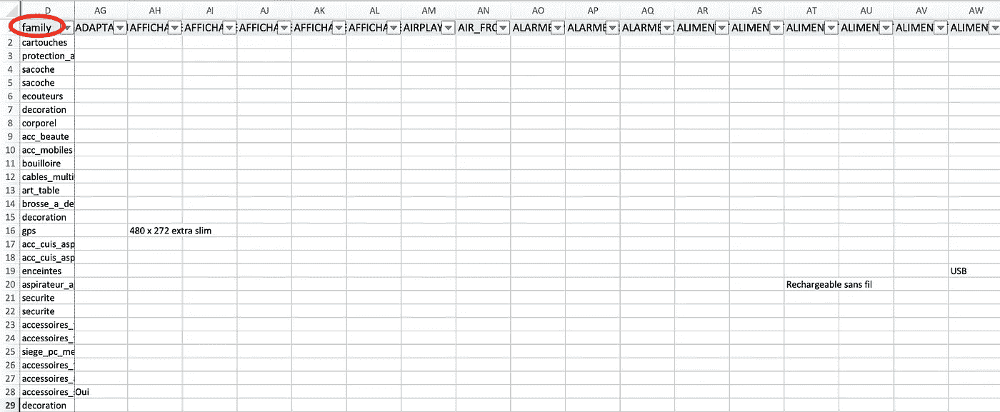
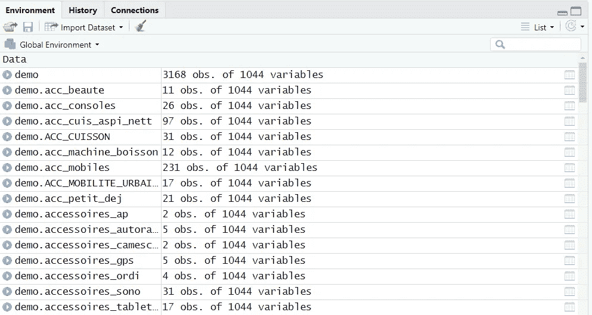
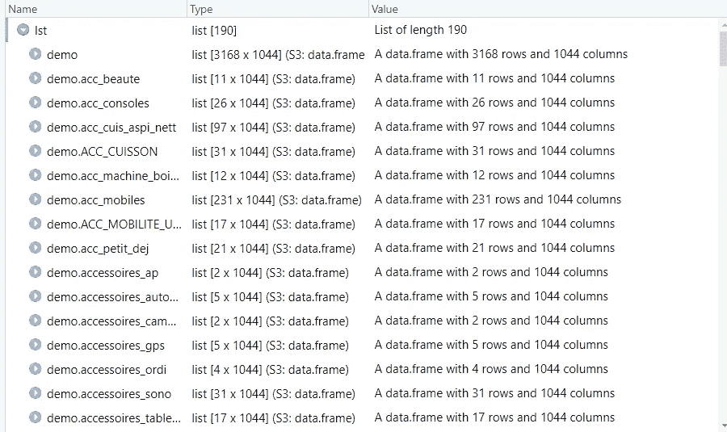
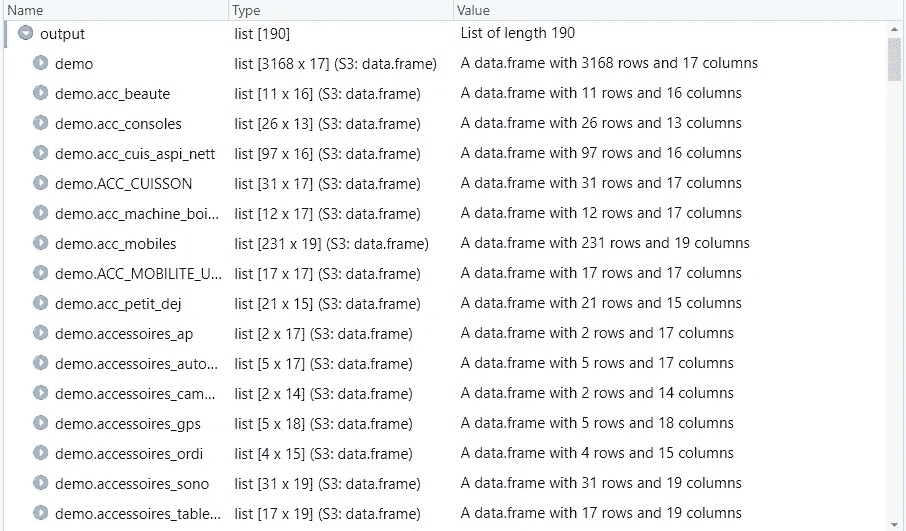
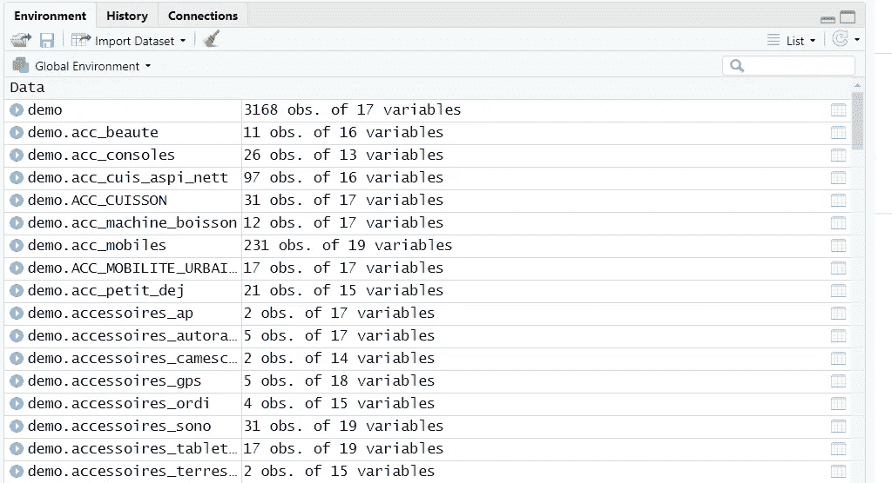
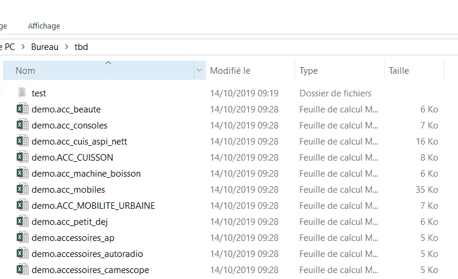
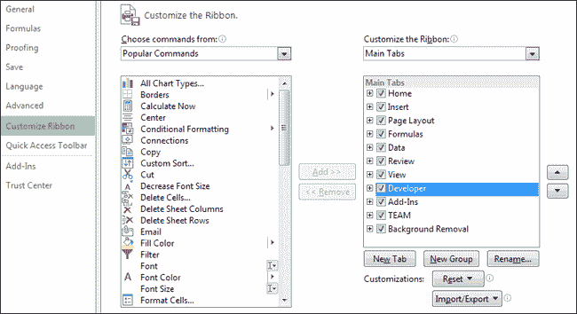
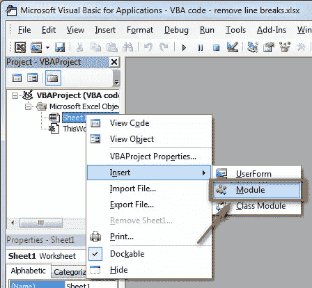
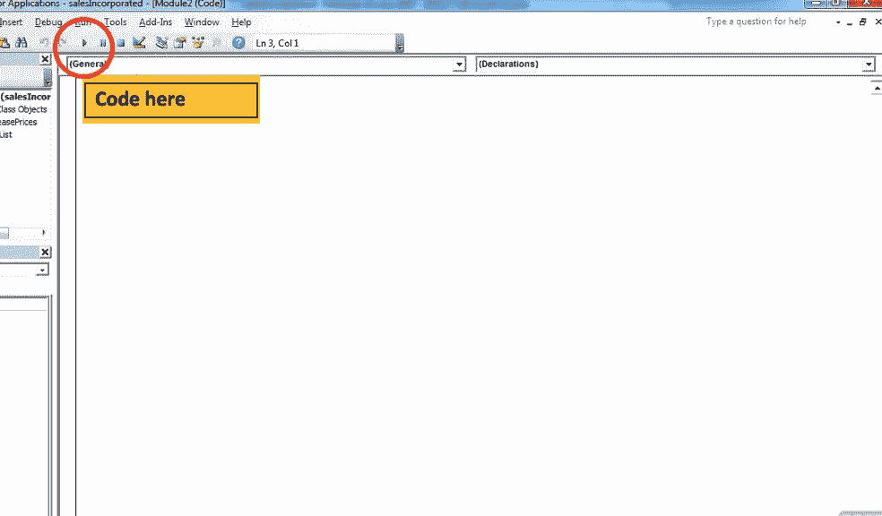
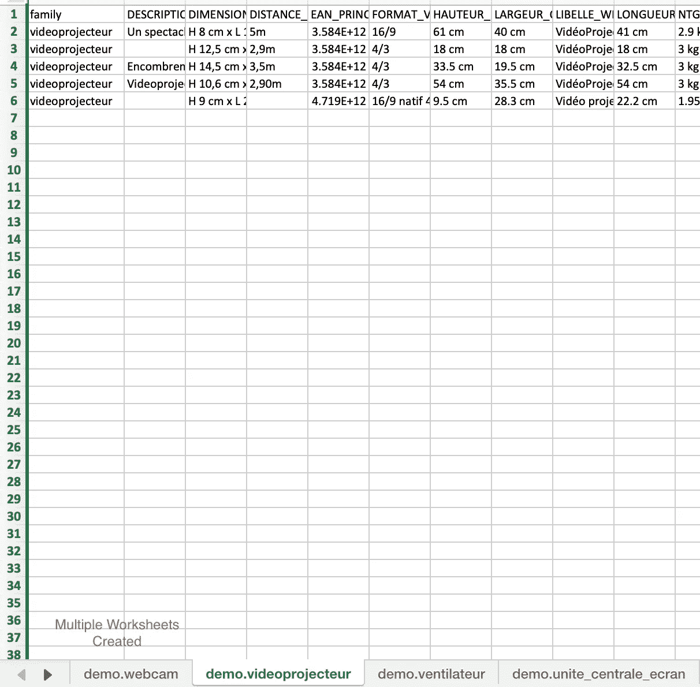

# 如何从列值列表中创建多个工作表，并使用 R 和 VBA 自动删除任何空列

> 原文：<https://towardsdatascience.com/how-to-create-multiple-worksheets-from-a-list-of-column-values-and-delete-any-empty-columns-4b121b659164?source=collection_archive---------22----------------------->


Photo by [Zan](https://unsplash.com/@zanilic?utm_source=unsplash&utm_medium=referral&utm_content=creditCopyText) on [Unsplash](https://unsplash.com/s/photos/software?utm_source=unsplash&utm_medium=referral&utm_content=creditCopyText)

有时候，我们会面临一些我们认为非常容易解决的问题，但实际上在现实生活中并不那么容易。两个很好的例子是根据单元格值将一个大的工作表拆分成多个工作表，并为每个工作表删除大量的空列。让我更详细地解释给你听。

# **有哪些问题？**



假设我们收到了一个这样的文件，并希望基于系列值创建多个工作表。共有 189 种不同的家庭价值观。手动执行这项任务或使用数据透视表效率不高，可能会导致一些内存问题。为此，我们将使用 R 和 VBA。

此外，在分割工作表后，我们将通过删除任何空列来清理每个工作表。该文件有 1，044 列，有些工作表有超过 100 个不连续的空列。

# **1。根据列值将一个大工作表拆分成多个工作表**

首先，我们导入数据并安装软件包。之后，我们检查 family 列中唯一值的数量，并设置工作目录，这样我们的文件就可以保存在一个地方。

```
install.packages('dplyr')
library(dplyr)#importing the file
demo <- read.csv("C:/Users/kewon-de/Desktop/tbd/demo.csv.txt", sep=";")#checking the # of values in the family column
length(unique(demo[["family"]])) #189# setting the working directory
setwd("C:/Users/kewon-de/Desktop/tbd")
```

使用下面的 R 代码，我们可以根据列值快速创建多个工作表。该程序循环遍历列值(=族)列表，并创建多个数据框。这些数据框以后会变成工作表。

```
for(i in (demo$family)) {
  name <- paste("demo", i, sep = ".")
  assign(name, demo[demo$family==i,])
}
```



data frames with empty columns

# **2。删除任何空列**

创建数据框后，我们现在可以检查是否有任何空列。首先，我们应该将所有数据帧放入一个列表中，这样我们就可以对列表应用一个函数(一次对所有数据帧应用函数)。下面的函数将去掉只有 na、null、无信息和 0 的列。在此之后，我们可以解压缩数据帧并验证列的数量——空列是否被正确删除。

```
lst<- mget(ls(pattern='^demo')) # putting 'demo' dataframes into a listoutput <- lapply(lst, function(df) Filter(function(x)!all(is.na(x) || is.null(x) || x == "" || x == 0),df))list2env(output,envir=.GlobalEnv)#unzipping the list
```

在清理空列之前，有 1044 列。



list of data frames before cleaning the empty columns

清理后，数据帧的数量变为 13 至 19 列。



list of data frames after cleaning the empty columns



clean data frames with no empty columns

解压缩列表时，干净的数据帧会替换旧的数据帧，如上所示。

*   如果只想移除几个数据框的空列，可以使用此代码手动完成。

```
demo.acc_consoles <- Filter(function(x)!all(is.na(x) || is.null(x) || x == "" || x == 0), demo.acc_consoles)
```

# 3.将干净的数据帧导出为 CSV 格式

既然所有的数据帧都是干净的，我们可以使用下面的代码将它们导出为 CSV 文件。

```
install.packages("xlsx")
library(xlsx)
for(i in names(output)){
  write.xlsx(output[[i]], paste0(i,".xlsx"),sheetName = i)
}
```

下面是在 r 中曾经是数据帧的 CSV 文件。



data frames in CSV

# 4.将 Excel 文件合并成一个文件

文件夹里有多个 excel 文件就没那么方便了；我们不能浏览产品。让我们用 VBA 把所有的 excel 文件合并成一个，这样我们就不用一次又一次地打开文件了。

在 excel 中，进入**文件**，点击**选项**，添加**开发者。**



当 VBA 屏幕弹出时，右击 **Sheet1** 并插入**模块。**



当模块弹出时，在屏幕上插入以下代码，并单击绿色箭头按钮运行代码。不要忘记添加您自己的 excel 文件所在的路径。

```
Sub GetSheets()
Path = "insert your own path here"
Filename = Dir(Path & "*.xls")
Do While Filename <> ""
Workbooks.Open Filename:=Path & Filename, ReadOnly:=True
For Each Sheet In ActiveWorkbook.Sheets
Sheet.Copy After:=ThisWorkbook.Sheets(1)
Next Sheet
Workbooks(Filename).Close
Filename = Dir()
Loop
End Sub
```



module

运行代码时，文件夹中的 excel 文件会自动合并成一个。



最后，我们有一个包含 189 个工作表的 excel 文件，中间没有空列。

本文分为两个部分:1)如何基于列值创建多个工作表 2)如何删除不连续的空列。您可以根据自己的需要简单地选择一个部分。

谢谢你看我的文章！如果你喜欢我所做的，不要犹豫，在 [GitHub](https://github.com/dkewon) 上关注我，在 [Linkedin](https://www.linkedin.com/in/deborah-kewon/) 上与我联系。

另外，请随意查看我的其他文章:

[如何获得关于货币汇率的 Twitter 通知:网络抓取和自动化](/how-to-get-twitter-notifications-on-currency-exchange-rate-web-scraping-and-automation-94a7eb240d60)

[数据块:如何在本地计算机上将数据帧保存为 CSV 文件](/databricks-how-to-save-files-in-csv-on-your-local-computer-3d0c70e6a9ab)

[使用 R Regex (Easy)从文本中提取关键字](https://medium.com/@deborahkewon/extracting-information-from-a-text-in-5-minutes-using-r-regex-520a859590de)