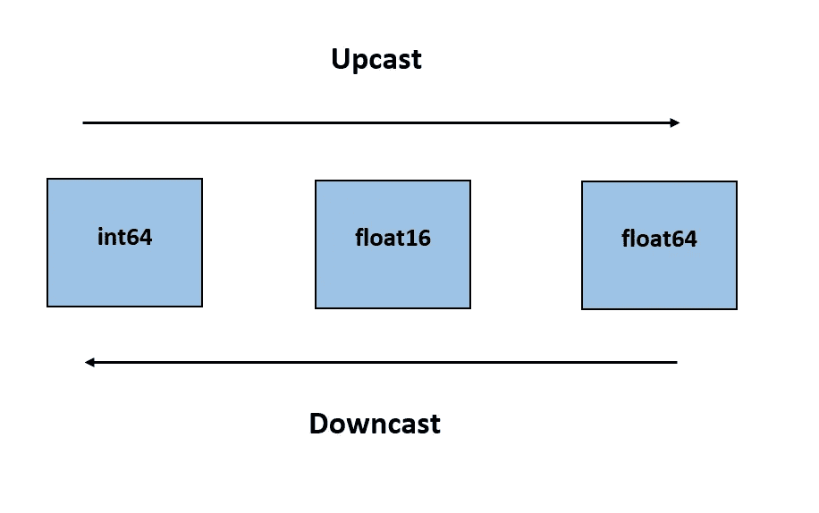
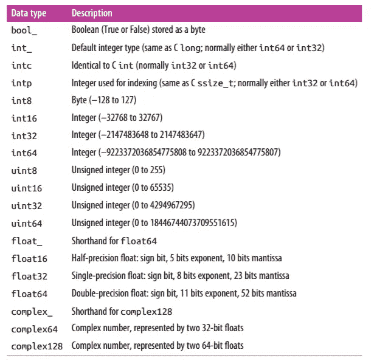

# 如何从头开始创建 NumPy 数组？

> 原文：<https://towardsdatascience.com/how-to-create-numpy-arrays-from-scratch-3e0341f9ffea?source=collection_archive---------13----------------------->

## 本教程是关于理解 NumPy python 包和从头开始创建 NumPy 数组的。


Credits: [GitHub](https://github.com/numpy/numpy.org/issues/37)

不管数据如何，分析它们的第一步是将它们转换成一组数字。有效地进行数据科学的基本过程是存储和操作数值数组。因此 Python 有专门的工具来处理数字数组:

1.  **NumPy 包**
2.  **熊猫套餐**

本教程只关注 NumPy 包。然而，熊猫包装文件将在晚些时候提供。教程的完整代码可以在下面我的 [**GitHub 库**](https://github.com/Tanu-N-Prabhu/Python/blob/master/How_to_create_NumPy_arrays_from_scratch%3F.ipynb) 中找到:

[](https://github.com/Tanu-N-Prabhu/Python/blob/master/How_to_create_NumPy_arrays_from_scratch%3F.ipynb) [## 塔努-北帕布/Python

### 此时您不能执行该操作。您已使用另一个标签页或窗口登录。您已在另一个选项卡中注销，或者…

github.com](https://github.com/Tanu-N-Prabhu/Python/blob/master/How_to_create_NumPy_arrays_from_scratch%3F.ipynb) 

# **什么是 NumPy？**

NumPy 代表 ***数值 Python。*** NumPy 提供了一种高效的方式来存储和操作密集数据缓冲区。在 NumPy 库的帮助下，我们可以创建和操作数组来存储数据。在某些方面，NumPy 的数组就像 Python 的 list 内置函数。

# 如何执行 NumPy 并检查其版本？

让我们开始吧。你可以在你喜欢的 python 编辑器中执行下面的程序，比如 [**PyCharm**](https://www.jetbrains.com/pycharm/) ， [**Sublime Text**](https://docs.anaconda.com/anaconda/user-guide/tasks/integration/sublime/) ，或者笔记本比如 [**Jupyter**](https://jupyter.org/) 和 [**Google Colab**](https://colab.research.google.com/notebooks/welcome.ipynb) 。选择一个你喜欢的 IDE 基本上是你的喜好。我使用 [**Google Colab**](https://colab.research.google.com/notebooks/welcome.ipynb) 来编写我的代码，因为它给了我大量的选项来提供好的文档。此外，请访问 [**NumPy 网站**](https://numpy.org/) 以获得有关安装过程的更多指导。

一旦在 IDE 上安装了 NumPy，就需要导入它。检查库的版本通常是一个好习惯。所以要安装 NumPy 库，你需要使用下面的代码。

```
import numpy
print(numpy.__version__)**1.17.4**
```

只要确保你是最新的 NumPy 版本就可以使用所有的功能和选项。与其用"***【numpy】***"我们可以用一个别名作为"***【NP***"。这就是所谓的“ ***走样*** ”。现在使用别名的要点是我们可以使用" ***np*** "而不是" ***numpy*** "，每次使用它的方法时都需要键入很长的时间。因此，创建别名并检查版本可以如下所示:

```
import numpy as np
print(np.__version__)**1.17.4**
```

从现在起，我们每次都可以用“ **np** ，而不是“ **numpy** ”。

# **为什么有了 python 的固定类型数组，Numpy 数组就出现了？**

Python 提供了几种不同的选项来存储高效的固定类型数据。Python 有一个内置的数组模块叫做“ **array** ，用来创建统一类型的数组。这是它的主要缺点。

```
import array# Creating an array
print(array.array('i', [1, 2, 3, 4, 5]))**array('i', [1, 2, 3, 4, 5])**
```

这里的“ ***i*** ”表示整数数据。我们不能尝试在数组模块中存储其他类型的数据。这通常会导致错误。

```
import array# Creating an array
print(array.array('i', [1, 2.0, 3, 4, 5]))**--------------------------------------------------------------------****TypeError            Traceback (most recent call last)**[**<ipython-input-25-49d63cb1f570>**](/<ipython-input-25-49d63cb1f570>) **in <module>()
----> 1 array.array('i', [1, 2.0, 3, 4, 5])****TypeError: integer argument expected, got float**
```

然而，Python 的数组模块提供了基于数组的数据的高效存储。但是 NumPy 数组可以对这种类型的数据执行有效的操作。有两种方法可以创建 NumPy 数组:

1.  从 Python 列表创建 NumPy 数组
2.  从头开始创建 NumPy 数组

# 从 Python 列表创建 NumPy 数组

我们可以使用[**NP . array**](https://docs.scipy.org/doc/numpy/reference/generated/numpy.array.html)**方法从 python 列表中创建数组。**

```
import numpy as np# Creating a list named "a"
a = [1, 2, 3, 4, 5]
print(type(a))**<class 'list'>**# Creating a numpy array from the list
print(np.array(a))**[1 2 3 4 5]**print(type(np.array(a)))**<class 'numpy.ndarray'>**
```

**NumPy 库仅限于具有相同类型的数组，如果存在类型不匹配，则可能的话会向上转换。考虑下面的例子:**

```
import numpy as np# Creating a list named "a"
a = [1, 2.0, 3, 4, 5]
print(type(a))**<class 'list'>**# Creating a numpy array from the list
print(np.array(a))**[1\. 2\. 3\. 4\. 5.]**print(type(np.array(a)))**<class 'numpy.ndarray'>**
```

**因此，原来的列表是具有一个浮点值的整数，但是 numpy 数组将其向上转换为所有的 ***浮点数*** 。整数被向上转换为浮点数。下面是一个小图表，给你足够的知识来理解向上转换和向下转换。**

****

**Numpy upcast and downcast**

**显式设置数据类型也是可能的。这可以使用关键字“ ***dtype*** ”来完成。**

```
import numpy as np# Creating a list named "a"
a = [1, 2, 3, 4, 5]# Creating a numpy array from the list
np.array(a, dtype='float64')print(np.array(a, dtype='float64'))**[1\. 2\. 3\. 4\. 5.]**
```

**从上面的例子可以看出，通过使用关键字“ ***dtype*** ”将整数类型的列表数据转换为浮点类型的数据。**

**Numpy 数组也可以是 ***多维的(数组中的数组)。这是做这件事的一种方法。*****

```
import numpy as np# Creating a list named "a"
a = [1, 2, 3, 4, 5]# Creating a numpy array from the list
np.array([range(i, i + 4) for i in a])**[[1 2 3 4]  
 [2 3 4 5]  
 [3 4 5 6]  
 [4 5 6 7]  
 [5 6 7 8]]**
```

> *****提示*** :只需将“I”的值递增 1 (i+1，2，3，4，…)这样做也可以增加数组的维数。上述阵列被视为 2D 阵列。**

# **从头开始创建 NumPy 数组**

**Numpy 数组实际上用于创建更大的数组。使用 numpy 包库从头开始创建大型数组效率更高。下面是一些从头开始创建 numpy 数组的例子。**

1.  ****创建一个长度为 5 的零填充的数组****

**我们可以使用名为 ***零*** 的 numpy 内置方法来实现这一点，如下所示:**

```
import numpy as np# Creating a numpy array of zeros of length 5
print(np.zeros(5, dtype='int'))**[0 0 0 0 0]**
```

**有一些标准的 numpy 数据类型可用。我不能一口气讨论所有的问题。大部分都没用过。所以我将以图表的形式提供 numpy 数组的数据类型。如果你不知道如何使用数据类型，请参考**显式更改其上面的数组数据类型**→***dtypes = "数据类型的名称"*****

****

**Credits: [Python Data Science Hand Book](https://tanthiamhuat.files.wordpress.com/2018/04/pythondatasciencehandbook.pdf)**

****2。创建一个用 1 填充的 3 x 4 数组****

**感谢 NumPy，因为我们不必将数组放在循环语句中(我讨厌这样做；)).你所要做的就是在 ***numpy.one*** 方法中提到你希望你的数组包含的行和列。**

```
import numpy as np# Creating a numpy array of 1’s which should have 3 rows and 4 columnsprint(np.ones((3, 4)))**[[1\. 1\. 1\. 1.]  
 [1\. 1\. 1\. 1.]  
 [1\. 1\. 1\. 1.]]**
```

**所以数字 3 →行和 4 →显然是列。**

****3。用特定的数字填充 numpy 数组****

**到目前为止，我们已经看到用 0 和 1 填充数组，但是我们还应该知道 numpy 允许我们用我们选择的任何特定数字填充数组。我们可以借助 ***numpy.full*** 方法来做到这一点。例如，让我们用数字 **500** 填充数组。**

```
import numpy as np# Creating a numpy array of 500’s which should have 3 rows and 4 columnsprint(np.full((3, 4), 500))**[[500 500 500 500]  
 [500 500 500 500]  
 [500 500 500 500]]**
```

**在 full 方法的帮助下，我们可以向数组中添加任意数量的元素。**

****4。创建随机数的 numpy 数组****

*****均匀分布→*** 它是所有结果发生的可能性相等的概率分布。例如，投掷硬币的概率是均匀分布的，因为结果很可能是正面或反面。两者不可能同时存在。**

**NumPy 包库为我们提供了一种生成随机数的均匀分布方法，名为***NumPy . random . uniform***。**

```
import numpy as np# Create a 3x3 array of uniformly distributed 
# random values between 0 and 1print(np.random.random((3, 3)))**[[0.89865866 0.71138067 0.85067426]  
 [0.53568422 0.32887081 0.97449983]  
 [0.48130729 0.15841703 0.57756513]]**
```

**此外，numpy 包库有一个种子生成器和随机数生成器，在种子方法的帮助下，我们可以控制随机数生成的顺序。他们中的大多数人不知道种子方法的特殊性及其目的。要了解更多关于 seed 方法的信息，请参考下面的内容。**

## **为什么我们需要随机数生成器内部的“种子”？**

**如果我们每次都使用种子，那么我们会得到相同的随机数序列。**

> **因此，相同的种子产生相同的随机数序列。**

```
import numpy as np# Create a random number arrays of size 5
np.random.seed(0)
print(np.random.random(5))**[0.5488135  0.71518937 0.60276338 0.54488318 0.4236548]**
```

**不管你执行上面的代码多少次，每次你都会得到相同的随机数。要了解区别，只需对代码(#)进行注释，然后查看区别。让我们更深入地研究一下 seed 方法。**

**例如，如果您使用种子(1)，然后生成一些随机数，它们将与您稍后生成的随机数相同，但使用相同的种子(1)，如下所示。**

```
import numpy as np# Create a random number arrays of size 5np.random.seed(1)
print(np.random.random(5))**[4.17022005e-01 7.20324493e-01 1.14374817e-04 3.02332573e-01  1.46755891e-01]**print(np.random.random(5))# Different random numbers would be generated now
**[0.09233859 0.18626021 0.34556073 0.39676747 0.53881673]**np.random.seed(1)
print(np.random.random(5))# Same random numbers would be generated same as the first time - Due to seed
**[4.17022005e-01 7.20324493e-01 1.14374817e-04 3.02332573e-01  1.46755891e-01]**
```

> *****相同的种子相同的随机数保证“再现性”——***[***Quora.com***](https://www.quora.com/What-is-seed-in-random-number-generation)**

**同样，种子的范围是从 ***0 到 2 * * 32–1。*** 不要只使用负数作为种子值，如果你这样做你会得到如下所示的错误:**

```
import numpy as npnp.random.seed(-1)-------------------------------------------------------------------**ValueError                      Traceback (most recent call last)**[**<ipython-input-9-bfd0c22f2d0a>**](/<ipython-input-9-bfd0c22f2d0a>) **in <module>()
----> 1 np.random.seed(-1)****mtrand.pyx in numpy.random.mtrand.RandomState.seed()****mt19937.pyx in numpy.random.mt19937.MT19937._legacy_seeding()****mt19937.pyx in numpy.random.mt19937.MT19937._legacy_seeding()****ValueError: Seed must be between 0 and 2**32 - 1**
```

*****正态分布→*** 也称为高斯分布，是一个实值随机变量的连续概率分布。它也被称为*一个* ***对称分布*** 其中大部分数值集中在峰值的中心。标准差决定了价差。**

**NumPy 包库为我们提供了一种生成随机数的均匀分布方法，名为***NumPy . random . normal***。语法与均匀分布几乎相同，但您需要添加两个更重要的数据，这里称为 ***均值*** 和 ***标准差*** 。**

```
import numpy as np# Create a 3x3 array of normally distributed random values
# with mean 0 and standard deviation 1print(np.random.normal(0, 1, (3, 3)))**[[-0.56651023  0.7299756   0.37299379]  
 [ 0.53381091 -0.0919733   1.91382039]  
 [ 0.33079713  1.14194252 -1.12959516]]**
```

****5。使用 numpy 数组创建单位矩阵****

**单位矩阵是这样的矩阵，其中主对角元素是 1，除了主对角元素之外的其他元素是 0。numpy 包库提供了一种生成称为 ***眼的单位矩阵的方法。*** 单位矩阵是一个方阵，意思是它有相等的行和列。**

```
import numpy as np# Create a identity matrix of 4 rows and 4 columnsprint(np.eye(4))**[[1\. 0\. 0\. 0.]  
 [0\. 1\. 0\. 0.]  
 [0\. 0\. 1\. 0.]  
 [0\. 0\. 0\. 1.]]**
```

**数字 4 代表行和列，因为它是一个正方形矩阵，我们只需要指定一次该值(本例中为 4)。**

**本教程到此结束**如何从头创建 NumPy 数组？**”，这只是 NumPy 包库的入门教程。然而，更复杂的 NumPy 包库的概念将在接下来的教程中讨论。谢谢你们花时间阅读我的教程。我希望你喜欢它。如果你对 NumPy 有任何疑问，那么评论区就是你的了。直到那时再见，看到你有一个美好的一天。**