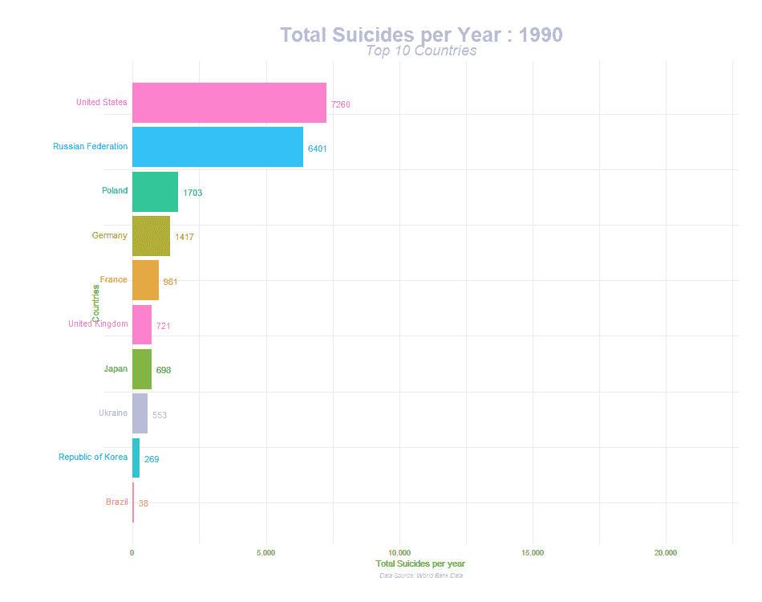
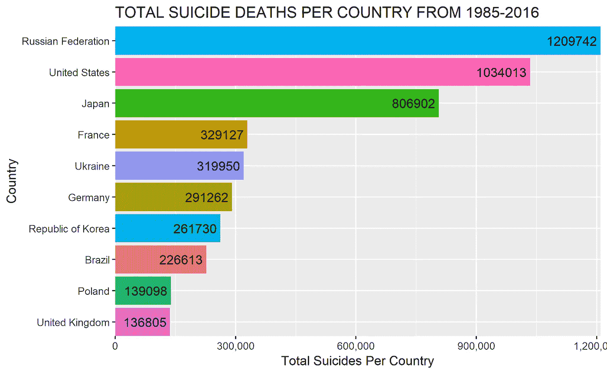

# 如何使用 gganimate 创建动画精美的剧情？

> 原文：<https://towardsdatascience.com/how-to-create-plots-with-beautiful-animation-using-gganimate-912f4279b073?source=collection_archive---------14----------------------->



Total suicide rates per country

**引言。**

可视化最重要的事情是当它迫使我们意识到一些我们不知道的事情。视觉上吸引人的图表很容易吸引我们的注意力。将数据动画化就像将生命吸入尘埃，这是一种创造的行为。你是如何创作出富有洞察力的吸引人的动画的？

在这篇文章中，我们将学习如何使用 R 包来创建漂亮的动画， [gganimate](https://gganimate.com/) 。

```
**#stable version of the package can be installed using** *install.packages(“gganimate”)* **#latest development version can be obtained by** *devtools::install_github(“thomasp85/gganimate”)*.
```

**数据。**

自杀率数据是从不同来源(世卫组织、联合国开发计划署、世界银行)汇编后从 Kaggle 获得的。该数据比较了 1985 年至 2016 年每个国家的社会经济信息和自杀率。灵感来自于不同国家的自杀预防策略。

**数据角力。**

我们将使用下面的代码来清理数据，并且只对我们将要处理的列进行子集化。

```
**#loading required libraries**
library(tidyverse)
library(reshape2)
library(ggthemes)
library(gganimate)
library(gifski)**#loading dataset**
suicide_data<-read.csv("./ARTICLES/suicide rates/master.csv",header = TRUE,stringsAsFactors = FALSE)**#selecting columns to work with**
suicide_sub<-suicide_data %>% select("ï..country","year" ,"sex","suicides_no")  %>% rename("country"="ï..country" )**#function to sum the total suicide per country**
n<-unique(suicide_sub$country)
country<-function(x){
  suicide2<-suicide_sub %>% filter(country==x)
  sum(suicide2$suicides_no)
}**#return a list with all total deaths per country**
country_total<-sapply(n,function(x) country(x))**#creating a dataframe with top 10 total suicides per country**
df<-do.call(rbind,Map(data.frame,Country=n,Total_Suicides=country_total))
df2<-df %>% arrange(desc(Total_Suicides))
df3<-head(df2,n=10)
write.csv(df3,"./ARTICLES/suicide rates/total_suicide.csv")**#plotting the top 10 countries leading in the total suicide rates**
ggplot(df3,aes(reorder(Country,Total_Suicides),Total_Suicides,fill=as.factor(Country)))+
    geom_col()+
    coord_flip(clip = "off", expand = FALSE)+
    guides( fill = FALSE) +
    labs(title="TOTAL SUICIDE DEATHS PER COUNTRY FROM 1985-2016", 
         y="Total Suicides Per Country", x="Country")+
    scale_y_continuous(labels = scales::comma) +
     geom_text(aes(label = paste(Total_Suicides,"")), hjust = 1)
```



```
**#subset initial data with top 10 countries**
top_suicide<-suicide_sub%>%filter(country==c(“Russian Federation”,”United States”,”Japan”,”France”,”Ukraine”,”Germany”,”Republic of Korea”,”Brazil”,”Poland”,”United Kingdom”))**#filtering years with consistent data**
top_suicide2<-top_suicide %>% filter(year %in%c(1990:2014)) 
top_suicide2$sex<-as.factor(top_suicide2$sex)**#summing the total male & female suicides per country for each year**
sm3<-aggregate(suicides_no~country+year,top_suicide2,sum)**#* 1 ensures we have non-integer ranks while sliding**
sm4<-sm3 %>% group_by(year) %>% mutate(rank = min_rank(-suicides_no) * 1) %>%
 ungroup()
```

**构建静态地块。**

我们的数据现在已经可以绘图了。我们不打算深入使用 ggplot 的更多细节。使用 ggplot 的综合指南可在[这里](https://github.com/hadley/ggplot2-book)获得。

```
**#plotting static plot**
static_plot<-ggplot(sm4,aes(rank,group=country,fill=as.factor(country),color=as.factor(country))) +
 geom_tile(aes(y = suicides_no/2,
 height = suicides_no,
 width = 0.9), alpha = 0.8, color = NA) +
 geom_text(aes(y = 0, label = paste(country, “ “)), vjust = 0.2, hjust = 1) +
 geom_text(aes(y=suicides_no,label = paste(“ “,suicides_no)), hjust=0)+
 coord_flip(clip = “off”, expand = TRUE) +
 scale_y_continuous(labels = scales::comma) +
 scale_x_reverse() +
 guides(color = FALSE, fill = FALSE) +
 theme_minimal() +
 theme(
 plot.title=element_text(size=25, hjust=0.5, face=”bold”, colour=”grey”, vjust=-1),
 plot.subtitle=element_text(size=18, hjust=0.5, face=”italic”, color=”grey”),
 plot.caption =element_text(size=8, hjust=0.5, face=”italic”, color=”grey”),
 axis.ticks.y = element_blank(), 
 axis.text.y = element_blank(), 
 plot.margin = margin(1,1,1,4, “cm”)
 )
```

**动画。**

**gg animate 的关键特性是什么？**

1. **transition_ *:** 此函数定义数据应该如何分布，以及它如何随时间的推移与自身相关联。

a. **transition_reveal:** 这允许你让数据逐渐消失。

b.**转换时间:**状态之间的转换长度被设置为对应于它们之间的实际时间差。

c. **transition_state:** 用于通过分类变量或离散变量来激活图形。

2. **view_ *:** 用于定义轴应该如何随动画变化。

a.**view _ follow(fixed _ y = TRUE):**这意味着当动画运行时，y 轴是固定的。

b.**view _ follow(fixed _ x = TRUE)**:当动画运行时，x 轴是固定的。

3. **ease_aes():** 它描述了在动画制作过程中应该如何缓和不同的美感。

a. **ease_aes("立方进制出")**

b. **ease_aes("正弦输入输出")**

4. **enter_*/exit_ *:** 用于确定在动画过程中，新数据如何出现，旧数据如何消失。

a.**进入 _ 淡出/退出 _ 收缩**

5. **State_length:** 这是指状态暂停的相对长度。

6.**过渡 _ 长度:**这是动画的相对长度。

```
**#creating final animation**
plt<-static_plot + transition_states(states = year, transition_length = 4, state_length = 1) + 
 ease_aes(‘cubic-in-out’) +
 #view_follow(fixed_x = TRUE) +
 labs(title = ‘Total Suicides per Year : {closest_state}’, 
 subtitle = “Top 10 Countries”,
 caption = “Data Source: World Bank Data”,
 x=”Countries”,y=”Total Suicides per year”)
```

7.**渲染。**

这是一种输出最终结果的计算。使用的参数包括:

**nframes:** 设置要使用的帧数(默认为 100)。

**每秒帧数(fps):** 这是每秒每帧花费的时间(默认为 10)

**渲染器:**设置将每一帧合成动画的功能。(默认为 gifski_renderer())。

如果我们想结束循环，我们使用:***renderer = gif ski _ renderer(loop = FALSE)***为了将动画情节保存为视频，我们使用***renderer = ffmpeg _ renderer()***

8.**持续时间**这是帧制作动画所需的总时间，即持续时间=30

9.**布局。**

我们可以通过指定大小来改变绘图的高度和宽度

我们将动画输出保存到一个名为 ***final_animation 的对象中。***

```
**#rendering the animation for gif**
final_animation<-animate(plt,100,fps = 20,duration = 30, width = 950, height = 750, renderer = gifski_renderer())**#rendering the animation for mp4** animate(plt,100,fps = 20,duration = 30, width = 950, height = 750, renderer = ffmpeg_renderer())
```

10。保存动画。

为了保存我们的动画，我们将使用带有参数的函数 ***anim_save()*** :

**动画**——这是我们动画剧情的最终输出。

路径-我们想要保存动画的地方。

```
**#saving the animation**
anim_save(“./ARTICLES/suicide rates/suicide_animate.gif”,animation=final_animation)
```

**输出。**


Final animation output.

**结论。**

我们已经能够用动画软件包来显示每个国家的自杀率。你可以调整代码，以有效地动画任何数据集，并纳入自己的演示文稿，博客或网站。要获得更多关于创建动画的见解，你可以查看这篇 [StackOverflow](https://stackoverflow.com/questions/53162821/animated-sorted-bar-chart-with-bars-overtaking-each-other/53163549) 指南或[关于数据科学](/how-to-do-that-animated-race-bar-chart-57f3a8ff27a8)的文章。随意评论，分享，点赞。更多讨论，你可以通过 [Linkedln](https://www.linkedin.com/in/brianmwangi/) 联系我。