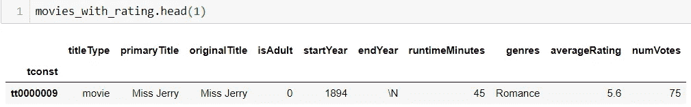
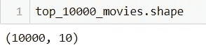
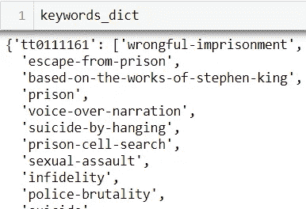
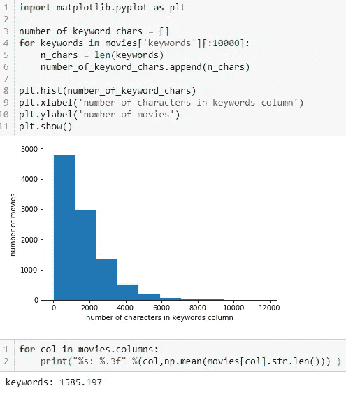
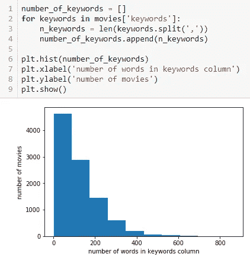
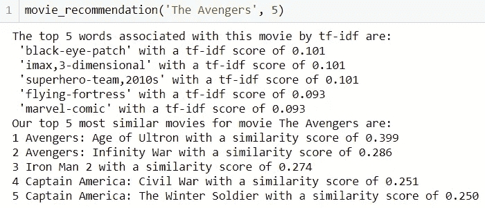
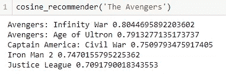
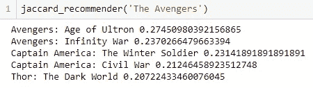

# 如何从头开始创建简单的基于关键词的电影推荐模型

> 原文：<https://towardsdatascience.com/how-to-create-simple-keyword-based-movie-recommender-models-from-scratch-afde718636c9?source=collection_archive---------11----------------------->

# 介绍

你试过用电影推荐器吗？理论上，这是一些有用的东西，可以帮助确定下一步该看什么，而不是花几个小时浏览网飞，但他们的结果往往是漫无目的的。这是一个大多数人都会涉及的问题，所以我决定自己创建一个自制的推荐系统，并在这篇博文中分享。我将向您展示如何从头开始创建 3 个简单的推荐模型，接受一部电影作为输入，返回“n”部最相似的电影作为输出，其中“n”由用户提供。

一般来说，推荐系统要么基于内容，要么与用户的历史和兴趣合作。我选择创建基于内容的模型，因为它们基于特定的输入项(电影)而不是基于用户进行预测。

注意，这个博客的推荐完全基于电影关键词。正如您将看到的，使用其他文本信息，如情节大纲或情节概要，而不是电影关键字是相当简单的。

为了限制这篇文章的范围，我没有包括数字特征(例如运行时间、发布年份、评级等。)和流派进行推荐。

如果你想在 GitHub 上关注或查看这篇文章的代码，请访问:[https://GitHub . com/gbl inick/Movie-Recommender-with-NLP/blob/master/Keyword % 20 Movie % 20 Recommender . ipynb](https://github.com/gblinick/Movie-Recommender-with-NLP/blob/master/Keyword%20Movie%20Recommender.ipynb)

# 数据集创建

任何数据科学项目的第一步都是获取数据集。有时你的数据集会给你(比如 Kaggle 竞赛)。在我们的例子中，由于这个项目是“从零开始”的，我们必须自己获得数据。

寻找电影数据的第一个地方是 https://www.imdb.com/interfaces/的 IMDb 公共数据仓库:[。这个存储库包含 7 个表，其中包含各种各样的优秀电影数据。不幸的是，没有一个表格包含我们可以用来推荐的电影关键词。这并不意味着我们不能使用任何表格。看看这些表格，我们注意到其中一个，【title.ratings.tsv.gz】的*包含一个名为“numVotes”的列，表示“该标题获得的票数”。这对我们很有用，因为我们可以使用这个列来获得投票数最多的 10，000 部电影。当然，如果能在我们的模型中包含每一部电影就好了，但是由于计算相似性需要额外的时间，这是不实际的。此外，即使我们没有实际的计算缺陷，我也不确定大多数人是否有兴趣看排名前 10，000 以外的电影。前 10，000 部电影应该足以让绝大多数观众满意。*](https://www.imdb.com/interfaces/)

我们还需要第二个表，*title.basics.tsv.gz*，它提供列标题类型，告诉我们标题是否是电影(相对于电视节目)。因为我们只想在我们的推荐者中包含电影，所以我们使用该列来过滤电影。

综上所述，这是我们目前的工作流程:

1.  导入必要的库(熊猫和 numpy):

2.将我们需要的两个 IMDb 表导入 pandas 的数据框架中(在图中，文件位于与我们的笔记本平行的名为“data”的文件夹中):

3.仅从 *title.basics* 表中选择电影，并创建一个新的数据帧“电影”:

4.为表创建一个公共索引(两个表中每个标题的 IMDb 唯一标识符在这里是一个很好的选择)，然后用一个简单的内部连接来连接表:

太好了！我们现在有一个名为“movies_with_rating”的表，其中包含所有 IMDb 电影及其评级(以及我们使用的 2 个表中的所有其他信息)。让我们看看最上面一行:

我们在表格中看到一些关于第一部电影的有趣信息。然而，我们未来的模型并不需要所有这些数据。对于这个项目，我们所关心的是通过 numVotes 获得前 10，000 部电影，并使用电影关键字来查找电影之间的相似性。

我们可以很容易地用熊猫来做到这一点。sort_values 函数:

完美。现在，我们可以将注意力转向获取我们想要用于推荐模型的情节信息。我们可以使用精彩的 IMDbPY API:【https://imdbpy.readthedocs.io/en/latest/index.html】获得这样的剧情信息。您需要使用 pip 或 conda 安装 API。

在使用 API 之前，我们需要导入它并实例化一个 IMDb 电影对象。我们将这样做，并导入几个其他的库，使用 API 运行 for-loops 成为更好的体验:

从 IMDb 提取绘图关键字的语法如下:

在上面的代码中，我首先实例化了一个字典来存储我将从 IMDb(在第 1 行)获取的关键字。我将使用电影 id 作为键，使用每部电影的关键字列表作为值。

在从第 2 行开始的 for 循环中，我遍历了前 10，000 部电影的索引。在第 5 行，我使用每个电影索引来获取相应的 IMDb 电影对象。请注意，在第 5 行，我从索引 2 开始对电影索引进行了子集化，因为索引以“tt”开头，后面跟着一个数字，而我们只需要这个数字。然后，我通过“情节大纲”对电影对象进行子集划分，以获得所需的情节大纲，然后将结果关键字列表作为对应于电影索引键的值存储在我的关键字字典中。

注意我在上面的代码中使用了 tqdm 和 sleep 库。tqdm 允许你看到你在 for 循环运行中的位置。当你运行一个 for 循环 10，000 次时(就像我们一样)，很高兴知道你走了多远。

睡眠图书馆让我们对 IMDb 有礼貌。假设我们请求网站给我们 10，000 次信息，最好将我们的请求分隔开，这样我们就不会让服务器不堪重负。

完成 for 循环后，我们有了一个字典，其中的键是电影 id，值是关键字列表。看起来是这样的:

我们应该把这本字典转换成熊猫数据框架，以利用熊猫的能力。但是，如果我们只是做一个简单的 *pd。熊猫会抱怨我们的字典长度不一样。因此，我们需要一个解决方案来获得我们想要的东西，如下面的代码所示:*

在第 1 行中，我们创建了一个新的字典，其中有相同的键，但值与之前的字典不同。这些值不再是关键字列表，而是熊猫系列。我们可以将这个字典转换成 DataFrame，然后在第 10 行用一个简单的 lambda 函数连接所有的关键字(现在是它们自己的列)。应用 lambda 函数后，我们得到一个系列，因此我们可以将这个系列转换为 DataFrame，重命名我们的列，并保存为 CSV。

我们不需要将绘图轮廓保存到 CSV 文件中，但是当您从一个耗时的过程中获取数据时，保存它是非常明智的，这样您就不必重新运行获取数据的过程。

要使用我们的绘图轮廓数据，我们可以从 keywords.csv 文件中加载它，重命名文件中存在的 2 列(即键和值)并将其连接到我们现有的表中:

就是这样！

我们现在有了一个情节文本信息的数据集，可以用来计算电影之间的相似性。

# 电子设计自动化(Electronic Design Automation)

在创建我们的模型之前，让我们做一些快速的 EDA。文本数据不是最容易进行探索性数据分析的数据，所以我们将保持 EDA 简短。

我们可以做的第一件事是查看每个关键字列表中字符数量的分布。我们先剔除没有关键词的电影:

我们现在可以找到每个关键字列表的长度(以字符为单位):

从分布和每列的平均字符数可以看出，分布是右尾的。

让我们看看，如果我们为每个关键字列表中的单词数绘制分布图，是否会得到类似的分布:

是的，也很右尾。

因此，我们对关键词列表进行了两种不同的测量——列表中的字符数和单词数——它们显示了相同的模式。这是有意义的，因为这些度量是直观相关的。右翼告诉我们的是，大多数电影没有很多关键词或角色，但有一小部分——大概是最成功的电影——有很多关键词和角色。

# 创建模型

我们现在可以创建我们的模型了。首先，我想讨论一个关于自然语言处理和使用文本的问题。通常，当使用文本时，你没有好的、易于使用的关键字列表。如果我们决定使用情节概要而不是关键词列表(如果 IMDb 不提供电影关键词，就会发生这种情况)，我们就会遇到这种情况。在这种情况下，有一些标准的，简单的步骤，你可以采取，以基本上创建自己的关键字列表。它们是:

1.小写单词

2.删除标点符号

3.删除停用词

4.词汇词条化

这些都可以使用 nltk 库相对简单地完成。

回到我们的模型:我们将创建 3 个不同的模型，基于不同的相似性概念以及不同的电影文本“向量”公式。前 2 个模型将使用余弦相似度，最后一个将使用 Jaccard 相似度。在前两个模型中，第一个将使用 tf-idf 创建电影矢量，第二个将使用简单的字数统计。

我们首先选择我们需要的列。因为我们正在创建基于关键字的推荐器，所以我们需要 keywords 列。因为我们还想输入一部电影的标题并获取其他电影，所以我们需要“primaryTitle”列。因此，我们将选择这两列。我们还重置了索引，因为我们的推荐功能稍后将使用电影在数据帧中的位置，而不是其 IMDb ID 来进行推荐:

接下来，我们需要获得一个列表列表，其中内部列表是每部电影的关键字列表。目前，我们在每部电影的关键字列中有一个字符串，其中包含所有关键字，并用逗号分隔。

我们可以通过使用 nltk 库获得这样一个列表列表:

在第 2 行，我们得到了前面提到的字符串列表。在第 4 行，我们从 nltk 库中导入了 *work_tokenize* 模块。在第 5 行，我们有一个列表理解，我们循环遍历每个关键字串，对于每个关键字串，我们得到带有 *word_tokenize* 的单个单词。注意*word _ token ize(keyword . lower())*返回一个关键字列表，所以我们最终得到一个列表的列表。

我们在这一点上还没有完成，因为 *word_tokenize* 在我们的关键字列表中留下了许多逗号。我们可以通过定义一个自定义函数 *no_commas* ，并将其应用于我们的关键字列表列表中的每个关键字列表，来轻松摆脱它们:

很好。所以我们现在在 *processed_keywords* 中有了我们想要的东西。

我们现在可以创建我们的第一个模型，一个使用词向量间余弦相似度的 tf-idf 模型。我不打算在这里解释它们是如何工作的。快速的谷歌搜索应该会返回许多有用的资源。

我们首先使用 gensim 创建一个单词字典:

这里的字典只包含我们处理过的关键字列表中与 ID 匹配的每个单词。

接下来，我们创建一个 genism 语料库，这里的语料库只是指“每部电影的词汇包”:

接下来，我们可以使用 genism tf-idf 模型将这些单词包转换为 tf-idf 模型:

最后，我们为我们的电影关键字集创建一个索引，允许我们计算任何给定的关键字集与我们的数据集中每部电影的关键字之间的相似性:

我们现在可以写一个函数来接受一部电影，并返回“n”部最相似的电影。我们函数的工作方式如下:

1.接受用户的电影

2.接受来自用户的“n ”,其中“n”是用户想要返回多少部电影

3.检索电影的关键词

4.将电影的关键词转换成单词包

5.将单词袋表示转换成 tf-idf 表示

6.使用 tf-idf 表示作为查询文档来查询我们的相似性度量对象

7.获取我们集合中每部电影的相似性结果，按照相似性递减的方式对集合进行排序，并返回“n”部最相似的电影及其相似性度量。不要返回最相似的电影，因为每部电影都是最相似的

在代码中:

现在让我们来测试一下。因为复仇者联盟最近很受欢迎，所以让我们将原始电影交给我们的功能:

看起来都很般配。

请注意，这种推荐系统不仅限于根据其他电影推荐电影。我们可以使用任何给定的关键字集来查询我们的相似性度量对象。碰巧的是，大多数人会想使用他们已经知道的电影来查询它，但它不限于此。

以下是基于提供的关键词进行推荐的更通用的函数:

我们可以继续我们的第二个推荐器，它也使用余弦相似度来计算单词向量之间的相似度。它与第一个模型的不同之处在于使用更简单的字数，而不是创建 tf-idf 字向量。这个替代实现是用 scikit-learn 中的 *CountVectorizer* 类来执行的，它将一组文本文档(在本例中是关键字列表)转换成一个令牌计数矩阵。

为了简单起见，我们还将计算余弦相似度。我们将使用 scikit-learn*metrics . pairwise*子模块中的*余弦相似度*函数，而不是使用*矩阵相似度*。

我们用下面的代码计算每部电影的字数:

然后，当给定一部电影时，我们需要做的就是计算该电影的词向量和其他词向量之间的余弦相似度，并返回最相似的匹配。这是通过我们的*余弦推荐器*功能实现的:

让我们在《复仇者联盟》中也尝试一下:

有用！与第一个模型相似。

对于我们的第三个模型，我们使用 Jaccard 相似度代替余弦相似度。因此，我们根本不需要单词向量。我们简单地将相似性计算为关键字集的交集除以关键字集的并集。

计算任意两个关键字列表之间的 Jaccard 相似性的代码很简单:

由此创建推荐器模型相对简单。我们找到给定的输入电影的关键字列表，计算该列表和每个其他电影关键字列表之间的 Jaccard 相似性，然后根据它们的相似性对电影进行排序，并返回前“n”个结果。

在代码中:

用我们最喜欢的电影进行测试，我们得到了很好的结果:

# 后续步骤

我们有很多方法可以改进现有的模型。

首先是用 Flask 部署模型，这样人们就可以使用它们了。可用性非常重要。

下一步将是找到一些方法来衡量我们的模型的性能。这很棘手，因为推荐系统通常没有明显的评估标准。尽管如此，我们还是可以想出一些方法(例如，使用用户反馈对模型进行排名)，而且有很好的资源可以这样做。

第三个要考虑的改进是在带有嵌入的情节概要上使用深度学习方法:[https://tfhub.dev/google/universal-sentence-encoder/2](https://tfhub.dev/google/universal-sentence-encoder/2)。这些方法应该允许我们将上下文结合到我们的推荐中，而不是像我们的模型目前使用的简单的单个单词。

最后，可以通过合并其他非文本特征(如体裁或数字特征)来改进模型。

几周后再来这里看看。我可能会写另一篇博文来实现这些改进。

请让我知道你对这个项目的看法，如果你有任何改进的建议。非常感谢所有建设性的意见。

# 参考

为了获得使用 Gensim MatrixSimilarity 类比较文档的灵感，我使用了奥瑞利的精彩教程“[我如何使用 Python 比较文档相似度](https://www.oreilly.com/learning/how-do-i-compare-document-similarity-using-python)”:[https://www . oreilly . com/learning/How-do-I-compare-document-similarity-using-Python](https://www.oreilly.com/learning/how-do-i-compare-document-similarity-using-python)

关于 Jaccard 和余弦相似度推荐器的使用，我非常感谢 Sanket Gupta 的教程“[Python 中文本相似度度量概述](/overview-of-text-similarity-metrics-3397c4601f50)”:[https://towards data science . com/Overview-of-Text-Similarity-Metrics-3397 c 4601 f50](/overview-of-text-similarity-metrics-3397c4601f50)