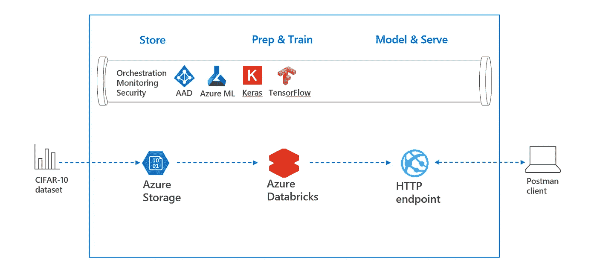

# 如何在 Azure 中创建自己的深度学习项目

> 原文：<https://towardsdatascience.com/how-to-create-your-own-deep-learning-project-in-azure-509660d8297?source=collection_archive---------10----------------------->

## 使用 Azure 存储、带有 Keras 的数据块和 Azure ML 服务

# 1.介绍

深度学习对公司来说有很多实际应用，例如图像识别、视频索引和语音到文本转录。然而，对于公司来说，从深度学习项目开始可能会令人望而生畏。常见的问题是所用数据的敏感性和深度学习的复杂性，深度学习可以被视为机器学习的最高级。

# 2.目标

在本教程中，创建了一个样本深度学习项目，它能够使用 CIFAR-10 数据集(飞机、青蛙、船)识别图片类别。在这种情况下，执行以下步骤:

*   Azure 存储用于安全地存储图片
*   Azure Databricks 用于使用 Keras 和 TensorFlow 训练模型
*   Azure ML 服务用于将模型版本化和部署为 HTTP 端点

这可以在下面的体系结构概述中描述:



2\. High level overview

这个解决方案的关键是 Azure Databricks，这是一个针对 Azure 优化的基于 Apache Spark 的分析平台。它本机集成了其他 Azure 服务，如 Azure Active Directory 和 Azure Storage。在本博客的剩余部分，将执行以下步骤:

*   3.先决条件
*   4.创建深度学习项目
*   5.部署深度学习模型
*   6.结论

这是一个独立的教程，重点是在 Azure 中建立自己的深度学习项目，以“弄脏你的手”，从而更加熟悉这个主题。重点是深度学习的内部工作，最新的算法或[计算机视觉 API](https://azure.microsoft.com/en-us/services/cognitive-services/computer-vision/)。如果你对 AI 的 devops 更感兴趣，请参考我以前的博客，[这里](/how-to-bring-your-data-science-project-in-production-b36ae4c02b46)和关注安全，见[这里](/how-to-embed-security-in-your-azure-data-science-project-55ef3f2ab47)。

# 3.先决条件

需要在同一资源组和同一位置创建以下资源。

*   [Azure 存储帐户](https://docs.microsoft.com/en-us/azure/storage/blobs/data-lake-storage-quickstart-create-account?toc=%2Fazure%2Fstorage%2Fblobs%2Ftoc.json#create-an-account-using-azure-cli)
*   [Azure Databricks 工作区](https://docs.azuredatabricks.net/getting-started/try-databricks.html#step-2-create-a-databricks-workspace)。
*   [Azure 机器学习服务](https://docs.microsoft.com/en-us/azure/machine-learning/service/quickstart-get-started)

# 4.创建深度学习项目

这一部分将执行以下步骤。

*   4a。将图片添加到存储帐户
*   4b。创建深度学习集群
*   4c。装载存储帐户
*   4d。单节点训练深度学习模型
*   4e。终止深度学习集群

## 4a。将图片添加到存储帐户

在本教程中， [CIFAR-10](https://www.cs.toronto.edu/~kriz/cifar.html) 数据用于训练深度学习模型。在第一个模型中，将使用 2000 个图片的子集。随后，将创建第二个模型，该模型使用 60000 张图片的完整 CIFAR-10 数据集。

为了说明如何将 Azure Storage 与 Azure Databricks 结合使用，将在 Storage 帐户中存储 2000 张图片的子集。因此，请访问以下 URL，下载 2000 张图片的压缩文件。

```
[https://github.com/rebremer/devopsai_databricks/raw/master/sampledata/2000pics_cifar10.zip](https://github.com/rebremer/devopsai_databricks/raw/master/sampledata/2000pics_cifar10.zip)
```

随后，转到 Azure 门户并选择您的存储帐户。然后选择 blobs 并创建一个名为“2000picscifar10”的新容器。随后，将之前下载的 zip 文件上传到您的容器中。


4a1\. Add zipfile to new container

最后，转到访问密钥，复制密钥或您的存储帐户。


4a3\. Copy access keys

## 4b。创建深度学习集群

转到您的 Azure Databricks 工作区并转到群集。由于模型将在不使用 Spark 作业的情况下在驱动程序节点上训练，因此不需要创建(并支付)工人节点。因此，使用以下设置创建一个新的 GPU 集群:


4b1\. Create GPU cluster without worker nodes

## 4c。装载存储帐户

转到您的 Azure Databricks 工作区，右键单击，然后选择导入。在单选按钮中，选择使用 URL 导入以下笔记本:

```
[https://raw.githubusercontent.com/rebremer/devopsai_databricks/master/project/modelling/0_mountStorage.py](https://raw.githubusercontent.com/rebremer/devopsai_databricks/master/project/modelling/0_mountStorage.py)
```

另请参见下图:


4c1\. Import notebook to mount storage

打开您的节点簿并更改以下设置

```
storageaccount="<<your_storage_account>>"
account_key="<<your_key_in_step4a>>"
containername="2000picscifar10" # change if you used another name
```

请注意，在生产环境中，不得将密钥存储在笔记本中。相反，[秘密范围](https://docs.azuredatabricks.net/user-guide/secrets/secret-scopes.html#create-an-azure-key-vault-backed-secret-scope)将被使用，参见我的[博客](/how-to-embed-security-in-your-azure-data-science-project-55ef3f2ab47)如何在数据科学项目中嵌入安全性。然后将笔记本连接到您创建的集群，然后单击 SHIFT+ENTER 来逐个单元地运行。


4c2\. Attach notebook to cluster

在本笔记本中，将执行以下步骤:

*   将存储帐户装载到 Azure Databricks 工作区
*   解压缩存储帐户中的图片
*   列出并显示图片

## 4d。单节点训练深度学习模型

再次转到您的 Azure Databricks 工作区，右键单击，然后选择导入。在单选按钮中，选择使用 URL 导入以下笔记本:

```
[https://github.com/rebremer/devopsai_databricks/blob/master/project/modelling/1_DeepLearningCifar10NotebookExploration.py](https://github.com/rebremer/devopsai_databricks/blob/master/project/modelling/1_DeepLearningCifar10NotebookExploration.py)
```

在本笔记本中，将执行以下步骤:

*   从存储帐户导入和处理数据
*   根据存储帐户中的 2000 张图片建立模型
*   在完整 CIFAR-10 数据集的 60000 张图片的数据集上建立模型
*   将模型保存到磁盘(dbfs)

当您成功运行笔记本时，您可以看到预测的概述(红色是错误的预测)。


4d1\. Overview of predictions

## 4e。终止深度学习集群

运行 GPU 集群的成本可能很高。由于我们在本教程的剩余部分不需要 GPU 集群，我们可以停止它。因此，转到您的集群并选择终止。


4e1\. Terminate cluster

# 5.部署深度学习项目

这一部分将执行以下步骤。

*   5a。在数据块中创建新簇
*   5b。将库添加到集群
*   5c。注册模型和日志指标
*   5d。创建模型的 HTTP 端点
*   5e。测试模型的 HTTP 端点

## 5a。在数据块中创建新簇

在这一步中，将创建一个新的集群，用于部署我们的模型。既然模型已经训练好了，我们就不再需要 GPU 了。选择具有以下设置的群集


5a1\. Non GPU cluster

## 5b。将库添加到集群

为了部署我们的模型，我们需要几个库。转到您的共享文件夹，右键单击共享并选择“创建库”。


4b1\. Add Libraries

随后，选择 Pypi 并将以下库添加到共享文件夹中:

```
azureml-sdk[databricks]
keras
tensorflow
```

## 5c。注册模型和日志指标

在这一步中，模型及其指标将被添加到您的 Azure ML 服务工作区。在 Azure Databricks 工作区中导入以下笔记本。

```
[https://raw.githubusercontent.com/rebremer/devopsai_databricks/master/project/modelling/2a_Cifar10KerasNotebookLogModel.py](https://raw.githubusercontent.com/rebremer/devopsai_databricks/master/project/modelling/2a_Cifar10KerasNotebookLogModel.py)
```

打开您的节点簿并更改您的 Azure ML 服务工作区的以下设置(订阅 id 可在您的 Azure ML 服务工作区实例的概述选项卡中找到)。

```
workspace="<<your_name_of_azure_ml_service_workspace>>"
resource_grp="<<your_resource_group_amlservice>>"
subscription_id="<<your_subscriptionid_amlservice>>"
```

然后运行笔记本，再次使用 Shift+Enter 逐个单元格地浏览。在本笔记本中，将执行以下步骤:

*   在 2000 张图片上训练的模型的对数度量
*   在所有 60000 张图片上训练的模型的日志度量
*   在步骤 5d 中注册要部署的最佳模型

要查看指标，请转到门户，选择 Azure 机器学习工作区，然后选择 Expirement，见下文


5c1\. Log metrics of model with 2000 pictures and all CIFAR-10 pictures

## 5d。创建模型的 HTTP 端点

将以下笔记本导入您的工作区

```
[https://raw.githubusercontent.com/rebremer/devopsai_databricks/master/project/modelling/2b_Cifar10KerasNotebookDeployModel.py](https://raw.githubusercontent.com/rebremer/devopsai_databricks/master/project/modelling/2b_Cifar10KerasNotebookDeployModel.py)
```

再次更改参数，类似于步骤 5c。在这个笔记本中，为在所有图片上训练的模型创建一个端点。当你去门户网站，选择 Azure 容器实例，你会发现端点的 IP 地址。


5d1\. Azure Container Instance with IP addresss

## 5e。测试模型的 HTTP 端点

要测试端点，需要完成以下步骤:

*   从互联网上获得一个 CIFAR-10 类别的随机 png
*   使用此[网站](https://onlinepngtools.com/convert-png-to-base64)将 png 转换为 base64 编码
*   使用类似[邮递员](https://www.getpostman.com/)的工具发送 base64 有效载荷来创建预测。

下图是一艘船的图片，转换为 base64 格式，用 Postman 发送，使用 endpoint 创建预测。


5e1\. Picture of ship converted to base64 using [https://onlinepngtools.com/convert-png-to-base64](https://onlinepngtools.com/convert-png-to-base64)


5e2\. Prediction of ship using HTTP endpoint

# 6.结论

在本教程中，创建了一个深度学习项目，其中使用了以下服务:

*   Azure 存储帐户可以安全地存储图片
*   Azure Databricks 与 Tensorflow 和 Keras 一起构建模型
*   Azure ML 服务跟踪模型并创建 HTTP 端点

深度学习对企业有很多实际应用。然而，对于企业来说，从深度学习项目开始可能会令人望而生畏。创建您自己的示例项目并“亲自动手”是学习和熟悉该主题的好方法。


6\. Sample project overview

> 最后，非常感谢我的同事 Ilona Stuhler，她非常友好地向我提供了这个课题的重要内幕，并把她的项目捐赠给了我。