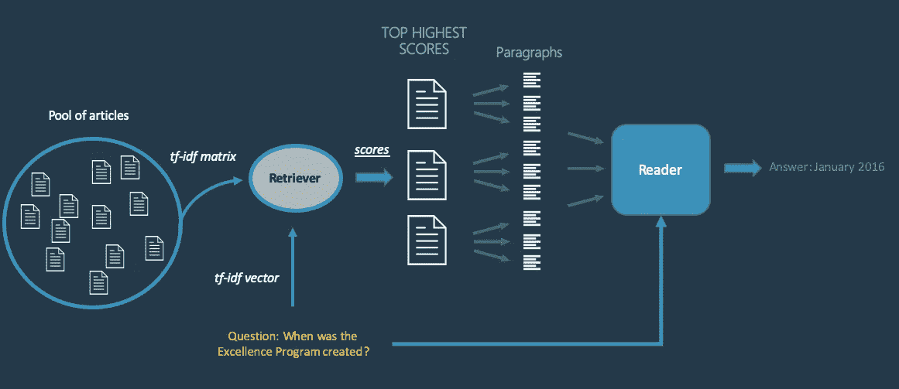
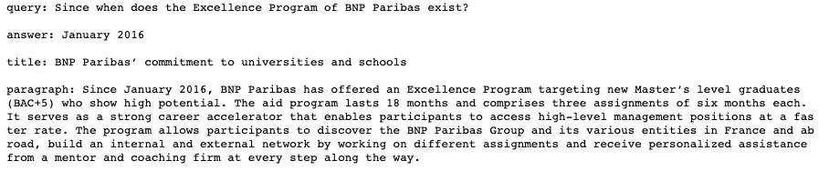
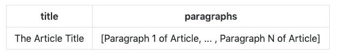
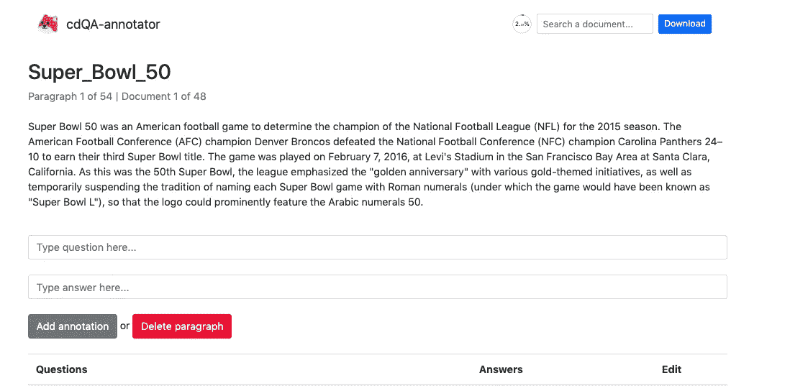
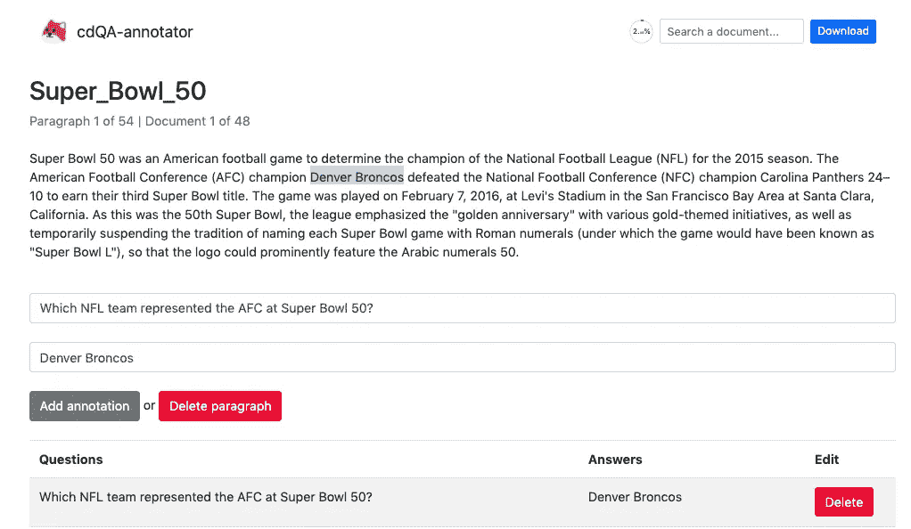
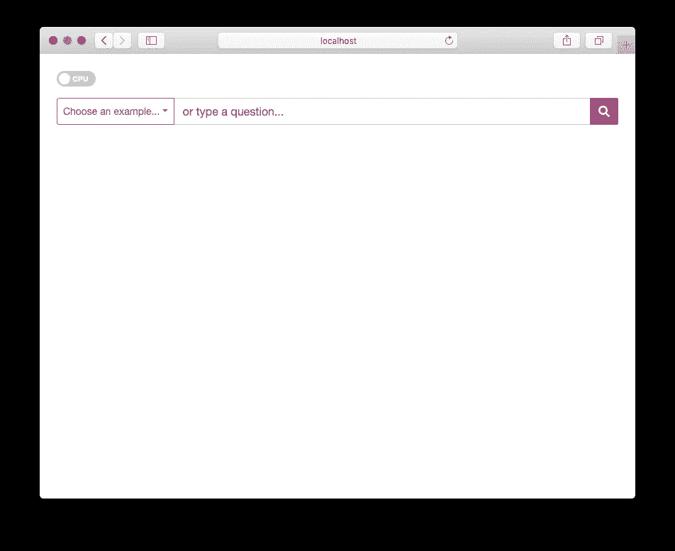
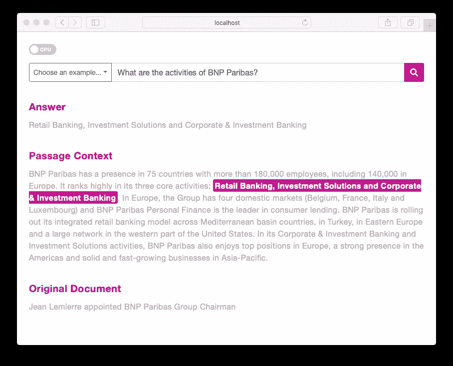

# 如何用 python 轻松创建自己的问答系统

> 原文：<https://towardsdatascience.com/how-to-create-your-own-question-answering-system-easily-with-python-2ef8abc8eb5?source=collection_archive---------1----------------------->

## 如何使用 [cdQA-suite](https://cdqa-suite.github.io/cdQA-website/) 在您自己的(私人)数据上创建 QA 系统


机器理解的历史起源于人工智能中第一个概念的诞生。聪明的艾伦·图灵在他的著名文章《T2》中提出了计算机器和智能“现在被称为[图灵测试](https://en.wikipedia.org/wiki/Turing_test)作为智能的标准。近 70 年后，问答(QA)仍然是人工智能中最困难的任务之一，它是 MC 的一个分支。

然而，自去年以来，由于深度学习研究的发展和迁移学习技术的出现，自然语言处理领域经历了快速的发展。强大的预先训练的 NLP 模型，如 [OpenAI-GPT](https://openai.com/blog/better-language-models/) 、 [ELMo](https://allennlp.org/elmo) 、 [BERT](https://github.com/google-research/bert) 和 [XLNet](https://arxiv.org/abs/1906.08237) 等，均由该领域的顶尖研究人员提供。

随着这些进步，一些改进的系统和应用程序将会出现。其中一个系统是 [cdQA-suite](https://cdqa-suite.github.io/cdQA-website/) ，这是我和一些同事在法国工程学院巴黎电信和欧洲个人理财领导者法国巴黎银行的合作下开发的一个软件包。

## 开放域质量保证与封闭域质量保证

当我们考虑 QA 系统时，我们应该知道两种不同的系统:**开放域 QA** (ODQA)系统和**封闭域 QA** (CDQA)系统。

开放域系统几乎可以处理任何问题，并且只能依赖于一般的本体和世界知识。这样一个系统的一个例子是 [DrQA](https://github.com/facebookresearch/DrQA/) ，一个由脸书研究公司开发的 ODQA，它使用维基百科的大量文章作为它的知识来源。由于这些文件涉及几个不同的主题，我们可以理解为什么这个系统被认为是一个 ODQA。

另一方面，封闭领域系统处理特定领域下的问题(例如，医学或汽车维修)，并且可以通过使用适合唯一领域数据库的模型来利用特定领域的知识。cdQA 套件的构建是为了让任何想要构建封闭领域 QA 系统的人都能轻松完成。

# cdQA 套件

 [## cdQA

### 一个端到端的封闭领域问答系统。- cdQA

github.com](https://github.com/cdqa-suite) 

[cdQA 套件](https://github.com/cdqa-suite)由三部分组成:

*   [cdQA](https://github.com/cdqa-suite/cdQA) :一个易于使用的 python 包，用于实现 QA 管道
*   [cdQA-annotator](https://github.com/cdqa-suite/cdQA-annotator) :一个为模型评估和微调方便问答数据集注释的工具
*   [cdQA-ui](https://github.com/cdqa-suite/cdQA-ui) :一个可以耦合到任何网站并可以连接到后端系统的用户界面。

我将解释每个模块是如何工作的，以及你如何使用它在你自己的数据上建立你的 QA 系统。

# cdQA

cdQA 架构基于两个主要组件:检索器**和阅读器**。你可以在下面看到系统机制的示意图。



Mechanism of cdQA pipeline

当一个问题被发送到系统时，检索器在数据库中选择最有可能包含答案的文档列表。它基于与 [DrQA](https://github.com/facebookresearch/DrQA/) 相同的检索器，该检索器基于一元语法和二元语法创建 TF-IDF 特征，并计算问句与数据库中每个文档之间的余弦相似度。

在选择了最有可能的文档后，系统将每个文档分成段落，和问题一起发送给读者，这基本上是一个预先训练好的深度学习模型。使用的模型是著名的 NLP 模型 [BERT](https://github.com/huggingface/pytorch-pretrained-BERT) 的 Pytorch 版本，由 [HuggingFace](https://huggingface.co/) 提供。然后，阅读器在每段中输出它能找到的最可能的答案。在阅读器之后，系统中还有最后一层，它通过使用内部得分函数来比较答案，并根据得分输出最可能的答案。

## 使用 cdQA python 包

在开始使用这个包之前，让我们安装它。您可以使用`pip`来安装它，或者从源代码中克隆存储库。对于本教程，我还将下载法国巴黎银行的数据集(一个从他们的公共新闻网页上摘录文章的数据集)。

```
# Installing cdQA package with pip
pip install cdqa# From source
git clone [https://github.com/cdqa-suite/cdQA.git](https://github.com/cdqa-suite/cdQA.git) &&
cd cdQA &&
pip install .
```

现在，您可以打开 jupyter 笔记本，按照下面的步骤来查看 cdQA 是如何工作的:

您应该有如下输出:



The output of a QAPipeline prediction

您可以注意到，系统不仅输出一个答案，还输出找到答案的****段落以及文档/文章的标题。****

**在上面的代码片段中，需要预处理/过滤步骤来将 BNP Paribas 数据帧转换为以下结构:**

****

**Structure of the Dataframe that should be sent to cdQA pipeline**

**如果您使用自己的数据集，请确保您的数据框架具有这样的结构。**

**当使用模型的 CPU 版本时，每个预测需要 10 到 20 秒才能完成。这个适中的执行时间是由于 BERT 阅读器，这是一个非常大的深度学习模型(约 110M 参数)。如果你有 GPU，可以直接用型号`models/bert_qa_vGPU-sklearn.joblib`的 GPU 版本。这些预先训练好的模型也可以在 cdQA github 的发布页面上找到:[https://github.com/cdqa-suite/cdQA/releases](https://github.com/cdqa-suite/cdQA/releases)**

## **培训/微调读者**

**您还可以提高预训练阅读器的性能，该阅读器在 [SQuAD 1.1](https://rajpurkar.github.io/SQuAD-explorer/) 数据集上进行了预训练。如果您有一个注释数据集(可以在 [cdQA-annotator](https://github.com/cdqa-suite/cdQA-annotator) 的帮助下生成),其格式与小队数据集相同，您可以在其上微调阅读器:**

```
# Put the path to your json file in SQuAD format here
path_to_data = './data/SQuAD_1.1/train-v1.1.json'cdqa_pipeline.fit_reader(path_to_data)
```

*****请注意，这种微调应该使用 GPU 来执行，因为 BERT 模型太大，无法用 CPU 来训练。*****

**你也可以在官方教程中找到其他方法来完成同样的步骤:[https://github.com/cdqa-suite/cdQA/tree/master/examples](https://github.com/cdqa-suite/cdQA/tree/master/examples)**

# **cdQA-注释器**

**为了方便数据注释，团队构建了一个基于 web 的应用程序，即 [cdQA-annotator](https://github.com/cdqa-suite/cdQA-annotator) 。**

**为了使用它，您应该将您的数据集转换为一个 JSON 文件，格式类似于 SQuAD:**

```
from cdqa.utils.converters import df2squad# Converting dataframe to SQuAD format
json_data = df2squad(df=df, squad_version='v1.1', output_dir='.', filename='dataset-name.json')
```

**现在您可以安装注释器并运行它了:**

```
# Clone the repo
git clone https://github.com/cdqa-suite/cdQA-annotator# Install dependencies
cd cdQA-annotator
npm install# Start development server
cd src
vue serve
```

**现在，您可以转到 [http://localhost:8080/](http://localhost:8080/) ，在加载您的 JSON 文件后，您将看到如下内容:**

****

**cdQA-annotator interface**

**要开始注释问答配对，您只需写下一个问题，用鼠标光标突出显示答案(答案将自动写出)，然后点击`Add annotation`:**

****

**Annotating question-answer pairs with cdQA-annotator**

**注释完成后，您可以下载它，并使用它根据您自己的数据对 BERT 阅读器进行微调，如前一节所述。**

# **cdQA-ui**

**该团队还提供了一个基于 web 的用户界面来耦合 cdQA。在这一节中，我将描述如何使用链接到`cdQA`后端的 de UI。**

**首先，您必须通过在您的 shell 上执行来部署一个`cdQA` REST API(确保您在`cdQA`文件夹上运行它):**

```
export dataset_path=path-to-dataset.csv
export reader_path=path-to-reader-model

FLASK_APP=api.py flask run -h 0.0.0.0
```

**其次，您应该继续安装 cdQA-ui 包:**

```
git clone [https://github.com/cdqa-suite/cdQA-ui](https://github.com/cdqa-suite/cdQA-ui) &&
cd cdQA-ui &&
npm install
```

**然后，启动开发服务器:**

```
npm run serve
```

**您现在可以在 [http://localhost:8080/](http://localhost:8080/) 上访问 web 应用程序。您将看到类似下图的内容:**

****

**Web application of cdQA-ui**

**由于应用程序通过 REST API 很好地连接到后端，您可以提出一个问题，应用程序将显示答案、找到答案的段落上下文以及文章的标题:**

****

**Demonstration of the web application running**

## **在网站中插入界面**

**如果你想在你的网站上连接界面，你只需要在你的 Vue 应用程序中导入以下内容:**

```
import Vue from 'vue'
import CdqaUI from 'cdqa-ui'

Vue.use(CdqaUI)import Vue from 'vue'
import BootstrapVue from "bootstrap-vue"

Vue.use(BootstrapVue)

import "bootstrap/dist/css/bootstrap.css"
import "bootstrap-vue/dist/bootstrap-vue.css"
```

**然后插入 cdQA 接口组件:**

## **演示**

**你也可以在官方网站上查看该应用的演示:[https://cdqa-suite.github.io/cdQA-website/#demo](https://cdqa-suite.github.io/cdQA-website/#demo)**

# **结论**

**在本文中，我介绍了`cdQA-suite`，这是一个用于部署端到端封闭领域问答系统的软件套件。**

**如果你有兴趣了解更多关于这个项目的信息，可以随时查看官方的 GitHub 库:[https://github.com/cdqa-suite](https://github.com/cdqa-suite)。如果您喜欢这个项目，并且认为它对您和您的应用程序有价值，那么请不要犹豫开始并跟踪这个库。**

**我们最近发布了 1.0.2 版本的`cdQA`包，它是高性能的，显示了非常有希望的结果。然而，仍有改进的余地。如果你希望对这个项目有所贡献，并有助于这些改进，你可以看看我们目前的问题:[https://github.com/cdqa-suite/cdQA/issues](https://github.com/cdqa-suite/cdQA/issues)。请随意选择一个并进行拉取请求:)。**

**干杯！**

# **来源:**

*   **GitHub 上的 cdQA 套件库:[https://github.com/cdqa-suite](https://github.com/cdqa-suite)**
*   **来自谷歌的官方 BERT 版本:[https://github.com/google-research/bert](https://github.com/google-research/bert)**
*   **拥抱脸的 Pytorch 版伯特:[https://github.com/huggingface/pytorch-pretrained-BERT](https://github.com/huggingface/pytorch-pretrained-BERT)**
*   **阵容数据集:[https://rajpurkar.github.io/SQuAD-explorer/](https://rajpurkar.github.io/SQuAD-explorer/)**
*   **https://github.com/facebookresearch/DrQA/脸书研究公司的 DrQA:**
*   **DeepPavlov，一个拥有开放域 QA 系统的库:[https://medium . com/DeepPavlov/Open-Domain-question-answering-with-DeepPavlov-c 665 D2 ee 4d 65](https://medium.com/deeppavlov/open-domain-question-answering-with-deeppavlov-c665d2ee4d65)**
*   **https://openai.com/blog/better-language-models/**
*   **https://allennlp.org/elmo**
*   **XLNet:[https://arxiv.org/abs/1906.08237](https://arxiv.org/abs/1906.08237)**