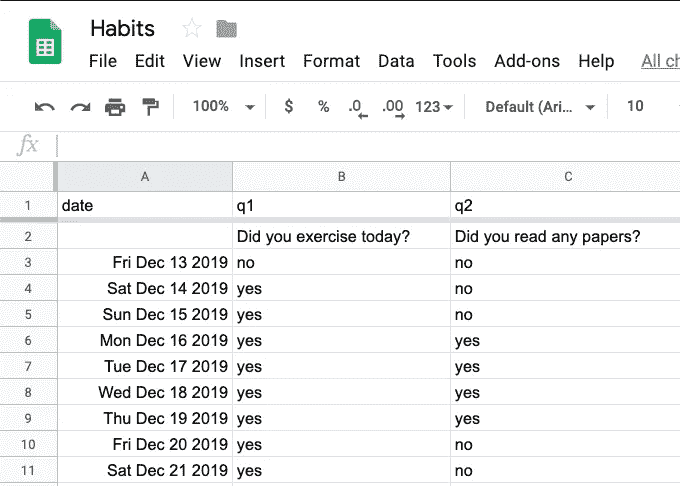

# 如何在谷歌助手上创建你的个人习惯跟踪器

> 原文：<https://towardsdatascience.com/how-to-create-your-personal-habit-tracker-on-google-assistant-a15fb304c561?source=collection_archive---------19----------------------->

## 一个程序员为所有程序员设计的跟踪你的习惯的最懒的方法！

# 序言

在很长一段时间里，我一直试图在日常生活中加入新的习惯。我尝试了各种应用程序、纸张模板等。但是都不好用。我通常会忘记填充它们，或者觉得这样做太累了。最近，我得到了一个新的谷歌 nest mini，睡觉前用它聊天很有趣。所以，我想为什么不让谷歌助手帮我追踪我的习惯。

# 它是如何工作的

我:“嘿谷歌，跟习惯追踪器聊聊”
助手:“获得习惯追踪器的测试版”
习惯追踪器:“你今天锻炼了吗？”
我:“是”
……更多问题……
HabitTracker:“你看了什么论文吗？”
我:“没有”
HabitTracker:“我问了我所有的问题”
之后，在我的“习惯”google sheet 中插入新的一行:

Nothing feels better than filling a spreadsheet with your voice!

# 如何创造你自己的

本教程我们要做的:
1。创建一个 Google 表单并添加您自己的问题
2。创建一个可以编辑您的工作表
3 的服务。设置您的 Dialogflow 项目
4。和你的习惯追踪者谈谈

您需要一些基本的编程知识和一个 Google 开发人员帐户来完成这个演练。如果您想修改代码的某些部分，了解一点 [Dialogflow 概念](https://cloud.google.com/dialogflow/docs/concepts)是有益的。完成演练大约需要一个小时。

## 1.创建您的谷歌表单

我用来填充 google 表单的脚本有一些假设，您应该遵守:

*   为时间保留第一列
*   保留前两行提问

你基本上可以复制[这张表](https://docs.google.com/spreadsheets/d/1dfpMBDscDgB4YIVvBrOdCk8FRxLG08QBsX9QuePsdCY/edit?usp=sharing)并添加你自己的问题。为后面的步骤保存您的电子表格键。

## 2.创建用于编辑工作表的服务

现在，您需要创建一个 google 服务帐户，并与它共享此文档。查看[本节教程](https://www.npmjs.com/package/google-spreadsheet#service-account-recommended-method)。经过这一步，你应该有你的`client_email`和`private_key`。

## 3.设置您的 Dialogflow 项目

[Dialogflow](https://dialogflow.cloud.google.com/) 是用于创建对话机器人的谷歌服务。我们需要设置它，并将其连接到我们自己的 web 服务，以使事情正常工作。你需要在 Dialogflow 中上传我的 [GitHub 项目](https://github.com/m30m/HabitTracker)中的一些文件，这些文件可以直接从[这里](https://github.com/m30m/HabitTracker/archive/master.zip)下载。

1.  首先，您需要创建一个新项目。
2.  从左侧菜单，转到实体部分并上传[是-否实体](https://github.com/m30m/HabitTracker/blob/master/Yes-No.json)。实体是 Dialogflow 可以从对话中检测到的概念，并将其传递给我们的服务。
3.  从左侧菜单中，转到 intents 部分并删除默认的欢迎意图。然后，上传[动态意图](https://github.com/m30m/HabitTracker/blob/master/dynamic.json)。
4.  从左侧菜单，进入完整菜单，并启用行内编辑器。将[中的`index.js`内容复制到](https://github.com/m30m/HabitTracker/blob/master/index.js)中，将[中的`package.json`内容复制到](https://github.com/m30m/HabitTracker/blob/master/package.json)中，并粘贴到它们的标签页中。现在你应该修改`index.js`并添加你自己的配置。这基本上是代码的前 3 行。
    所有的逻辑都在里面`index.js`它创建一个 Dialogflow 应用程序来处理请求，它连接到 google 电子表格，读取问题，并在所有问题都得到回答时添加一个新行。
5.  部署您的功能！可惜，这不是结局。Firebase 函数不允许您向测试计划中的其他服务发出请求。你也必须升级你在 Firebase 的计划。Blaze 计划几乎是免费的，因为你的函数每天被调用的次数不会超过几次。

## 4.测试一切

在 Dialogflow 的右边部分，你可以通过说或输入“跟踪我的习惯”来开始与你的习惯跟踪器对话。你可以检查 Firebase 函数日志，看看是否一切顺利。最后，你可以直接在谷歌助手上测试它，只需点击“查看它如何在谷歌助手上工作”链接，然后从那里将你的机器人部署到你的所有设备上。

# 收场白

我用谷歌助手追踪我的习惯已经有 10 天了，感觉真的比其他方法好。首先，我有更多的动力去做我的习惯，因为当谷歌助手询问我的习惯时，对它说“是”的感觉真的很好；不知何故，这和我小时候老师问我有没有做作业的时候很像。说好的时候感觉真的很好，说不的时候感觉很丢人
第二，真的很简单，不打扰你睡觉。你不需要看着屏幕，你不需要你旁边的手机或者纸和笔。
最后但并非最不重要的一点是，数据保存在谷歌表单上的感觉真的很好。我可以随心所欲地处理我的数据，任何第三方都无法访问。这对于纸质习惯跟踪器和没有导出功能的第三方应用来说都不容易。

希望你喜欢我的文章和快乐习惯追踪！