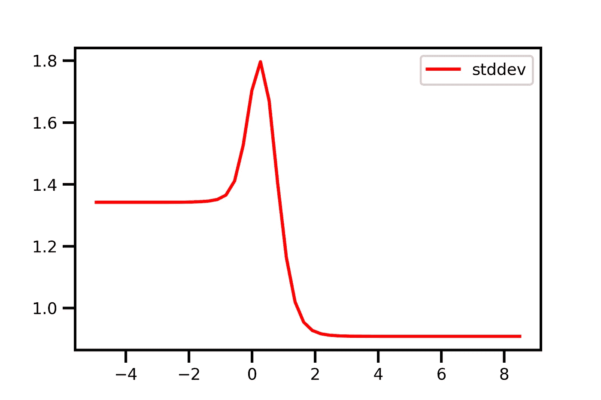

# 深度学习时代如何应对不确定性

> 原文：<https://towardsdatascience.com/how-to-deal-with-uncertainty-in-the-era-of-deep-learning-977decdf84b5?source=collection_archive---------16----------------------->

## TensorFlow 在深度学习社区中引入了概率建模

Photo by [Hossein Soltanloo](https://unsplash.com/@soltanloo?utm_source=unsplash&utm_medium=referral&utm_content=creditCopyText) on [Unsplash](https://unsplash.com/search/photos/out-of-focus?utm_source=unsplash&utm_medium=referral&utm_content=creditCopyText)

最近，每天都有新的出色的机器学习应用发布，很可能是由一些深度学习模型驱动的。在表面之下，成千上万的公司将相同的技术应用于各种不同的过程。最迟当它支持关键决策时，你应该考虑每一个预测的确定程度。我们将解释为什么会这样，如何定义不确定性，并最终查看一些代码示例，以便您能够在下一个项目中应用我们的发现。

## 特洛伊斑马的故事

我们来做一个思维实验。假设你是一家组织旅行的公司，你想为客户的冒险创造一个更安全的体验。作为一名机器学习工程师，你的目标可能是创建一个图像分类器，将周围的动物标记为“潜在危险”或“可能无害”。这个程序会让顾客感到安全，并在必要时给予他们预防措施。

幸运的是，一个月前你在所有的车上安装了摄像头，这样你现在就有了大量斑马、蛇、长颈鹿等的图像。你马上开始训练你的神经网络。初步评估显示，您的模型运行得相当好，可以检测出各种潜在危险的蛇和无害的斑马。

> “那太好了”，你想，“但是如果我在实践中使用这个模型，而一只在数据中被低估甚至完全不存在的动物出现在我的相机前，那该怎么办？”

这个模型被迫在两个可能的结果中选择一个，尽管它实际上没有任何线索。进一步想象一下，在这种情况下,(几乎)未知的动物是一只老虎。由于某些相似性(条纹、四条腿等)，模型可能会在其内部表示中定位照片。)更接近斑马，而不是捕食者，因此错误地分类了情况。

Photo by [Smit Patel](https://unsplash.com/@_smeet__?utm_source=unsplash&utm_medium=referral&utm_content=creditCopyText) on [Unsplash](https://unsplash.com/collections/2530039/white-tigers?utm_source=unsplash&utm_medium=referral&utm_content=creditCopyText)

如果模型能够传达其不确定性，并且因为您主要对客户的安全感兴趣，您可以校准您的系统，以便在有疑问时做出防御性反应，这不是很好吗？

预测不确定性有许多原因，但从我们的建模角度来看，基本上可以归结为两类。最简单的方法是把它看作与数据和模型相关的不确定性。

## 任意不确定性

前者可能是更明显的一个。每当你在相同的环境下进行多次测量时，每次都不可能得到完全相同的结果。这是为什么呢？原因有几个:如果你用的是传感器，每个设备本身都有它的准确度、精密度、分辨率等。在手动实验室样本的情况下，所使用的技术、个人技能和扮演其角色的经验。基本上，测量的每个方面都是未知的，因此会引入某种随机性，这属于这一类。

如果你能够减少随机的不确定性，取决于你对收集数据的方式有多大的影响力。

## 认知不确定性

既然我们已经涵盖了数据中的不确定性，那么模型呢？这不仅仅是模型解释给定数据的能力的问题，而是数据包含所有已知信息的确定程度的问题。看待认知不确定性的另一种方式是衡量一个(无限的)模型集合对结果的认同程度。如果多个模型得出严重偏离的结论，这些数据显然没有描绘出全貌。

例如，试图拟合复杂函数的简单模型、太少或缺少数据等都可能导致认知上的高度不确定性。这就是你作为建模者的经验可以大放异彩的地方。是不是缺少了一个重要的特性？在你的训练数据中，有没有代表不足的情况？你选对型号了吗？

## 实用的方法

由于两种类型的不确定性在所有预测中都不是恒定的，所以我们需要一种方法来为每个预测分配特定的不确定性。这就是新的 [TensorFlow Probability](https://www.tensorflow.org/probability) 软件包介入拯救世界的地方。它提供了一个框架，将概率建模与我们钟爱的深度学习模型的能力相结合。

**chart 1:** example data

为了演示的目的，我们将采取一个非常简单的回归问题，只有一个输入和一个输出维度。训练数据的两个 blobs 在它们的标准偏差方面不同，并且在它们之间是我们没有任何数据的空间。模型能够以任何有意义的方式考虑和交流这些方面吗？

我们将采用两层神经网络。第一个以 sigmoid 为激活，第二个以 identity 函数为激活。到目前为止，一切如常。

最后缺少的步骤是来自[张量流概率](https://www.tensorflow.org/probability)的新[TFP . layers . distributionλ](https://www.tensorflow.org/probability/api_docs/python/tfp/layers/DistributionLambda)层。它返回的不是一个张量，而是一个[TFP . distributions . distribution](https://www.tensorflow.org/probability/api_docs/python/tfp/distributions/Distribution)，你可以用它来执行你期望从分布中得到的所有类型的操作，比如采样，导出它的均值或标准差等等。

**chart 2:** aleatoric uncertainty

**chart 3:** aleatoric uncertainty (standard deviation)

你注意到第二致密层的两个神经元了吗？他们需要学习输出分布的均值和标准差。

你可以看到，通过预测一个分布而不是一个单一的值，我们越来越接近我们实际想要达到的目标。如前所述，两个斑点具有不同的方差，并且模型在其预测中反映了这一点。可以认为，对于每个斑点，该模型预测了关于拟合的平均曲线的恒定方差，该方差似乎与数据不匹配，但是这是由于有限的模型复杂性，并且将随着自由度的增加而解决。

但是在两个 blobs 之间发生了什么呢？这不是我们对一个没有数据的空间中的不确定性度量的期望，对吗？谁说在那个空间里，在远离拟合函数的某个地方，没有另一个不可测量的斑点？没人；我们只是不知道。模型也没有。不管怎样，你不应该对模型的插值感到太惊讶。

> 毕竟，这就是模型的作用:在没有数据的情况下，学习最符合已知数据且不损害这一目的的函数。

那么，我们如何弥补这种信息的缺乏呢？事实证明，我们之前已经讨论过解决方案:考虑认知不确定性。

基本方法是将使用分布代替单个变量的想法向前推进一步，并将其应用于所有模型参数。因此，我们以之前的示例为例，用 TFP . layers . dense variative 层替换两个 Keras 密集层。因此，该模型不仅学习一组权重和偏差，而且将其所有参数视为随机变量，其或多或少的方差取决于它找到最佳拟合的确定程度。在推断期间，模型从参数分布中取样，这导致每次运行的不同预测。因此，必须进行几次推断，并计算总体平均值和标准偏差。

**chart 4:** aleatoric and epistemic uncertainty

**chart 5:** aleatoric and epistemic uncertainty (standard deviation)

这个升级版的模型如何处理我们的玩具数据？我们可以看到，它仍然反映了两个 blobs 附近的不同方差，尽管它们似乎都增加了。这实际上是有意义的，因为我们看到的是两者的总和，即任意的和认知的不确定性。

此外，在两个数据点之间，行为发生了更剧烈的变化:由标准偏差表示的模型不确定性现在在我们没有任何可用数据的情况下达到峰值。这正是我们所希望的。

让我们再看一下我们的例子，并思考为什么它实际上是有效的。概括地说，该模型试图找到最符合数据的函数。难道没有很多其他函数能像图表 4 中的函数一样很好地拟合数据吗？例如，如果将曲线沿 x 轴稍微向左或向右移动，损耗不会显著变化。因此，造成这种移动的模型参数具有广泛的分布。在给定数据的情况下，模型对这个参数相当不确定。

如果您对完整的代码示例感兴趣，可以看看 [jupyter 笔记本](https://gist.github.com/de-eplearn/ff643168e48de5ada255b23b22627521)。它基于[tensor flow probability](https://www.tensorflow.org/probability)团队与他们的[博客](https://medium.com/tensorflow/regression-with-probabilistic-layers-in-tensorflow-probability-e46ff5d37baf)就同一主题发表的一篇文章。如果你想更深入地研究，我推荐查看一本 jupyter 笔记本[的重写版](https://github.com/CamDavidsonPilon/Probabilistic-Programming-and-Bayesian-Methods-for-Hackers/blob/master/Chapter1_Introduction/Ch1_Introduction_TFP.ipynb)由 *Cameron Davidson-Pilon* 撰写的《黑客的贝叶斯方法*》一书。我非常喜欢他们展示内容的互动方式。*

# *结论*

*通过查看一个使用[张量流概率](https://www.tensorflow.org/probability)的简单示例，我们看到了在我们的模型中考虑不确定性的重要性，以及如何克服随之而来的挑战。虽然这个库还很年轻，但我预计它很快就会变得成熟起来，因为它提供了一种简单的方法，通过无缝地适应 Keras 来结合概率建模和深度学习。*

*希望在从预测中得出重要决策之前，关注模型的可靠性将成为越来越普遍的做法。看到可以说是最广泛使用的深度学习库为此奠定基础，至少是朝着正确的方向迈出了一大步。*

*如果你觉得这篇文章有帮助，请在评论中告诉我你的想法和经历，别忘了在 [Medium](https://medium.com/@dirk.elsinghorst) 和 [LinkedIn](https://www.linkedin.com/in/dirk-elsinghorst/) 上关注我。*