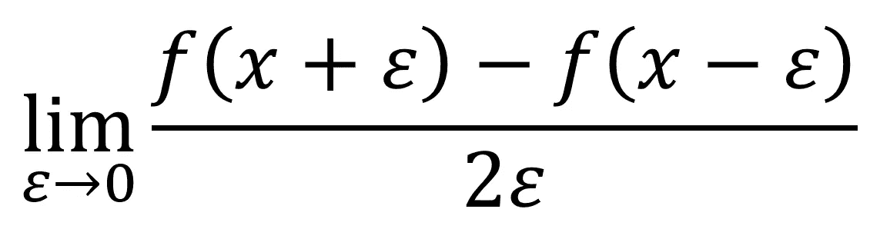
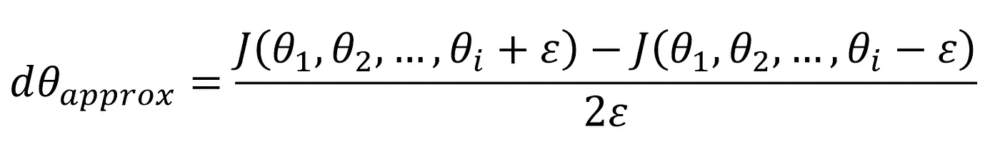
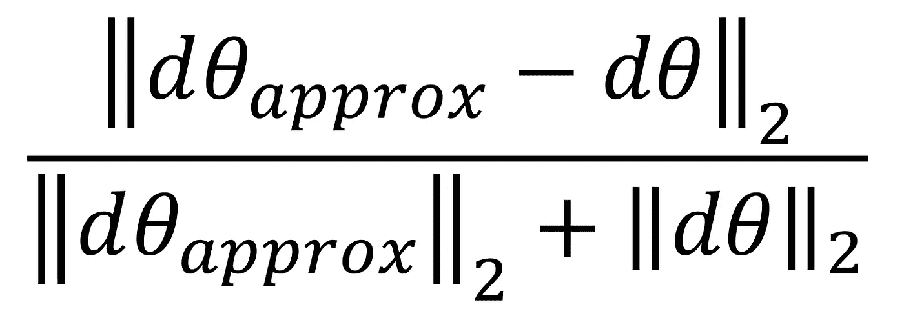
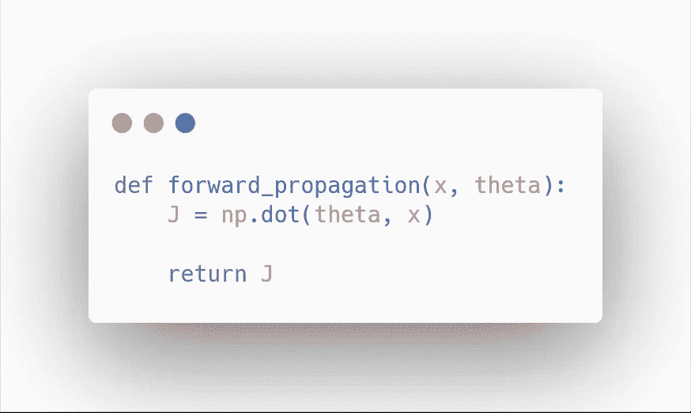
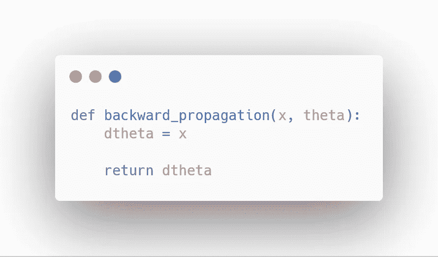
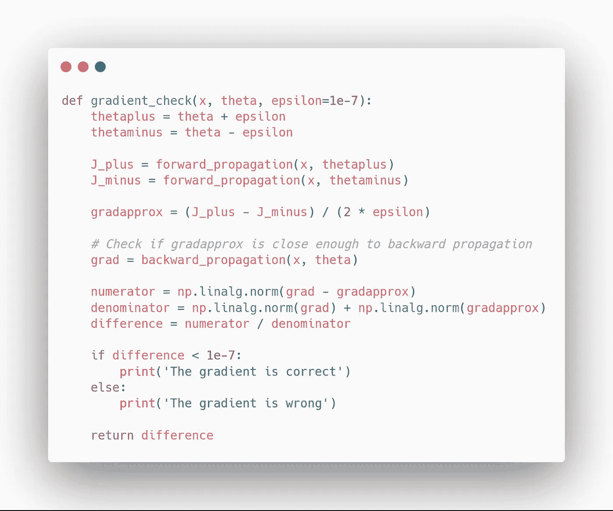
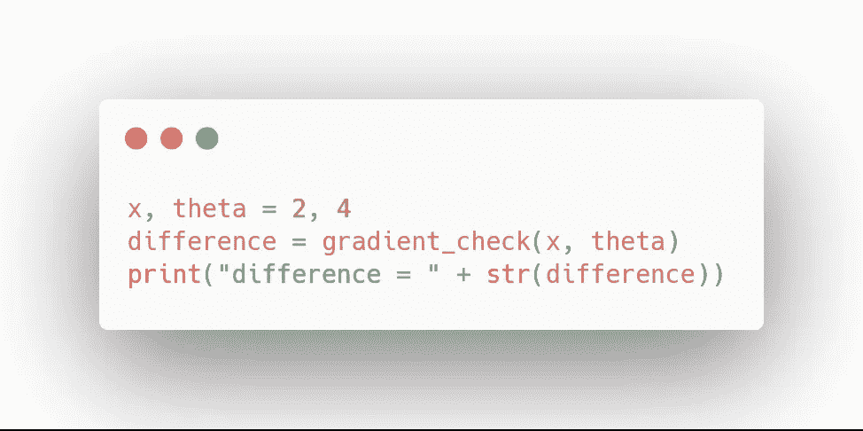
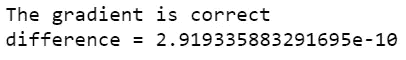

# 如何使用梯度检查调试神经网络

> 原文：<https://towardsdatascience.com/how-to-debug-a-neural-network-with-gradient-checking-41deec0357a9?source=collection_archive---------6----------------------->

## 理解数学并学习如何执行梯度检查

Photo by [Sue Thomas](https://unsplash.com/@suethomas?utm_source=medium&utm_medium=referral) on [Unsplash](https://unsplash.com?utm_source=medium&utm_medium=referral)

当[从零开始实现一个神经网络](/how-to-build-a-deep-neural-network-without-a-framework-5d46067754d5)时，反向传播可以说是更容易出错的地方。因此，在调试神经网络时，调试此步骤的方法可能会节省大量时间和麻烦。

这里将介绍**梯度检查**的方法。简而言之，该方法包括使用数值方法来近似梯度。如果它接近计算的梯度，那么反向传播是正确实现的！

让我们深入了解更多的细节，看看如何在项目中实现它。

> 对于机器学习、深度学习和人工智能的实践视频教程，请查看我的 [YouTube 频道](https://www.youtube.com/channel/UC-0lpiwlftqwC7znCcF83qg?view_as=subscriber)。

Bugs are scary… Let’s get rid of them with gradient checking!

# 一点微积分

假设你有一些微积分的知识，梯度检验会非常容易理解。

我们知道反向传播计算导数(或梯度)。在微积分课程中，你可能记得导数的定义如下:

Definition of the derivative

上述定义可用作导数的数值近似值。取足够小的*ε*，计算出的近似值将在*ε*平方的范围内具有误差。

换句话说，如果*ε*为 0.001，则近似值将偏离 0.00001。

因此，我们可以用它来近似梯度，进而确保反向传播正确实现。这构成了梯度检查的基础！

# 矢量化实现

现在，在用 Python 实现梯度检查之前，我们需要定义一种矢量化形式的梯度检查。

让我们将权重和偏差矩阵重新整形为一个大向量 *theta。*同样，它们各自的所有导数都将被放入一个向量 *d_theta* 。因此，近似梯度可以表示为:

Vectorized approximation of the gradient

注意上面的等式和极限的定义几乎是一样的！

然后，我们应用以下公式进行梯度检查:

Gradient check

上面的等式基本上是由向量的范数之和归一化的欧几里德距离。在其中一个向量非常小的情况下，我们使用归一化。

作为*ε*的值，我们通常选择 1e-7。因此，如果梯度检查返回值小于 1e-7，则意味着反向传播被正确地实现。否则，您的实现中可能会出现错误。如果该值超过 1e-3，则可以肯定代码不正确。

# 代码

为了便于理解，让我们编写梯度检查代码，并将其应用于一个简单的示例。如果你卡住了，代码在这里可用[。](https://github.com/marcopeix/Deep_Learning_AI/blob/master/2.Improving%20Deep%20Neural%20Networks/1.Practical%20Aspects%20of%20Deep%20Learning/Gradient%20Checking.ipynb)

我们从定义一个非常简单的激活函数开始:

然后，我们实现反向传播:

当然，您会注意到反向传播是正确实现的。随意放一个错误，以测试梯度检查的鲁棒性。

现在，我们实现梯度检查:

完美！让我们检查一下反向传播是否正确实现了:

您应该会看到以下内容:

恭喜你！您现在知道如何使用梯度检查来调试您的神经网络了！如果您在不使用框架的情况下构建神经网络，这尤其有用。否则，像 TensorFlow 和 Keras 这样的框架会自动处理反向传播步骤，您可以放心地假设它已正确实现。

在[未来的帖子](/how-to-improve-a-neural-network-with-regularization-8a18ecda9fe3)中，我将展示如何使用正则化来改进神经网络。

干杯！