# 如何在亚马逊 SageMaker 和微软 Azure 机器学习工作室之间抉择

> 原文：<https://towardsdatascience.com/how-to-decide-between-amazon-sagemaker-and-microsoft-azure-machine-learning-studio-157a08af839a?source=collection_archive---------3----------------------->

## 两者都可以更快地构建模型，但是针对的用户类型非常不同

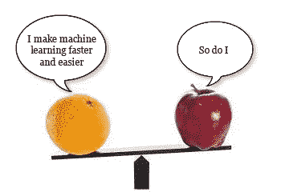

我最近发表了一篇微软 Azure Machine Learning Studio(Studio)[的走查，对它的简单和强大印象良好。但是，还有其他工具也声称可以使机器学习更容易，并加快模型开发。我想知道他们如何比较？所以，本周，我要看看亚马逊 SageMaker (SageMaker)以及它与 Studio 的比较。](/how-microsoft-azure-machine-learning-studio-clarifies-data-science-8e8d3e6ed64e)

当我将 SageMaker 与 Studio 进行比较时，我发现了一种非常不同的建模方法。每种工具的供应商都声称提供全面管理的服务，覆盖整个机器学习工作流程，以快速构建、训练和部署机器学习模型。这是完全正确的。然而，他们以截然不同的方式实现这一点。

Azure Studio 有一个拖放 UI，其中机器学习建模过程是在画布上构建的(如果用户没有太多偏离，完全没有代码)。用户可以避开复杂的数据工程、开源库和 Python 编码。该产品面向数据分析师、公民数据科学家以及其他希望以简单、直观的方式构建模型的人。

另一方面，SageMaker 严重依赖代码，大部分用户交互都是在熟悉的 Jupyter 笔记本上进行的(当然，这是数据科学家最常用的工具之一。)SageMaker 环境将允许最大的灵活性(使用 Python——数据科学家最流行的编码语言),但需要比 Studio 更多的数据工程、数据存储和计算资源方面的知识。

因此，虽然这两种产品都使数据科学变得更容易，但这实际上是比较苹果和橙子的情况，因为它们的运作方式如此不同。SageMaker 不适合 Studio 的目标用户，他们不了解编码和数据工程，Studio 似乎限制了精通软件的数据科学家和开发人员，他们习惯于编码他们想要的任何东西。

要了解为什么这些产品是为不同的用户设计的，最好是通过屏幕截图浏览模型构建的过程，了解每个产品如何进行设置、获取数据、准备数据、构建和训练模型、对模型进行测试和评分以及部署。

对于 SageMaker，我将使用 Python3 实现 XGBoost 算法，为一家银行的市场部预测一位客户是否会购买 CD。对于 Studio，我将使用各种汽车属性进行线性回归，以预测汽车的价格。下面是这两种产品的工作原理。

# **设置—创建环境**

亚马逊 SAGEMAKER

使用 Amazon SageMaker，我们首先在云中创建一个 Jupyter 笔记本实例。

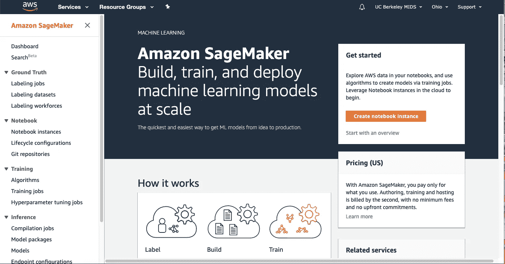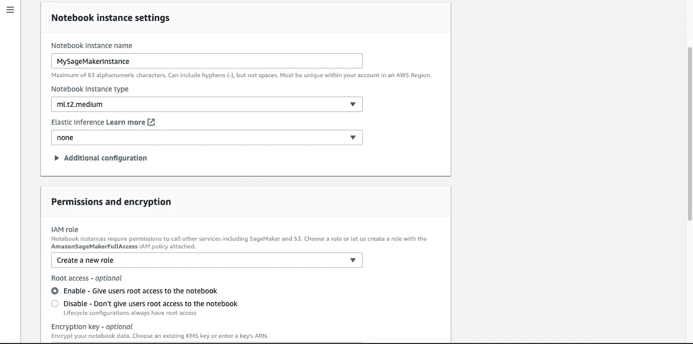

创建笔记本实例是为了让用户可以访问 S3 (AWS 存储)和其他服务。请注意，在这个设置过程中，用户正在决定他们应该访问哪些 S3 存储桶，选择他们的云实例的大小和其他技术细节，这可能会让公民数据科学家感到困惑。

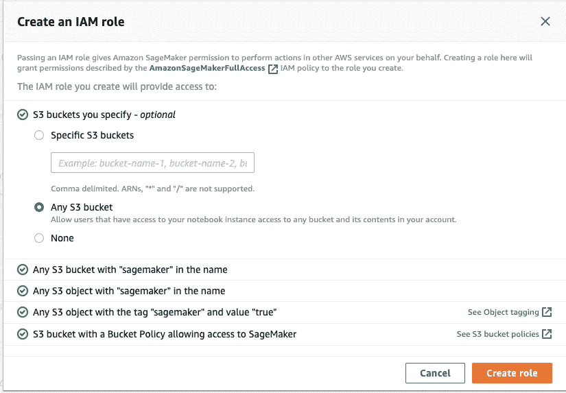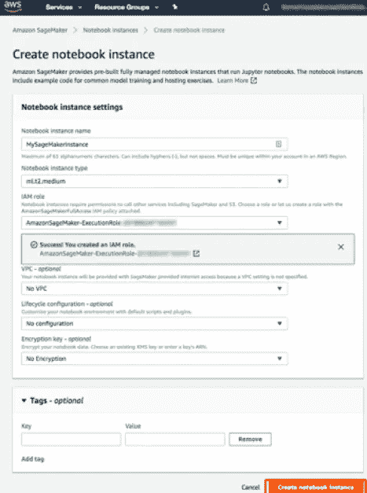

AZURE 工作室

Azure 机器学习工作室的启动点是主页。

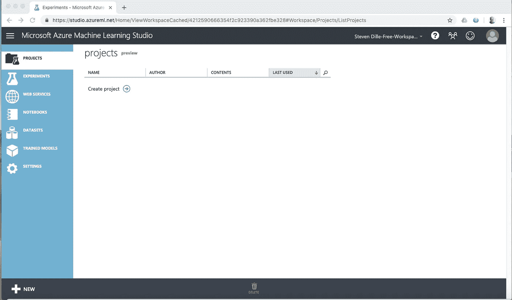

与 SageMaker 中所需的初始设置和实例管理相比，Studio 看起来更像一个业务应用程序，并且跳过了复杂性。基本布局显示在左侧的以下选项卡中:

项目——代表单个项目的实验、数据集、笔记本和其他资源的集合

实验-您创建或保存的实验

Web 服务——您从实验中部署的 WEB 服务模型

笔记本—您创建的 Jupyter 笔记本

数据集-您已上传到 Studio 的数据集

训练模型-您在实验中训练并保存的模型

# **获取数据**

AZURE 工作室

Studio 允许您在该屏幕截图的左侧导入和保存数据集。在这个例子中，我选择了一个标签为**汽车价格数据(原始数据)**的数据集，然后将这个数据集拖到实验画布上。

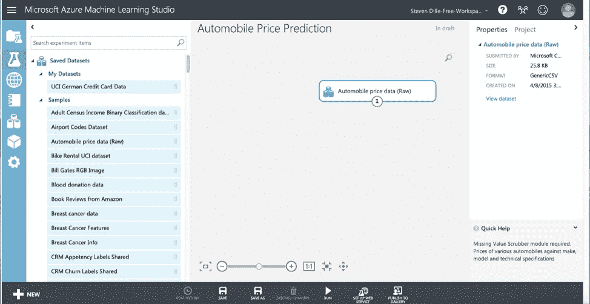

studio 的工作方式是通过创建画布来进行机器学习实验。在画布上，用户拖放必要的组件，如数据集、转换、算法等..在有序的流程中进行模型实验。在测试和决定模型之后，实验被转换为工作模型并发布。

数据科学家欣赏的一个非常好的特性是能够快速查看数据列和分布，以了解他们正在处理的数据。要查看这些数据，只需单击数据集底部的输出端口，然后选择 Visualize。

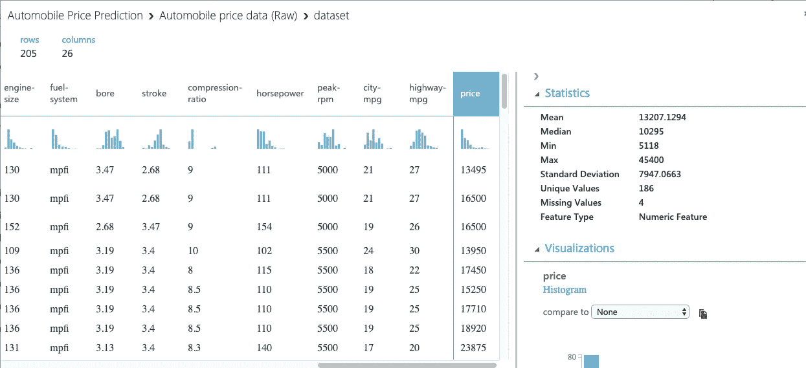

亚马逊 SAGEMAKER

在本例中，将数据放入 SageMaker 的过程是用 Python 以编程方式完成的。用户选择数据集(可以是 CSV 文件等。)并将其导入熊猫数据框架进行分析。这被集成到后面显示的 SageMaker 的数据准备部分。在本例中，代码类似于 Python 命令:

model_data = pd.read.csv(…。)

# **准备数据**

亚马逊 SAGEMAKER

在 SageMaker 中，一旦用 Python 编写了数据，用户就可以自由地以编程方式转换列，删除缺少数据的行等..完全灵活。稍后，我将向您展示一些样例代码，其中包括重新格式化标题和列，作为模型选择部分的一部分。

为了在训练模型之前在 SageMaker 中完成数据准备，还需要完成许多步骤来配置环境。注意:这里再次强调容器、数据框架、库，定义正确的 S3 桶和国家区域。这种复杂性对 Studio 中的用户是屏蔽的。

首先，我们需要选择我们正在使用的 Python 版本——conda _ Python 3。

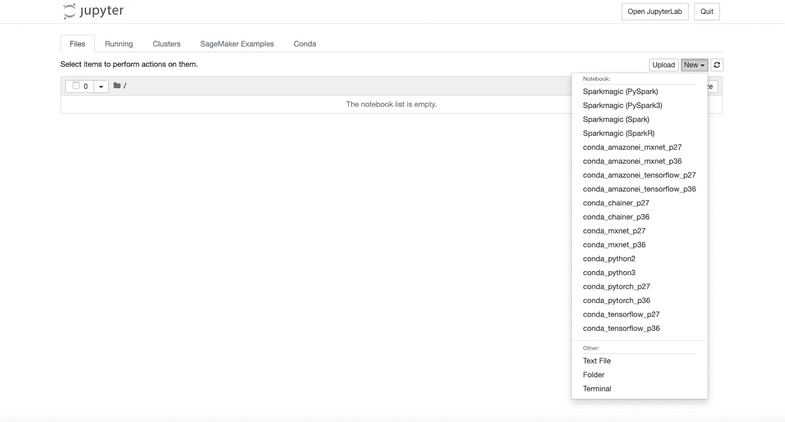

为了准备数据、训练机器学习模型并部署它，我们需要导入一些库并定义一些环境变量。在这种情况下，这样做的代码如下所示。我们将运行 Jupyter 笔记本中的代码。

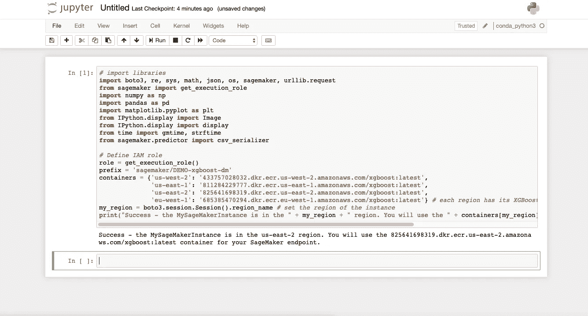

我们将需要一个 S3 桶来存储我们的训练数据，一旦我们处理了它，这也需要定义。

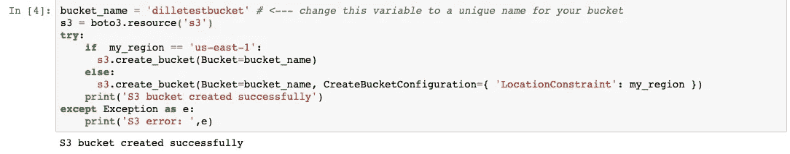

接下来，我们需要将数据下载到我们的 SageMaker 实例，并如上所述将其加载到 Pandas 数据帧中。要做到这一点，应该如下所示:

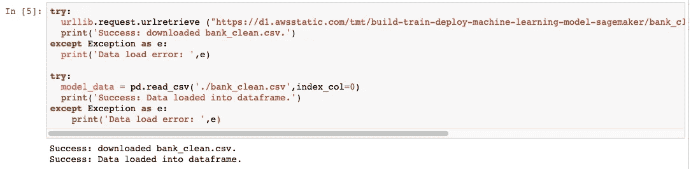

AZURE 工作室

与基于代码的方法相比，Studio 提供了一种拖放的可视化方法。Studio 中的数据集和模块具有由小圆圈表示的输入和输出端口——输入端口在顶部，输出端口在底部。要在实验中创建数据流，需要将一个模块的输出端口连接到另一个模块的输入端口。您可以随时单击数据集或模块的输出端口，查看数据流中该点的数据。

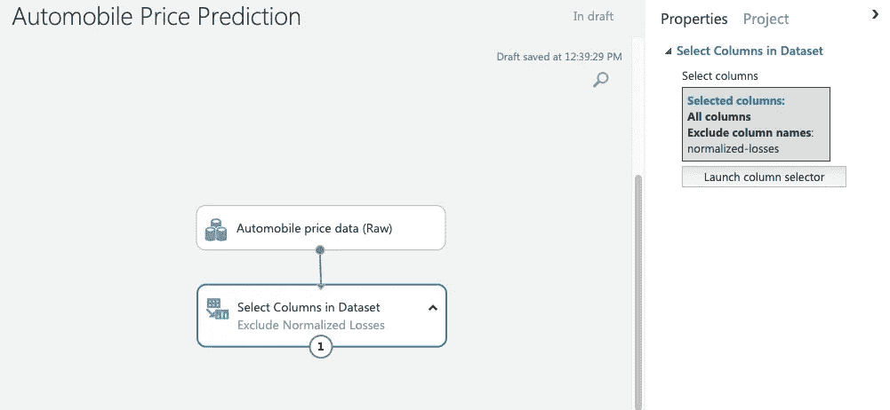

Studio 使数据准备过程对业务用户来说非常容易。它们提供了一个模块(**选择数据集**中的列，以完全删除不需要的列(在本例中为**归一化损失**列，它有许多缺失值)。我们只需将数据集模块中的**选择列连接到我们的汽车数据集，并选择要排除的列。**

类似地，为了删除丢失数据的行，我们将**清除丢失数据**模块拖到实验画布上，并将其连接到数据集模块中的**选择列。**

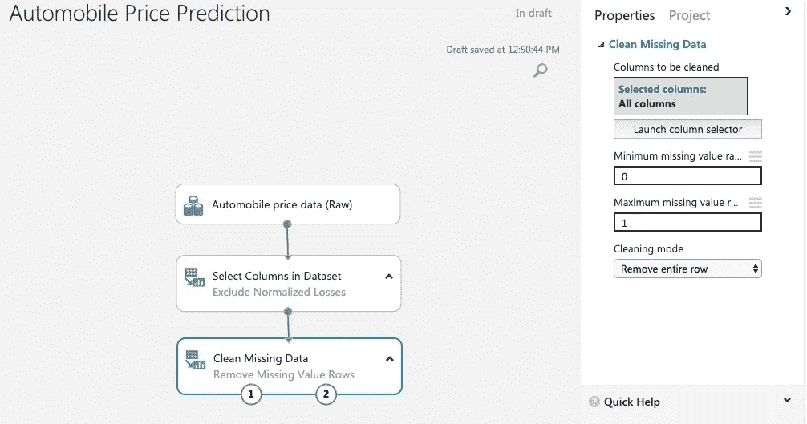

# **建立&训练模型**

这一步包括将数据分成训练和测试子集，选择预测所基于的特征，并选择最适合数据的算法。

**分割数据并选择特征**

亚马逊 SAGEMAKER

将数据分成训练集和测试集是通过几行 Python 代码完成的。训练数据(本例中为客户数据集的 70%)将在一个称为梯度优化的迭代周期中使用，以学习模型要素并以最小的误差从输入要素中推断分类标签。这似乎是 SageMaker 在这个例子中的一个优势，因为功能选择(独立变量)是自动执行的，而在 Studio 中，我们手动选择功能，正如您将看到的。剩下的测试数据(30%)将用于稍后评估模型的性能。

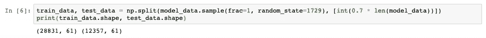

AZURE 工作室

为了在 studio 中分割数据和选择特性，我们使用 Dataset 和 split data 模块中的 select 列。

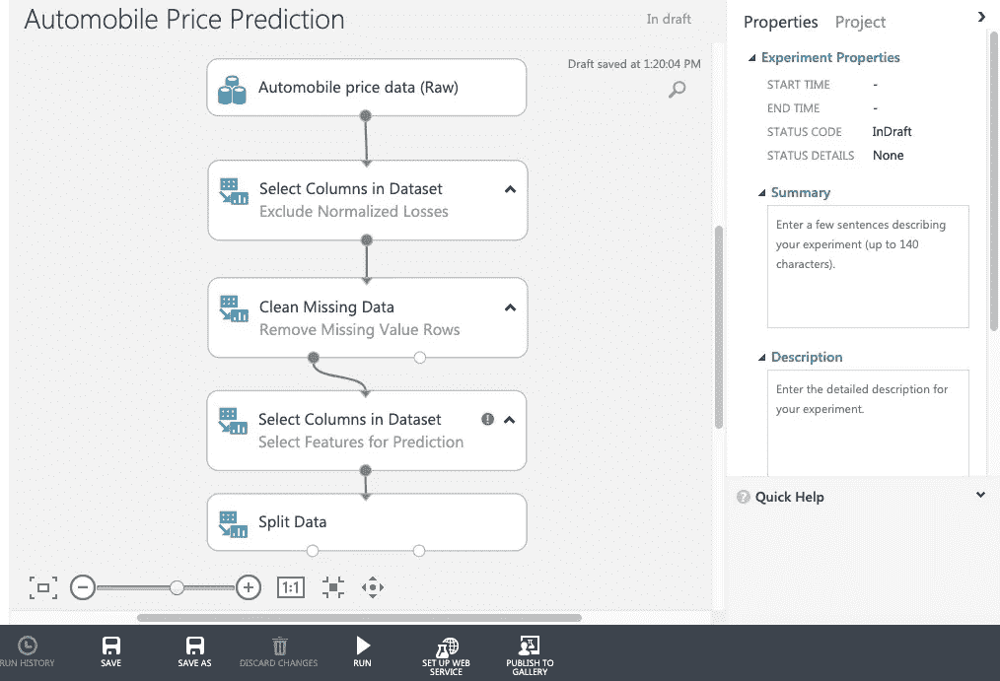

Studio 允许我们通过选择我们认为将提供预测能力的列来选择传递给训练算法模块的特性，并进行迭代，直到我们获得所需的性能。我确实发现 Studio 中的一些机器学习算法确实使用特征选择或维度缩减作为训练过程的一部分。当我们使用这些算法时，我们可以跳过特征选择过程，让算法像 SageMaker 一样决定最佳输入。对于线性回归，我们手动选择特征。

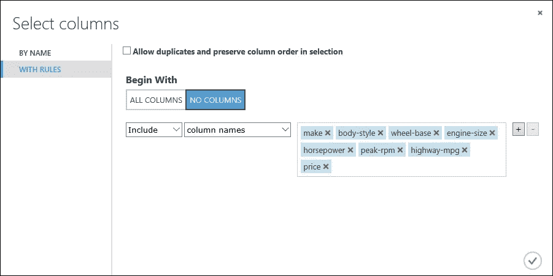

为了分割数据，我们将使用分割数据模块，直观地选择分割百分比，而不是像在 SageMaker 中那样进行编码。

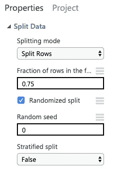

**训练模型**

亚马逊 SAGEMAKER

我们已经预先确定将使用 SageMaker 预构建的 XGBoost 算法。类似于我们在准备数据部分如何在 Studio 中消除列和行，我们可以在 SageMaker 中用 Python 进行相同类型的数据清理和重新格式化。下面的代码(在单元格#6 中)重新格式化训练数据的头和第一列，并从 S3 存储桶加载数据。

接下来，我们需要设置 SageMaker 会话，创建 XGBoost 模型的实例(估计器)，并定义模型的超参数。这个的代码在 7 号单元格。

加载数据并设置 XGBoost 估计器后，我们现在可以在 ml.m4.xlarge 实例上使用梯度优化来训练模型，方法是使用单元格#8 中的代码在 Jupyter 笔记本中选择 run。

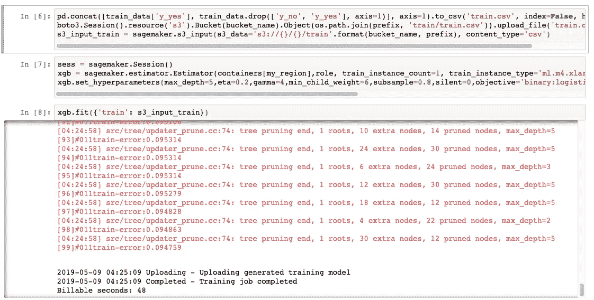

AZURE 工作室

为了添加我们希望使用的学习算法，我们展开画布左侧的**机器学习类别**，并展开**初始化模型部分**。我们已经预先确定我们将使用线性回归，所以选择线性回归模块并将其拖到画布上。接下来，我们将找到**火车模型**模块并将其拖动到实验画布上。将**线性回归**模块的输出连接到**训练模型**的输入，并将**分割数据**模块的训练数据(左端口)连接到**训练模型**，如图所示。

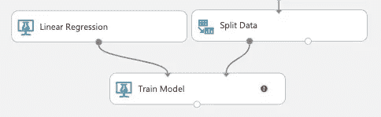

单击火车模型模块，然后在属性窗格中单击启动列选择器，然后选择价格列。价格是我们的模型将要预测的价值..我们将价格从可用列移动到选定列列表中。

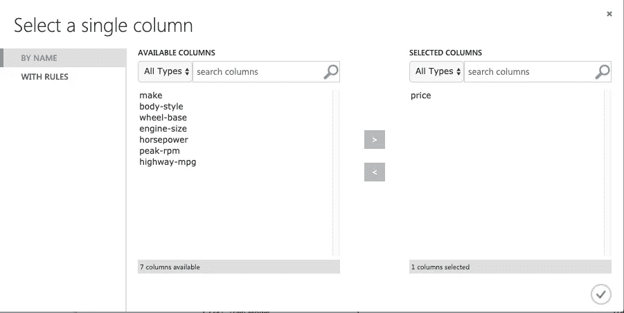

我们终于可以进行实验了。我们现在有了一个经过训练的回归模型，可以进行价格预测，我们在 Studio 中的模型创建流程如下所示:

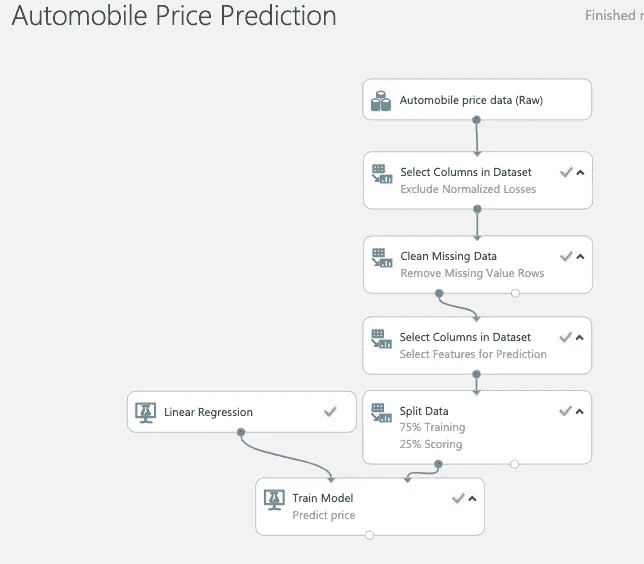

# **测试、评分和部署模型**

亚马逊 SAGEMAKER

要在 Sagemaker 中测试模型，我们必须首先部署它，这是一个与在 Studio 中不同的过程。为了在服务器上部署模型并创建端点，我们在 Jupyter 的 cell 9 中运行以下代码。为了预测测试数据中的客户是否注册了银行产品，我们将在 Jupyter 的单元格 10 中运行代码。

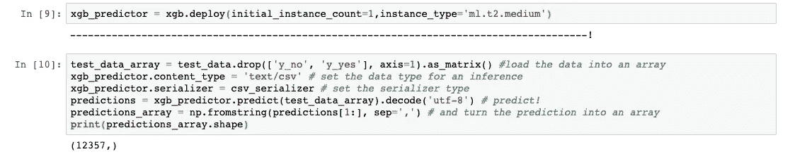

为了评估性能，我们编写 Python 代码来比较实际性能和预测性能，并生成如下结果表。

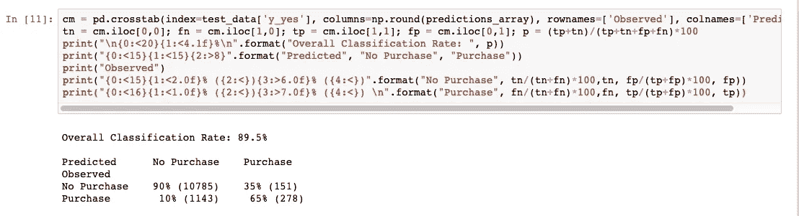

从这些结果中，我们可以得出结论，该模型准确地预测了测试数据中 90%的客户的结果，对于注册的客户，精度为 65% (278/429)，对于未注册的客户，精度为 90% (10，785/11，928)。

最后，在 Sagemaker 中，我们还需要记住终止我们的会话并清理云资源，以消除我们帐户中的进一步费用。下面的代码删除了 SageMaker 端点和 S3 存储桶中的对象。

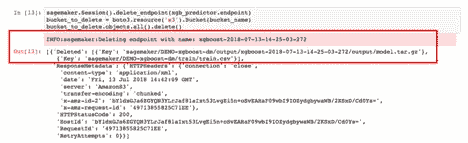

AZURE 工作室

既然我们已经在 75%的数据上训练了 Studio 模型，我们可以使用它来对另外 25%的数据进行评分，以查看我们的模型运行得有多好。我们通过将**乐谱模型**模块拖到实验画布上，并将**训练模型**的输出连接到它来实现这一点。然后，我们将**分割数据**模块的测试数据输出(右端口)连接到**评分模型**模块，如图所示。

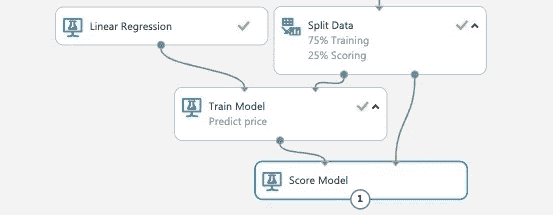

然后，我们运行实验，并通过单击底部端口并选择 Visualize 来查看**分数模型**的输出。预测价格与模型使用的所有已知要素数据一起显示在“评分标签”列中。列 price 是数据集中实际已知的价格。

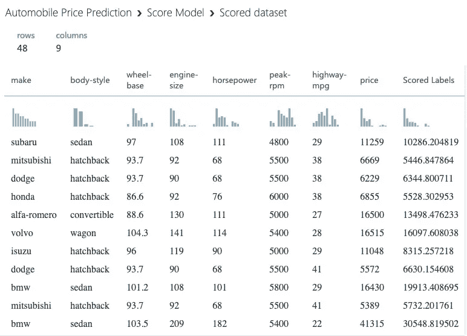

与 SageMaker 一样，我们希望评估我们的模型表现如何。为此，我们将**评估模型**模块拖到画布上，并简单地将其连接到**得分模型**的输出。现在，当我们再次运行这个实验时，我们可以看到平均误差和 R 平方等的统计结果...

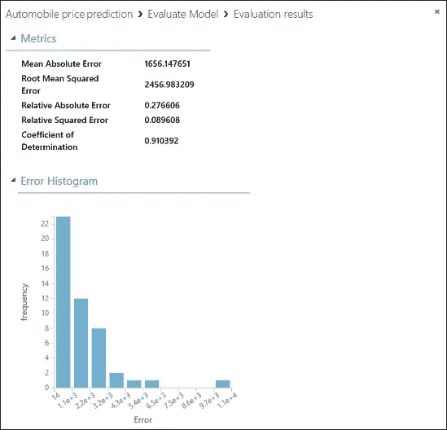

在对模型的准确性感到满意之后，Studio 通过一个**设置 Web 服务**按钮就可以轻松地将模型发布给其他人使用。在我们决定了模型的特征和算法之后，该选项通过消除模型中的数据分割、训练和其他不必要的步骤，将模型从实验转换为预测实验。我们最后一次运行这个模型来检查结果，它已经准备好了一个 API 密匙供其他人在 Azure 上使用。

# **总结**

微软和亚马逊都提供了一个强大的流程和基于 UI 的工具，以加速和简化 Azure Studio 和亚马逊 SageMaker 的机器学习模型开发过程。但是这些工具是为完全不同的用户设计的。

Studio 提供了一个漂亮的拖放界面，带有简单的模块来执行常见的功能，如访问数据、清理数据、评分和测试模型以及部署等..它旨在引导公民数据科学家和初学者完成构建机器学习模型的过程，同时保护他们免受管理云实例、Python 编码和 Jupyter 笔记本的复杂性的影响。

SageMaker 是为开发人员和数据科学家的需求而构建的，他们习惯于在 Jupyter 笔记本上工作，用 Python 编程，并希望获得灵活性和对资源的完全控制。但是 SageMaker 的用户无法避免其他云操作复杂性，如云实例管理——知道要选择的集群大小、位置以及完成工作后关闭集群。除了 Python 编程之外，这些类型的任务会使 SageMaker 成为大多数试图构建模型的业务分析师的不合适的选择。

但是一个产品比另一个产品能产生更精确的模型吗？我不认为模型的准确性会将一个与另一个区分开来，因为这两个产品都允许我们导入任何所需的算法，并且这两个产品都在不同的模型上提供了一些自动化的功能选择。我怀疑一个产品能比另一个产品始终产生更精确的建模结果，这有什么可概括的区别。

真正的区别在用户设计点。SageMaker 面向数据科学家/开发人员，Studio 面向公民数据科学家。但是，Studio 也支持 Jupyter 笔记本界面，这使得数据科学家也可以使用 Studio 和 Azure 机器学习服务的云基础设施来完成 SageMaker 在亚马逊云基础设施上提供的功能。为此，对于更多类型的用户来说，Studio 可能是一个更通用的选择。

# **关于作者**

史蒂夫·迪尔(Steve Dille)是硅谷的产品管理和营销领导者，曾在数据管理、分析、商业智能和大数据领域的公司高管团队中成功完成了 5 次公司收购和 1 次 IPO。最近，他是 SparkPost 的 CMO，在他的帮助下，SparkPost 从一家内部高容量电子邮件发送者转变为领先的预测分析驱动的云电子邮件 API 服务，并从 1300 万美元增长到超过 5000 万美元。他目前正在通过在加州大学伯克利分校攻读信息和数据科学硕士学位，建立数据科学、人工智能和机器学习方面的深厚知识。他过去的学历包括芝加哥大学布斯商学院的 MBA 学位和匹兹堡大学的计算机科学/数学学士学位。他曾在 NCR 担任软件开发人员，在惠普担任产品经理，在赛贝斯(Sybase)担任数据仓库总监，在许多其他初创公司和中型公司担任产品或 CMO 副总裁。