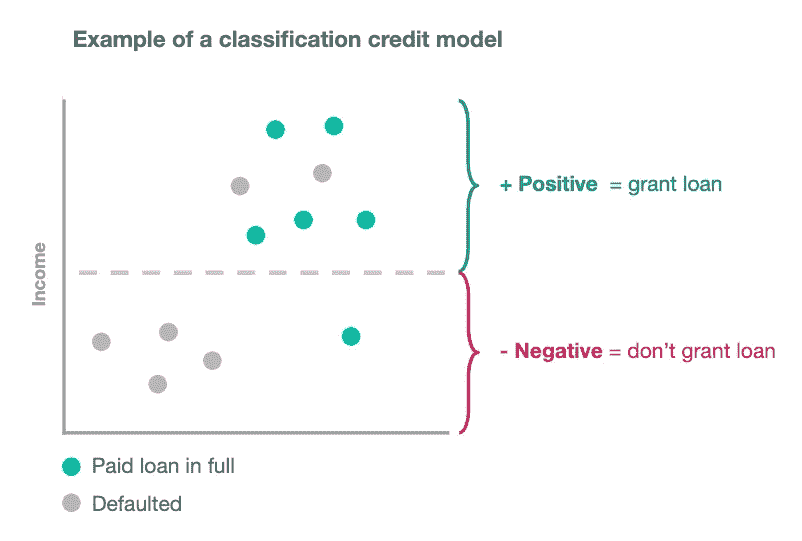
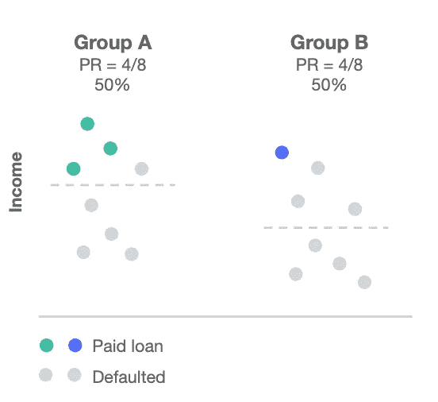
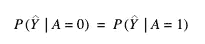
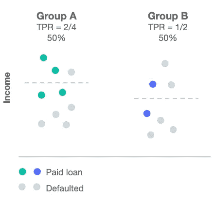
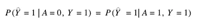
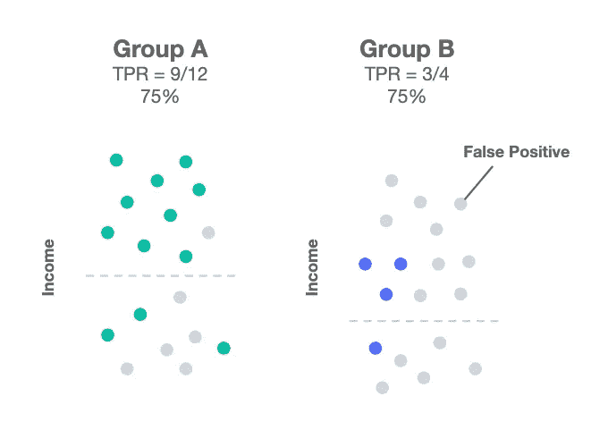
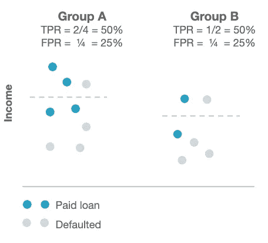
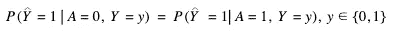
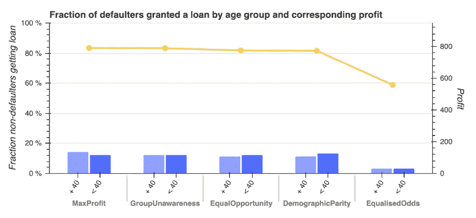

# 如何定义公平性以检测和防止机器学习中的歧视性结果

> 原文：<https://towardsdatascience.com/how-to-define-fairness-to-detect-and-prevent-discriminatory-outcomes-in-machine-learning-ef23fd408ef2?source=collection_archive---------4----------------------->

## 为了检测机器学习预测中的歧视性结果，我们需要比较我们的模型如何对待不同的用户群。

这可以通过在我们的模型中定义一个描述公平概念的度量来实现。例如，在看大学录取时，我们可以比较男女的录取率。这相当于使用人口统计上的均等作为公平的数学定义。它指出，在理想世界中，获得积极结果(例如:被大学录取)的群体之间的差异应该为零。然而，这很少发生，这就是为什么我们需要跟踪差距。

人口均等是我们可以用来描述数学公平的定义之一。在本帖中，我们将回顾分类模型中最常见的三个定义。选择正确的公平类型非常重要；否则，错误的指标会导致有害的决策，我们将对此进行探讨。

# 从示例开始

在这篇文章中，我将用一个信用模型的例子来解释数学公平的主要定义。我们将研究何时以及如何使用它们是有意义的。

我们将使用的历史数据可以描述如下:

*   *已还贷款:*全额还贷款者。
*   *违约:*无力偿还贷款而违约的人。

Figure 1: example of a classification credit model

让我们假设我们正在建立一个纯粹基于“收入”的信用模型。我们的模型旨在了解那些能够全额偿还贷款的人的典型收入，并将他们与那些倾向于违约的人区分开来。

这意味着我们只需要在我们的训练集中设置一个收入阈值，以决定未来谁可以获得贷款(这是图 1 中的虚线)。那些超过阈值的人将获得贷款(正面预测)。门槛以下的人是得不到贷款的人(负面预测)。

# 数学公平的第一个例子:人口均等

人口统计均等表明，受保护阶层(如性别)的每个部分的比例应平等地获得积极成果。积极的结果是首选的决定，如“上大学”、“获得贷款”或“看到广告”。如前所述，理想情况下差值应该为零，但通常情况下并非如此。

让我们假设我们正在建立一个完全基于“收入”的信用模型(见图 2)。我们可以决定对每个组使用不同的需求水平，这样 A 组获得贷款的人的百分比就等于 b 组获得贷款的人的百分比。

## 数学定义

在数学术语中，人口统计均等要求结果独立于受保护的 A 类:

Equation 1: Probability of getting an outcome is independent of A

关于[混淆矩阵](https://en.wikipedia.org/wiki/Confusion_matrix)，我们要求正率(PR)对于保护类的每个段都是相同的。

正比率(A=0) =正比率(A=1)

在实践中，我们可能不要求正利率的差异等于零，但我们的目标是将这一差距最小化。

## 什么会出错？

假设我们想要创建一个舞蹈团体。我们正试图从一群专业舞者、流行歌手和一些演员中挑选我们的舞蹈团队。历史上的刻板印象告诉我们，舞蹈演员和流行歌手将非常适合这份工作。然而，我们几乎可以肯定演员们可能不会。

假设我们得到了上面 GIF 中的结果，职业舞者和流行歌手在这种情况下会被认为是天生的高手。憨豆先生糟糕的舞蹈表演确实会加强我对演员不擅长舞蹈的偏见。

当决定做出时，演员们还没有像专业舞者和流行歌手一样有机会学习舞蹈。如果我们立即要求人口统计均等，这可能导致促进历史偏见。

现在来看一个更严肃的例子。比方说，我们希望让更多女性加入由典型的“男生俱乐部”组成的董事会。这可能不是最欢迎女性的环境。我们需要有一个适当的计划，以便环境是包容性的，新的少数群体得到正确的支持。否则，我们有强化历史偏见的风险。

## 何时使用人口统计均等

在以下情况下，我们应该使用人口统计均等作为公平的定义:

*   我们希望**改变我们当前世界的状态，以改善它** *(例如:我们希望看到更多的少数群体获得成功)*
*   我们意识到**历史偏见可能影响了我们数据的质量** *(例如:ML solution 被培训来雇佣软件工程师，而以前几乎没有女性被雇佣)*
*   我们制定了一个**计划来支持无特权群体**和**，以防止历史偏见** *(例如:制定惩罚董事会非包容性行为的政策)*

大学录取倾向于实现人口均等。一个很好的例子是牛津大学通过招收更多来自弱势背景的学生来提高多样性。在这种情况下，学生有很高的学术潜力，但他们的教育可能已经中断，或者他们必须克服个人的劣势。这一组的学生在开始他们的学位课程之前将得到额外的支持，延伸到一个完整的基础学年。

# 数学公平的第二个例子:机会均等

Figure 3: use of different income thresholds to achieve Equal Opportunity

平等机会是指每个群体都应该以平等的比率获得积极的结果，假设这个群体中的人有资格获得积极的结果。

如果我们看一下图 3 中的例子，我们可以看到准确预测的阳性百分比在两组中都是 50%。

如果我们仔细想想，这就像是在说:

> 假设你会跳舞，你可以成为我们舞蹈队的一员。

## 数学定义

机会均等要求积极结果独立于受保护的 A 类，条件是 Y 实际上是积极的:

Equation 2: Probability of getting a positive outcome is independent of A, conditional on Y being an actual positive

基于[混淆矩阵](https://en.wikipedia.org/wiki/Confusion_matrix)，我们要求受保护类的每个片段的真实肯定率(TPR)相同。

真阳性率(A=0) =真阳性率(A=1)

在实践中，我们可能不要求实际正利率之差等于零，但我们的目标是将差距最小化。

## 什么会出错？

Figure 4: many False Positives are introduced in Group B to be able to achieve Equal Opportunity

如果我们看一下图 4，我们可以看到两个组的真实阳性率(TRP)是相同的，这是机会均等所要求的。

但是，如果我们关注 B 组，我们可以注意到引入了许多假阳性。在这种情况下，误报是指那些在实际上可能违约的情况下获得贷款的人。这意味着我们将在 B 组中更大范围地损害信用评分，这将导致完全不同的影响。

## 何时使用平等机会

在以下情况下，我们应该使用平等机会作为公平的定义:

*   非常强调**正确预测积极结果** *(例如:我们需要非常擅长检测欺诈交易)*
*   引入**误报对用户和公司来说都不昂贵** *(例如:错误地通知客户欺诈活动对客户和发送警报的银行来说都不一定昂贵)*
*   目标变量是**不被认为是主观的** *(例如:给谁贴上“好”员工的标签会引起偏见，因此非常主观)*

如上所述，考虑到“误报”形式的错误不会对客户或处理该情况的公司产生代价高昂的负面影响，使用平等机会可能是欺诈检测的合适案例。此外，将交易标记为欺诈应该是一个明确的决定，而不是受到重大偏见的。

# 数学公平的第三个例子:均等的赔率

Figure 5: use of different income thresholds to achieve equalised odds

数学公平的最终定义是均等赔率，这是我们将在本博客中讨论的最具限制性的概念。

这个概念规定模型应该:

*   正确识别各组之间比率相等的积极结果*(与机会均等相同)*，而且
*   在各组之间以相等的比率误分类阳性结果*(在各组之间产生相同比例的假阳性)*

我们可以在图 5 中看到这样一个例子，其中我们以 50%的正确率识别出两组的阳性结果，但两组的假阳性比例相同，均为 25%。

## 数学定义

均等赔率要求正结果独立于受保护的 A 类，以实际 Y:

Equation 3: Probability of getting a positive outcome is independent of A, conditional on Y

基于[混淆矩阵](https://en.wikipedia.org/wiki/Confusion_matrix)，我们要求保护类的每个片段的真阳性率(TPR)和假阳性率(FPR)相同。

真阳性率(A=0) =真阳性率(A=1) *和*

假阳性率(A=0) =假阳性率(A=1)

在实践中，我们可能不要求真阳性率和假阳性率之差等于零，但我们将致力于使这两个差距最小化。

## 什么会出错？

Figure 6: The False Positive Rate (bar chart, left y-axis) is minimised when enforcing Equalised Odds at the expense of lower profits (line chart, right axis)

鉴于这是最具限制性的定义，试图为每个群体实现平等的 TPR 和 FPR 可能会导致利润下降。这是因为模型性能可能会因无法优化多数群体的准确性而受到影响。

图 6 是实施均等赔率时可能发生的情况的一个例子。我建立了一个信贷模型来确定谁应该获得贷款，并分析了 40 岁以上和 40 岁以下人群的公平定义。在这种情况下，与其他公平定义相比，利润在均等赔率期间受到严重惩罚。

对于这个例子，在建立模型之前，没有做任何工作来检测或减轻偏差，这可能解释了为什么利润如此之低。这也表明了应用偏差缓解技术(如“重新称重”)和对缺失数据进行良好分析的重要性，以便在不损害货币价值的情况下为每个人建立良好的模型。

## 何时使用均等赔率

在以下情况下，我们应该使用均等赔率作为公平的定义:

*   重点强调**正确预测积极结果** *(例如:正确识别谁应该获得贷款来推动利润)，以及*
*   我们非常关心**最大限度地减少代价高昂的误报** *(例如:减少对无力还款者的贷款发放)*
*   目标变量是**不被认为是主观的** *(例如:标注谁是‘好’员工会导致偏见，因此非常主观)*
*   模型的**回报功能没有受到严重影响** *(例如:业务的收入或利润功能仍然很高)*

信用模型是一个很好的例子，用均等的赔率来定义公平。我们通过接受尽可能多的能够全额偿还贷款的客户来创造商业价值。然而，我们也关心最大限度地减少“误报”，即那些获得贷款但无法偿还的人。

误报会损害客户的信用评分，从而影响他们未来的金融机会。这也会给发放贷款的银行带来很高的成本。

同时，将贷款标记为全额支付或违约是一个非主观的决定和清晰的过程。

# 结论

在这篇博客中，我们学习了可以应用于分类模型的“数学公平”的三个最常见的定义。我们研究了何时使用每个公平指标是有意义的，以及在应用它们时需要考虑什么。

我们必须开始分析我们的模型如何对不同的客户群产生不同的影响。否则，我们就有大规模传播系统性歧视的风险。

如果您对本文有任何反馈或建议，请在下面的评论框中留下👇。