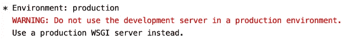
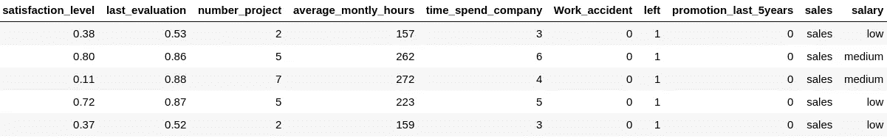
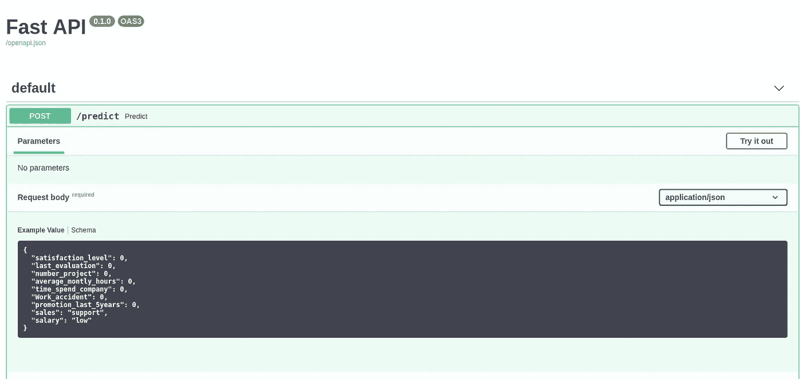
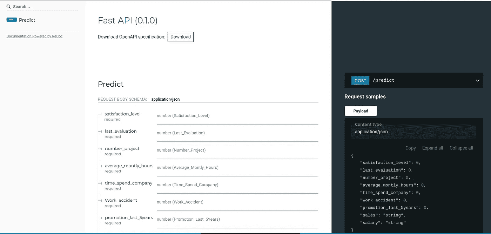
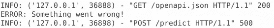

# 如何部署机器学习模型

> 原文：<https://towardsdatascience.com/how-to-deploy-a-machine-learning-model-dc51200fe8cf?source=collection_archive---------5----------------------->

## 机器学习

## 使用 FastAPI+uvicon 创建生产就绪的 API


Photo by [SpaceX](https://unsplash.com/@spacex?utm_source=unsplash&utm_medium=referral&utm_content=creditCopyText) on [Unsplash](https://unsplash.com/search/photos/rocket?utm_source=unsplash&utm_medium=referral&utm_content=creditCopyText)

你在网上看到的任何机器学习文章都在讨论模型的复杂性以及如何正确应用它们。尽管这些文章可能很有趣也很有价值，但只有少数文章考虑了创建模型后会发生什么:

> 部署 ML 模型需要哪些步骤？

不幸的是，我能找到的大多数文章都讨论了如何使用 Flask 快速创建端点，但是没有意识到 Flask 本身很难用于生产。

从命令行运行 Flask 时，您首先看到的是以下内容:



显然，要使它完全投入生产，还需要做更多的工作和考虑。

## 部署模型时要考虑的事情

*   扩展您的 API
*   容器化您的 API 环境
*   记录您的 API
*   重新训练您的模型以避免模型漂移
*   记录您的 API 和模型
*   云还是内部部署？

在本文中，我们将一起经历几个步骤，让您的 API 为生产做好准备，无论是在本地还是在云上，重点是文档、日志和伸缩。

我们将使用 FastAPI 代替 Flask。这并不是因为 Flask 有什么问题，而是我相信 FastAPI 可以让你更快地投入生产。

## 文档结构

你可以在这里从[得到所有的数据和文件。对于本指南，请确保您的文档结构如下:](https://github.com/MaartenGr/ML-API)

```
.
├── **app**
│   └── main.py
│   └── sample.log
│   └── **data** │         └── encoder.pickle
│         └── features.pickle
│         └── model.pickle
│
├── **notebooks** │   └── preprocessing.ipynb
│   └── test_connection.ipynb
│   └── data.csv
│
├── requirements.txt
└── Dockerfile
```

这将有助于防止错误，尤其是在创建 Docker 容器时。

# 1.准备文件

我们将要部署的模型用于预测人员流动。你可以在这里得到数据[。前几行如下所示:](https://www.kaggle.com/jacksonchou/hr-data-for-analytics)



我们首先加载数据并保存我们希望在模型中使用的特征的名称。这有助于跟踪列的顺序。当您指的是薪水时，您不希望意外地输入年龄值。

接下来，由于列 *Sales* 和 *Salary* 是分类的，我们将应用并保存一个 hot 编码实例。一键编码将一个列转换为具有 0 或 1 的 *n* 列，其中 *n* 等于唯一类别的数量。我这样做是因为它在部署您的模型时显示了一些额外的复杂性。

最后，我使用现成的 LightGBM 分类器来预测营业额。该模型被保存，以便可以在我们的 API 中使用。

Preprocessing the data and creating the model

在我们准备好数据并保存了所有必要的文件之后，是时候开始创建 API 来服务我们的模型了。

**注意**:保存模型有几种方法，每种方法都有自己的优缺点。除了酸洗，你还可以使用 [Joblib](https://scikit-learn.org/stable/modules/model_persistence.html) 或者使用 [LightGBM 的内部程序](https://lightgbm.readthedocs.io/en/latest/pythonapi/lightgbm.Booster.html#lightgbm.Booster.save_model)。

# 2.生产就绪 API

生产通常意味着终端用户可以访问的 API 形式的端点。对于 python 来说，有很多选择，比如[烧瓶](https://github.com/pallets/flask)、[猎鹰](https://github.com/falconry/falcon)、[小星星](https://github.com/encode/starlette)、 [Sanic](https://github.com/huge-success/sanic) 、 [FastAPI](https://github.com/tiangolo/fastapi) 、[龙卷风](https://github.com/tornadoweb/tornado)等。

## FastApi

出于三个原因，我们将在本文中使用 FastApi:

*   像 Flask 一样，您可以用**最小代码**设置一个端点
*   它是**难以置信的快**，它的速度与 NodeJS 和 Go 不相上下
*   它**自动创建**open API(Swagger)和 ReDoc **文档**

然而，这是个人经验，幸运的是，您可以很容易地将 FastApi 换成其他东西。

## 紫玉米

我们用 Uvicorn 来服务我们的 FastAPI 服务器。与更传统的 WSGI 服务器相比，Uvicorn 是允许异步进程的 ASGI 服务器。这将加快应用程序的速度，并使您更接近生产性能。

## **美国石油学会**

首先，我们需要安装 FastAPI 和 Uvicorn:

```
pip install fastapi
pip install uvicorn
```

安装完必要的包后，我们可以开始创建主文件。在这个文件中，我们确保加载了之前保存的所有必要文件。

然后，我们创建一个名为`Data`的类，它定义了模型中使用的所有变量。这有助于跟踪我们使用的变量，而且还基于我们创建的类创建文档。

最后，我们创建了预测方法。在这种情况下，数据被提取出来并按正确的顺序排列。像我们之前所做的那样，应用了一键编码。然后，预测以 0 或 1 的形式返回。

main.py

现在我们已经安排好了一切，我们可以从您的控制台使用以下命令加载服务器:

```
uvicorn main:app
```

`main`是指文件的名称(main.py ),而`app`是指 main.py 中 FastApi 实例的名称。如果一切正常，您可以看到服务器运行在 [http://127.0.0.1:8000](http://127.0.0.1:8000) 。

要测试它是否返回预测，您可以运行以下代码:

还可以用 [Postman](https://www.getpostman.com/) 测试 API，这是一个很棒的 API 开发工具。

虽然从技术上讲，您的 API 现在可以用于生产，但是包含文档、记录 API 中发生的事情以及将您的解决方案容器化将会很有帮助。

# 3.证明文件

很有可能您不是在现有服务中实现 API 的人。如果您记录了端点，以便可以毫无困难地使用它，那就更好了。幸运的是，FastApi 会基于我们之前创建的`Data`类自动创建文档。

FastApi 有自动文档内置的方法:OpenApi (Swagger)和 ReDoc。

## OpenApi

启动 FastAPI 服务器后，您可以访问[http://127 . 0 . 0 . 1:8000/docs](http://127.0.0.1:8000/docs)查看自动生成的服务器文档。你甚至可以按“试试看”来看看服务器是否如预期的那样工作。



## 雷多克

像 OpenAPI/Swagger 一样，ReDoc 生成参考文档。它通过允许您创建一个高度可定制的基于 react 的模板来扩展它们。FastAPI 在[http://127 . 0 . 0 . 1:8000/redoc](http://127.0.0.1:8000/redocs)自动创建文档。



**注**:如果你想看 ReDoc 的大范围现场版，可以去看看[http://redocly.github.io/redoc/](http://redocly.github.io/redoc/)。

# 4.记录

我见过许多人使用`print()`语句来跟踪他们代码内部发生的事情。这对小型应用程序来说没问题，但是当您在*开发*、*测试*、*验收*、**、**和*生产* (DTAP)之间切换时，您可能不想显示相同的消息。

这就是**日志**的用武之地。它允许您为应用程序设置特定的日志记录级别，并且只在超出该级别时显示消息。

我们的 API 将受益于**日志**，主要有两个原因:

*   我们可以跟踪 API 是否还在工作，以及它遇到了哪些问题
*   我们可以跟踪模型的输入并检查其性能

如果我们保留所有输入数据以便进一步分析，这将非常有趣。这将为我们提供以前从未见过的数据信息，并可能改进模型。

## 日志记录级别

有些错误可能不如其他错误有趣。在生产中，您可能希望显示致命错误，而不是应用程序的进度信息。当您调试应用程序时，这可能会有所不同。

为了解决这个问题，我们可以使用日志记录的**级**:

*   `**DEBUG**` —调试应用程序时有用的信息。值= 10
*   `**INFO**` —申请进度信息。值= 20
*   `**WARNING**` —关于潜在有害情况的信息。值= 30
*   `**ERROR**` —关于非致命错误的信息。值= 40
*   `**CRITICAL**` —关于严重和致命错误的信息。值= 50

如果我们将记录器设置在`**WARNING**`级别，那么将只显示`**WARNING**`、`**ERROR**`和`**CRITICAL**`。

## 本地记录器

为了在本地使用记录器，我们初始化记录器并设置其最低级别:

```
import loggingapp = FastAPI()# Initialize logging
my_logger = logging.getLogger()
my_logger.setLevel(logging.DEBUG)
```

最低级别现在设置在`**DEBUG**`，这意味着基本上所有级别的记录都会显示。当你将你的模型投入生产时，我建议你将它设置为`**WARNING**`。

要使用记录器，只需调用它并指定日志记录的级别。该消息将被打印到控制台:

```
my_logger.error("Something went wrong!")
```



现在，你可能想要**保存**日志到一个文件。为此，只需用此语句代替上面的`setLevel`:

```
logging.basicConfig(level=logging.INFO, file='sample.log')
```

# 5.使用 Docker

既然我们已经有了要部署的 API，我们可能希望使用 Docker 将应用程序容器化。Docker 将您的应用程序及其所有依赖项打包，以确保它在任何环境下都能无缝工作。这使得跨环境部署应用程序变得更加容易，而不需要太多额外的集成步骤。

首先确保你已经安装了 [Docker](https://docs.docker.com/docker-for-windows/install/) 。因为我们希望有一个跨环境的稳定的应用程序，所以为应用程序指定一个`requirements.txt` 是很重要的。

下一步是创建 Dockerfile 本身，它是运行我们的 API 的一个包含版本所需要的。幸运的是，FastAPI 的开发人员已经创建了 python 映像，允许在适当的环境中运行 FastAPI:

Dockerfile

将上面的代码保存在 docker 文件中，导航到该文件夹并运行以下命令:

```
docker build -t myimage ./
docker run -d --name mycontainer -p 80:80 myimage
```

这将构建并运行我们在 Dockerfile 文件中指定的映像。

您的 API 现在已经准备好了，可以从 [http://127.0.0.1/docs](http://127.0.0.1/docs) 访问。

# 结论

在这个(有点)全面的指南中，我们已经经历了为您的模型创建 API 和将应用程序容器化的 5 个步骤。现在，您可以选择在本地托管它，或者通过云解决方案(如 AWS 或 Azure)部署 Docker。

请注意，我试图尽可能全面地阐述这一点，同时包括我认为重要的主题。但是，一些更高级的主题被排除在外，例如:

*   处理概念漂移
*   保护您的 API
*   配置 Gunicorn 服务器
*   为不同阶段创建单独的 docker 文件(DTAP)
*   使用 CI/CD 自动重新训练您的模型
*   使用 Kubeflow 和 Kubernetes 简化生产
*   等等。

所有的**代码**都可以在这里找到:

[](https://github.com/MaartenGr/ML-API) [## 马尔滕格尔/毫升-API

### 关于创建一个生产就绪的 API 来为您的 ML 模型服务的指南。

github.com](https://github.com/MaartenGr/ML-API) 

# 感谢您的阅读！

如果你像我一样，对人工智能、数据科学或心理学充满热情，请随时在 [LinkedIn](https://www.linkedin.com/in/mgrootendorst/) 上添加我，或者在 [Twitter](https://twitter.com/MaartenGr) 上关注我。