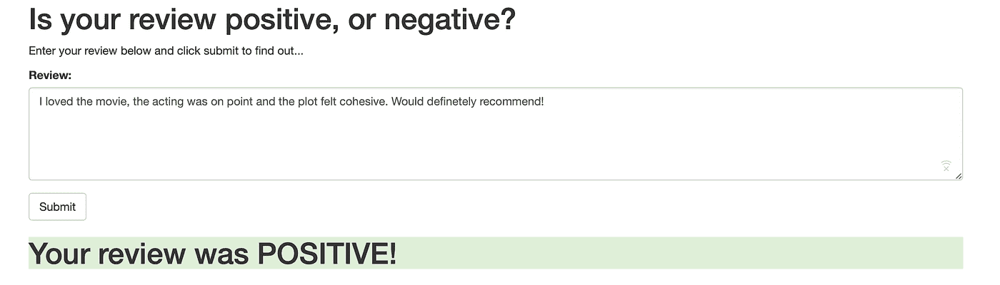

# 如何从贝鲁特部署神经网络

> 原文：<https://towardsdatascience.com/how-to-deploy-a-neural-network-from-beirut-3e4db10fe525?source=collection_archive---------19----------------------->


Photo by [Zheka Boychenko](https://unsplash.com/@toni_stark18?utm_source=medium&utm_medium=referral) on [Unsplash](https://unsplash.com?utm_source=medium&utm_medium=referral)

贝鲁特是黎巴嫩华丽的首都，也伴随着繁华都市的典型问题。除此之外，它还遭受着频繁的停电和世界上最慢的互联网连接之一。

这里也是我度过暑假的地方，也是本文的理想试验场:如何用亚马逊的 [SageMaker](https://aws.amazon.com/sagemaker/) 和 [PyTorch](https://pytorch.org) 以 web 应用的形式部署神经网络。

在继续之前，建议将存储库克隆到 SageMaker 中，以遵循这个漫长的过程。整个项目从开始到结束都托管在这个 [GitHub 库](https://github.com/NadimKawwa/rnn_sentiment_analysis)中。

# 下载数据

对于这个任务，我们将使用 Maas 等人的 [IMDb 数据集](http://ai.stanford.edu/~amaas/data/sentiment/)，它包含 25，000 条用于训练的高度极性电影评论，以及 25，000 条用于测试的评论。我们创建一个目录并下载数据:

# 加工和清洁


Photo by [Pablo Lancaster Jones](https://unsplash.com/@fotolancaster?utm_source=medium&utm_medium=referral) on [Unsplash](https://unsplash.com?utm_source=medium&utm_medium=referral)

下载完数据后，我们需要将其转换成可读的格式。下面的 *read_ibmd_data* 函数读入每个评论，并将它们组合成一个单一的输入结构。

然后，我们将正面和负面的评论结合起来，并使用 *prepare_imdb_data* 函数对结果记录进行洗牌。

在继续之前，让我们检查一下我们做得怎么样。下面的评论值为 1，表示它是正面的。

```
Contains *spoilers* - also, my quotes may not be exact.<br /><br />Everyone always notes the satire in social commentary and economic parallels - how true. But to me, I see this movie as much more than that. I love the symbolism of this guy in a glowing white suit. There is so much confusion and filth in the world around him, but it won't stick. Alec Guiness was the perfect guy to play this - his boyish grins and eternal curiousity are so appropriate:<br /><br />"That's ingenious - can you tell me, what is the ratio of ink to petrol?"<br /><br />The only moment of defeat is when he realizes that his invention hasn't worked after all - standing there almost naked. Yet, more than shame is the simple disappointment that "it didn't work." He's never really intimidated by people. Remember,<br /><br />"But Sidney, we want to stop it too."<br /><br />Barely a moments hesitation before he's off trying to get away again. Does he show any sign of the pain such a betrayal must've caused? No.<br /><br />Also notable is Dapne's role. She is sick and tired of money and power. She thinks she's finally found love, outside of her father's company. At first she doesn't really care about Sidney anymore than anyone else. But that moment when he falls off her car and she goes back to see if maybe she killed him - and yet he is still thinking only of the beauty of his invention. She's finally found something she thinks is worth living for. The funny thing is that it's not even romance. It is friendship, but of such an ephemeral nature that the title almost doesn't fit. It's more admiration, and perhaps even inspiration.<br /><br />Upon her discovery that Michael has no real love for her, and that her father is completely incompetent to take care of her, she gives into cynicism and tries to temp Sidney. Fortunately she finds that there really are people in this world living for more than power, money and lust. What a refreshment:<br /><br />"Thank you Sidney. If you would've said 'yes' I think I'd have strangled you."<br /><br />I love the very end, when all of this crazy business seems to have come to nothing. But then, the bubbly, quirky beat starts up and Sidney goes off, his stride matching the tune: dauntless. Where is Daphne? We don't really know - but they weren't really in love and she wasn't really a scientist. He got help escaping and she got "a shot in the arm of hope." (Pollyanna) A cont'd relationship would've been nice, but as Billy Joel says "it's more than I'd hoped for..."<br /><br />
```

巧合的是，这是一篇很长的评论，但是略读就能看出它是积极的。它带有许多 html 标签，我们将删除这些标签，因为它们没有增加情感价值。我们还想对我们的输入进行标记，以便在进行情感分析时，像*娱乐*和*娱乐*这样的词被认为是相同的。

review_to_words 助手函数就是这样做的，它依赖于 [NLTK](https://www.nltk.org/) 库。

我们在下面的*预处理 _ 数据*函数中使用*审查 _ 到 _ 单词*。它读入数据并缓存结果。这是因为执行该处理步骤可能需要很长时间。这样，如果我们无法在当前会话中完成笔记本，我们可以返回，而无需再次处理数据。

# 转换数据


Photo by [Quino Al](https://unsplash.com/@quinoal?utm_source=medium&utm_medium=referral) on [Unsplash](https://unsplash.com?utm_source=medium&utm_medium=referral)

对于我们将在本笔记本中实现的模型，我们将为所有单词构建一个特征表示，作为将评论中出现的单词映射到整数的一种方式。首先，我们将每个单词表示为一个整数。然而，评论中出现的一些词很少出现，因此可能不包含太多用于情感分析的信息。

我们处理这个问题的方式是，我们将固定我们工作词汇的大小，我们将只包括最频繁出现的单词。然后，我们将把所有不常用的单词组合成一个类别，在我们的例子中，我们将把它标记为 *1* 。

由于我们将使用递归神经网络，如果每次复习的时间长度相同，将会很方便。为了做到这一点，我们将确定评论的大小，然后用“无词”类别填充短评论(我们将把它标记为 *0* )，并截断长评论。

build_dict 实现了对数据的特征转换。注意，即使 *vocab_size* 被设置为 *5000* ，我们只想为最频繁出现的 *4998* 个单词构建一个映射。这是因为我们想为'*无字*'保留特殊标签 *0* ，为'*生僻字*'保留特殊标签 *1* 。

我们评论中最常见的五个词是什么？不出所料他们是: *movi* ， *film* ， *one* ， *like* ， *time* 。

稍后，当我们构建一个端点来处理提交的评审时，我们将需要使用我们已经创建的 *word_dict* 。因此，我们现在将它保存到一个文件中以备将来使用。

现在我们有了单词字典，它允许我们将评论中出现的单词转换成整数，我们使用它将评论转换成它们的整数序列表示，确保填充或截断到固定长度，在我们的例子中是 *500* 。

我们首先创建 *convert_and_pad* 函数来填充单个审查。

然后我们在 *convert_and_pad_data* 中实现它，将其应用于整个数据。

让我们回顾一下在上面的步骤中我们做了什么。为了处理短评论和长评论，我们将所有评论填充或删减到特定长度。对于短于某个*填充*长度的评论，我们将用 0 填充。这可能会导致内存问题，但这是标准化评论的必要步骤。

当我们构建包含所有词汇的 *word_dict* 变量时，我们只使用了训练数据。这意味着在训练和测试数据集之间不会发生数据泄漏。然而，如果训练数据集不是详尽的，我们将会遇到限制。

# 上传到 S3

我们需要将训练数据集上传到一个简单的存储服务( [S3](https://aws.amazon.com/s3/) )中，以便我们的训练代码能够访问它。现在我们将把它保存在本地，稍后我们将上传到 S3。

注意我们保存的数据的格式是很重要的，因为我们在编写训练代码时需要知道它。在我们的例子中，数据集的每一行都具有形式为*的标签*、*的长度*、*的评论【500】*，其中*评论【500】*是表示评论中单词的 *500* 整数序列。

接下来，我们需要将训练数据上传到 SageMaker 默认 S3 存储桶，以便在训练我们的模型时可以访问它。

下面的代码块上传了我们的数据目录的全部内容。这包括 *word_dict.pkl* 文件。这是幸运的，因为我们将在稍后创建接受任意审查的端点时需要它。现在，我们将只注意到这样一个事实，即它驻留在数据目录中(因此也在 S3 培训桶中)，并且我们将需要确保它保存在模型目录中。

# 构建和培训 PyTorch 模型


Credits: Udacity

SageMaker 上的模型由三个对象组成:

*   模型工件
*   培训代码
*   推理代码

每个组件都相互作用。这里我们将使用 Amazon 提供的容器，并编写我们自己的定制训练和推理代码。

我们将从在 PyTorch 中实现我们自己的神经网络以及一个训练脚本开始。出于这个项目的目的，我们在火车文件夹内的 *model.py* 文件中提供了必要的模型对象。下面的代码块展示了实现。

我们可能希望调整三个参数来提高模型的性能:

*   嵌入维度
*   隐藏维度
*   词汇量

我们可能希望在训练脚本中配置这些参数，这样，如果我们希望修改它们，就不需要修改脚本本身。首先，我们将编写一些训练代码，这样我们可以更容易地诊断出现的任何问题。

首先，我们将加载一小部分训练数据集作为样本。尝试在笔记本中完全训练模型将非常耗时，因为我们无法访问 GPU，并且我们使用的计算实例不是特别强大。然而，我们可以处理一小部分数据来感受一下我们的训练脚本是如何运行的。

接下来，我们需要编写训练代码本身。我们将把复杂的方面，如模型保存/加载和参数加载留到稍后。

假设我们有上面的训练方法，我们将通过编写代码来测试它是否工作，该代码在我们之前加载的小样本训练集上执行我们的训练方法。尽早这样做的原因是为了让我们有机会修复早期出现的、更容易诊断的错误。

为了使用 SageMaker 构建 PyTorch 模型，我们必须为 SageMaker 提供一个训练脚本。我们可以选择包含一个目录，这个目录将被复制到容器中，我们的训练代码将从这个目录中运行。当执行训练容器时，它将检查上传目录(如果有)中的 *requirements.txt* 文件，并安装任何所需的 Python 库，之后将运行训练脚本。

当在 SageMaker 中构造 PyTorch 模型时，必须指定一个入口点。这是将在模型训练时执行的 Python 文件。在 *train* 目录中有一个名为 *train.py* 的文件，它包含了训练我们的模型所需的大部分代码。唯一缺少的是我们之前编写的 *train()* 方法的实现。

SageMaker 将超参数传递给训练脚本的方式是通过参数。然后，这些参数可以被解析并在训练脚本中使用。要了解这是如何完成的，请随意查看提供的 *train/train.py* 文件。

# 部署测试模型

既然我们已经训练了我们的模型，我们想要测试它，看看它的表现如何。目前，我们的模型接受形式为 *review_length* ， *review[500]* 的输入，其中 review*【500】*是一系列 *500* 整数，它们描述了评论中出现的单词，使用 *word_dict* 进行编码。幸运的是，SageMaker 为具有简单输入的模型提供了内置的推理代码。

我们需要提供一个函数来加载保存的模型。这个函数必须被调用 *model_fn()* ，并把模型工件存储目录的路径作为它唯一的参数。这个函数也必须存在于我们指定为入口点的 python 文件中。在我们的例子中，已经提供了模型加载功能，因此不需要进行任何更改。

注意，当运行内置推理代码时，它必须从 *train.py* 文件中导入 *model_fn* 方法。这也是为什么训练代码被包裹在一个主护中(即*if _ _ name _ _ = ' _ _ main _ _ ':*)

由于我们不需要对培训期间上传的代码进行任何修改，我们可以简单地按原样部署当前的模型。

在部署模型时，我们要求 SageMaker 启动一个计算实例，该实例将等待数据发送给它。因此，该计算实例将继续运行，直到关闭。了解这一点很重要，因为**部署端点的成本取决于它已经运行了多长时间**。

# 使用模型进行测试

部署完成后，我们可以读入测试数据，并将其发送到我们部署的模型，以获得一些结果。一旦我们收集了所有的结果，我们就可以确定我们的模型有多精确。

我们现在有一个经过训练的模型，该模型已经部署，我们可以向其发送经过处理的评论，并返回预测的情绪。然而，最终我们希望能够给我们的模型发送一个未处理的评审。也就是说，我们希望将评论本身作为一个字符串发送。例如，假设我们希望向我们的模型发送以下评论。

我们现在需要回答的问题是，我们如何将这个评论发送给我们的模型？

回想一下，在前面的部分中，我们做了两件事:

*   移除所有 html 标签并阻止输入
*   使用 *word_dict* 将评论编码为一个整数序列

为了进行审核，我们需要重复这两个步骤。使用之前的 *review_to_words* 和 *convert_and_pad* 方法，我们将 *test_review* 转换成一个名为 *test_data* 的 numpy 数组，适合发送给我们的模型。回想一下，我们的模型期望输入形式为 *review_length* ， *review[500]* 。然后我们可以使用*预测器*对象来预测情绪。

# Web 应用程序的部署模型


Photo by [SpaceX](https://unsplash.com/@spacex?utm_source=medium&utm_medium=referral) on [Unsplash](https://unsplash.com?utm_source=medium&utm_medium=referral)

现在我们知道我们的模型正在工作，是时候创建一些定制的推理代码了，这样我们就可以向模型发送一个尚未处理的评论，并让它决定评论的情绪。

正如我们在上面看到的，默认情况下，我们创建的评估器，在部署时，将使用我们在创建模型时提供的入口脚本和目录。然而，由于我们现在希望接受一个字符串作为输入，并且我们的模型期望一个经过处理的审查，我们需要编写一些定制的推理代码。

我们将把编写的代码存储在目录中。这个目录中提供的是我们用来构建模型的 *model.py* 文件，一个 utils.py 文件，它包含我们在初始数据处理过程中使用的 *review_to_words* 和 *convert_and_pad* 预处理函数，以及 *predict.py* ，这个文件将包含我们的定制推理代码。还要注意的是, *requirements.txt* 会告诉 SageMaker 我们的定制推理代码需要哪些 Python 库。

在 SageMaker 中部署 PyTorch 模型时，我们需要提供 SageMaker 推理容器将使用的四个函数。

*   model_fn:这个函数与我们在训练脚本中使用的函数相同，它告诉 SageMaker 如何加载我们的模型。
*   input_fn:这个函数接收已经发送到模型端点的原始序列化输入，它的工作是反序列化输入，使输入可用于推理代码。
*   output_fn:这个函数获取推理代码的输出，它的工作是序列化这个输出，并将其返回给模型端点的调用者。
*   predict_fn:推理脚本的核心，这是进行实际预测的地方。

对于我们在这个项目中构建的简单网站，我们只需要能够接受一个字符串作为输入，我们希望返回一个单一的值作为输出。我们可以推断，在更复杂的应用程序中，输入或输出可能是图像数据或其他一些二进制数据，这需要更多的努力来序列化。

在 *serve/predict.py* 中，我们编写如下推理代码:

既然已经编写了定制推理代码，我们将创建并部署我们的模型。首先，我们需要构造一个新的 PyTorch 模型对象，它指向训练期间创建的模型工件，还指向我们希望使用的推理代码。然后我们可以调用 deploy 方法来启动部署容器。

既然我们已经用定制推理代码部署了我们的模型，我们应该测试一下是否一切正常。这里，我们通过加载第一个 *250* 正面和负面评论来测试我们的模型，并将它们发送到端点，然后收集结果。只发送部分数据的原因是，我们的模型处理输入然后执行推理所花费的时间相当长，因此测试整个数据集是不允许的。

# 为 Web 应用程序使用模型

现在我们知道我们的端点正在按预期工作，我们可以设置与之交互的 web 页面。

到目前为止，我们一直通过构建一个使用端点的预测器对象来访问我们的模型端点，然后只使用预测器对象来执行推理。如果我们想创建一个访问我们模型的 web 应用程序会怎么样？

目前的设置方式使得这不可能，因为为了访问 SageMaker 端点，应用程序必须首先使用 IAM 角色向 AWS 进行身份验证，其中包括对 SageMaker 端点的访问。但是，有一个更简单的方法！我们只需要使用一些额外的 AWS 服务


Credits: AWS

上图概述了各种服务将如何协同工作。最右边是我们上面训练过的 endoint 模型，它是使用 SageMaker 部署的。最左边是我们的 web 应用程序，它收集用户的电影评论，发送出去，并期望得到正面或负面的反馈。

在中间，我们将构建一个 Lambda 函数，我们可以把它想象成一个简单的 Python 函数，只要特定的事件发生，它就可以被执行。我们将授予该函数从 SageMaker 端点发送和接收数据的权限。

最后，我们将用来执行 Lambda 函数的方法是我们将使用 API Gateway 创建的一个新端点。这个端点将是一个 url，它侦听要发送给它的数据。一旦它得到一些数据，它将把这些数据传递给 Lambda 函数，然后返回 Lambda 函数返回的任何内容。本质上，它将充当一个接口，让我们的 web 应用程序与 Lambda 函数进行通信。

## 设置 Lambda 函数

每当我们的公共 API 接收到数据时，Lambda 函数就会被执行。当它被执行时，它将接收数据，执行任何需要的处理，将数据(评论)发送到我们创建的 SageMaker 端点，然后返回结果。

因为我们希望 Lambda 函数调用 SageMaker 端点，所以我们需要确保它有这样做的权限。为此，我们将构造一个角色，稍后我们可以赋予 Lambda 函数。

使用 AWS 控制台，导航到 **IAM** 页面并点击**角色**。然后，点击**创建角色**。确保 **AWS 服务**是所选的可信实体类型，并选择**λ**作为将使用该角色的服务，然后单击 **Next: Permissions** 。

在搜索框中键入`sagemaker`并选中**amazonsagemakerfullcaccess**策略旁边的复选框。然后，点击**下一步:复习**。

最后，给这个角色一个名字。确保你使用一个我们以后会记住的名字，例如*lambdasagemakerole*。然后，点击**创建角色**。

现在我们可以创建 Lambda 函数。使用 AWS 控制台，导航到 AWS Lambda 页面，点击**创建功能**。当我们进入下一页时，确保选择了**从头开始创作**。

现在，用一个我们以后会记得的名字来命名这个 Lambda 函数，例如*情绪分析函数*。确保选择了 **Python 3.6** 运行时，然后选择在上一部分中创建的角色。然后，点击**创建功能**。

在下一页，我们可以看到一些关于我们刚刚创建的 Lambda 函数的信息。向下滚动可以看到一个编辑器，我们可以在其中编写 Lambda 函数被触发时将执行的代码。在我们的例子中，我们将使用下面的代码。

我们需要将端点名称添加到 Lambda 函数中。在 SageMaker 笔记本中，我们可以获得这个端点名称:

一旦我们将端点名称添加到 Lambda 函数中，点击**保存**。Lambda 函数现在已经启动并运行。接下来，我们需要为我们的 web 应用程序创建一个执行 Lambda 函数的方法。

## 设置 API 网关

既然我们的 Lambda 函数已经设置好了，是时候使用 API Gateway 创建一个新的 API 了，它将触发我们刚刚创建的 Lambda 函数。

使用 AWS 控制台，导航到**亚马逊 API 网关**，然后点击**开始**。

在下一页上，确保选择了**新 API** ，并为新 API 命名，例如*sensation _ analysis _ API*。然后，点击**创建 API** 。

现在我们已经创建了一个 API，但是它目前什么也不做。我们想要它做的是触发我们之前创建的 Lambda 函数。

选择**动作**下拉菜单，点击**创建方法**。将创建一个新的空白方法，选择其下拉菜单并选择 **POST** ，然后点击旁边的复选标记。

对于集成点，确保选择了 **Lambda 函数**并点击**使用 Lambda 代理集成**。该选项确保发送给 API 的数据不经处理直接发送给 Lambda 函数。这也意味着返回值必须是正确的响应对象，因为它也不会被 API Gateway 处理。

在 **Lambda 函数**文本输入框中输入之前创建的 Lambda 函数的名称，然后点击**保存**。在弹出的对话框中点击 **OK** ，允许 API Gateway 调用您创建的 Lambda 函数。

创建 API 网关的最后一步是选择**动作**下拉菜单并点击**部署 API** 。我们需要创建一个新的部署阶段，并将其命名为相关的名称，例如 *prod* 。

我们现在已经成功地建立了一个公共 API 来访问您的 SageMaker 模型！请确保复制或记下所提供的 URL，以调用新创建的公共 API，因为下一步需要用到它。该 URL 位于页面顶部，在文本**调用 URL** 旁边以蓝色突出显示。一个示例 URL 如下所示:

与端点相关联的链接是:[https://ltii177nx3.execute-api.us-west-2.amazonaws.com/prod](https://ltii177nx3.execute-api.us-west-2.amazonaws.com/prod)

# 部署 Web 应用程序

现在我们有了一个公开可用的 API，我们可以开始在 web 应用程序中使用它。出于我们的目的，我们有一个简单的静态 html 文件，它可以利用前面创建的公共 API。

在*网站的*文件夹中有一个名为*index.html*的文件。将文件下载到您的计算机上，并在您选择的文本编辑器中打开该文件。应该有一行包含*** *替换为公共 API URL**** 。用上一步中的 url 替换这个字符串，然后保存文件。

现在，如果您在本地计算机上打开`index.html`，浏览器将作为本地 web 服务器运行，您可以使用提供的站点与您的 SageMaker 模型进行交互。

更进一步，你可以把这个 html 文件放在任何你想放的地方，例如使用亚马逊 S3 上的[静态站点。](https://docs.aws.amazon.com/AmazonS3/latest/dev/website-hosting-custom-domain-walkthrough.html)

# 结果

让我们看看我们的模型在正面和负面评论中的表现。



恭喜你！你现在有一个神经网络驱动的网络应用程序！

*这个项目之所以成为可能，得益于* [*Udacity 的深度学习*](https://www.udacity.com/course/deep-learning-nanodegree--nd101) *nanodegree。我强烈推荐这门课程，作为获得对人工智能的坚实理解的一种方式！*