# 如何使用 Amazon Free ec2 实例部署 Streamlit 应用程序？

> 原文：<https://towardsdatascience.com/how-to-deploy-a-streamlit-app-using-an-amazon-free-ec2-instance-416a41f69dc3?source=collection_archive---------2----------------------->


Image by [Gerd Altmann](https://pixabay.com/users/geralt-9301/?utm_source=link-attribution&utm_medium=referral&utm_campaign=image&utm_content=2786261) from [Pixabay](https://pixabay.com/?utm_source=link-attribution&utm_medium=referral&utm_campaign=image&utm_content=2786261)

## 10 分钟内将数据应用程序上传到网上

如果我们没有一个好的方式来展示它，机器学习项目就永远不会真正完成。

***在过去，一个制作精良的可视化或一个小 PPT 足以展示一个数据科学项目，但随着 RShiny 和 Dash 等仪表板工具的出现，一名优秀的数据科学家需要具备相当多的 web 框架知识。***

Web 框架很难学。为了一些看似简单的事情，我仍然会对所有的 HTML、CSS 和 Javascript 感到困惑。

更不用说做同一件事的许多方法，这让我们数据科学的人感到困惑，因为 web 开发对他们来说是次要技能。

这就是 ***StreamLit*** 的用武之地，它承诺只用 Python 创建 web 应用。

在我关于 Streamlit 的上一篇文章中，我谈到了如何使用简单的 Python 为数据科学家编写 Web 应用。

但是，一个主要的抱怨，如果你去看看那个帖子的评论部分，是关于不能在网络上部署 Streamlit 应用。

这是一个有效的投诉。

> 开发人员不能在每次客户想要使用应用程序时都带着笔记本电脑出现。这样的 app 有什么用？

***所以在这篇文章中，我们将进一步使用 Amazon Free ec2 实例在 Web 上部署我们的 Streamlit 应用程序。***

# 设置 Amazon 实例

在开始使用 amazon ec2 实例之前，我们需要设置一个实例。您可能需要使用您的电子邮件 ID 注册，并在 [AWS 网站](https://aws.amazon.com)上设置支付信息。就像简单的登录一样。从这里开始，我将假设您有一个 AWS 帐户，因此我将解释接下来的重要部分，以便您可以继续操作。

*   使用[https://us-west-2.console.aws.amazon.com/console](https://us-west-2.console.aws.amazon.com/console)进入 AWS 管理控制台。
*   在 AWS 管理控制台上，您可以选择“启动虚拟机”。在这里，我们尝试设置一台机器，用于部署我们的 Streamlit 应用程序。
*   第一步，您需要为机器选择 AMI 模板。我选择 18.04 Ubuntu 服务器，因为它适用于免费层。还有 Ubuntu。

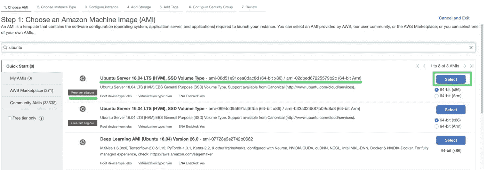

*   在第二步中，我选择了`t2.micro`实例，因为它同样符合自由层的条件。如您所见,`t2.micro`只是一个具有 512 MB RAM 的 CPU 实例。如果你正在处理一个强大的模型或愿意支付，你可以选择一个更大的机器。

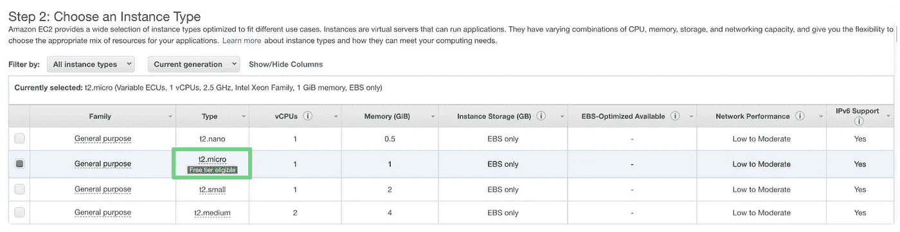

*   继续按下一步，直到你到达“6。配置安全组”选项卡。您需要添加一个规则，类型为:“自定义 TCP 规则”，端口范围:8501，源:Anywhere。我们在这里使用端口 8501，因为它是 Streamlit 使用的自定义端口。

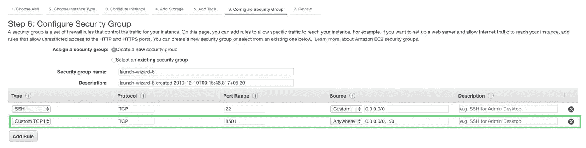

*   您可以单击“查看并启动”，最后单击“启动”按钮来启动实例。单击启动后，您可能需要创建一个新的密钥对。在这里，我创建了一个名为 streamlit 的新密钥对，并使用“Download Key Pair”按钮下载它。请妥善保管此密钥，因为每次您需要登录到此特定机器时都会用到它。下载密钥对后，单击“启动实例”

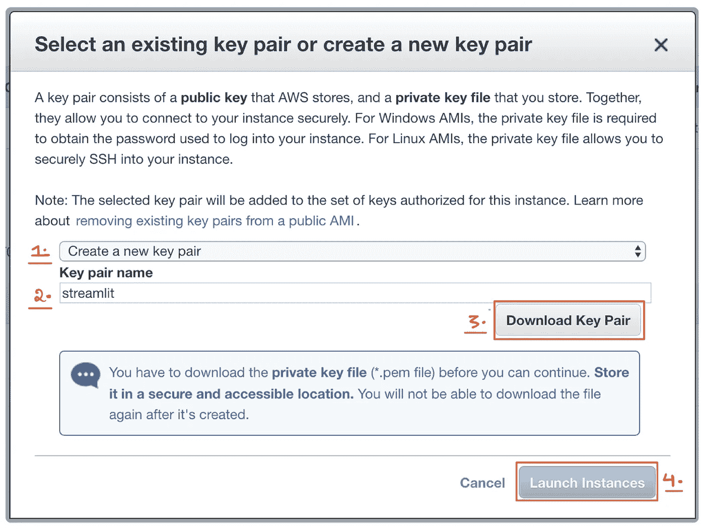

*   现在，您可以转到您的实例，查看您的实例是否已经启动。提示:查看实例状态，它应该显示“正在运行”

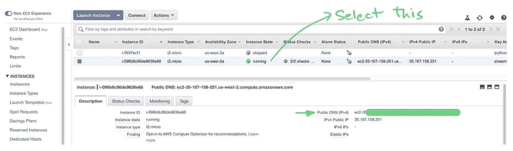

*   选择您的实例，从描述中复制 ***公共 DNS(IPv4)地址*** 。应该是 ec2 开头的东西。
*   一旦你在你保存了`streamlit.pem`文件的文件夹中运行以下命令。我在这里屏蔽了一些信息。

```
chmod 400 streamlit.pemssh -i "streamlit.pem" ubuntu@<Your Public DNS(IPv4) Address>
```

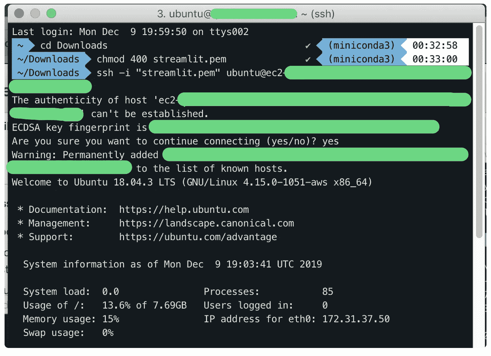

# 安装所需的库

哇，那可真难。完成上述所有步骤后，您应该能够看到虚拟机的 ubuntu 提示符。我们需要设置这台机器来运行我们的应用程序。我将使用我在[上一篇文章](/how-to-write-web-apps-using-simple-python-for-data-scientists-a227a1a01582)中使用的同一个`streamlit_football_demo`应用程序。

我们首先安装 miniconda，并将其路径添加到环境变量中。

```
sudo apt-get updatewget [https://repo.continuum.io/miniconda/Miniconda3-latest-Linux-x86_64.sh](https://repo.continuum.io/miniconda/Miniconda3-latest-Linux-x86_64.sh) -O ~/miniconda.shbash ~/miniconda.sh -b -p ~/minicondaecho "PATH=$PATH:$HOME/miniconda/bin" >> ~/.bashrcsource ~/.bashrc
```

然后，我们为我们的应用程序安装额外的依赖项来运行。这意味着我安装了 streamlit 和 [plotly_express](/pythons-one-liner-graph-creation-library-with-animations-hans-rosling-style-f2cb50490396) 。

```
pip install streamlit
pip install plotly_express
```

我们的机器已经准备就绪，可以运行了。

# 在 Amazon ec2 上运行 Streamlit

当我设置好实例后，我可以从 [Github](https://github.com/MLWhiz/streamlit_football_demo.git) 获取我的演示应用程序的代码。或者你可以选择创建或复制另一个应用程序。

```
git clone [https://github.com/MLWhiz/streamlit_football_demo.git](https://github.com/MLWhiz/streamlit_football_demo.git)cd streamlit_football_demo
streamlit run helloworld.py
```

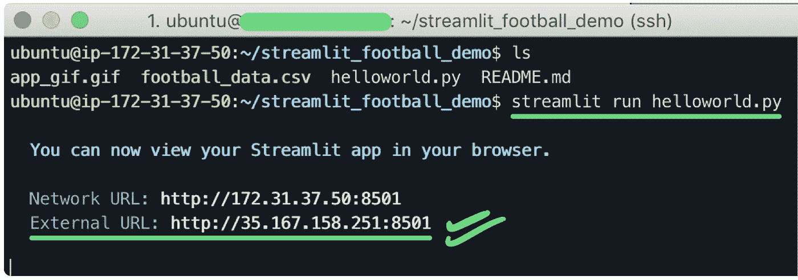

现在，您可以转到浏览器并键入外部 URL 来访问您的应用程序。我的地址是`[http://35.167.158.251:8501](http://35.167.158.251:8501)`。这是输出。如果你想玩这个应用程序，现在就可以打开。

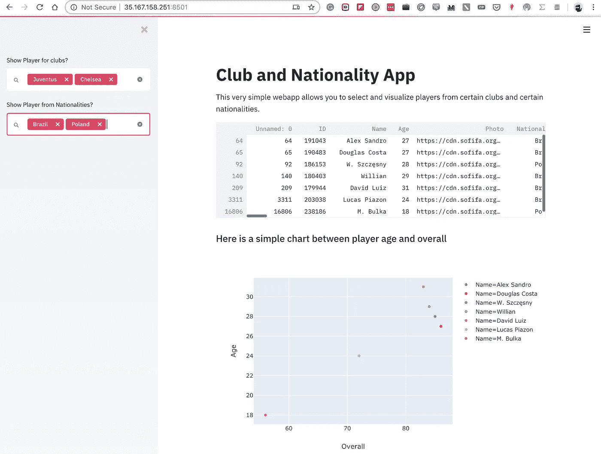

# 不过这是一个很小的问题

我们已经开始运行我们的应用程序，让全世界都可以看到。但是每当你要关闭 SSH 终端窗口时，这个过程就会停止，你的应用程序也会停止。

***那我们怎么办？***

TMUX 来救援了。TMUX 允许我们甚至在离开终端窗口后继续运行我们的会话。这也有助于许多其他事情，但我将只是通过我们需要的步骤。

首先，我们停止使用`Ctrl+C`并安装`tmux`

```
sudo apt-get install tmux
```

我们使用下面的命令启动一个新的`tmux`会话。我们将会话的名称保留为 StreamSession。这里你可以用任何名字。

```
tmux new -s StreamSession
```

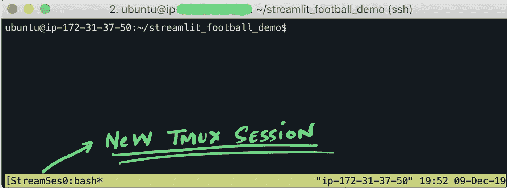

您可以在屏幕底部看到会话名称为“StreamSession”。您现在可以在`tmux`会话中开始运行 streamlit。

```
streamlit run helloworld.py
```

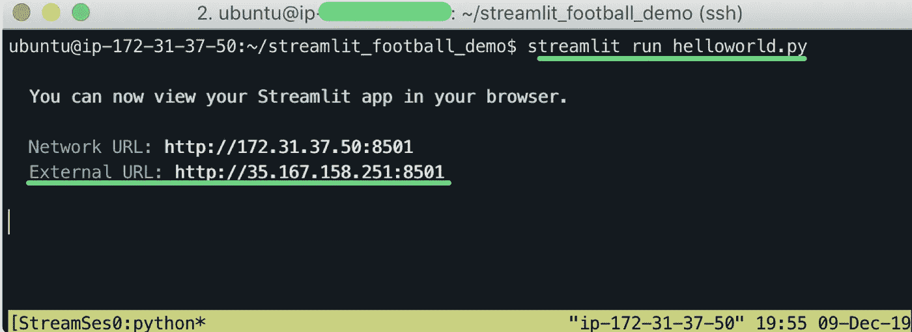

您将能够在[外部 URL](http://35.167.158.251:8501/\) 看到您的应用。 ***下一步是分离我们的 TMUX 会话*** ，这样当您离开 SSH shell 时，它将继续在后台运行。为此，只需按下`Ctrl+B and then D`(按 D 时不要按 Ctrl)

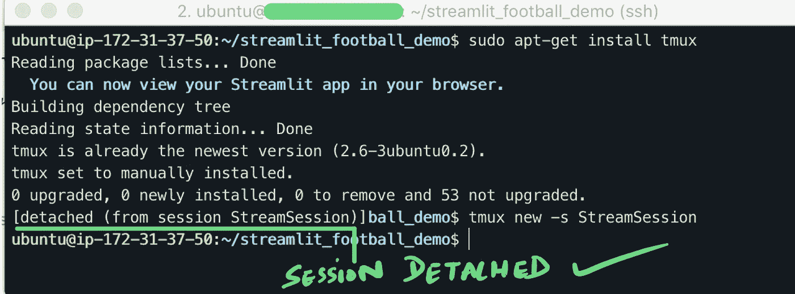

***您现在可以关闭您的 SSH 会话，应用程序将继续在外部 URL 运行。***

瞧啊。我们开始运行了。

***Pro TMUX 提示:*** 您可以使用下面的`attach`命令重新连接到同一个会话。最棒的是，您可以关闭 SSH shell，然后几个小时后再回来，重新连接到一个会话，从关闭 SSH shell 时所在的位置继续工作。

```
tmux attach -t StreamSession
```

# 简单的故障排除:

***如果您的应用没有在 8501 托管，*** 这意味着 streamlit 应用的一个实例已经在您的系统上运行，您需要停止它。为此，您可以首先找到进程 ID

```
ps aux | grep streamlit
```

您将看到如下内容:

```
ubuntu   **20927**  2.4 18.8 713780 189580 pts/3   Sl+  19:55   0:26 /home/ubuntu/miniconda/bin/python /home/ubuntu/miniconda/bin/**streamlit** run helloworld.py
```

你将需要 ***杀死这个进程。你可以简单地通过***

```
kill -9 20947
```

# 结论

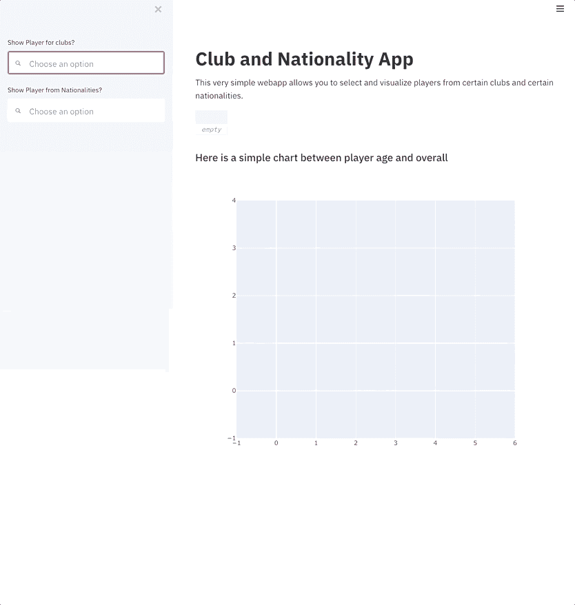

Our Final App

Streamlit 使创建应用程序的整个过程民主化了，我不能再推荐它了。如果你想了解更多关于如何用 Streamlit 创建令人敬畏的网络应用程序，那么请阅读我的[上一篇](/how-to-write-web-apps-using-simple-python-for-data-scientists-a227a1a01582)帖子。

***在本帖中，我们*** [***使用亚马逊 ec2 在 AWS 上部署了***](/take-your-machine-learning-models-to-production-with-these-5-simple-steps-35aa55e3a43c) ***一个简单的 web app。***

在这个过程中，我们创建了自己的 Amazon ec2 实例，登录到 SSH shell，安装了 miniconda 和依赖项，运行了我们的 Streamlit 应用程序并了解了 TMUX。一天的学习够吗？

所以去展示这些疯狂的技能吧。以轻松的语气结束，正如斯登冲锋枪·苏特拉在他的讽刺作品中所说，我非常喜欢:

> 秘诀:重要的不是你知道什么，而是你表现出什么。

如果你想了解更多关于如何构建机器学习项目和最佳实践的信息，我想调出他在 Coursera [深度学习专业化](https://coursera.pxf.io/7mKnnY)中出色的[第三门课程](https://coursera.pxf.io/7mKnnY)名为构建机器学习项目。一定要去看看。

谢谢你的阅读。将来我也会写更多初学者友好的帖子。通过[媒体](https://medium.com/@rahul_agarwal?source=post_page---------------------------)关注我或者订阅我的[博客](http://eepurl.com/dbQnuX?source=post_page---------------------------)来了解他们。一如既往，我欢迎反馈和建设性的批评，可以通过 Twitter [@mlwhiz](https://twitter.com/MLWhiz?source=post_page---------------------------) 联系到我

此外，一个小小的免责声明——这篇文章中可能会有一些相关资源的附属链接，因为分享知识从来都不是一个坏主意。