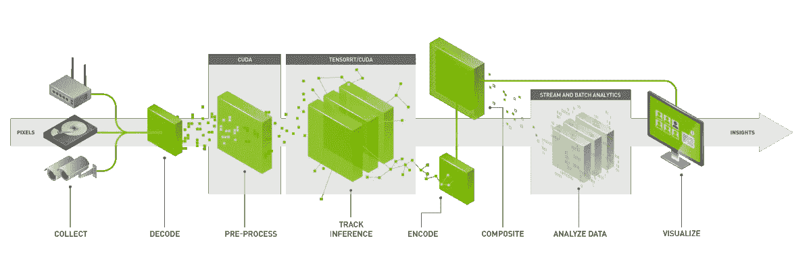
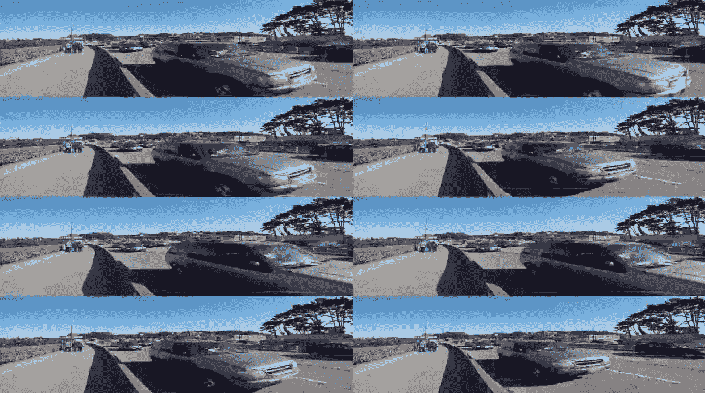
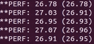

# 如何使用 DeepStream 在 NVIDIA Jetson Nano 上部署 ONNX 模型

> 原文：<https://towardsdatascience.com/how-to-deploy-onnx-models-on-nvidia-jetson-nano-using-deepstream-b2872b99a031?source=collection_archive---------4----------------------->

## 在 Jetson Nano 上测试 DeepStream 的多流神经网络推理性能的实验。


Jetson Nano. ([Source](https://developer.nvidia.com/embedded/jetson-nano-developer-kit))

将复杂的深度学习模型部署到小型嵌入式设备上是一项挑战。即使有针对深度学习优化的硬件，如 [**杰特森纳米**](https://developer.nvidia.com/embedded/jetson-nano-developer-kit) 和推理优化工具，如 [**TensorRT**](https://developer.nvidia.com/tensorrt) ，瓶颈仍然可以在 I/O 管道中出现。如果模型必须处理具有多个输入和输出流的复杂 I/O 管道，这些瓶颈可能会加剧。拥有一个能够以端到端的方式处理所有瓶颈的工具不是很好吗？

# 向深溪问好

原来有一个 SDK 试图缓解这个问题。 [DeepStream](https://developer.nvidia.com/deepstream-sdk) 是一款 SDK，针对 NVIDIA Jetson 和 T4 平台进行了优化，以提供无缝的端到端服务，将原始流数据转换为可操作的见解。它构建在 [GStreamer](https://gstreamer.freedesktop.org/) 框架之上。在这里，“原始流数据”通常是连续的(和多个)视频流，“可操作的见解”是深度学习或其他分析算法的最终输出。



The DeepStream pipeline. ([Source](https://developer.nvidia.com/deepstream-sdk))

DeepStream SDK 使用其定制的 [GStreamer 插件](https://developer.nvidia.com/deepstream-sdk#plugins)来提供各种功能。值得注意的是，它有基于推理和物体跟踪的插件。下图列出了他们插件的功能。关于他们插件的详尽技术指南，你可以参考他们的[插件手册](https://docs.nvidia.com/metropolis/deepstream/plugin-manual/index.html)。


Plugins available in DeepStream. ([Source](https://developer.nvidia.com/deepstream-sdk#plugins))

我特别喜欢 DeepStream 的一个特性是，它以流水线方式优化了整个 I/O 处理。我们还可以堆叠多个深度学习算法，异步处理信息。这允许您增加吞吐量，而没有手动创建和管理多处理系统设计的麻烦。

最好的部分是，对于一些支持的应用程序，如对象检测，跟踪，分类或语义分割，DeepStream 易于使用！对于这样的应用，只要你有一个兼容格式的深度学习模型，只需要在一些文本文件中设置几个参数，就可以轻松启动 DeepStream。

在这篇博客中，我们将在 DeepStream 上设计并运行一个实验来测试它的功能，并看看它是否易于在 Jetson Nano 上使用。

# 实验

为了测试 DeepStream 的功能，让我们在 [Jetson Nano](https://developer.nvidia.com/embedded/jetson-nano-developer-kit) 上部署一个预训练的对象检测算法。出于几个原因，这是一个理想的实验:

*   DeepStream 针对英伟达 T4 和杰特森平台上的推理进行了优化。
*   DeepStream 有一个使用 TensorRT 进行推理的插件，支持对象检测。此外，它会自动将 ONNX 格式的模型转换为优化的 TensorRT 引擎。
*   它有支持多种流输入的插件。它也有插件来保存多种格式的输出。

ONNX [模型动物园](https://github.com/onnx/models)有一堆预先训练好的物体探测模型。我从动物园选择了**微型 YOLO v2** [型号](https://github.com/onnx/models/tree/master/vision/object_detection_segmentation/tiny_yolov2)，因为它很容易与 DeepStream 兼容，而且足够轻，可以在杰特森纳米上快速运行。

> **注:**我确实试过使用来自[动物园](https://github.com/onnx/models)的 SSD 和 YOLO v3 型号。但是有一些兼容性问题。我的 [GitHub 知识库](https://github.com/thatbrguy/Deep-Stream-ONNX/blob/master/FAQ.md)中讨论了这些问题，以及验证和处理此类情况的技巧。我最终使用微型 YOLO v2，因为它很容易兼容，没有任何额外的努力。

现在，我们要研究的特性如下:

1.  **多个输入流:**运行 DeepStream，同时对多个视频流进行推理。具体来说，我们将尝试使用多达 4 个视频流。
2.  **多输出接收器:**在屏幕上显示结果，并使用 RTSP 进行流式传输。该流将被连接到网络的另一设备访问。

实验将评估性能(每秒帧数，FPS)和易用性。接下来的几节将指导您如何在 Jetson Nano 上设置 DeepStream 来运行这个实验。这个实验使用的所有代码都可以在我的 [GitHub 库](https://github.com/thatbrguy/Deep-Stream-ONNX)上获得。如果你只是好奇结果如何，请随意跳到**结果**部分。

# 入门指南

在本节中，我们将浏览一些说明，为我们的实验做好准备。

## 第 1 部分:设置您的 Jetson Nano

按照[Jetson Nano 开发工具包](https://docs.nvidia.com/metropolis/deepstream/dev-guide/index.html)上的说明设置并启动您的 Jetson Nano。如果你在设置上遇到一些问题，我强烈推荐以下[这些](https://www.hackster.io/news/getting-started-with-the-nvidia-jetson-nano-developer-kit-43aa7c298797) [资源](https://medium.com/@ageitgey/build-a-hardware-based-face-recognition-system-for-150-with-the-nvidia-jetson-nano-and-python-a25cb8c891fd)。

我想强调一些可能会帮你省去一些麻烦的要点:

*   建议至少用 32GB 的 MicroSD 卡(我用的是 64GB)。
*   您需要有线以太网连接。如果您需要将 Jetson Nano 连接到 WiFi，您需要使用 Edimax EW-7811Un 等加密狗。
*   你需要一个直接接受 HDMI 输入的显示器。我无法使用带有 VGA-HDMI 适配器的 VGA 显示器。

## 第 2 部分:安装 DeepStream SDK

现在你已经有了你的 Jetson Nano，我们可以安装 DeepStream 了。Nvidia 已经整理了 [DeepStream 快速入门指南](https://docs.nvidia.com/metropolis/deepstream/dev-guide/index.html)，你可以按照 **Jetson 设置**部分下的说明进行操作。

在您使用上面的链接安装 DeepStream 之前，我想强调一下我的安装经验:

*   安装程序会建议您使用 Nvidia SDK 管理器安装 Jetpack。我跳过了这一步，因为我意识到在第 1 部分(上面)中使用操作系统映像在默认情况下具有大多数必需的依赖性。
*   在快速入门指南的“安装 DeepStream SDK”小节中，我使用了方法 2。

在安装了 DeepStream 并提升了时钟之后(如指南中所述)，我们可以运行他们的一个示例来验证安装是否正确完成。将(`**cd**`)移动到您的 DeepStream 安装文件夹中，并运行以下命令:

```
deepstream-app -c ./samples/configs/deepstream-app/source8_1080p_dec_infer-resnet_tracker_tiled_display_fp16_nano.txt
```

在执行时，您应该会看到类似这样的内容:



Output on executing DeepStream using the sample configuration file.

如果你看到类似的东西，恭喜你！如果你愿意，你可以尝试更多的样品。该指南有一个名为“参考应用程序源详细信息”的部分，提供了示例的描述。

## 第 3 部分:设置实验

现在你已经安装并测试了 DeepSteam，我们可以继续我们的实验了。我已经将实验所需的所有文件打包在我的 [GitHub 存储库](https://github.com/thatbrguy/Deep-Stream-ONNX)中。您可以按照存储库的 [readme](https://github.com/thatbrguy/Deep-Stream-ONNX/blob/master/README.md) 文件中关于设置说明的逐步说明进行操作。

在继续实验之前，如果您以前没有使用过 GStreamer，那么浏览一下他们的 [**基础**](https://gstreamer.freedesktop.org/documentation/application-development/introduction/basics.html?gi-language=c) 页面是值得的。这有助于更好地理解 DeepStream 文档中使用的一些术语。

# 将您的自定义 ONNX 模型与 DeepStream 接口

在这一节中，我们将探讨如何将 ONNX 模型的输出与 DeepStream 进行接口。更具体地说，我们将逐步完成在 **C++** 中创建自定义处理函数的过程，以从 ONNX 模型的输出中提取边界框信息，并将其提供给 DeepStream。

## 第 1 部分:理解 Tiny YOLOv2 的输出

ONNX 模型以**通道优先**格式输出形状为`**(125, 13, 13)**`的张量。然而，当与 DeepStream 一起使用时，我们获得了形状为`**(21125)**`的张量的**展平**版本。我们的目标是从这个展平张量中手动提取包围盒信息。

让我们首先尝试直观地理解 ONNX 模型输出的输出张量。考虑输出张量是一个维度为`**(B, H, W)**`的长方体，在我们的例子中是`B=**125**,H=**13**,W=**13**`。我们可以分别沿着宽度(W)、高度(H)和深度(B)考虑 X、Y 和 B 轴。现在，XY 平面中的每个位置代表一个网格单元。

让我们想象一个网格单元`**(X=0, Y=0)**`。对于这个给定的(X，Y)位置，沿着深度轴(B)有 125 个值。让我们以 25 个为一组重新排列 125 个值，如下所示:


Figure A: Interpreting the meaning of the 125 b-values along the B-axis for the grid cell (X = 0, Y = 0).

正如我们在这里看到的，每个连续的 25 个值属于一个单独的边界框。在每组 25 个值中，前 5 个值是边界框参数，后 20 个值是类别概率。利用这一点，我们可以提取 5 个边界框中每一个的坐标和置信度得分，如下所示:


Formulae for extracting the bounding box parameters. ([Source](https://pjreddie.com/media/files/papers/YOLO9000.pdf))

请注意，我们只在一个网格单元(X=0，Y=0)上执行了此操作。我们必须迭代 X 和 Y 的所有组合，以在每个网格单元找到 5 个边界框预测。

既然我们对信息是如何存储的有了一个直观的概念，让我们尝试使用索引来提取它。在**展平**输出张量后，我们得到一个存储信息的数组，如下图所示:


Figure B: Flattened representation of the output tensor.

展平的数组有`125 * 13 * 13 = **21125**`个元素。如上所示，数组中的每个位置对应于索引`**(b, y, x)**`。我们可以观察到，对于给定的`**(y,x)**` 值，对应的`**b**` 值由`13 * 13 = **169**`隔开。

下面的 **Python** 中的代码片段展示了我们如何获得对应于给定`**(y, x)**`位置中 5 个边界框中每一个的`**b**`值的位置。请注意，如**图 A** 所示，对于给定的`**(y, x)**`位置，每个边界框有 25 个`**b**`值。

```
## Let **arr** be the flattened array.
## The array **values** contains the value of **arr** at the 25 b_values per ## bbox,x,y combination. **num_anchors** = 5
**num_classes** = 20
**xy_offset** = y * 13 + x
**b_offset** = 13 * 13
**bbox_offset** = 5 + num_classes
for **bbox** in range(**num_anchors**):
  **values** = []
  for **b** in range(**bbox_offset**):
     value = **arr**[xy_offset + b_offset * (b + bbox * bbox_offset)]
     values.append(value)
```

剩下要做的就是编写与此相同的 **C++** 代码。

## 第 2 部分:编写边界框解析函数

现在我们已经了解了输出是如何存储和提取的，我们需要用 C++编写一个函数来做同样的事情。DeepStream 需要一个具有如下所示参数的函数:

```
extern "C" bool **NvDsInferParseCustomYoloV2Tiny**(
    std::vector<NvDsInferLayerInfo> const& **outputLayersInfo**,
    NvDsInferNetworkInfo const& **networkInfo**,
    NvDsInferParseDetectionParams const& **detectionParams**,
    std::vector<NvDsInferParseObjectInfo>& **objectList**
);
```

在上面的函数原型中，`**outputLayersInfo**` 是一个`**std::vector**`，包含了我们 ONNX 模型的各个输出层的信息和数据。在我们的例子中，因为我们只有一个输出层，我们可以使用`**outputLayersInfo[0].buffer**`来访问数据。变量`**networkInfo**` 具有模型期望的高度和宽度信息，变量`**detectionParams**` 具有关于某些配置的信息，例如`**numClassesConfigured**`。

变量`**objectList**` 应在每次调用该函数时用作为`**NvDsInferParseObjectInfo**` 类型对象存储的边界框信息`**std::vector**`进行更新。因为变量是通过引用传递的，所以我们不需要返回它，因为更改会在源中反映出来。但是，函数在执行结束时必须返回`**true**` 。

对于我们的用例，我们创建`**NvDsInferParseCustomYoloV2Tiny**` ，这样它将首先解码 ONNX 模型的输出，如本节第 1 部分所述。对于每个边界框，我们创建一个类型为`**NvDsInferParseObjectInfo**` 的对象来存储它的信息。然后我们应用[非最大抑制](https://www.coursera.org/lecture/convolutional-neural-networks/non-max-suppression-dvrjH)来移除相同对象的重复边界框检测。然后，我们将生成的边界框添加到`**objectList**` 矢量中。

我的 [GitHub 库](https://github.com/thatbrguy/Deep-Stream-ONNX)的`**custom_bbox_parser**` 目录下有`**nvdsparsebbox_tiny_yolo.cpp**`，已经为你写好了函数。下面的**流程图**解释了[文件](https://github.com/thatbrguy/Deep-Stream-ONNX/blob/master/custom_bbox_parser/nvdsparsebbox_tiny_yolo.cpp)中的逻辑流程。代码可能看起来很大，但那仅仅是因为为了便于理解，它被大量地记录和注释了！


Flowchart approximately describing the flow of logic in the code file.

## 第 3 部分:编译函数

现在剩下的就是把函数编译成一个`**.so**`文件，这样 DeepStream 就可以加载和使用它了。在编译它之前，您可能需要在 Makefile 中设置一些变量。你可以参考我的 [GitHub 库](https://github.com/thatbrguy/Deep-Stream-ONNX)中自述文件的第 4 步获取说明。一旦完成，进入 GitHub 库并运行下面的命令:

```
make -C custom_bbox_parser
```

# 设置配置文件

好消息是大部分繁重的工作已经完成。剩下的就是设置一些配置文件，告诉 DeepStream 如何运行实验。一个配置文件有一组“组”，每个“组”有一组以[密钥文件格式](https://specifications.freedesktop.org/desktop-entry-spec/latest/)编写的“属性”。

对于我们的实验，我们需要设置两个配置文件。在本节中，我们将探究这些配置文件中的一些重要属性。

## 第 1 部分:Tiny YOLOv2 的配置文件

我们的 ONNX 模型由 DeepStream 的 **Gst-Nvinfer** 插件使用。我们需要设置一些属性来告诉插件信息，比如 ONNX 模型的位置，编译后的边界框解析器的位置等等。

在 GitHub 存储库中，已经为我们的实验设置了名为`**config_infer_custom_yolo.txt**`的配置文件。文件中给出了每个属性设置的注释和理由。有关所有受支持属性的详细列表，请查看此[链接](https://docs.nvidia.com/metropolis/deepstream/plugin-manual/index.html#page/DeepStream_Plugin_Manual%2Fdeepstream_plugin_details.02.01.html%23wwpID0E0IZ0HA)。

我们没有使用的一些有趣的属性是“净比例因子”和“偏移”属性。他们基本上使用公式`net_scale_factor * (x — mean)`缩放输入`(x)`。我们没有使用这些属性，因为我们的网络直接将未缩放的图像作为输入。

## 第 2 部分:DeepStream 的配置文件

我们还需要为 DeepStream 设置一个配置文件，以启用和配置它将使用的各种插件。如前所述，GitHub 存储库包含配置文件`**deepstream_app_custom_yolo.txt**`，它已经为我们的实验设置好了。

与上一部分不同的是，这个配置有“osd”(屏幕显示)、“primary-gie”(初级 GPU 推理机)等一大堆组。此[链接](https://docs.nvidia.com/metropolis/deepstream/dev-guide/index.html#page/DeepStream_Development_Guide%2Fdeepstream_app_config.3.2.html%23)包含所有可配置的可能组的信息以及每个组支持的属性。

在我们的实验中，我们定义了一个源组(`source0`)和三个宿组(`sink0`、`sink1`和`sink2`)。单源组负责并行读取**四个**输入视频流。三个接收器组分别用于在屏幕上显示输出、使用 [RTSP](https://en.wikipedia.org/wiki/Real_Time_Streaming_Protocol) 传输输出以及将输出保存到磁盘。我们在`primary-gie`组中提供了 Tiny YOLOv2 的配置文件路径。此外，我们还设置了`titled-display`和`osd`组来控制输出在屏幕上的显示方式。

# 运行深流

这是最简单的部分。您只需运行以下命令:

```
deepstream-app -c ./config/deepstream_app_custom_yolo.txt
```

首次启动 DeepStream 需要一段时间，因为 ONNX 模型需要转换为 TensorRT 引擎。建议在此过程中关闭 Chromium 等内存密集型应用。一旦创建了引擎文件，如果在微小的 YOLOv2 配置文件中定义了引擎文件的路径，后续的启动将会很快。

# 结果

在运行 DeepStream 时，一旦创建了引擎文件，我们就会看到一个`2x2`平铺显示，如下图所示。拼接显示器中的每个单元对应于不同的流输入。正如所料，所有的**四个不同的输入**被同时处理。

Output displayed by DeepStream.

因为我们还启用了 RTSP，所以我们可以在`rtsp://localhost:8554/ds-test`访问流。我使用 VLC 和 RTSP 的地址(在用我的 Jetson Nano 的 IP 地址替换了`localhost`之后)来访问连接到同一网络的笔记本电脑上的流。请注意，另一个接收器也用于将输出流保存到磁盘。令人印象深刻的是，控制台定期记录每视频流接近 **6.7** 的 FPS！


FPS per video stream while simultaneously using four video streams.

如果我们有一个单一的输入流，那么我们的 FPS 应该是四个视频的四倍。我通过更改配置文件中的值并再次启动 DeepStream 来测试这一点。正如所料，我们得到了一个巨大的接近 **27 FPS** 的单一视频流！考虑到它仍然向三个不同的接收器发送输出，性能令人印象深刻。



FPS while using a single video stream.

然而，我们注意到微小的 YOLOv2 的检测精度没有 FPS 那么惊人。这尤其是因为该模型是以牺牲一些准确性为代价来优化速度的。此外，视频中的人面部模糊，模型在训练时可能不会遇到这种模糊。因此，该模型可能会面临额外的困难。

# 判决和想法

深溪速度惊人。尽管 Tiny YOLOv2 针对速度而非准确性进行了优化，但稳定的高 FPS 性能，同时提供无缝多流处理和 RTSP 流等惊人的功能，是值得赞赏的。

然而，使用 DeepStream 可能并不简单，尤其是如果您的模型与 TensorRT 不完全兼容。在这种情况下，手动编写自己的 TensorRT 层可能是一个更可行的(尽管很乏味)选择。此外，可能会出现这样的情况，即现成的 ONNX 模型的 opset 版本可能高于 DeepStream 当前接受的版本。

尽管如此，我确实觉得 DeepStream 提供的功能是值得努力的。我建议你通过复制我的[实验](https://github.com/thatbrguy/Deep-Stream-ONNX)来尝试一下！