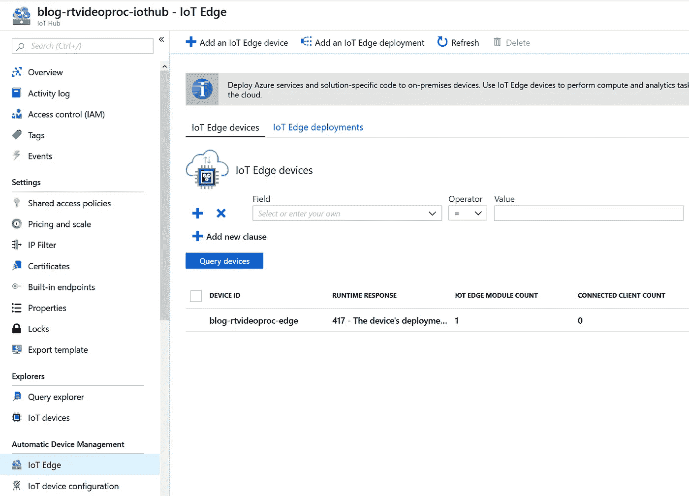

# 如何用 Azure 在边缘设备上部署你的 AI 模型

> 原文：<https://towardsdatascience.com/how-to-deploy-your-ai-model-on-edge-devices-8c38a9519c58?source=collection_archive---------15----------------------->

# **1。简介**

边缘计算是一种模式，其中部分计算在分散的边缘设备上完成，是扩展云计算的一种很好的方式。使用这种模式，人工智能(AI)模型在云中训练并部署在边缘，这具有以下优势:

*   **速度**当需要实时决策时，云计算意味着太多的延迟
*   **可用性**允许设备在与云的连接受限的情况下离线工作
*   **减少带宽**当产生大量数据时，在设备上进行过滤以防止所有带宽被消耗

在这篇博客中，创建了一种功能，可以使用 Azure IoT Edge 和自定义视觉 AI 检测火车上的涂鸦。这是按如下方式完成的:

*   涂鸦检测模型使用 [Azure 自定义视觉](https://docs.microsoft.com/en-us/azure/cognitive-services/custom-vision-service/home)进行训练，并导出为 TensorFlow 模型。
*   模型作为 docker 容器部署在边缘(相机，由 Ubuntu 虚拟机模拟)
*   Edge 设备分析火车视频中的涂鸦。只有在检测到涂鸦时，视频才会放在 Blob on Edge 上，并上传到链接的 Azure 存储中
*   一旦视频在 Azure 中，视频可以被进一步处理(从视频中提取文本，在 Power BI 仪表板上显示结果，参见我以前的[博客](/intelligent-realtime-and-scalable-video-processing-in-azure-201f87104f03)

该项目的架构可描述如下:


1\. Using AI with Cognitive Services on Azure IoT Edge

在博客的剩余部分，架构的边缘部分通过以下步骤实现:

*   2.创建和导出人工智能模型
*   3.将人工智能模型作为容器部署在边缘设备上
*   4.结论

# 2.创建和导出人工智能模型

[Azure 认知服务](https://azure.microsoft.com/en-us/services/cognitive-services/)是一组可以注入到你的应用中的 API。它包含语音识别、图片中的对象识别和语言翻译的智能算法。还可以通过使用自定义视觉扩展另一个模型来创建自己的 AI 模型。这可以看作是“在预训练图像识别模型的神经网络中添加最后一个自定义层”。该项目采取了以下步骤:

*   2a。训练自定义视觉模型来检测火车上的涂鸦。
*   2b。将自定义视觉模型导出为 docker 文件
*   2c。将导出的模型添加到 Visual Studio 代码项目

## 2a。训练和部署自定义视觉模型来检测火车上的涂鸦

前往 [Custom Vision 网站](https://www.customvision.ai/)，使用您的 Azure 广告凭证登录。登录后，选择创建一个具有属性“分类”和多类(每个图像一个标签)的自定义视觉项目。确保选择 General (compact)作为域，否则模型无法作为容器导出，另请参见下文。


2a1\. Create Custom Vision API project

然后将以下图像下载到以下 git 项目中的文件夹[cognitive services](https://github.com/rebremer/realtime_video_processing/tree/master/CognitiveServices)/custom vision images 中:

```
[https://github.com/rebremer/realtime_video_processing.git](https://github.com/rebremer/realtime_video_processing.git)
```

第一步，将带有涂鸦标签的涂鸦图片添加到您的项目中。其次，将带有标记涂鸦的 no_graffiti 图片添加到您的项目中，然后进行底片处理。然后使用快速通道训练模型，也见下文。


2a2\. Train Custom Vision Api project

您可以通过点击“快速测试”来测试模型，然后使用之前下载的 git 项目从测试文件夹中选择一个图像。

## 2b。将自定义视觉模型导出为 docker 文件

一旦您定型并测试了模型，您就可以创建模型的端点或者导出它。在这个场景中，模型被导出为 dockerfile。转到您的项目，选择您想要导出的迭代，然后选择 export。随后，选择将模型导出为包含张量流的 dockerfile。pb 文件。


2b1\. Export model as dockerfile

在下一章中，模型被添加到项目中。

## 2c。将导出的模型添加到 Visual Studio 代码项目

在这个项目中， [Visual Studio 代码](https://code.visualstudio.com/)用作编辑器。安装完成后，选择 Open Folder，然后选择打开在步骤 2a 中克隆的 github 项目中的“RealTime_Video_Processing”文件夹。然后替换 EdgeCustomVision/modules/ImageClassifierService/app 文件夹中的 model.pb 和 label.txt，另见下文


2c1\. Adding CustomVision model to project

# 3.将人工智能模型作为容器部署在边缘设备上

在这一部分，项目部署在边缘。博客的这一部分扩展了以下标准 Azure [教程](https://github.com/Azure-Samples/Custom-vision-service-iot-edge-raspberry-pi)，并执行以下步骤:

*   3a。安装准备工作
*   3b。在物联网集线器上安装边缘设备
*   3c。在边缘设备上安装模块

## 3a。安装准备工作

需要安装以下预备设备:

*   安装 [Azure 核心工具版本 2.x](https://docs.microsoft.com/en-us/azure/azure-functions/functions-run-local#v2) 。
*   安装 [Azure CLI](https://docs.microsoft.com/en-us/cli/azure/install-azure-cli) 。此博客需要 Azure CLI 版或更高版本。运行`az --version`找到您拥有的版本。
*   安装[对接器](https://docs.docker.com/install/)
*   安装 [Azure 物联网边缘扩展](https://marketplace.visualstudio.com/items?itemName=vsciot-vscode.azure-iot-edge):一个连接到你的物联网中心的扩展，让你通过 Visual Studio 代码管理你的物联网设备

此外，创建一个存储帐户、物联网中心和 Azure 容器实例，这是本教程剩余部分需要的。

```
az login# Create resource group
az group create -n blog-rtvideoedge-rg -l westeurope# Create storage account and container
az storage account create -n <stor name> -g blog-rtvideoedge-rg --sku Standard_LRS
az storage container create -n videoblob --account-name <stor name># Create IoT Hub
az iot hub create --resource-group blog-rtvideoedge-rg --name blog-rtvideoedge-iothub --sku F1# Create Azure Container registry
az acr create -n <your unique acr name> -g blog-rtvideoedge-rg --sku Standard -l westeurope
```

## 3b。在物联网集线器上安装边缘设备

一个 Ubuntu VM 将作为这个博客中的边缘设备。执行以下命令

```
# Install extension
az extension add --name azure-cli-iot-ext# Create VM that will serve as Edge device
az vm create --resource-group blog-rtvideoedge-rg --name blog-rtvideoedge-vm --image microsoft_iot_edge:iot_edge_vm_ubuntu:ubuntu_1604_edgeruntimeonly:latest --admin-username azureuser --generate-ssh-keys --size Standard_DS1_v2# Open port such that video processing on Ubuntu VM can be seen in webbrowser
az network nsg rule create --resource-group blog-rtvideoedge-rg --nsg-name blog-rtvideoedge-vmNSG --name port_5012 --priority 1020 --destination-port-range 5012
```

现在，使用以下命令将虚拟机作为边缘设备添加到物联网中心:

```
# Create edge registration in IoT Hub
az iot hub device-identity create --hub-name blog-rtvideoedge-iothub --device-id blog-rtvideoedge-vm --edge-enabled# Retrieve keys from edge registration
az iot hub device-identity show-connection-string --device-id blog-rtvideoedge-vm --hub-name blog-rtvideoedge-iothub# And add this key to your VM using the following command:
az vm run-command invoke -g blog-rtvideoedge-rg -n blog-rtvideoedge-vm --command-id RunShellScript --script "/etc/iotedge/configedge.sh '<device_connection_string from previous step>'"
```

正确创建物联网集线器和边缘设备后，您应该会在门户中看到以下内容



3b1\. Edge device created in IoT Hub

## 3c。在边缘设备上安装模块

在博客的这一部分，将在边缘设备上安装以下模块:

*   边缘上的 Azure Blob 将用作边缘设备的本地存储，并异步将数据放入链接的存储帐户
*   由摄像机模块和网络服务器组成的自定义视觉模块，可在其中跟踪视频处理。

现在找到。env 并填写以下变量:

```
# Replace the value of these variables with your own container registry
                                            CONTAINER_REGISTRY_ADDRESS="<Your ACR address>"                       CONTAINER_REGISTRY_USERNAME="<Your ACR username>"                       CONTAINER_REGISTRY_PASSWORD="<Your ACR password>"                                               BLOB_STORAGE_CONNECTIONSTRING="<Your storage account key>"                       BLOB_STRORAGE_CONTAINER="videoblob"                                               PRIVATE_IP_VM="10.0.0.4"                                               LOCAL_STORAGE_NAME="localvideostor"                       LOCAL_STORAGE_KEY="<create string using [https://generate.plus/en/base64?gp_base64_base%5Blength%5D=64](https://generate.plus/en/base64?gp_base64_base%5Blength%5D=64)>"
```

随后，通过右键单击`deployment.edgecamera.template.json`文件并选择`Build and push IoT Edge Solution`来构建整个解决方案，参见下文。


3c1\. Build and push IoT Edge Solution

如果出现认证错误，首先在命令行中运行以下命令:`az acr login --name <your acr> -g blog-rtvideoedge-rg`

在下一步中，构建并推送两个 docker 容器(这可能需要一段时间),并创建一个新的 config/deployment . edge camera . JSON。需要完成以下步骤:

*   从 Visual Studio 代码将其连接到您的物联网中心(为此需要安装 2a 中提到的物联网边缘扩展)
*   转到新创建的 config/deployment . edge camera . jsonle，选择`Create Deployment for Single device`并选择我们在 3b 中创建的边缘设备。然后 docker 映像将被构建并部署到该设备上(这可能需要一段时间)

如果一切顺利，您可以点击物联网边缘在物联网门户中查找设备，另请参见下文:


3c2\. Edge modules deployed sucessfully

随后，当您通过使用端口 5012 访问 Ubuntu VM 的公共 IP 来查找正在实时分析的视频时，也请参见下文


3c3\. Videos being analyzed in realtime

使用`ssh azureuser@<public ip ubuntu vm>`和类型`sudo docker start camera-capture`通过 ssh 进入您的虚拟机可以重启视频处理。用于记录`sudo docker logs camera-capture`、`journalctl -u iotedge` 和`sudo systemctl status iotedge`。由于视频包含涂鸦，因此将其放在 blob on edge 上，该 blob 将视频异步上传到附带的 blob 存储帐户上。然后可以进一步加工，看我之前的[博客](/intelligent-realtime-and-scalable-video-processing-in-azure-201f87104f03)怎么做这个。

# 4.结论

在这篇博客中，我们讨论了带人工智能的边缘计算对扩展集中式云计算非常重要，因为它允许 1)实时决策，2)离线可用性，3)降低带宽以实现成本效益。在这种情况下，创建了一个可以在边缘进行智能处理的项目，如下所示

*   使用自定义视觉模型对边缘进行涂鸦检测
*   仅当检测到涂鸦时，才使用 Blob on Edge 将视频添加到 Azure 存储帐户
*   一旦视频在 Azure 中，数字识别使用 OCR 完成，结果显示在 Power BI 上(参见我之前的[博客](/intelligent-realtime-and-scalable-video-processing-in-azure-201f87104f03))

项目的架构如下所示。


4\. Using AI with Cognitive Services on Azure IoT Edge