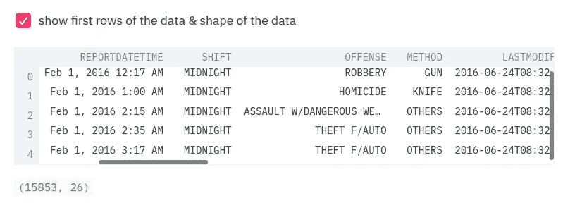
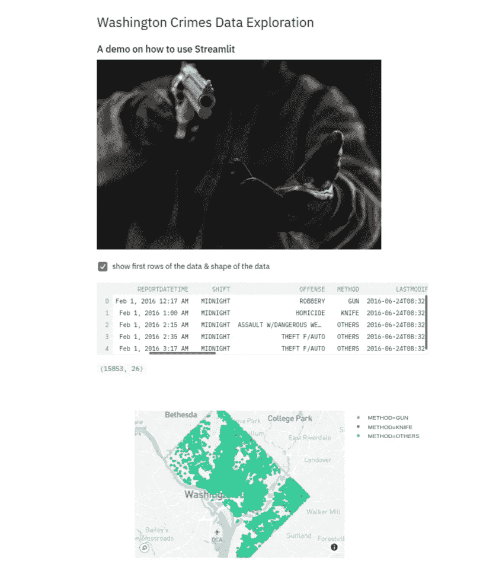
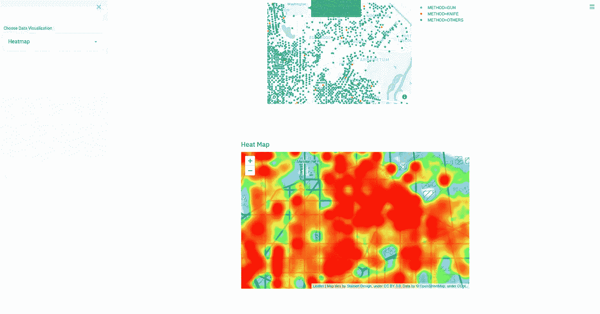
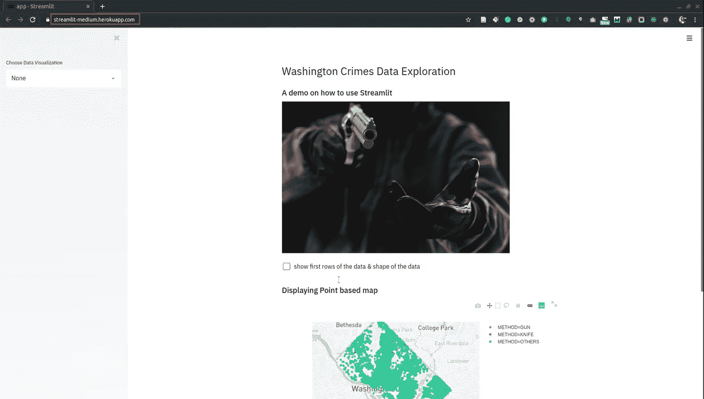

# 如何使用 Python 将您的数据科学项目轻松部署为 web 应用程序

> 原文：<https://towardsdatascience.com/how-to-deploy-your-data-science-as-web-apps-easily-with-python-955dd462a9b5?source=collection_archive---------7----------------------->

## 教程+在 Heroku 中部署——Streamlit 带来了革命性的变化，使部署 web 应用程序变得更加容易。


Photo by Christina @ wocintechchat.com on Unsplash

你知道在网上部署应用程序在技术上有多复杂。借助 Streamlit，您可以使用纯 python 创建应用程序，无需担心前端开发。在本地服务器上实现它只需要一个命令。如果你想在网络上使用它，你可以在任何其他云平台上托管它。


Streamlit — Pure Python

在本教程中，您将使用 python 和 streamlit 构建数据可视化应用程序。后来我们把它部署在 Heroku 供公众使用。这是我们将在 Heroku 中构建和部署的一个预告片。

## 设置简化 it

我们用 pip 安装 Streamlit，如下所示:

```
pip install streamlit
```

运行 Streamlit 就像运行一样简单:

```
streamlit run XXX.py
```

现在，我们还没有创建我们的应用程序。但是在我们继续之前，我们创建了一个 GitHub 存储库，我们稍后将使用它在 Heroku 中部署应用程序。创建 Github 存储库后，克隆它。

```
git clone [https://github.com/shakasom/streamlit-medium.git](https://github.com/shakasom/streamlit-medium.git)
```

从现在开始，我们处理这个文件夹。所以转到这个文件夹:

```
cd streamlit-medium/
```

在下一节中，我们将开发一个 python 数据可视化应用程序。

## 本地应用程序开发

你可以使用你最喜欢的开发环境。让我们创建一个 python 文件来编写应用程序。你想叫它什么都可以。我会把我的叫做 app.py

我们首先导入我们需要的库。

```
import streamlit as st
import pandas as pd
import plotly_express as px
*import folium* from folium.plugins import HeatMap
import seaborn as sns
```

本教程的数据是 2016 年 1 月至 6 月华盛顿报道的犯罪。让我们创建一个函数来帮助我们做到这一点。

```
# Get the data from url and request it as json file@st.cache(*persist*=True, *suppress_st_warning*=True)
*def* load_data():
    df = pd.read_csv(    “https://query.data.world/s/6joi7hjgjmwifhl2clpldwm36xmvmx")
    df[“REPORTDATETIME”] = pd.to_datetime(
    df[“REPORTDATETIME”], *infer_datetime_format*=True)
    df[“Day”] = df[“REPORTDATETIME”].dt.day 
    df[“Month”] = df[“REPORTDATETIME”].dt.month
    df[“Hour”] = df[“REPORTDATETIME”].dt.hour
    return df
```

让我们创建 **main** 函数，当我们执行它时，它会自动运行我们的应用程序。首先，我们使用上面的函数获取数据，并将其命名为 df_data。我们还开始编写标题(st.header)并向我们的应用程序添加图像(st.image)。

```
*def* main():
    df_data = load_data()
    st.header(“Washington Crimes Data Exploration”)
    st.subheader(“A demo on how to use Streamlit”)
    st.image(image.jpg", *width*=600)if __name__ == “__main__”:
    main()
```

有了这个简单而纯粹的 python 代码，我们可以在本地派生出一个 Streamlit 应用程序。你需要跑:

```
streamlit run app.py
```

还有瓦拉！您的应用将在浏览器中启动。让我们检查一下我们目前掌握的情况。一个标题，副标题文本和一个图像，你可以从下面的截图看到。它运行在本地主机端口 8501 上。


Streamlit screenshot

让我们为我们的应用程序添加更多的功能。我们将逐步做到这一点。我们首先在应用程序中显示数据集的一些行。我们还展示了整个数据集的形状。要控制显示项目，可以使用 **st.checkbox** ，点击一次；它将显示缩进代码中的内容。 **st.write** 可以拿熊猫做手术，所以如果你想展示头部，我们可以这样做。

```
if st.checkbox(“show first rows of the data & shape of the data”):
    st.write(df_data.head())
    st.write(df_data.shape)
```

在**主**函数中添加上述代码并保存。现在，如果您转到浏览器并刷新或重新运行您的应用程序，您将看到一个复选框，如果您单击它，您将看到数据集的前几行。



Adding checkbox

让我们在应用程序中添加一张地图。首先，我们创建一个函数来返回一个图形。

```
@st.cache(*persist*=True, *suppress_st_warning*=True)
*def* display_map(*df*):
    st.subheader(“ Displaying Point based map”)
    px.set_mapbox_access_token("MAPBOX TOKEN”)
    fig = px.scatter_mapbox(df, *lat*=”Y”, *lon*=”X”, *color*=”METHOD”\
          , *zoom*=10)return fig
```

在**主**函数内部，我们可以调出 **st.plotly_chart** 。有一些内置的图表功能，包括 Matplotlib、Bokeh 等，但任何其他尚未在 streamlit 中实现的库也是可能的，因为我们将在接下来使用 Folium 库。

```
st.plotly_chart(display_map(df_data))
```

上面的代码将在我们的应用程序中添加一个美丽的 Plotly 地图，你可以从下面的截图中看到。



Streamlit app

## 侧栏元素

如果您想使用侧边栏，您可以将 **st.sidebar** 与任何其他 streamlit 功能一起使用。该方法将在侧边栏中创建您的应用程序元素。让我们看一个使用带有下拉选择的侧边栏的例子— **selectbox。**

首先，我们创建选择—热图和计数图。

```
dataviz_choice = st.sidebar.selectbox(“Choose Data Visualization”, [“None”, “Heatmap”, “Countplot”])
```

让我们为热图创建一个函数。

```
*def* heat_map(*df*):
    locs = zip(df.Y, df.X)
    m = folium.Map([38.8934, -76.9470], *tiles*=’stamentoner’,   *zoom_start*=12)
    HeatMap(locs).add_to(m)
    return st.markdown(m._repr_html_(), *unsafe_allow_html*=True)
```

注意，这里我们使用的是 st.markdown。在 Streamlit 中还没有实现 yellow 库，但是我们可以在上面的代码中以这种方式创建一个 yellow map。

现在，让我们用热图和计数图填写我们的选择。

```
if dataviz_choice == “Countplot”:
    st.subheader("Countplot")
    sns.countplot(“METHOD”, *data*=df_data)
    st.pyplot()elif dataviz_choice == “Heatmap”:
    st.subheader(“Heat Map”)
    heat_map(df_data)
```

如果您在浏览器中重新运行您的应用程序，您应该会看到一个带有选项的侧边栏。如果我们选择热图，我们的应用程序将如下所示。



Streamlit Heatmap

在下一节中，我们将在 Heroku 中部署应用程序，在那里您可以免费构建应用程序。如果你愿意，你也可以用 AWS 或者 Google 云平台来部署，但是在本教程中，我将使用 Heroku。

## 在 Heroku 部署应用程序

首先，确保你在 Heroku 注册。然后，我们需要创建四个文件来在云中部署我们的应用程序:Procfile、config 文件、需求和运行时。让我们首先创建 Procfile。当我们想在 Heroku 中剥离应用程序时，我们在这里提供要运行的内容。以下是 Procfile 的外观:

```
web: sh create_config.sh && streamlit run app.py
```

保存文件并将其命名为“Procfile ”,不带任何扩展名。

接下来，我们创建配置文件，将其命名为 create_config.sh，并将以下代码粘贴到其中。

```
mkdir -p ~/.streamlit 
echo “[server]
headless = true
port = $PORTenableCORS = false
” > ~/.streamlit/config.toml
```

需求文件包含了应用程序需要的库。您可以使用 pip 冻结。requirements.txt 文件如下所示:

```
streamlit==0.51.0
pandas==0.25.2
plotly-express==0.4.1
seaborn==0.9.0
folium==0.10.0
```

最后，运行时文件指定您希望应用程序运行的 python 版本。

```
python-3.7.5
```

现在我们需要将这些新文件推送到我们的 Github 库。

```
git add *
git commit -m “deploying files”
git push
```

我们的本地文件现在被推送到我们的 Github 库，我们可以开始在 Heroku 部署应用程序。在命令行中运行以下命令，然后按任意键。

```
heroku login
```

将弹出一个新的浏览器。用你的证件登录 Heroku。一旦你这样做了，回到你的命令行，创建一个这样的 Heroku 应用程序。

```
heroku create streamlit-medium
```

最后，我们需要推动 Heroku。

```
git push heroku master
```

如果你现在逃跑

```
heroku open
```

您的应用程序将在新的浏览器中打开，或者您可以单击提供的 URL。也就是说，你可以与任何人共享这个 URL，他们将从任何地方访问你的应用程序。



Streamlit app deployed in Heroku

## 结论

在本教程中，我们用 python 和 streamlit 创建了一个数据可视化应用程序。我们还使用 Heroku 在云中部署了应用程序。本教程的代码可以在这个 Github 资源库中找到

[](https://github.com/shakasom/streamlit-medium) [## shakasom/streamlit-medium

### 你知道他们在网上部署应用程序在技术上有多复杂。有了 Streamlit，您可以用纯粹的…

github.com](https://github.com/shakasom/streamlit-medium) 

您可以通过以下 URL 访问 Heroku web 应用程序:

 [## 细流

### 编辑描述

streamlit-medium.herokuapp.com](https://streamlit-medium.herokuapp.com/)