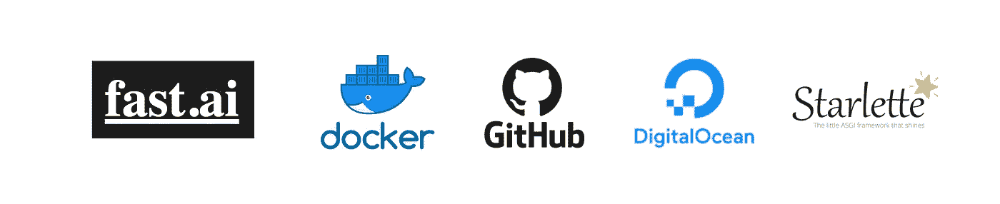
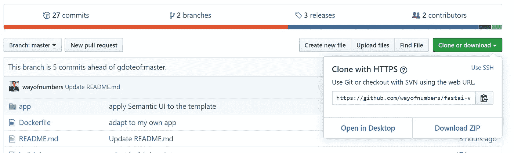
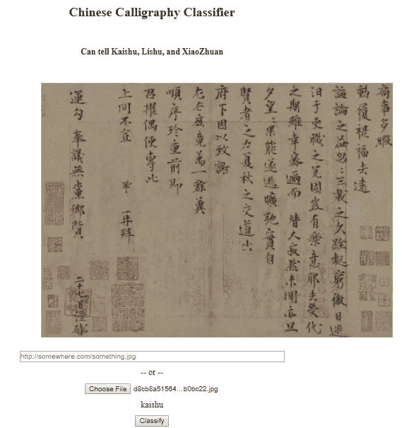
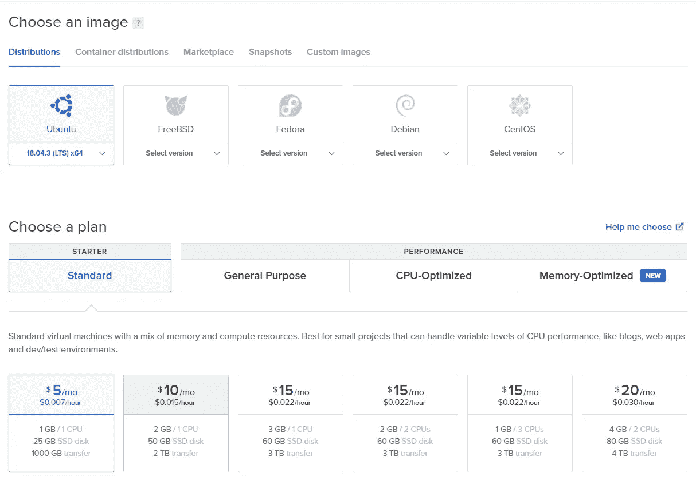

# 如何将您的机器学习 Web 应用部署到数字海洋

> 原文：<https://towardsdatascience.com/how-to-deploy-your-machine-learning-web-app-to-digital-ocean-64bd19ce15e2?source=collection_archive---------8----------------------->

## 使用 Fast.ai、Docker、GitHub 和 Starlette ASGI 框架



Y 你已经收集了你的数据，勤奋地清理了这些数据，把它们塞进你精心微调的模型中，并花费了大量的 GPU 时间来训练这个模型。预测是最先进的！太棒了。

> 但是现在呢？

当然是和全世界分享啦！它有如此巨大的潜力，以前没有人这样做过，你想让每个人都尝试一下！怎么会？你问。

在本教程中，我将向您介绍一种部署训练有素的机器学习模型的经济而灵活的方法。我将带你走完这一过程中的每一步，希望在读完这篇文章后，你在向世界部署你的“下一个大东西(模型)”时不会有任何问题。

# 如何训练(和输出)你的龙(模型)


Image from [https://www.facebook.com/HowToTrainYourDragon/](https://www.facebook.com/HowToTrainYourDragon/)

首先，你需要训练你的模型，并导出它。在本文中，我们将使用 Fast.ai 的库来展示它是如何完成的。你可能想参考我的关于如何收集数据和训练一个**中国书法分类器**模型的[两篇文章](https://medium.com/datadriveninvestor/deep-learning-models-by-fast-ai-library-c1cccc13e2b3)或者你也可以使用你自己的模型。出于本文的目的，我将假设您已经训练了模型并达到了您想要的准确率。

Fast.ai 使用一个`learn`对象来训练模型，为了导出你的模型，使用方法`learn.export()`将你训练好的模型导出并保存到一个`export.pkl`文件中(上面 [*链接*](https://medium.com/datadriveninvestor/deep-learning-models-by-fast-ai-library-c1cccc13e2b3) *的*我的模型导出文件大约是 100MB* )。保存这个文件，我们以后会用到它。*

# GitHub 驱动的网络开发

模型准备好了，下一步是 web 应用程序开发。我假设你是一个全栈的 web 开发人员，所以让我们直接进入编码。不，我只是在开玩笑。我们将使用 GitHub 上的样板 web 应用程序模板来快速准备好您的 web 应用程序。你只需要做一些小的调整，你就可以开始了。如果你不知道 [GitHub](https://github.com) 是什么，它是存放大量开源应用程序源代码的地方。我已经把一个现成的 web 应用程序的代码放在那里了，所以你可以很容易地下载和重用。

进入这个 [GitHub 库](https://github.com/wayofnumbers/fastai-vision-uvicorn-gunicorn-starlette-docker)，点击右边绿色大按钮**克隆或者下载**，如下图:



在弹出窗口中，复制链接，然后转到您的终端并键入:

```
git clone [https://github.com/wayofnumbers/fastai-vision-uvicorn-gunicorn-starlette-docker.git](https://github.com/wayofnumbers/fastai-vision-uvicorn-gunicorn-starlette-docker.git)
cd fastai-vision-uvicorn-gunicorn-starlette-docker
```

这些命令将把所有需要的代码克隆到你的本地机器上，在一个名为`fastai-vision-uvicorn-gunicorn-starlette-docker`的文件夹下，并进入那个文件夹。这是我们将要处理的主文件夹，其中有几个值得解释的内容:

**app** :这个`app`文件夹的结构如下:

```
template
|--app.html
main.py
export.pkl
```

这是您的 Starlette web 应用程序源代码所在的位置。它有一个非常简单的 Python 文件`main.py`。 [**Starlette**](https://www.starlette.io/) 是一个轻量级的 [ASGI](https://asgi.readthedocs.io/en/latest/) 框架/工具包，非常适合构建高性能的 asyncio 服务。

它还有保存的模型文件`export.pkl`。`template`文件夹中有一个 HTML 模板文件`app.html`，它将作为你的 web 应用程序 UI。

还记得你保存的导出的`export.pkl`文件吗？把那个拿出来，替换掉这个`app` 文件夹里的那个。所以应用程序会使用你的模型。也欢迎您更新 app.html 文件以获得更好的 UI，但是就部署而言，这不是必需的。现在你的 web 应用程序的源代码已经准备好了，我们需要把它打包到一个 [Docker](https://www.docker.com/) 容器中，并做一些测试。我们使用 **Dockerfile** 作为配置文件。我们将在下一节中探索更多。

# 让我们把它记录下来！

我们将使用 Docker 创建一个运行我们 web 应用程序的容器。如果你不知道 Docker 是什么，只知道它是一种迷你虚拟机，安装了所有必要的库和依赖项，因此应用程序可以平稳运行。它比真正的虚拟机更小、更灵活，并且可以非常容易地创建和部署。

首先，你需要安装 Docker。[这里](https://docs.docker.com/install/)是一个非常全面的指南，供你参考。安装后，如果您运行的是 Ubuntu，那么运行以下命令会有所帮助:

```
sudo groupadd docker
sudo usermod -aG docker $USER
```

这将消除每次输入 docker 命令时使用`sudo`的需要。重新启动，现在 docker 应该安装正确。

在`app`文件夹和`Dockerfile`所在的同一个目录中，我们需要创建一个 docker 映像，其中包含这个文件夹中的所有源代码，这样我们就可以进行测试了。输入以下命令(不要忘记“.”结尾):

```
docker build -t test_app .
```

这将根据`Dockerfile`启动一个 docker 映像构建过程。这需要一段时间，所以让我们简单看看`Dockerfile`里面有什么:

```
#1 FROM tiangolo/uvicorn-gunicorn-starlette:python3.7
#2 RUN pip install fastai aiohttp 
#3 RUN pip install jinja2 
#4 RUN pip install starlette 
#5 COPY ./app /app 
#6 WORKDIR /app 
#7 EXPOSE 80
```

这是不言自明的:

**第 1 行:**指定我们将从哪个起始映像构建 docker 映像。我们用`tiangolo/uvicorn-gunicorn-starlette:python3.7`。你可以在这里找到它的 GitHub 链接[，在这里](https://github.com/tiangolo/uvicorn-gunicorn-starlette-docker)找到 Docker Hub 链接[。](https://hub.docker.com/r/tiangolo/uvicorn-gunicorn-starlette/)

**2、3、4 行:**安装 fast.ai 库、jinja 模板框架、Starlette 框架等实用工具。

第 5 行:把你的应用文件夹复制到 docker 镜像中，这样我们的应用就可以在 docker 容器中运行了。

**第 6、7 行:**将工作目录分配给`app`文件夹，将端口 80 暴露给外部，这样我们就可以通过端口 80(HTTP)访问 web app。

一旦创建了 docker 图像，运行`docker images`进行检查。您会发现类似这样的内容:

```
REPOSITORY    TAG    IMAGE ID    CREATED        SIZE
test_app      latest xxxxxxxxx   1 minutes ago  4.05GB
```

现在，我们可以从创建的映像启动 docker 容器，并在本地测试您的应用程序:

```
docker run -p 80:80 \
		-v ./absolute/path/to/export.pkl:/app/export.pkl \
		-e TITLE="Chinese Calligraphy Classifier" \
		-e SUBTITLE="Can disambiguate Chinese calligraphy styles like KaiShu, LiShu, XiaoZhuan" 
		test_app
```

在上面的 docker 命令中，我们将端口指定为 80。我们将两个环境变量转移到容器中，`TITLE` 和`SUBTITLE`，它们将用于显示我们的 web 应用程序 UI 标题。最后，我们指定了 docker 图像名:`test_app`。请注意，对于`export.pkl`文件，需要使用绝对路径，否则 Docker 将无法找到。

如果您没有看到任何错误，您的 docker 容器现在应该已经启动并运行了。走向你的浏览器，输入`127.0.0.1`并点击回车，瞧！你应该看看网络应用。给它一个'楷书'、'隶书'或'小篆'的书法形象，打'**分门别类【T27'，你应该看到这样的东西:**



Very rough web app UI

你可以看到 app 把这个归类为‘凯叔’，没错。现在你的应用已经在本地机器上运行了，我们已经完成了 80%。剩下的就是部署到云上了。接下来让我们向云进发吧！

# 下一步，云！

对于云托管服务，我们将使用[数字海洋](https://www.digitalocean.com)。与亚马逊 AWS、GCP 或 Azure 等现有公司相比，它对开发者更友好，也更便宜。你可以按照[这篇写得很好的简明教程](https://www.digitalocean.com/docs/droplets/how-to/create/)来创建一个你自己的账户和‘Droplet’。(“Droplet”是一个由 Digital Ocean 运行的虚拟机，你可以在其中安装你的应用程序，很像一个 AWS 实例。)如果您愿意，您可以使用[此链接](https://m.do.co/c/bc334d488542)创建您的帐户，并免费获得 50 美元的信用点数，这足以让您入门。使用以下配置作为参考:



建议您创建至少有 **4G** 内存的 Droplets，因为安装 PyTorch 需要大量内存。以后你可以把它缩小到 2G。

您可以选择默认的“数据中心”并设置您的身份验证方法。使用 SSH 密钥或密码，无论哪种方式您都觉得更舒服。我个人比较喜欢 SSH 键，按键少，更安全。一旦创建了 Droplet，SSH 进入它，我们就为最后的部署做好了准备！

# 部署！部署！部署！

现在你应该能够以`root`的身份 SSH 到你的服务器。建议创建一个拥有`sudo`权限的普通用户，可以按照[本教程](https://www.digitalocean.com/community/tutorials/how-to-create-a-sudo-user-on-ubuntu-quickstart)进行操作。一旦创建了一个普通用户，注销您的`root`用户，用您的普通用户帐户通过 SSH 重新登录到服务器。最终的部署与我们已经在本地机器上完成的非常相似，只是这次我们是在远程 droplet 服务器上完成的。首先，让 git 克隆我们的 repo，这样我们就有了源代码:

```
git clone [https://github.com/wayofnumbers/fastai-vision-uvicorn-gunicorn-starlette-docker.git](https://github.com/wayofnumbers/fastai-vision-uvicorn-gunicorn-starlette-docker.git)
cd fastai-vision-uvicorn-gunicorn-starlette-docker 
```

不要忘记复制你的`export.pkl`文件来替换`app`文件夹中的内容。(如果您不知道如何操作，请点击此[链接](https://unix.stackexchange.com/questions/106480/how-to-copy-files-from-one-machine-to-another-using-ssh)

如果没有安装 docker，请安装 docker。然后使用下面的命令构建 docker 映像。同样，如果由于内存不足而导致映像构建失败，请调高内存大小，稍后您可以调低内存大小，而不会增加太多成本。

```
# make it so that you don't need sudo for running docker command
sudo groupadd docker
sudo usermod -aG docker $USER# build the image
docker build -t test_app .
```

一旦构建了映像，启动 docker 容器:

```
docker run -p 80:80 \
		-v ./absolute/path/to/export.pkl:/app/export.pkl \
		-e TITLE="Chinese Calligraphy Classifier" \
		-e SUBTITLE="Can disambiguate Chinese calligraphy styles like KaiShu, LiShu, XiaoZhuan" 
		test_app
```

一旦 docker 容器启动并运行，进入你的浏览器，输入你的 Droplet 的 IP 地址，点击回车。恭喜你！你已经成功地将你的深度学习模型部署到互联网上了！

# 结论

没那么难吧。使用标准 DigitalOcean Droplet 进行部署提供了很多灵活性。你可以对你的 Droplets 做任何你想做的事情，因为你有 root 权限。你可以在上面运行多个应用程序，只需支付很少的费用(5-10 美元应该足够了)。如果你的应用获得了一些牵引力，需要更多的资源，你可以很容易地扩大规模。

我希望这篇教程对你部署你的 AI 应用有所帮助。如果您有任何问题或想要分享您的部署经验，请在下面写下回复。部署愉快！

更新:我已经在这里部署了 web 应用[。我使用 DigitaOcean 上的 web 应用程序作为 API 后端服务器，并将另一个基于](https://wayofnumbers.github.io/fastai-vision-model-inference--react-gh-pages) [ReactJS 的 web 应用程序](https://wayofnumbers.github.io/fastai-vision-model-inference--react-gh-pages)托管在 [GitHub 页面](https://github.com/wayofnumbers/fastai-vision-model-inference--react-gh-pages/tree/master)上作为前端。由于 React 应用程序需要访问“http”URL，一些浏览器会显示“混合内容错误”，只需启用它，您应该可以自己尝试一下。也欢迎大家查看回购中的 React app 源代码。

欢迎任何反馈或建设性的批评。你可以在 Twitter [@lymenlee](https://twitter.com/lymenlee) 或者我的博客网站[wayofnumbers.com](https://wayofnumbers.com)上找到我。