# 如何利用机器学习检测恶意推文

> 原文：<https://towardsdatascience.com/how-to-detect-mean-tweets-with-machine-learning-deaa9dc6a8a8?source=collection_archive---------18----------------------->

## 因为现在一切都是令人讨厌的…

Don’t give me that attitude

我想我不需要提醒你们所有人，尽管互联网有很多好处，但它也可能是消极的温床。只要看看 Reddit 或 YouTube 或 eelslap.com，你就会明白我的意思。

Twitter 一直是一个平台，人们可以在这里公开世界上和生活中发生的一切。我们的总统极其善于利用这个平台表达自己的意见，甚至调节美国公众的普遍看法。你可以想象，鉴于 Twitter 每天有 1.26 亿用户，不幸的是，有些人在说出自己的想法时没有过滤器。缺乏过滤器的人导致非常不合适的推文，从而导致不可避免的争论和痛苦。

今天我们要找点乐子，看看我们能否自动过滤掉哪些推文是冒犯性的，哪些不是。

# 议程

1.  数据预处理
2.  数据清理
3.  标记化
4.  堵塞物
5.  数据可视化
6.  提取特征
7.  模型结构
8.  需要改进的地方
9.  资源

*如果你想更深入地了解这个项目，或者如果你想添加代码，可以查看一下* [*GitHub 库*](https://github.com/jerrytigerxu/Twitter-Sentiment-Analysis) *。*

# 数据预处理

像往常一样，在我们开始实际的细节之前，我们需要在做任何有趣的事情之前准备好我们的数据。所有必要的数据都在 GitHub 存储库中。

我们有两个文件，一个训练文件和一个测试文件。在火车文件中，我们有各种推文的随机分类。有三个特性，一个唯一的 id、一个标签和实际的 tweet 文本。如果推文是非冒犯性的(非种族主义或性别歧视等)，标签为“0”。)而标签是‘1’如果推文很冒犯的话。

首先，我们将导入一大堆库。

现在我们将使用熊猫来读取测试和训练文件。

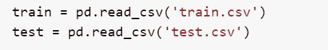

让我们用熊猫来看看我们的数据是什么样的。

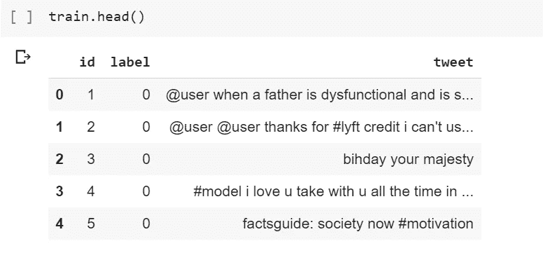

我将使用一些更好的数据符号，只显示那些被标记为攻击性的推文。

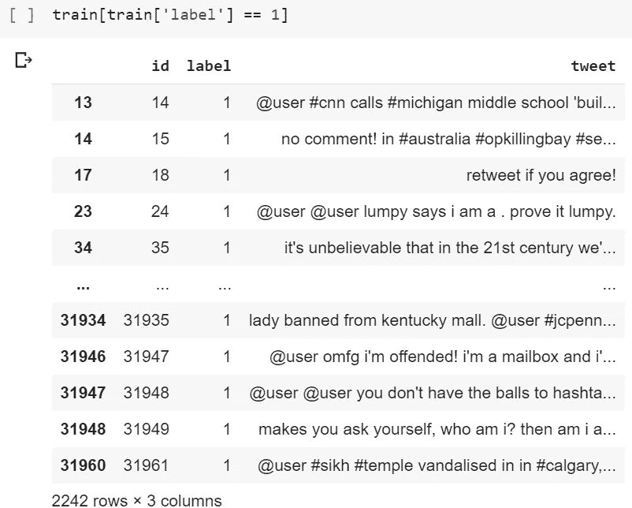

现在我们已经加载了数据，我们可以通过清理数据来最大限度地提高机器学习的效率。

# 数据清理

对于数据清理，我们将采取三个步骤:

1.  移除 Twitter 句柄
2.  删除标点、数字和特殊字符
3.  删除那些没有太大价值的小词

为了节省时间，我们将组合我们的训练和测试数据帧，并在两者上进行所有的数据清理。

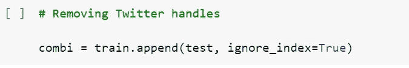

现在，我们将创建一个正则表达式，允许我们从我们的推文中找出并删除 Twitter 句柄。

现在我们的组合数据框架应该不再有 Twitter 句柄了。我们可以用一个简单的脚本删除特殊字符、数字和标点符号。

然后我们将删除没有增加价值的短词。

让我们看看现在合并后的数据帧是什么样子。

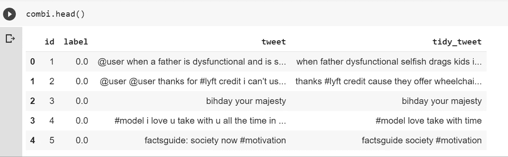

Nice work!

# 标记化

真正的乐趣开始了！因为机器学习算法不能像我们一样找到模式和见解(它们不能只是阅读一整串文本，所以它们必须接受单个单词)，我们需要一种方法来保留每条推文的*【本质】*，同时让算法尽可能容易地了解什么使推文具有攻击性或不具有攻击性。

幸运的是，我们有这种有用的预处理形式，叫做**记号化**，它基本上是把你所有的文本分割成最基本的单元。

这是一个看起来像什么的例子。

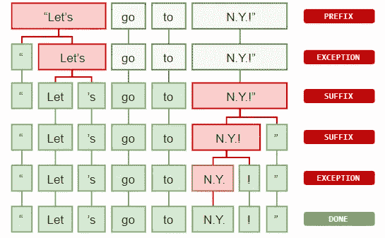

New York is indeed special

标记化实际上非常简单。你所要做的就是把你的文本分成独立的部分。

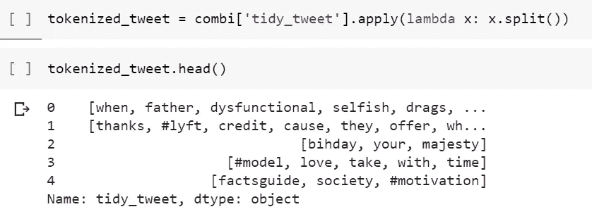

嘣！我们结束了！

# 堵塞物

既然我们已经完成了标记化，我们需要继续下一步的预处理步骤，称为**词干**，本质上是将每个标记化的单词转换成它的词根形式和时态。例如，对“创建”一词进行词干化会产生“创建”一词，而“寄售”一词会变成“寄售”。

让我们来看看我们的词干推文。

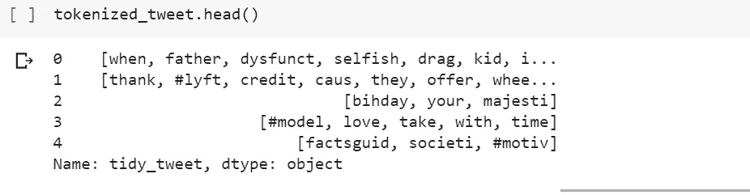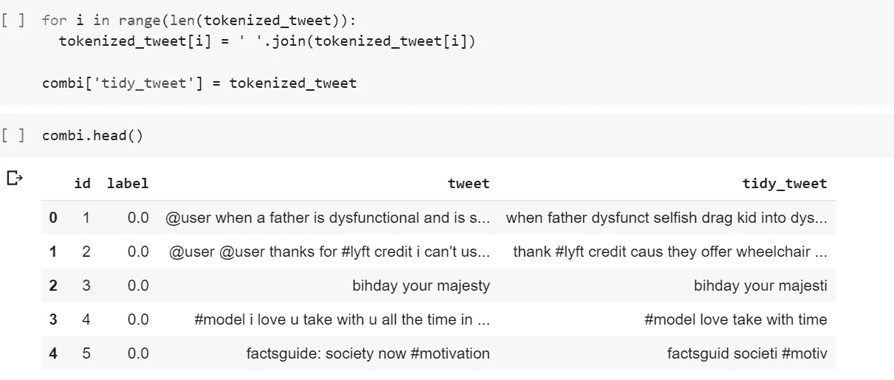

# 数据可视化

在我们进入机器学习之前，对我们的数据进行一些直觉是一个很好的实践。数据可视化是我们实际探索和理解数据的一种很好的方式。

我们想回答的一些问题是:

*   数据集中最常见的词是什么？
*   负面和正面推文最常用的词是什么？
*   一条推文中有多少标签？
*   相关的趋势有哪些？

## 常用词

为了看到我们推文中的常用词，我们可以创建一个词云来真正看到它们。

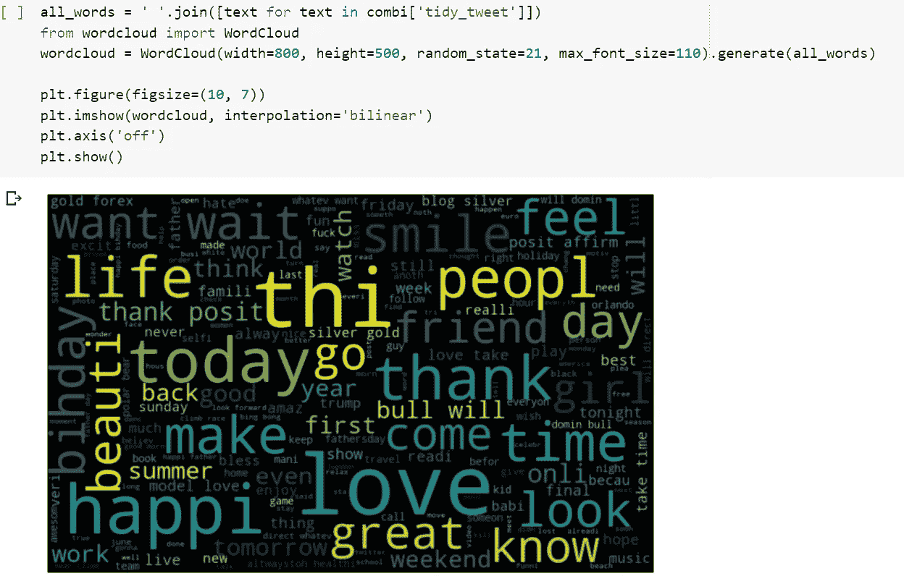

## 正面推文中的单词

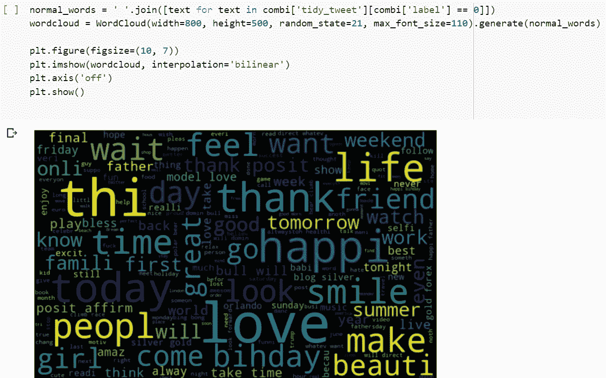

## 负面推文中的词语

*(警告:这个词云中的词绝对是 NSFW)*

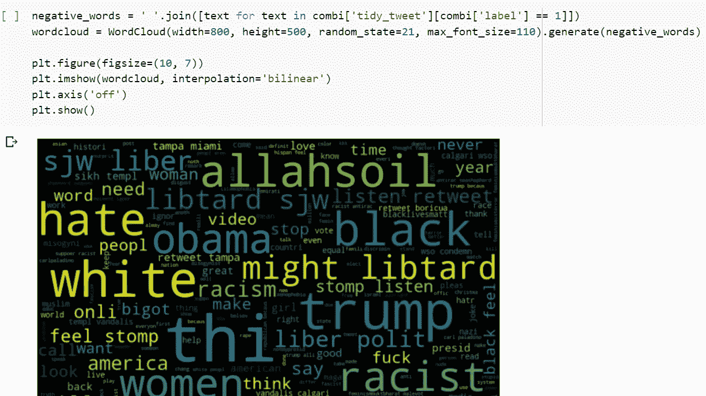

## 标签

我们故意不删除标签，因为它们可以携带大量有用的信息。我们将提取标签，看看哪些是最常出现的。

现在让我们画出最常见的标签。

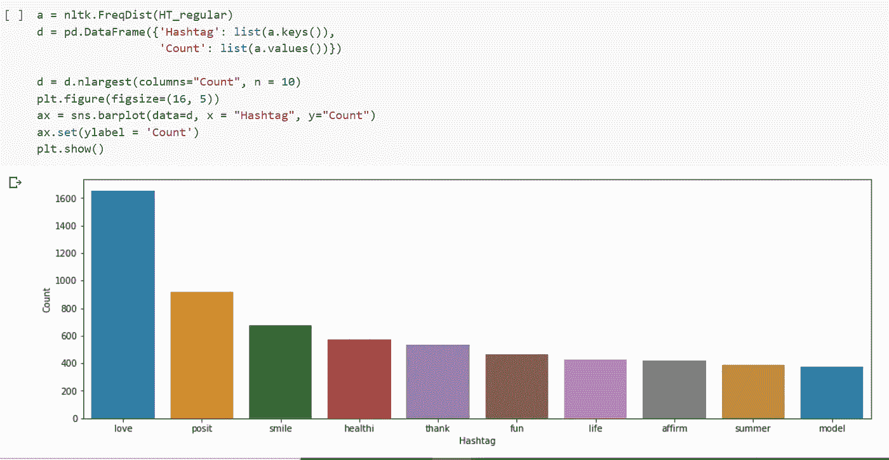

Positive hashtags

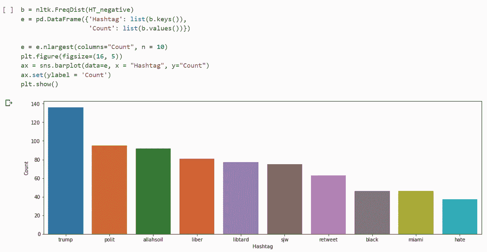

Negative hashtags

# 提取特征

现在我们已经完成了所有必要的步骤，是时候真正开始机器学习了。

我们将使用逻辑回归机器学习算法来训练我们的预测模型。在我们实际训练我们的模型之前，我们必须将文本数据转换成算法实际可以读取的格式。

我们可以使用两种方法，词袋和 TF-IDF(术语频率-逆文档频率)。我不会详细介绍这些特征提取模型实际上是如何工作的，但是可以通过我放在本文底部的参考资料来了解更多信息。

首先我们将提取单词袋。

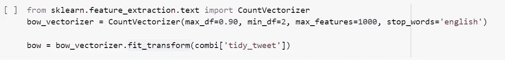

然后我们用 TF-IDF 提取。

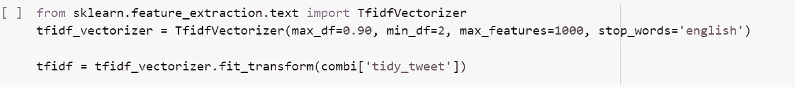

现在，我们可以使用这些提取的数据框架来训练我们的逻辑回归模型。

# 模型结构

是时候建立我们的模型了。

首先，我们将建立单词袋数据框架。

现在让我们看看我们预测准确度的结果。

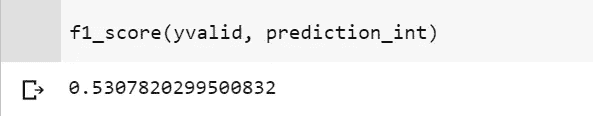

现在，我们将使用 TF-IDF 数据框架构建模型。

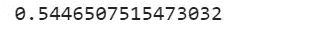

看来我们的模型还有很多需要改进的地方。尽管这是一个开始。

# 需要改进的地方

感谢您花时间通读这篇文章！请随意查看我的[作品集网站](https://jerrytigerxu.github.io/?source=post_page---------------------------)或[我的 GitHub](https://github.com/jerrytigerxu?source=post_page---------------------------) 。

## 1.使用不同的 Twitter 数据。

## 2.尝试不同的自然语言处理方法

## 3.使用不同的机器学习算法

## 4.调整超参数

# 资源

1.  [熊猫](https://www.learndatasci.com/tutorials/python-pandas-tutorial-complete-introduction-for-beginners/)
2.  [正则表达式](https://medium.com/tech-tajawal/regular-expressions-the-last-guide-6800283ac034)
3.  [自然语言处理](/your-guide-to-natural-language-processing-nlp-48ea2511f6e1)
4.  [逻辑回归](https://www.youtube.com/watch?v=yIYKR4sgzI8)
5.  [文字袋](https://machinelearningmastery.com/gentle-introduction-bag-words-model/)
6.  [TF-IDF](http://www.tfidf.com/)