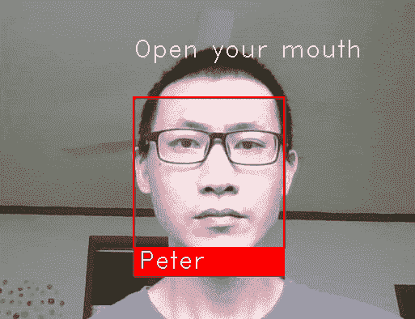

# 如何检测人脸登录时的张嘴

> 原文：<https://towardsdatascience.com/how-to-detect-mouth-open-for-face-login-84ca834dff3b?source=collection_archive---------9----------------------->

你用过银行/支付 app 人脸登录，被要求张嘴、点头或转头吗？这种方法非常流行，特别是在中国，以防止使用静态人脸图像或 3D 打印进行欺骗/黑客攻击。我花了大约两天时间，终于想出了一个非常简单的方法，利用来自[人脸识别](https://github.com/ageitgey/face_recognition)项目的特征输出来检测嘴巴张开。

下面是将该算法应用于实时网络摄像头视频时的效果。



# 人脸识别项目

[face_recognition](https://github.com/ageitgey/face_recognition) 是一个基于 [dlib](https://github.com/davisking/dlib) 的非常棒的人脸识别开源项目，正如它自己所描述的:

> 世界上最简单的用于 Python 和命令行的面部识别 api

通过几行 Python 代码，您可以检测到一张脸，识别出是谁，并输出脸部特征，如下巴、眼睛、鼻子和嘴唇。

例如，对一张奥巴马图片运行示例[find _ face _ features _ in _ picture . py](https://gist.github.com/peterjpxie/2b0befb3b6696cf82fb891b871436380)(只有 40 行代码)，可以得到如下所示的所有面部特征。


Source image


Facial features drawn in the image

您还将在标准输出中获得面部特征细节，包括上唇和下唇。每个特征都是位置点的列表。

Facial feature outputs

## 面部识别装置

你可以按照 github 上的 face_recognition 项目中的[步骤](https://github.com/ageitgey/face_recognition#installation)，或者直接下载[预配置的 VM](https://medium.com/@ageitgey/try-deep-learning-in-python-now-with-a-fully-pre-configured-vm-1d97d4c3e9b) (强烈推荐)。

# 检测嘴张开的算法

face_recognition 提供了用于静态图形分析的 API，但它不会告诉你像张嘴或点头这样的面部动作。然而，我们可以通过特征输出来检测这些运动，即，在这种情况下嘴张开/闭合。

上唇和下唇特征输出都包含 12 个位置点的列表，但顺序不同。

```
top_lip points: [(181, 359), (192, 339), (211, 332), (225, 336), (243, 333), (271, 342), (291, 364), (282, 363), (242, 346), (225, 347), (211, 345), (188, 358)]
bottom_lip points: [(291, 364), (270, 389), (243, 401), (223, 403), (207, 399), (190, 383), (181, 359), (188, 358), (210, 377), (225, 381), (243, 380), (282, 363)]
```

使用 matplotlib 绘制唇点，可以清楚地看到点的顺序，如下所示。感兴趣的话，点击查看剧情脚本[。](https://gist.github.com/peterjpxie/ed43bf4f76cc38349fb06885f74678a6)


Algorithm Illustration

**我的算法很简单:**

如果嘴巴张开高度大于嘴唇高度*比率，则嘴巴张开。

*   **比率**:可调，定义开口的大小。你可以简单地把 ratio = 1，也就是说嘴张开的程度大于唇高。
*   **唇高**:三对点距离的平均值如下:

```
2–10
3–9
4–8
```

这些对对于顶部和底部唇点都是相同的。

*   **口高**:三对点距离的平均值，如下:

```
Top lip 8–10 Bottom lip
Top lip 9–9  Bottom lip
Top lip 10–8 Bottom lip
```

## 算法代码

**唇高功能:**

如果你把每个点对的指数加起来，你会发现总和总是 12。所以如果 *i* 是一个点，另一个点就是 *12-i.*

两点(x1，y1)和(x2，y2)的距离定义如下。


因此我们得到下面的嘴唇高度函数。

**口高功能:**

将各口穴对的指数相加，总和为 18。

**检查口开启功能:**

使用唇高和嘴高功能，我们可以定义检查嘴张开功能如下。

我选择上嘴唇高度和下嘴唇高度的最小值作为嘴唇高度。或者可以用平均值。

而我挑一个比值为 0.5，就不用张大嘴测试了😄。

mouth_open_algorithm_part3.py

好了，一切都准备好了。让我们来测试一下。

mouth_open_algorithm_test.py

产出:

```
top_lip height: 12.35
bottom_lip height: 21.76
mouth height: 33.34
Is mouth open: True
```

# 真实世界的例子

结合 face_recognition 和嘴部张开检测算法，我们可以开发一个网络摄像头实时人脸识别应用程序，具有检测嘴部张开/闭合的能力，正如你在本文开头的视频中看到的那样。它只有 80 行代码，你可以从 github [这里](https://github.com/peterjpxie/detect_mouth_open)克隆。注意，你需要先安装 [face_recognition](https://github.com/ageitgey/face_recognition.git) 包。

```
git clone [https://github.com/peterjpxie/detect_mouth_open.git](https://github.com/peterjpxie/detect_mouth_open.git)cd detect_mouth_openpython facerec_from_webcam_mouth_open.py
```

# 笔记

这只是检测嘴巴张开的一种方式。你肯定会从其他来源找到其他类似或不类似的方法，或者你可以找到自己的方法。在寻找答案之前，自己想出一个方法是有趣和令人兴奋的。

感谢阅读。