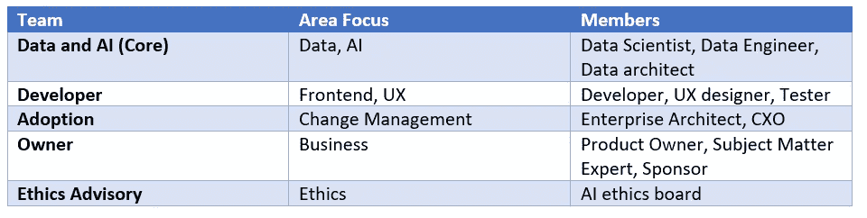
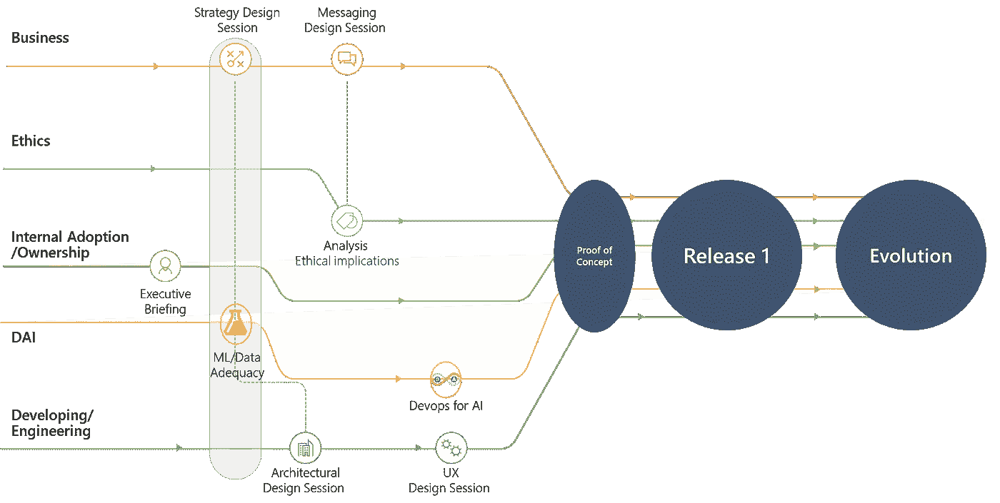

# 如何开发数据产品而不死尝试

> 原文：<https://towardsdatascience.com/how-to-develop-data-products-and-not-die-trying-762c8878d05c?source=collection_archive---------11----------------------->

*作者:*
[*大卫·弗洛雷斯·费尔南德斯*](https://medium.com/u/91cfb74fcedd?source=post_page-----762c8878d05c--------------------------------) *、数据与 AI 解决方案架构师@微软* [*巴勃罗·帕丽丝*](https://medium.com/u/c2f9a2467f89?source=post_page-----762c8878d05c--------------------------------) *、数字架构师@微软*

# 公司努力通过分析项目发展壮大

在当今数据积累的时代，全球渴望人工智能在各个层面的创新和商业应用。也许是时候停下来反思一下那种到处使用 AI 的燃烧欲望，并考虑一下“[乐器定律](https://en.wikipedia.org/wiki/Law_of_the_instrument)”:“如果你只有一把锤子，那么一切看起来都像钉子”。

***TL；DR:通过最后 10 个问题来评估你在构建数据产品方面有多擅长。***

有许多报告警告公司在业务中实施或采用人工智能时遇到的问题。Gartner 指出 60%的分析和 BI 项目失败了，后来认识到实际情况更糟。根据 Gartner 分析师 Nick Heudecker 的说法，Gartner 对 60%的估计“过于保守”。真正的失败率接近 85%。".因此，如果你正面临任何困难，请认为你并不孤独，如果你不是，请认为你可能错过了一次现实检查。根据我们与不同行业和国家的客户打交道的经验，公司最常遇到的情况可以总结如下:听起来耳熟吗？

1.**没有预算经验:**投资大，兴趣大，但没有开发高级数据和人工智能项目的经验，这意味着在取得任何结果之前都会浪费大量时间。

2.**不支持**:没有业务支持的公司。许多好的想法由于缺乏合适的利益相关者的暗示而被搁置。

3.目标明确但效率低下的团队发展:团队努力工作却一事无成，或者结果令公司失望。

4.雄心勃勃的公司:有预算，有时有无限的资源，但不担心技术限制。当试图将解决方案应用于大规模问题时，这种情况可能会导致挫折。

5.**缺少数据:**数据不完整或完全孤立。这些类型的公司需要首先投资建立和准备他们的数据系统，以便能够进入高级分析。我们还可以在这里包括数据质量的问题。这不是一个小问题。

6.**理论上的**:公司拥有优秀的分析团队，但不了解敏捷方法或数据科学，难以扩大规模或将模型投入生产。

7.**天真**:相信 ML 有魔力的公司。祝你好运！

# 我们如何避免主要的陷阱？

本文的目的是作为讨论的种子，并提出一种不同的方法来执行和理解高级分析在企业架构中的正确位置。

想想看，很多时候这些项目的完成方式基本上是使用一个目标很少与公司的优先事项一致的供应商。我们可以在多大程度上外包数据产品的开发？供应商试图开发最准确或最适合的模型，而不关注工作的潜在和最终目的，这种情况并不罕见，当然，这是有用的。他们有没有搞清楚准确率和 ROI 之间的关系？相关吗？部署了一个非常好的模型，但没有人能够将其转化为金钱、新收入或成本节约，这种情况并不少见。那么，我们是否部署了一个非常好的模型，但却毫无用处？或者相反，我们是否部署了一个非常糟糕的模型，它并不比特定数据集的随机模型好多少？一旦模型被部署，谁来照看它们？问题太多…

总结一下，这些是公司必须集中精力的基本部分:使用和适用性。一家公司计划使用数据和人工智能构建的任何东西都必须遵循开发产品的理念。公司必须像为客户创造新产品一样痴迷于他们的开发过程。要么让它盈利，要么抛弃它。

此外，一个为了 PoC 而参与 PoC 的公司，仅仅关注技术组件往往是一种不完整的努力，也可能导致失败，不仅因为模型或数据不好，还因为失去了业务方向。这就是为什么我们在这篇文章中提出的不是孤立的工作，而是以敏捷的方式开发一个产品的完整版本，虽然功能有限，但是需要所有利益相关者的参与。**软件世界中没有什么新东西，但显然还没有深入到那些创造数据驱动解决方案或产品的人的头脑中**。

# 为了构建一个数据产品，你需要什么？

希望在这个阶段，经验告诉我们的事情已经很清楚了:团队、方法和责任的清晰定义不应该被低估。这就是我们提出数据产品开发隔离策略的原因。在我们的下一篇文章中，我们将对此进行更深入的探讨。例如，每个工作流必须如何独立工作，以及所有团队如何在不造成混乱的情况下协作。同时，这是我们对团队、重点领域以及成员的建议:

Main team members and focus areas

同时，关于哪种方法更好还有很多可以讨论的，但是我们建议不要在选择完美的方法上浪费太多时间。应用的交付方法可以是你公司规定的任何方法:敏捷、团队数据科学过程、设计架构会议、设计思维、UX 设计，这里仅举几个例子。重要的一点是选择一种与您团队的技能相一致的方法，并关注最终的业务成果。

为了说明不同团队之间关系的复杂性，请参见下图，其中我们描述了实现完整 PoC 或功能发布的主要里程碑和依赖关系。

Workstrems involved in Data Product development

# 结论

我们只是触及了可能阻碍或减缓您的数据项目的表面原因，我们承认许多公司正在努力使他们的数据项目盈利或仅仅是有用，我们已经提出了一种组织不同工作流的方法。下一步是什么？

为什么不开始思考之前提到的五个主题以及你的公司是如何解决它们的:

1.方法学

2.数据

3.组

4.技术

5.商业导向

并向您的团队提出以下问题:

1.你的团队有能力在短时间内展示切实的成果吗？

2.这些结果与您的团队最初试图解决的业务问题直接相关吗？

3.与问题直接相关的业务人员能够建议参数配置吗？

4.技术在某种程度上影响了你的决定吗？例如，“我的团队觉得使用 SAS 很舒服，我们没有大数据，所以除此之外我们不需要任何其他技术。”

5.你的团队意识到你的模型的准确性和货币影响之间的关系了吗？例如，您的模型中 1%的准确性对您的业务目标有任何意义吗？

6.你能使用 3 个月前你尝试过的完全相同的数据集重新创建你的实验并比较结果吗？

7.你的团队使用任何源代码控制工具吗？有测试工具吗？除了笔记本之外还有其他工具吗？有人为你的团队写的代码做代码评审吗？

8.你能解释一下你的算法的结果吗，以防在现实世界中出错？例如，在给出信用的假阳性的情况下，你能向风险部门解释为什么吗？

9.你有将模型引入生产的流程吗？您能执行负载测试吗？性能测试？不停止服务就部署？

10.你的公司里有道德顾问的角色吗？法律部门了解您的数据产品吗？

如果你对这篇文章的内容感兴趣，请花几分钟时间回答这个表格，让我们知道你如何看待自己在开发数据产品。这是绝对匿名和保密的。

[链接到表单](https://forms.office.com/Pages/ResponsePage.aspx?id=DQSIkWdsW0yxEjajBLZtrQAAAAAAAAAAAAO__c2ubAtUMTdHNE5aMExFUU82M1M0Rk1LUFQ3RlVCTi4u)

# 参考资料:

[https://www . techrepublic . com/article/85-of-big-data-projects-fail-but-your-developers-can-help-yours-success/](https://www.techrepublic.com/article/85-of-big-data-projects-fail-but-your-developers-can-help-yours-succeed/)

[https://cdn . oreillystatic . com/en/assets/1/event/278/Agile % 20 for % 20 data % 20 science % 20 teams % 20 presentation . pdf](https://cdn.oreillystatic.com/en/assets/1/event/278/Agile%20for%20data%20science%20teams%20Presentation.pdf)

[https://hbr.org/2018/10/how-to-build-great-data-products](https://hbr.org/2018/10/how-to-build-great-data-products)