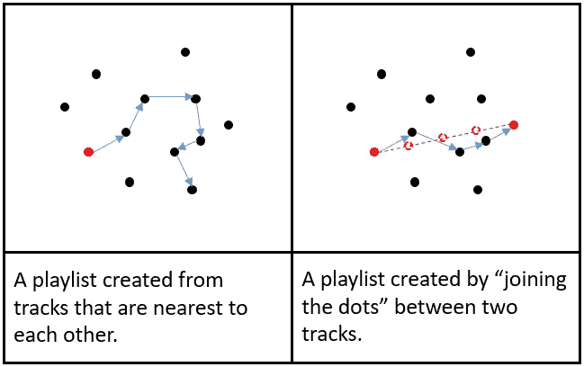

# 如何用人工智能发现 Spotify 上的新音乐

> 原文：<https://towardsdatascience.com/how-to-discover-new-music-on-spotify-with-artificial-intelligence-b2110af6a611?source=collection_archive---------7----------------------->

Photo by author

## 寻找你可能从未听说过的艺术家的类似音乐

## 更新:自己试试[这里](https://deej-ai.online)，这里

 [## deej-a . I .-Google Play 上的应用程序

### 使用人工智能发现新音乐，根据音乐的声音自动生成播放列表…

play.google.com](https://play.google.com/store/apps/details?id=online.deejai.www) 

或者这里:

https://apps.apple.com/us/app/deej-a-i/id1529860910?mt=8

作为一名 DJ，我最讨厌的问题是“你有什么[在此插入完全不合适的艺术家]？”“你听哪种*音乐？”。在我看来，一旦你把音乐放进一个流派的盒子里，它就会被它的限制所束缚。但是，如果不贴上标签，如何分享和组织音乐呢？*

Spotify 能够根据特定曲目创建播放列表(或“电台”)。它非常擅长选择相似艺术家的音乐，但是不可避免地，它倾向于播放你可能已经熟悉的音乐。也许这就是你想要的，但是如果你想要一些你从未听过的*新*音乐的推荐呢？在 MP3 发明之前的美好时光里，我会去伦敦皮卡迪利大街的果酱唱片店。奥利会*知道*我到底在找什么样的东西，而我会*在听了几秒钟后就立刻知道*我是否喜欢一首曲子……这么说吧，一大笔钱转手了。

毫无疑问，有大量的音乐是我不知道的，但是没有像奥利这样的人来帮助我，我怎么能找到它呢？我不想把音乐按类别分类，而是想出一种连续的方式来组织和探索它。我不是通过关于艺术家或歌曲的信息来寻找，而是通过歌曲听起来的方式来寻找相关的东西。如果你对我如何编写一个名为 Deej-A.I .的程序的技术细节感兴趣，在不使用任何标签或任何未公开可用的数据的情况下做到这一点，那么看看这篇[文章](/create-automatic-playlists-by-using-deep-learning-to-listen-to-the-music-b72836c24ce2)。

我在所有 Spotify 曲目上运行了我的程序，这些曲目(a)在播放列表中至少出现 10 次(截至 2018 年 10 月),并且(b)可以以 30 秒 MP3 样本的形式下载。这给了我两种关联 Spotify 歌曲的方法:一种是根据它们在播放列表中出现的接近程度，另一种是根据它们听起来的相似程度。第一种方式倾向于将相似艺术家的歌曲分组，而第二种方式将具有相似能量、情绪、节奏或乐器的歌曲放在一起。从技术上讲，这些被称为多维空间中的*嵌入*，其中一个轨道与另一个轨道的接近程度表示它们彼此有多相似。有趣的是:我们可以混合这两种关联音轨的方式，从而控制我们对发现类似音乐的开放程度，这些音乐可能来自我们从未听说过的艺术家。我将把这个混音参数称为*创意*，其中 0 表示由相似的艺术家创作，1 表示由相似的声音创作。

例如，如果我们让 Deej-A.I .根据 Luis Fonsi 的“ *Despacito* ”的声音生成一个播放列表(我应该说这是*而不是*我听的那种音乐:-)，那么我们会得到以下结果。

有趣的是，我们最终得到了一堆听起来非常相似的歌曲(自动调音的人声，毁灭的节奏等等)，但它们来自世界各地，使用各种不同的语言。也许这是你的事，我没资格评判。

随着新航的"*吊灯*"它挑选出一些惊人相似的声音歌曲，包括新航自己的一首。请记住，当创造力设置为 100%时，除了音乐听起来如何之外，没有什么可以继续。

如果我们给它一些更有挑战性的东西呢？顾名思义，“比蚊子的高音喇叭还恐怖”并不是妮娜·西蒙的典型特征。以下是 Spotify 给出的结果。

另一方面，Deej-A.I .因为它实际上是在听音乐，掌握时髦的非洲节奏，并提供更加连贯的播放列表。在这种情况下，我选择了 50%的创造力，以便获得类似艺术家的类似声音推荐。

# 将点连接起来

生成播放列表最明显的方法是添加与刚刚播放过的歌曲最接近的歌曲。正如你所看到的，这可以产生一个有趣但曲折的路径通过嵌入空间。如果你走得够久，你永远无法确定你会在哪里结束。

另一种方法是我称之为“连点”(这个术语是我从 DJ 吉勒斯·彼得森那里借来的)。您选择第一首和最后一首曲目，以及沿途您想要访问的任何其他曲目，播放列表将从最接近沿连接这些曲目的线等间距点的曲目中生成。换句话说，我们在尽可能接近的选定轨迹之间进行线性插值。这可能会导致一些有趣的结果，因为嵌入空间中的不同方向可能会以某种方式编码音乐的某些方面，如能量、人声的存在和速度等。当然，如果你计划举办一个聚会，你可以用它来开始一些放松的东西，然后通过一些众所周知的最爱，最后以室内音乐结束…

如果我们要求它制作一个播放列表，从*的《权力的游戏》*的主题音乐开始，到*的《维京人》*的主题音乐结束，我们看看它会得到什么。

如果我们尝试一些不同的流派呢？这是我之前做的一个播放列表，从迪斯科屋到电子乐，有 50%的创意。

如果你有灵感(并且有一个谷歌账户)，你可以自己试一试。只需点击下面的链接，在“沙盒模式”下打开，连接到一台机器，然后按下播放按钮。

 [## 谷歌联合实验室

### 编辑描述

colab.research.google.com](https://colab.research.google.com/github/teticio/Deej-A.I./blob/master/Spotify_Discovery.ipynb) 

如果你想出了一个有趣的播放列表，请在评论中加入链接。快乐聆听！