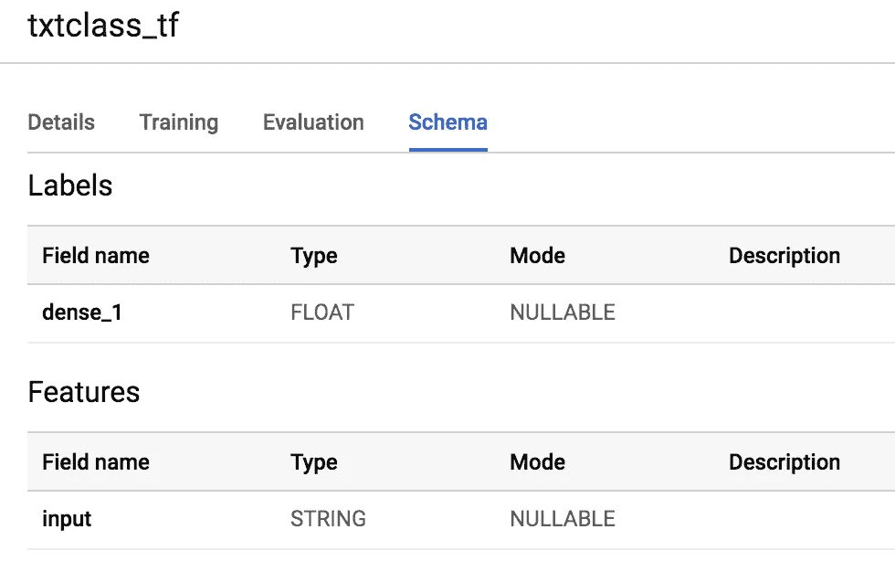
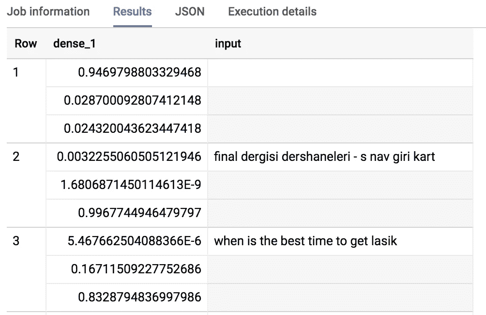
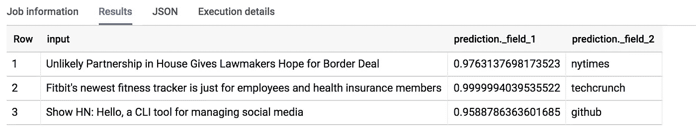

# 如何在 BigQuery 中直接批量预测张量流模型

> 原文：<https://towardsdatascience.com/how-to-do-batch-predictions-of-tensorflow-models-directly-in-bigquery-ffa843ebdba6?source=collection_archive---------23----------------------->

## BigQuery ML 现在支持 TensorFlow SavedModel

如果您已经在 TensorFlow 中训练了一个模型，并将其导出为 SavedModel，那么您现在可以使用 ML。BigQuery 中的 PREDICT SQL 函数进行预测。如果您想要进行批量预测(例如，对过去一小时收集的所有数据进行预测)，这非常有用，因为任何 SQL 查询都可以在 BigQuery 中调度。

步骤:

*   在 TensorFlow 中训练和导出保存的模型
*   在 BigQuery 中，创建一个模型，传递保存的模型的位置
*   用 ML。评估，ML。预测等。就像在 BigQuery 中使用其他(内置)模型类型训练模型一样。

*注意:该功能目前处于公开测试阶段。联系您的 GCP 代表获得白名单。*


## 1.在 TensorFlow/Keras 中训练和导出保存的模型

我将使用我在这篇博文中描述的[文本分类模型](/how-to-do-text-classification-using-tensorflow-word-embeddings-and-cnn-edae13b3e575)进行演示，其 Keras 代码在 [GitHub](https://github.com/GoogleCloudPlatform/training-data-analyst/tree/master/courses/machine_learning/deepdive/09_sequence/txtclsmodel) 上。我在 Cloud ML 引擎上训练模型，但你可以在任何地方以任何方式训练它。重要的一点是将模型作为保存的模型导出到 Google 云存储中:

```
exporter = tf.estimator.LatestExporter('exporter', serving_input_fn)
```

## 2.创建模型

在 BigQuery 中创建模型只需指定一个不同的 model_type，并将其指向导出 SavedModel 的 model_path(注意末尾的通配符，用于选择资产、词汇等)。):

```
CREATE OR REPLACE MODEL advdata.txtclass_tf
OPTIONS (**model_type='tensorflow',**
         **model_path=**'gs://cloud-training-demos/txtclass/export/exporter/1549825580/*')
```

我已经将上面的 bucket 设置为 public，所以您可以按原样尝试上面的查询(首先创建一个名为 advdata 的数据集)。这将在 BigQuery 中创建一个模型，其工作方式类似于任何内置模型:



特别是，该模式指出模型所需的输入称为“输入”,并且是一个字符串。

## 3.用模型预测

用模型预测非常简单。例如，我们可以从 BigQuery 表中提取一些数据，并确保在 select 中，我们根据 TensorFlow 的要求来命名列。在这种情况下，我的 TensorFlow 模型的 serving_input_fn 指定该模型需要一个名为“input”的输入字符串。

鉴于此，我们现在可以做一个预测:

```
WITH extracted AS (
SELECT source, REGEXP_REPLACE(LOWER(REGEXP_REPLACE(title, '[^a-zA-Z0-9 $.-]', ' ')), "  ", " ") AS title FROM
  (SELECT
    ARRAY_REVERSE(SPLIT(REGEXP_EXTRACT(url, '.*://(.[^/]+)/'), '.'))[OFFSET(1)] AS source,
    title
  FROM
    `bigquery-public-data.hacker_news.stories`
  WHERE
    REGEXP_CONTAINS(REGEXP_EXTRACT(url, '.*://(.[^/]+)/'), '.com$')
    AND LENGTH(title) > 10
  )
)
, input_data AS (
  SELECT title AS input FROM extracted limit 5
)SELECT *
FROM ML.PREDICT(MODEL advdata.txtclass_tf, 
               (SELECT * FROM input_data))
```

这提供了结果:



知道了实际的标签，我们可以使实际的查询更好:

```
SELECT
  input,
  (SELECT AS STRUCT(p, ['github', 'nytimes', 'techcrunch'][ORDINAL(s)]) prediction FROM
    (SELECT p, ROW_NUMBER() OVER() AS s FROM
      (SELECT * FROM UNNEST(dense_1) AS p)) 
  ORDER BY p DESC LIMIT 1).*FROM ML.PREDICT(MODEL advdata.txtclass_tf,
(
SELECT 'Unlikely Partnership in House Gives Lawmakers Hope for Border Deal' AS input
UNION ALL SELECT "Fitbit\'s newest fitness tracker is just for employees and health insurance members"
UNION ALL SELECT "Show HN: Hello, a CLI tool for managing social media"
))
```

请注意，这个函数直接在 SQL 中提供值。结果是:



就是这样！