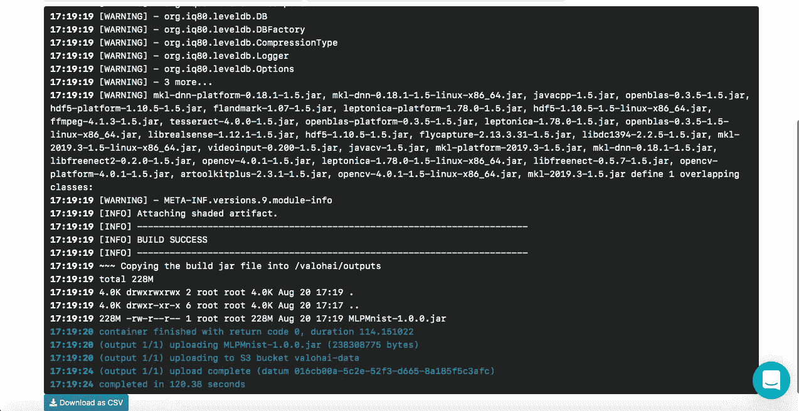
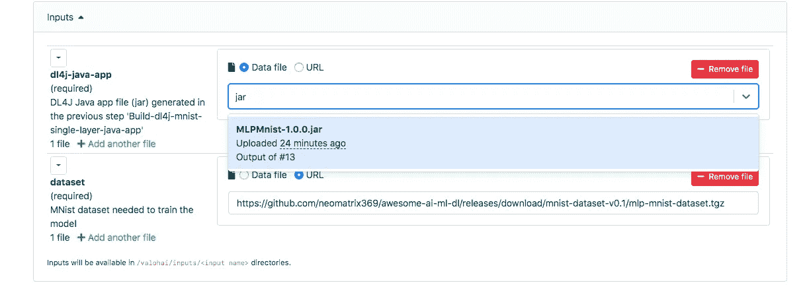
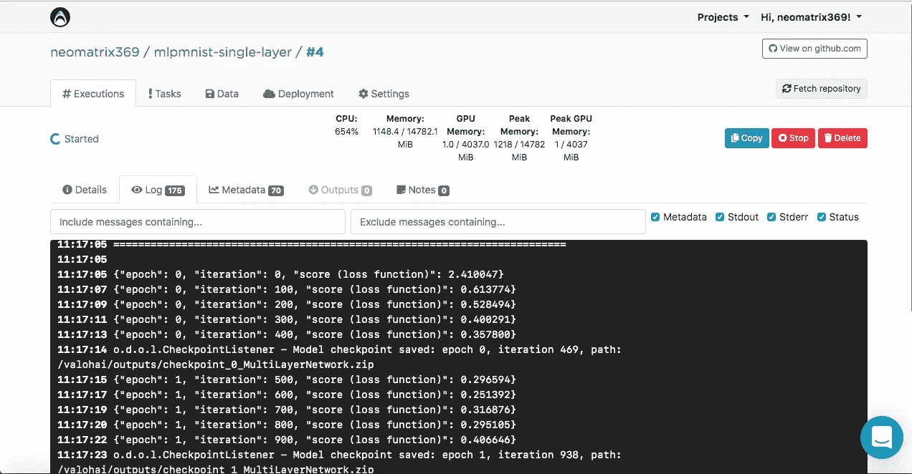
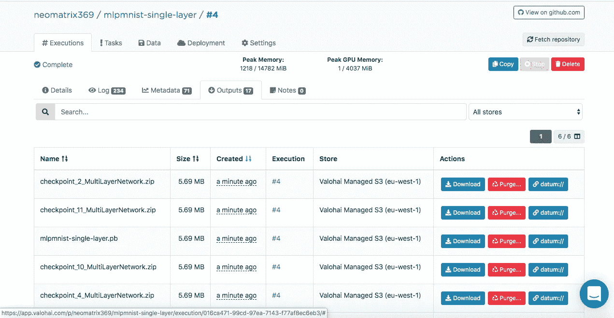
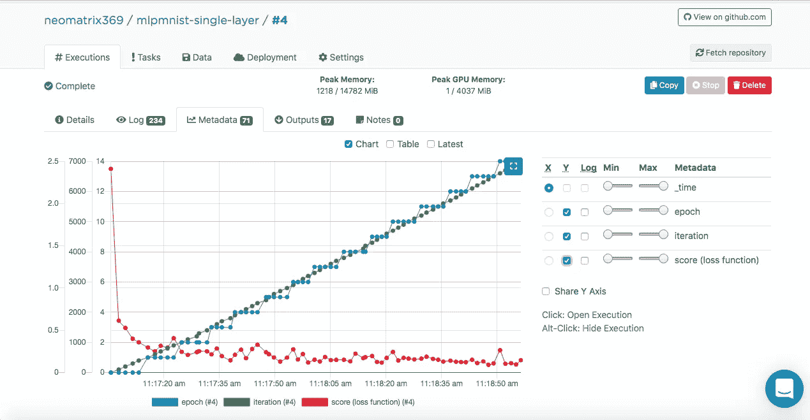
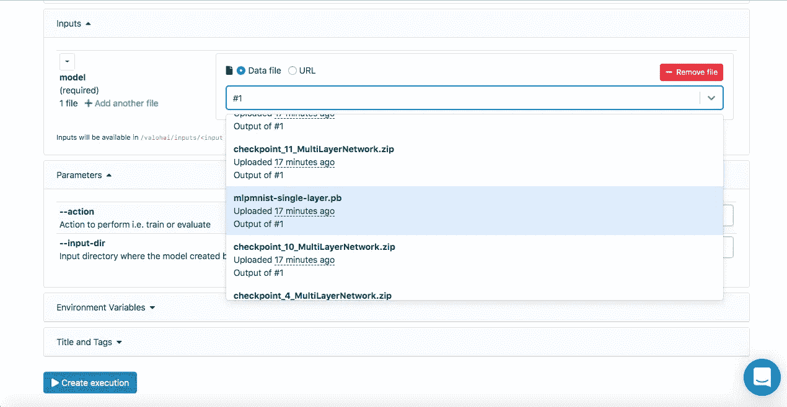
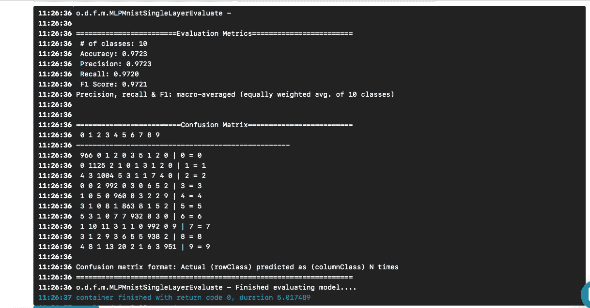
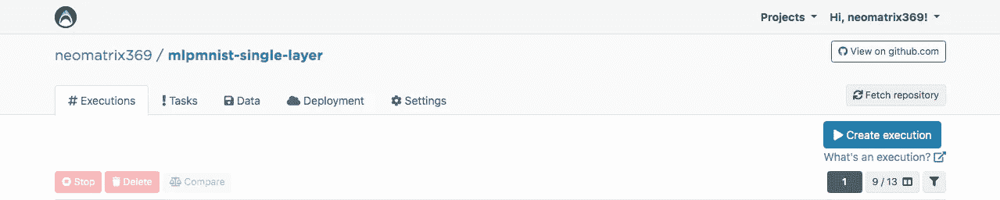

# 如何做 Java 的深度学习？

> 原文：<https://towardsdatascience.com/how-to-do-deep-learning-for-java-on-the-valohai-platform-eec8ba9f71d8?source=collection_archive---------17----------------------->


[*Image*](https://unsplash.com/photos/jEqyV_rumuU) *source (unsplash) via* [Praveen Thotagamuwa](https://unsplash.com/@biscket)

# 介绍

不久前，我偶然发现了这款名为 [Valohai](https://valohai.com/) 的生命周期管理工具(或云服务),它的用户界面以及简单的设计和布局给我留下了深刻的印象。我和 [Valohai](https://valohai.com/) 的一名成员就当时的服务聊得很开心，并得到了一个演示。在此之前，我已经使用 [GNU Parallel](https://www.gnu.org/software/parallel/) 、JavaScript、Python 和 Bash 编写了一个简单的管道——另外一个完全使用了 [GNU Parallel](https://www.gnu.org/software/parallel/) 和 Bash。我也想过用现成的任务/工作流管理工具(如 Jenkins X、Jenkins Pipeline、Concourse 或 Airflow)替换移动部件，但由于各种原因，我没有继续这个想法。

回到我们最初的对话，我注意到许多关于 [Valohai](https://valohai.com/) 的例子和文档都是基于 Python、R 以及各自的框架和库。缺乏基于 Java/JVM 的例子或文档。所以我借此机会做了些事情。

[Valohai](https://valohai.com/) 鼓励我使用著名的 Java 库[DL4J——Java 的深度学习](https://deeplearning4j.org/)来实现一些东西。

在了解了 Valohai 的设计、布局和工作流程后，我对它的初步体验已经给了我很好的印象。它是开发者友好的，并且制作者已经考虑了开发者和基础设施工作流程的各个方面。在我们的世界中，后者主要由开发人员或系统运行团队运行，我们知道其中的细微差别和棘手问题。你可以从网站的[功能区](https://valohai.com/features/)找到更多关于它的功能。

**Achtung！**只是想让你知道，从这里开始，这篇文章将更具技术性，可能包含代码片段，并提到深度学习/机器学习和基础设施相关的术语。

# 我们需要什么，如何需要？

对于任何机器学习或深度学习项目或倡议，目前两个重要的组件(从高级别角度来看)是代码，它们将创建并服务于整个生命周期将在其中执行的模型和基础设施。

当然，在上述之前、期间和之后都需要一些步骤和组件，但是为了简单起见，我们假设需要代码和基础设施。

**代码**

对于代码，我选择了一个使用 DL4J 的修改示例，它是一个 [MNist 项目](https://en.wikipedia.org/wiki/MNIST_database)，有 60，000 个图像的训练集和 10，000 个手写数字图像的测试集。这个数据集可以通过 DL4J 库获得(就像 [Keras](https://keras.io/) 提供了它们的库存一样)。在 [DL4J Cheatsheet](https://deeplearning4j.org/docs/latest/deeplearning4j-cheat-sheet) 中的 [DatasetIterators](https://github.com/eclipse/deeplearning4j/blob/master/nd4j/nd4j-backends/nd4j-api-parent/nd4j-api/src/main/java/org/nd4j/linalg/dataset/api/iterator/DataSetIterator.java) 下查找 [MnistDataSetIterator](https://github.com/eclipse/deeplearning4j/blob/master/deeplearning4j/deeplearning4j-data/deeplearning4j-datasets/src/main/java/org/deeplearning4j/datasets/iterator/impl/MnistDataSetIterator.java) ，以获得关于该特定数据集的更多详细信息。

在开始之前看看我们将使用的源代码，主要的 Java 类叫做 [org.deeplearning4j .前馈. mnist . mlpmnissinglerayerrunner](https://github.com/neomatrix369/awesome-ai-ml-dl/blob/master/examples/cloud-devops-infra/valohai/MLPMnist/src/main/java/org/deeplearning4j/feedforward/mnist/MLPMnistSingleLayerRunner.java)。

**基础设施**

现在很明显，我们已经决定使用 [Valohai](https://valohai.com/) 作为我们运行实验(模型的训练和评估)的基础设施来测试 Java 示例。 [Valohai](https://valohai.com/) 识别 git 库并直接挂钩到它们，允许执行我们的代码，而不管平台或语言如何——我们将看到这是如何工作的。这也意味着，如果你是 GitOps 或基础设施即代码的坚定支持者，你会喜欢这个工作流。

为此，我们只需要一个在 [Valohai](https://valohai.com/) 上的账户，我们可以利用一个[自由层账户](https://valohai.com/pricing/)，当我们[注册](https://app.valohai.com/accounts/signup/)时，可以访问各种配置的几个实例。更多详细信息，请参见[计划和定价](https://valohai.com/pricing/)下的自由层和对比图表。对于我们想做的，免费层是绰绰有余了。

# Java 和 Valohai 的深度学习

正如我们所同意的，我们将使用这两种技术来实现我们的目标，即训练一个单层模型并对其进行评估，以及查看在 [Valohai](https://valohai.com/) 上的端到端体验。

我们将把必要的构建和运行时依赖项捆绑到 Docker 映像中，并使用它来构建我们的 Java 应用程序，训练一个模型，并通过一个简单的 [valohai.yaml](https://github.com/valohai/mlpmnist-dl4j-example/blob/master/valohai.yaml) 文件在 [Valohai](https://valohai.com/) 平台上对其进行评估，该文件位于项目存储库的根文件夹中。

# 面向 Java 的深度学习:DL4J

简单的部分是，我们在这里不需要做太多，只需构建 jar 并将数据集下载到 Docker 容器中。我们有一个预构建的 Docker 映像，其中包含构建 Java 应用程序所需的所有依赖项。我们已经将此图像推送到 [Docker Hub](https://hub.docker.com/) ，您可以通过搜索[dl4j-mnist-single-layer](https://hub.docker.com/r/neomatrix369/dl4j-mnist-single-layer)找到它(我们将使用 YAML 文件中定义的特定标签)。我们已经选择使用 [GraalVM 19.1.1](https://github.com/oracle/graal) 作为这个项目的 Java 构建和运行时，因此它被嵌入到 Docker 映像中(关于 Docker 映像的定义，请参见 [Dockerfile](https://github.com/valohai/mlpmnist-dl4j-example/blob/master/Dockerfile) )。要了解更多关于 GraalVM 的信息，请查看 graalvm.org 官方网站的资源。

**编排**

当从命令行调用 uber jar 时，我们进入`MLPMnistSingleLayerRunner`类，该类根据传入的参数将我们导向预期的操作:

传递给 uber jar 的参数由该类接收，并由`execute()`方法处理。

我们可以通过`--action train`参数创建一个模型，并通过分别传递给 Java 应用程序(uber jar)的`--action evaluate`参数评估创建的模型。

完成这项工作的 Java 应用程序的主要部分可以在下面提到的两个 Java 类中找到。

**训练一个模型**

可以通过以下方式从命令行调用:

这将在由执行开始时传入的`--output-dir`指定的文件夹中创建名为`mlpmnist-single-layer.pb`的模型(当成功时，在执行结束时)。从 [Valohai](https://valohai.com/) 的角度来看，应该是放入我们做的${VH_OUTPUTS_DIR}中(见 [valohai.yaml](https://github.com/valohai/mlpmnist-dl4j-example/blob/master/valohai.yaml) 文件)。

有关源代码，请参见类[MLPMNistSingleLayerTrain.java](https://github.com/valohai/mlpmnist-dl4j-example/blob/master/src/main/java/org/deeplearning4j/feedforward/mnist/MLPMnistSingleLayerTrain.java)。

**评估模型**

可以通过以下方式从命令行调用:

这期望一个名为`mlpmnist-single-layer.pb`的模型(由训练步骤创建)出现在调用应用程序时由传入的`--input-dir`指定的文件夹中。

有关源代码，请参见 MLPMNistSingleLayerEvaluate.java 类。

我希望这个简短的插图能够清楚地说明训练和评估模型的 Java 应用程序一般是如何工作的。

这就是我们所需要的，但是请随意使用其余的[源](https://github.com/valohai/mlpmnist-dl4j-example)(以及 [README.md](https://github.com/valohai/mlpmnist-dl4j-example#mlpmnist-dl4j-example-mlpmnist-single-layer-) 和 bash 脚本)来满足您的好奇心和理解这是如何完成的！关于如何使用 DL4J 的更多资源已在帖子末尾的**资源**部分提供。

# 瓦罗海

作为一个平台，Valohai 允许我们松散地耦合我们的运行时环境、代码和数据集，正如你从下面 YAML 文件的结构中看到的。这样，不同的组件可以独立发展，而不会互相妨碍或依赖。因此，我们的 Docker 容器只包含构建和运行时组件。在执行时，我们在 Docker 容器中构建 uber jar，将其上传到一些内部或外部存储，然后通过另一个执行步骤从存储(或另一个位置)下载 uber jar 和数据集来运行训练。这样，两个执行步骤是分离的；例如，我们可以构建一次 jar，然后在同一个 jar 上运行数百个训练步骤。由于构建和运行时环境不应该经常改变，我们可以缓存它们，代码、数据集和模型源可以在执行时动态可用。

[**valohai.yaml**](https://docs.valohai.com/valohai-yaml/index.html)

将我们的 Java 项目与 [Valohai](https://valohai.com/) 基础设施集成的核心是定义[执行](https://docs.valohai.com/core-concepts/executions.html)项目文件夹根目录下 [valohai.yaml](https://docs.valohai.com/valohai-yaml/index.html) 文件中的步骤的步骤。我们的 [valohai.yaml](https://github.com/valohai/mlpmnist-dl4j-example/blob/master/valohai.yaml) 长这样:

**Build-dl4j-mnist-单层-java-app** 步骤说明

从 YAML 文件中，我们可以看到，我们首先使用 Docker 映像来定义这一步，然后运行构建脚本来构建 uber jar。我们的 docker 映像具有构建环境依赖项设置(即 GraalVM JDK、Maven 等)来构建 Java 应用程序。我们不指定任何输入或参数，因为这是构建步骤。一旦构建成功，我们希望将名为`MLPMnist-1.0.0-bin.jar`(原始名称)的 uber jar 复制到`/valohai/outputs`文件夹(由`${VH_OUTPUTS_DIR}`表示)。该文件夹中的所有内容都会自动保存在项目的存储中，例如 AWS S3 存储桶。最后，我们定义要在 AWS 环境中运行的作业。

注意:*[*valo hai*](https://valohai.com/)*自由层不能从 Docker 容器内部进行网络访问(默认情况下这是禁用的)，请联系支持人员启用此选项(我也必须这样做)，否则我们将无法在构建期间下载 Maven 和其他依赖项。**

***步骤运行-dl4j-mnist-单层列车-模型**的说明*

*定义的语义与上一步类似，只是我们指定了两个输入，一个用于 uber jar ( `MLPMnist-1.0.0.jar`)，另一个用于 dataset(将被解压到`${HOME}/.deeplearning4j`文件夹中)。我们将传递两个参数`--action train`和`--output-dir /valohai/outputs`。从该步骤创建的模型被收集到`/valohai/outputs/model`文件夹中(由`${VH_OUTPUTS_DIR}/model`表示)。*

*注意:*在 Valohai Web UI 的 Executions 选项卡的输入字段中，除了使用 datum://或 http:// URLs 之外，我们还可以使用执行编号，即* `*#1*` *或* `*#2*` *来选择以前执行的输出。键入文件名的几个字母也有助于搜索整个列表。**

***步骤运行-dl4j-mnist-单层评估-模型**的说明*

*同样，这一步类似于上一步，除了我们将传入两个参数`--action evaluate`和`--input-dir /valohai/inputs/model`。此外，我们再次指定了在 YAML 文件中定义的两个`inputs:`部分，称为`dl4j-java-app`和`model`，它们都没有设置`default`。这将允许我们使用 web 界面选择 uber jar 和我们希望评估的模型——它是通过步骤**Run-dl4j-mnist-single-layer-train-model**创建的。*

*希望这解释了上述定义文件中的步骤，但如果您需要进一步的帮助，请不要犹豫，看看[文档](https://docs.valohai.com/index.html)和[教程](https://docs.valohai.com/tutorials/index.html)。*

*一旦我们有了一个帐户，我们就可以[登录](https://app.valohai.com/accounts/login/)并继续创建一个名为`mlpmnist-single-layer`的项目，将 git repo[https://github.com/valohai/mlpmnist-dl4j-example](https://github.com/valohai/mlpmnist-dl4j-example)链接到该项目并保存该项目，快速浏览教程以了解[如何使用 web 界面](https://docs.valohai.com/tutorials/index.html)创建项目。*

*现在您可以执行一个步骤，看看结果如何！*

## *构建 DL4J Java 应用程序步骤*

*转到 web 界面中的**执行**选项卡，使用**【创建执行】**按钮复制一个现有的或创建一个新的执行，所有必要的默认选项将被填充，选择步骤**Build-dl4j-mnist-single-layer-Java-app。***

*对于*环境*，我将选择 *AWS eu-west-1 g2.2xlarge* ，并单击页面底部的**【创建执行】**按钮，以查看执行开始。*

**

## *训练模型步骤*

*进入 web 界面的**执行**页签，与上一步相同，选择步骤**运行-dl4j-mnist-单层-列车-模型**。您必须选择在上一步中构建的 Java 应用程序(只需在字段中键入 jar ),数据集已经通过 **valohai.yaml** 文件预先填充:*

**

*点击**【创建执行】**开始此步骤。*

**

*您将在日志控制台中看到模型摘要:*

*在执行期间和结束时，可以在**执行**主选项卡的**输出**子选项卡下找到创建的模型:*

**

*您可能已经注意到了**输出**子选项卡中的几个工件。这是因为我们在每个时期结束时都会保存一个检查点！在执行日志中注意这些:*

*检查点 zip 包含模型训练在该点的状态，保存在以下三个文件中:*

***训练模型>元数据***

*您可能已经注意到这些符号在执行日志中飞快地闪过:*

*这些符号触发 [Valohai](https://valohai.com/) 拾取这些值(以 JSON 格式),用于绘制执行指标，在执行期间和执行之后，可以在**执行**主选项卡中的**元数据**子选项卡下看到这些值:*

**

*我们能够通过将一个监听器类(名为 [ValohaiMetadataCreator](https://github.com/neomatrix369/awesome-ai-ml-dl/blob/master/examples/cloud-devops-infra/valohai/MLPMnist/src/main/java/org/deeplearning4j/feedforward/mnist/ValohaiMetadataCreator.java) )挂接到模型中来做到这一点，这样在训练期间，注意力会在每次迭代结束时传递给这个监听器类。在这个类的例子中，我们打印了**历元计数**、**迭代计数**和**分数(损失函数值)**，下面是这个类的代码片段:*

## *评估模型步骤*

*一旦通过前面的步骤成功地创建了模型，我们就可以开始评估它了。我们像前面一样创建一个新的执行，但是这次选择**Run-dl4j-mnist-single-layer-evaluate-model**步骤。在开始执行之前，我们需要再次选择 Java 应用程序( **MLPMnist-1.0.0.jar** )和创建的模型(**MLPMnist-single-layer . Pb**)(如下所示):*

**

*选择所需的模型作为输入后，点击**【创建执行】**按钮。这是一个比前一个更快的执行步骤，我们将看到以下输出:*

**

*模型分析后的**评估指标**和**混淆矩阵**将显示在控制台日志中。*

*我们可以看到，我们的培训活动已经产生了基于测试数据集的接近 **97%** 准确度*的模型。混淆矩阵有助于指出一个数字被错误地预测为另一个数字的情况。也许这对模型的创建者和数据集的维护者来说是一个很好的反馈，可以做一些进一步的研究。**

*问题依然存在(不在本文讨论范围之内)——当面对*真实世界的数据*时，模型有多好？*

*CLI 工具很容易安装和使用，参见[命令行用法](https://docs.valohai.com/valohai-cli/installation.html?highlight=cli)。*

*如果您还没有克隆 git 存储库，那么应该这样做:*

```
*$ git clone [https://github.com/valohai/mlpmnist-dl4j-example](https://github.com/valohai/mlpmnist-dl4j-example)*
```

*然后，我们需要将通过上一节中的 web 界面创建的 [Valohai](https://valohai.com/) 项目链接到存储在本地机器上的项目(我们刚刚克隆的项目)。为此，请运行以下命令:*

*您将看到类似这样的内容:*

*选择 1(或适合您的选项),您应该会看到以下消息:*

*`😁 Success! Linked /path/to/mlpmnist-dl4j-example to mlpmnist-single-layer.`*

*使用 CLI 工具了解所有 CLI 选项的最快方法是:*

```
*$ vh — help*
```

*还有一件事，在继续之前，确保你的 [Valohai](https://valohai.com/) 项目与最新的 git 项目同步，通过这样做:*

```
*$ vh project fetch*
```

**

*(在 web 界面的右上方，显示有两个指向彼此的箭头图标)。*

*现在，我们可以使用以下命令从 CLI 执行这些步骤:*

```
*$ vh exec run Build-dl4j-mnist-single-layer-java-app*
```

*一旦执行开始，我们可以通过以下方式检查和监控它:*

*我们还可以同时通过 web 界面看到上述更新。*

*关于如何使用 [Valohai](https://valohai.com/) 的更多资源已在本文末尾的参考资料部分提供，还有一些关于如何使用 CLI 工具的博客文章，请参见[【1】](https://blog.valohai.com/from-zero-to-hero-with-valohai-cli)|[【2】](https://blog.valohai.com/from-zero-to-hero-with-valohai-part-2)。*

# *结论*

*如你所见，DL4J 和 T21 单独或组合使用都很容易上手。此外，我们可以在组成我们实验的不同组件上进行开发，即构建/运行时环境、代码和数据集，并以松散耦合的方式将它们集成到执行中。*

*本文中使用的模板示例是开始构建更复杂项目的好方法。您可以使用 web 界面或 CLI 通过 [Valohai](https://valohai.com/) 完成您的工作！使用 CLI，您还可以将其与您的设置和脚本集成(甚至与 CRON 或 CI/CD 作业集成)。*

*此外，很明显，如果我在从事一个 AI/ML/DL 相关的项目*，我就不需要关心创建和维护*一个端到端的管道(过去许多其他人和我不得不这么做)——这要感谢 [Valohai](https://valohai.com/) 的人们所做的出色工作。*

**感谢*[*sky mind*](https://skymind.ai/)*(背后的启动*[*DL4J*](https://deeplearning4j.org/)*，用于创建、维护和保持免费)和*[*valo hai*](https://valohai.com/)*让这个工具和云服务可以免费和商业使用。**

*请在下面的评论中留言或者发微博告诉我这是否有帮助，我也欢迎反馈。*

# *资源*

*   *[mlpmnist-dl4j-GitHub 上的示例项目](https://github.com/valohai/mlpmnist-dl4j-example)*
*   *[牛逼的 AI/ML/DL 资源](https://github.com/neomatrix369/awesome-ai-ml-dl/)*
*   *[Java AI/ML/DL 资源](https://github.com/neomatrix369/awesome-ai-ml-dl/blob/master/README-details.md#java)*
*   *[深度学习和 DL4J 资源](https://github.com/neomatrix369/awesome-ai-ml-dl/blob/master/README-details.md#deep-learning)*

***其他 DL4J 资源***

*损失函数*

*   *[DL4J 的损失功能接口](https://deeplearning4j.org/api/latest/org/nd4j/linalg/lossfunctions/ILossFunction.html)*
*   *[所有机器学习者都应该知道的 5 个回归损失函数](https://heartbeat.fritz.ai/5-regression-loss-functions-all-machine-learners-should-know-4fb140e9d4b0)*

*估价*

*   *[https://deep learning 4j . org/docs/latest/deep learning 4j-nn-evaluation](https://deeplearning4j.org/docs/latest/deeplearning4j-nn-evaluation)*

***瓦罗海资源***

*   *[瓦罗海](https://valohai.com/) | [文档](https://docs.valohai.com/) | [博客](https://blog.valohai.com/) | [GitHub](https://github.com/valohai) | [视频](https://www.youtube.com/channel/UCiR8Fpv6jRNphaZ99PnIuFg) | [展柜](https://valohai.com/showcase/) | [关于瓦罗海](https://github.com/neomatrix369/awesome-ai-ml-dl/blob/master/data/about-Valohai.md#valohai) | [懈怠](http://community-slack.valohai.com/)|[@瓦罗海](http://twitter.com/valohaiai)*
*   *关于如何使用 CLI 工具的博文:[【1】](https://blog.valohai.com/from-zero-to-hero-with-valohai-cli)|[【2】](https://blog.valohai.com/from-zero-to-hero-with-valohai-part-2)*

***其他资源***

*   *[牛逼的 Graal](https://github.com/neomatrix369/awesome-graal)|[graalvm.org](https://www.graalvm.org/)*

# *最初发表于 https://blog.valohai.com。*