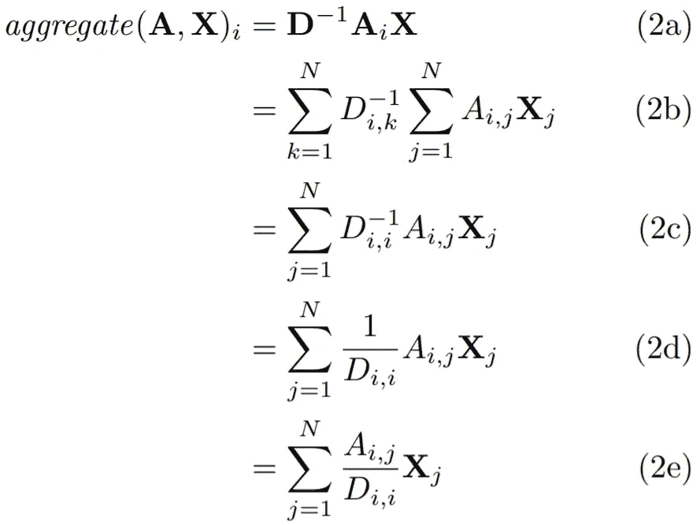

# 如何用图卷积网络在图上做深度学习

> 原文：<https://towardsdatascience.com/how-to-do-deep-learning-on-graphs-with-graph-convolutional-networks-62acf5b143d0?source=collection_archive---------1----------------------->

## 第 2 部分:谱图卷积的半监督学习

图的机器学习是一项困难的任务，因为图的结构非常复杂，但也能提供丰富的信息。本文是关于如何使用图形卷积网络(GCNs)对图形进行深度学习的系列文章中的第二篇，GCNs 是一种强大的神经网络，旨在直接对图形进行处理并利用其结构信息。我将对上一篇文章做一个简要的回顾，但是你可以在这里找到这个系列的其他部分:

1.  [图卷积网络的高级介绍](/how-to-do-deep-learning-on-graphs-with-graph-convolutional-networks-7d2250723780)
2.  谱图卷积的半监督学习(this)

在上一篇文章中，我对 GCNs 进行了高层次的介绍，并展示了如何根据相邻节点的表示来更新节点的表示。在这篇文章中，我们首先深入了解在上一篇文章中讨论的相当简单的图卷积中执行的聚合。然后我们继续讨论最近发布的图卷积传播规则，我展示了如何在小型社交网络 Zachary's 空手道俱乐部的社区预测任务中实现和使用它进行[半监督学习](https://en.wikipedia.org/wiki/Semi-supervised_learning)。如下所示，GCN 能够学习每个节点的潜在特征表示，该潜在特征表示将两个社区分成两个合理内聚和分离的聚类，尽管每个社区仅使用一个训练示例。


Latent node representations of Zachary’s Karate Club in a GCN at each training epoch.

# 简要回顾

在我上一篇关于 GCNs 的文章中，我们看到了一个简单的数学框架来表达 GCNs 中的传播。简而言之，给定一个 *N × F⁰* 特征矩阵**t5】x和一个图结构的矩阵表示，例如 *G* 的 *N* × *N* 邻接矩阵 ***A*** ，GCN 中的每一个隐层可以表示为***hⁱ****= f(*【t24) ***a****)*其中***h****⁰=****x***和 *f* 是一个传播规则。 每层 ***Hⁱ*** 对应一个*n*×*f****ⁱ***特征矩阵，其中每一行都是一个节点的特征表示。**

我们看到了以下形式的传播规则

1.  *f(****hⁱ****，****a****)=σ(****ahⁱwⁱ****)，*和
2.  *f(***，****a****)=σ(****d****⁻****âhⁱwⁱ****)*凡*

**这些规则在通过应用权重***【wⁱ***和激活函数 *σ* 进行变换之前，将节点的特征表示计算为其邻居 的特征表示的集合。我们可以通过将上面的传播规则 1 和 2 表示为*f(****hⁱ****，****a****)= transform(aggregate(****【a,hⁱ****)，****wⁱ****)其中 **)****=****【σ】(****mwⁱ****)*和*合计(***)=****ahⁱ********

**正如我们在上一篇文章中所讨论的，规则 1 中的聚合将结点表示为其相邻要素表示的总和，这有两个明显的缺点:**

*   **节点的聚集表示不包括它自己的特征，并且**
*   **度数较大的结点在其要素制图表达中将具有较大的值，而度数较小的结点将具有较小的值，这可能会导致梯度爆炸的问题，并使得使用对要素缩放敏感的随机梯度下降等算法进行训练变得更加困难。**

**为了解决这两个问题，规则 2 首先通过将单位矩阵添加到*来实施自循环，并使用转换后的邻接矩阵***= A****+****I***进行聚合。接下来，通过与逆度矩阵***d****⁻*相乘来归一化特征表示，将集合变成平均值，其中集合的特征表示的比例对于节点度是不变的。***

**在下文中，我将把规则 1 称为*求和规则*，把规则 2 称为平均规则。**

# **光谱图卷积**

**Kipf 和 Welling 最近的一篇论文提出了使用光谱传播规则的快速近似光谱图卷积[1]:**

****

**与上一篇文章中讨论的求和规则和均值规则相比，谱规则的不同之处仅在于聚合函数的选择。虽然它有点类似于均值规则，因为它使用度数矩阵 ***D*** 的负幂来标准化聚集，但是标准化是不对称的。让我们试一试，看看它能做什么。**

## **作为加权和的聚合**

**我们可以将我到目前为止介绍的聚合函数理解为加权和，其中每个聚合规则的不同之处仅在于它们对权重的选择。在继续讨论谱规则之前，我们首先来看看如何将相对简单的和与平均规则表达为加权和。**

****求和规则** 为了了解如何使用求和规则计算第 *i* 个节点的集合特征表示，我们来看看如何计算集合中的第 *i* 行。**

****

**The Sum Rule as a Weighted Sum**

**如以上等式 1a 所示，我们可以将第 *i* 个节点的集合特征表示计算为向量矩阵乘积。我们可以将这个向量矩阵乘积公式化为一个简单的加权和，如等式 1b 所示，其中我们对 ***X*** 中的 *N* 行中的每一行求和。**

**等式 1b 中聚集的第 *j* 个节点的贡献由第 ***A*** 的第 *i* 行的第 *j* 列的值确定。由于*是邻接矩阵，如果第 *j* 个节点是第 *i* 个节点的邻居，则该值为 1，否则为 0。因此，等式 1b 对应于对第 *i* 个节点的邻居的特征表示求和。这证实了前一篇文章中的非正式观察。***

**总之，每个邻居的贡献仅取决于由邻接矩阵*定义的邻居。***

*****平均值规则** 为了查看平均值规则如何聚合节点表示，我们再次查看如何计算聚合中的第 *i* 行，现在使用平均值规则。为了简单起见，我们只考虑“原始”邻接矩阵上的平均规则，而不考虑*和单位矩阵 ***I*** 之间的加法，这简单地对应于将自循环添加到图中。****

****

**The Mean Rule as a Weighted Sum**

**从上面的等式中可以看出，现在求导的时间稍微长了一点。在等式 2a 中，我们现在首先通过将邻接矩阵 ***A*** 乘以度矩阵 ***D*** 的逆矩阵来对其进行变换。这个计算在等式 2b 中变得更加清楚。逆度矩阵是一个[对角矩阵](https://en.wikipedia.org/wiki/Diagonal_matrix)，其中沿对角线的值是逆节点度 s.t .位置( *i，i)* 的值是第 *i* 个节点的逆度。因此，我们可以去掉求和符号之一，得到等式 2c。方程 2c 可以进一步简化，得到方程 2d 和 2e。**

**如等式 2e 所示，我们现在再次对邻接矩阵*中的 *N* 行中的每一行求和。正如在讨论求和规则时提到的，这对应于对每个第 *i* 个节点的邻居求和。然而，等式 2e 中的加权和中的权重现在被保证用第 *i* 个节点的度求和为 1。因此，等式 2e 对应于第 *i* 个节点的邻居的特征表示的平均值。***

**求和规则仅依赖于由邻接矩阵*定义的邻域，而平均值规则也依赖于节点度数。***

***光谱规则我们现在有了一个有用的框架来分析光谱规则。让我们看看它会把我们带到哪里！***

******

***The Spectral Rule as a Weighted Sum***

***与均值规则一样，我们使用度矩阵 d 来变换邻接矩阵 A。然而，如等式 3a 所示，我们将度矩阵提升到-0.5 的幂，并将其乘以 ***A*** 的每一侧。该操作可以分解为等式 3b 所示。再次回忆，度矩阵(及其幂)是对角。因此，我们可以进一步简化方程 3b，直到得到方程 3d 中的表达式。***

**等式 3e 显示了一些非常有趣的东西。当计算第 I 个节点的聚集特征表示时，我们不仅考虑第 I 个节点的度，还考虑第 j 个节点的度。**

**与平均值规则类似，光谱规则对聚合 s.t .进行归一化。聚合要素制图表达与输入要素保持大致相同的比例。但是，谱规则在加权和中对低度数邻居的权重较高，对高度数邻居的权重较低。当低度相邻比高度相邻提供更多有用信息时，这可能是有用的。**

# **基于 GCNs 的半监督分类**

**除了谱规则，Kipf 和 Welling 还演示了 GCNs 如何用于半监督分类[1]。在[半监督学习](https://en.wikipedia.org/wiki/Semi-supervised_learning)中，我们希望利用有标签和无标签的例子。到目前为止，我们已经隐含地假设整个图是可用的，也就是说，我们处于[转导](https://en.wikipedia.org/wiki/Transduction_(machine_learning))设置中。换句话说，我们知道所有的节点，但不知道所有的节点标签。**

**在我们看到的所有规则中，我们在结点邻域上进行聚合，因此共享相邻结点的结点往往具有相似的要素表示。如果图表现出[同质性](https://en.wikipedia.org/wiki/Homophily)，即连接的节点倾向于相似(例如具有相同的标签)，则该属性非常有用。同向性存在于许多现实网络中，尤其是社交网络表现出强烈的同向性。**

**正如我们在[上一篇](/how-to-do-deep-learning-on-graphs-with-graph-convolutional-networks-7d2250723780)中看到的，即使是*一个随机初始化的 GCN* 仅仅通过使用图结构就可以实现同形图中节点的特征表示之间的良好分离。我们可以通过在标记的节点上训练 GCN 来更进一步，通过更新在所有节点上共享的权重矩阵来有效地将节点标记信息传播到未标记的节点。这可以按如下方式完成[1]:**

1.  **通过 GCN 执行前向传播。**
2.  **在 GCN 的最后一层按行应用 sigmoid 函数。**
3.  **计算已知节点标签的交叉熵损失。**
4.  **反向传播损失并更新每层中的权重矩阵 W。**

# **扎卡里空手道俱乐部中的社区预测**

**让我们看看谱规则如何使用半监督学习将节点标签信息传播到未标签节点。正如在[上一篇](/how-to-do-deep-learning-on-graphs-with-graph-convolutional-networks-7d2250723780)中一样，我们将以扎卡里的空手道俱乐部为例。**

***如果您想继续学习，您可以在 Jupyter 笔记本上找到数据集，其中包含训练和评估 GCN* [*的代码，请点击这里*](https://github.com/TobiasSkovgaardJepsen/posts/tree/master/HowToDoDeepLearningOnGraphsWithGraphConvolutionalNetworks/Part2_SemiSupervisedLearningWithSpectralGraphConvolutions) *。***

## **扎卡里空手道俱乐部**

**简而言之， [Zachary 的空手道俱乐部](https://en.wikipedia.org/wiki/Zachary%27s_karate_club)是一个小型社交网络，在这里，空手道俱乐部的管理员和教练之间发生了冲突。任务是预测空手道俱乐部的每个成员选择冲突的哪一方。网络的图示如下所示。每个节点代表一个空手道俱乐部的成员，成员之间的链接表明他们在俱乐部之外进行互动。管理员和讲师分别标有 A 和 I。**

****

**Zachary’s Karate Club**

## **MXNet 中的谱图卷积**

**我在 [MXNet](https://mxnet.apache.org/) 中实现了谱法则，这是一个易用且[高效的](https://medium.com/@julsimon/keras-shoot-out-tensorflow-vs-mxnet-51ae2b30a9c0)深度学习框架。实现如下:**

```
**class SpectralRule(HybridBlock):
    def __init__(self,
                 A, in_units, out_units,
                 activation, **kwargs):
        super().__init__(**kwargs) I = nd.eye(*A.shape)
        A_hat = A.copy() + I D = nd.sum(A_hat, axis=0)
        D_inv = D**-0.5
        D_inv = nd.diag(D_inv) A_hat = D_inv * A_hat * D_inv

        self.in_units, self.out_units = in_units, out_units

        with self.name_scope():
            self.A_hat = self.params.get_constant('A_hat', A_hat)
            self.W = self.params.get(
                'W', shape=(self.in_units, self.out_units)
            )
            if activation == 'ident':
                self.activation = lambda X: X
            else:
                self.activation = Activation(activation) def hybrid_forward(self, F, X, A_hat, W):
        aggregate = F.dot(A_hat, X)
        propagate = self.activation(
            F.dot(aggregate, W))
        return propagate**
```

**`__init__`将邻接矩阵`A`以及来自图卷积层的每个节点的特征表示的输入和输出维度作为输入；分别为`in_units`和`out_units`。通过与单位矩阵`I`相加，将自循环添加到邻接矩阵`A`中，计算度矩阵`D`，并将邻接矩阵`A`转换为谱规则指定的`A_hat`。这种变换不是严格必需的，但是在计算上更有效，因为否则变换将在层的每次向前传递期间执行。**

**最后，在`__init__`的`with`子句中，我们存储了两个模型参数— `A_hat`存储为常量，权重矩阵`W`存储为可训练参数。**

**奇迹就发生在这里。在前向传递中，我们使用以下输入执行该方法:`X`，前一层的输出，以及我们在构造函数`__init__`中定义的参数`A_hat`和`W`。**

## **构建图形卷积网络**

**现在我们有了光谱规则的实现，我们可以将这样的层堆叠在彼此之上。我们使用类似于上一篇文章中的两层架构，其中第一个隐藏层有 4 个单元，第二个隐藏层有 2 个单元。这种体系结构可以很容易地将产生的二维嵌入可视化。它与前一篇文章中的架构有三点不同:**

*   **我们使用光谱法则而不是平均值法则。**
*   **我们使用不同的激活函数:在第一层中使用 tanh 激活函数，因为否则死亡神经元的概率会非常高，并且第二层使用同一性函数，因为我们使用最后一层来分类节点。**

**最后，我们在 GCN 之上添加一个逻辑回归层用于节点分类。**

**上述架构的 Python 实现如下。**

```
**def build_model(A, X):
    model = HybridSequential() with model.name_scope():
        features = build_features(A, X)
        model.add(features) classifier = LogisticRegressor()
        model.add(classifier) model.initialize(Uniform(1)) return model, features**
```

**我已经将包含图卷积层的网络的特征学习部分分成了一个`features`组件，将分类部分分成了`classifier`组件。独立的`features`组件使得稍后可视化这些层的激活更加容易。`LogisticRegressor`作为分类层，通过对最后一个图形卷积层提供的每个节点的特征求和并对该和应用 [sigmoid 函数](https://en.wikipedia.org/wiki/Sigmoid_function)来执行[逻辑回归](https://en.wikipedia.org/wiki/Logistic_regression)。**

***你可以在* [*中找到构造* `*features*` *组件的代码和* `*LogisticRegressor*` *组件的代码。*](https://github.com/TobiasSkovgaardJepsen/posts/blob/master/HowToDoDeepLearningOnGraphsWithGraphConvolutionalNetworks/Part2_SemiSupervisedLearningWithSpectralGraphConvolutions/notebook.ipynb)**

## **训练 GCN**

**用于训练 GCN 模型的代码如下所示。简而言之，我初始化一个二元交叉熵损失函数`cross_entropy`和一个 SGD 优化器`trainer`来学习网络参数。然后，该模型被训练特定数量的时期，其中为每个训练示例计算`loss`，并且使用`loss.backward()`反向传播误差。然后调用`trainer.step`来更新模型参数。在每个时期之后，由 GCN 层构建的特征表示被存储在`feature_representations`列表中，我们将很快对此进行检查。**

```
**def train(model, features, X, X_train, y_train, epochs):
    cross_entropy = SigmoidBinaryCrossEntropyLoss(from_sigmoid=True)
    trainer = Trainer(
        model.collect_params(), 'sgd',
        {'learning_rate': 0.001, 'momentum': 1}) feature_representations = [features(X).asnumpy()] for e in range(1, epochs + 1):
        for i, x in enumerate(X_train):
            y = array(y_train)[i]
            with autograd.record():
                pred = model(X)[x] # Get prediction for sample x
                loss = cross_entropy(pred, y)
            loss.backward()
            trainer.step(1) feature_representations.append(features(X).asnumpy()) return feature_representations**
```

**至关重要的是，只有教师和管理员的标签被标记，网络中的其余节点是已知的，但未被标记！GCN 可以在图卷积期间找到标记和未标记节点的表示，并且可以在训练期间利用这两种信息源来执行半监督学习。**

**具体来说，半监督学习发生在 GCN 中，因为它通过聚集节点的标记和未标记邻居来产生节点的潜在特征表示。在训练期间，我们然后反向传播监督的二进制交叉熵损失，以更新所有节点共享的权重。然而，这种损失取决于标记节点的潜在特征表示，而潜在特征表示又取决于标记节点和未标记节点。因此，学习变成半监督的。**

## **可视化特征**

**如上所述，存储每个时期的特征表示，这允许我们看到特征表示在训练期间如何变化。在下文中，我考虑两种输入特征表示。**

****表示 1** 在第一种表示中，我们简单地用稀疏的 34 × 34 [单位矩阵](https://en.wikipedia.org/wiki/Identity_matrix)， *I* 作为特征矩阵`X`，即*对图*中每个节点的一键编码。这种表示的优点在于，它可以用于任何图中，但是导致网络中每个节点的输入参数，这需要大量的存储器和计算能力用于大型网络上的训练，并且可能导致过拟合。谢天谢地，空手道俱乐部网络相当小。使用这种表示对网络进行 5000 个时期的训练。**

****

**Classification Errors in the Karate Club using Representation 1**

**通过对网络中的所有节点进行集体分类，我们得到了网络中的误差分布，如上图所示。这里，黑色表示分类错误。尽管有将近一半(41%)的节点被错误分类，但是与管理员或教师(但不是两者)都有密切联系的节点。)倾向于正确分类。**

****

**Changes in Feature Representation during Training using Representation 1**

**在左侧，我已经说明了特征表示在训练过程中是如何变化的。节点最初紧密地聚集在一起，但是随着训练的进行，教师和管理员被拉开，拖着一些节点。**

**尽管管理员和教师被给予完全不同的表示，但是他们所拖动的节点不一定属于他们的社区。这是因为图卷积在特征空间中将共享邻居的节点紧密地嵌入在一起，但是共享邻居的两个节点可能不平等地连接到管理员和教师。特别地，使用单位矩阵作为特征矩阵导致每个节点的高度局部表示，即，属于图的相同区域的节点可能紧密地嵌入在一起。这使得网络难以以归纳的方式在遥远的区域之间共享公共知识。**

****表示 2**
我们将通过添加两个不特定于网络的任何节点或区域的特征来改进表示 1，这两个特征测量与管理员和教师的连通性。为此，我们计算从网络中的每个节点到管理员和教师的最短路径距离，并将这两个特征连接到之前的表示。**

**On 可能会认为这是一种欺骗，因为我们注入了关于图中每个节点位置的全局信息；应该(理想地)由`features`组件中的图形卷积层捕获的信息。然而，图卷积层总是具有局部视角，并且捕获这种信息的能力有限。尽管如此，它仍然是理解 gcn 的有用工具。**

****

**Classification Errors in the Karate Club using Representation 1**

**如前所述，我们对网络中的所有节点进行分类，并绘制网络中的误差分布图，如上图所示。这一次，只有四个节点被错误分类；相对于表示 1 的显著改进！根据对特征矩阵的更仔细的检查，这些节点或者与教师和管理员等距(在最短路径意义上),或者更靠近管理员但属于教师团体。使用表示 2 对 GCN 进行 250 个时期的训练。**

****

**Changes in Feature Representation during Training using Representation 2**

**如左图所示，节点最初还是非常紧密地聚集在一起，但是在训练开始之前就已经分成了几个社区！随着训练的进行，社区之间的距离增加了。**

# **下一步是什么？**

**在这篇文章中，我已经深入解释了 gcn 中的聚合是如何执行的，并以均值、求和以及谱规则为例，展示了如何将其表示为加权和。我真诚的希望你会发现这个框架对于考虑在你自己的图卷积网络中聚合时你可能想要的权重是有用的。**

**我还展示了如何在 MXNet 中实现和训练一个 GCN，使用谱图卷积在图上执行半监督分类，并以 Zachary 的空手道俱乐部作为一个简单的示例网络。我们看到了仅使用两个带标签的节点，GCN 仍有可能在表示空间中实现两个网络社区之间的高度分离。**

**虽然还有很多关于图卷积网络的知识需要学习，我希望将来有时间与你分享，但这是(目前)这个系列的最后一篇文章。如果你对进一步阅读感兴趣，我想以下列我认为相当有趣的论文作为结束:**

1.  **[**大型图上的归纳表示学习**](https://arxiv.org/abs/1706.02216)
    在这篇论文中，Hamilton 等人提出了几个新的聚合函数，例如，使用 max/mean pooling 或多层感知器。此外，他们还提出了一种简单的方法对 GCNs 进行小批量训练，大大提高了训练速度。**
2.  **[陈等人。al 提出了他们的 FastGCN 方法，该方法通过独立地执行图卷积层的批量训练来解决这个缺点。](https://arxiv.org/pdf/1801.10247.pdf)**
3.  **[**N-GCN:用于半监督节点分类的多尺度图卷积**](https://arxiv.org/pdf/1802.08888.pdf)
    其中 FastGCN 解决了训练递归图卷积网络的问题，N-GCN 挑战了 GCNs 完全需要递归的前提！相反，Abu-El-Haija 等人提出了一种具有多个(N 个)gcn 的扁平架构，其输出被连接在一起。每个 GCN 在不同的距离捕获邻域(基于随机行走语义)，从而避免递归聚集。感谢 Binny Mathew 让我注意到这一点。**

**喜欢你读的书吗？考虑在 [*Twitter*](https://twitter.com/TobiasSJepsen) *上关注我，在那里，除了我自己的帖子之外，我还分享与数据科学和机器学习的实践、理论和伦理相关的论文、视频和文章。***

***如需专业咨询，请在*[*LinkedIn*](https://www.linkedin.com/in/tobias-skovgaard-jepsen/)*上联系我，或在*[*Twitter*](https://twitter.com/TobiasSJepsen)*上直接留言。***

# **参考**

**[1] [论文](https://arxiv.org/abs/1609.02907)名为*带有图卷积网络的半监督分类*作者 Thomas Kipf 和 Max Welling。**