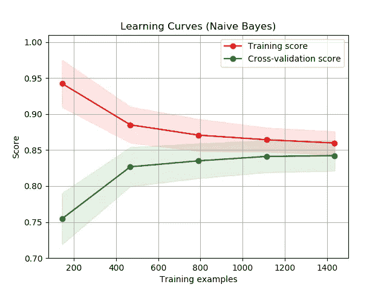

# 如何进行误差分析以使你所有的模型更好

> 原文：<https://towardsdatascience.com/how-to-do-error-analysis-to-make-all-of-your-models-better-a13c4ca643a?source=collection_archive---------2----------------------->

## 循序渐进的指南

From [Pexel](https://www.pexels.com/photo/board-game-business-challenge-chess-277052/)s

# 介绍

有很多方法可以改进开箱即用的机器学习模型。您可以对模型和数据做一些事情，以获得比标准 scikit-learn 版本的模型更好的结果。有特征工程、超参数调整和选择正确的成本函数。如果我们进入深度学习，那么我们接近网络架构、迁移学习和许多其他的想法。作为一名数据科学家，这些是你学习建模的第一步，也是最重要的一步。像随机搜索和网格搜索这样的工具应该在每个数据科学家的工具箱中，以帮助优化这一过程，并建立可能的最佳模型。

当你在一个项目中工作时，大多数人做了我上面提到的所有事情，然后，通过交叉验证或训练测试分割，获得一些评估指标。重复这些步骤，直到获得可能的最佳度量分数，并且认为该模型值得使用。这绝不是一条糟糕的道路。它通常会产生优秀的模型，以它们应该的方式提供价值。然而，只要付出一点额外的努力，你就能让你构建的每一个模型都变得更好。我们可以通过误差分析来实现这一点。

# 误差分析

## 这是什么？

当建立一个模型时，你可以随机地或者有意识地去做。建立模型的随机方法很容易被采用。它需要更少的努力，但仍然会带来结果。一种随机的方法是，在一个模型的每次迭代之后，你决定尝试一些新的东西来使它变得更好，而不去想为什么。很简单:一个可能会提高 F1 分数的想法突然出现在你的脑海中，为什么不试试呢？这很简单，也很有效。

[https://imgs.xkcd.com/comics/machine_learning.png](https://imgs.xkcd.com/comics/machine_learning.png)

建立模型的有意方法是使用误差分析。错误分析要求您在每次迭代后深入研究模型的结果。你在观察的层面上观察数据和预测，并形成假设，解释为什么你的模型在某些预测上失败了。然后，您通过以可能修复错误的方式更改模型来测试您的假设，并开始下一次迭代。随着误差分析的进行，建模的每一次迭代都变得更加耗时，但是最终的结果会更好，并且可能会更快到达。

## 进行误差分析的正确方法

没有一种固定的方法可以让你进行错误分析。它是探索性的，需要一些创造力和领域知识。也就是说，我会给你我通常喜欢采取的步骤。希望这能给你一个起点，让你从挖掘模型的错误中找到深刻的见解。

# 误差分析过程

对于模型的每一次迭代，我都从这些步骤的开头开始，并遍历它们，直到我找到应该修复的东西。我提出我的假设，改变我的模型，重新开始这个过程，直到我满意为止。在这一节中，我将向您介绍我采取的步骤，一些您可能会发现错误的地方，以及一些可能的修复方法。我们将从最高级别的数据到最低级别的数据，一路寻找错误。

## 数据级错误

这可能是最常见的错误分析类型，大多数人都这样做。我喜欢从观察所有数据的模型误差开始。

[**过拟合/欠拟合**](/overfitting-vs-underfitting-a-conceptual-explanation-d94ee20ca7f9)

检查你的模型是否过度或不足。我最喜欢的方法是使用学习曲线，如下图所示。

[Learning Curve from Scikit-Learn](https://scikit-learn.org/stable/auto_examples/model_selection/plot_learning_curve.html)

一般来说，我在实践中发现，最好是先过度拟合，然后使用调节技术将模型带回到一个好的位置。

潜在修复:

*   如果过度拟合，则 L1 或 L2 正则化或更多数据
*   如果拟合不足，则需要更复杂的模型或更多的特征

**预测分布**

确保数据的分布看起来与预测的分布有些相似。如果它们看起来不相似，那我们就有问题了。

潜在修复:

*   从数据中移除异常值
*   使用不同的成本函数

## 组级错误

一旦数据级别的错误得到处理，我们就可以按组查看错误。这部分误差分析的目的是识别模型表现差的组。在决定如何创建组时，一些领域知识会有所帮助。我建议从数据中已经存在的明显的群体开始，然后根据直觉创建群体。例如，我可能会先通过分类变量来查看预测误差，然后再将数字变量拆分到多个箱中进行检查。在观察群体时，我总是会留意一些具体的事情。

**预测过高/过低**

查看是否有任何特定的组，该模型在很长时间内高估或低估了这些组。如果一个模型总是过度预测某个群体，这似乎是我们可以教它解决的问题。如果表现不佳的小组缺乏数据，也要注意。

潜在修复:

*   惩罚对该组过度预测
*   缺少数据时的过采样方法
*   如果缺少数据，则收集数据

**平均误差大**

查看是否有任何组比所有其他组对总误差的贡献更大。出于多种原因，这一点很重要。首先，我们显然想知道哪里出了问题，以便能够修复。第二，它关系到模型的可解释性和应用。如果一个模型在除了一个组之外的所有组上都表现良好，如果它不能被修复，您可能只想将该模型用于除该组之外的所有事情。

潜在修复:

*   k-分层交叉验证，以确保每次分裂的群体观察
*   缺少数据时的过采样方法
*   数据收集缺乏数据

## 个别错误

现在我们开始讨论实质问题。一旦我们完成了所有更高层次的误差分析，是时候深入每个观察的误差了。我喜欢通过查看我预测的前 20 个错误来做到这一点。与更高层次的分析不同，我对您可能会发现的常见错误没有任何建议。你应该仔细观察，查看数据和预测，并确定预测是否有效。有时模型做出了很好的预测，而观察的目标却不可靠。这些是我们可以忍受的错误。如果你认为这个观察似乎不合理，问问自己为什么。模型遗漏了哪些本应帮助它做出更好预测的信息？通过多次观察寻找可能导致错误的模式。你可能会发现一些你以前忽略的东西，你可以修复。你可能会发现，有时候你的模型就是搞砸了，你找不到原因。从这一点出发，你要么继续调整你的模型，决定去获取更多的数据，要么称你的模型是好的。

# 实施它

错误分析需要时间，也需要大量的思考。花时间搜索和检查模型性能差的原因。好的错误分析模式是这样的:

*   查找错误
*   创建一个可以修复错误的假设
*   测试假设
*   重复

遵循这些步骤，加上一点创造力和耐心，将有助于您构建一个比单独进行一些超参数调整更好的模型。

如果你有任何关于如何进行有效的错误分析的问题，请在下面给我留言，我会回答的！