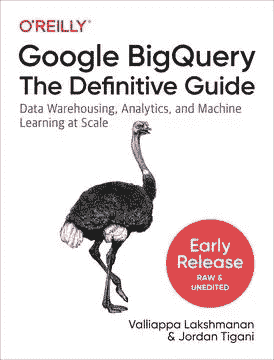

# 如何对 BigQuery ML 模型进行超参数调优

> 原文：<https://towardsdatascience.com/how-to-do-hyperparameter-tuning-of-a-bigquery-ml-model-29ba273a6563?source=collection_archive---------28----------------------->

## 使用云 AI 平台的贝叶斯优化或使用脚本的网格搜索

*注意:超参数调优* [*现在已经内置到 BigQuery ML*](https://medium.com/google-cloud/hyperparameter-tuning-directly-within-bigquery-ml-a0affb0991ae) *中，对于简单的调优需求，您可以简单地指定一个 hparam_range。使用本文中的方法进行更复杂的超参数调优。*

在进行机器学习时，有许多参数我们选择得相当随意。这些包括诸如学习速率、L2 正则化的水平、神经网络中的层数和节点数、提升树的最大深度、矩阵分解模型的因子数等因素。通常情况下，为这些值选择不同的值可能会产生更好的模型(通过保留的评估数据集上的误差来衡量)。为这些参数选择一个好的值称为超参数调整。

下面是 GitHub 中示例的[完整代码。它来自我们即将出版的关于 BigQuery 的书。](https://github.com/GoogleCloudPlatform/bigquery-oreilly-book/blob/master/09_bqml/hyperparam.ipynb)



The code here is from Chapter 9 of our new book on BigQuery. You can read it in early access on Safari.

# 使用脚本调整超参数

以 K 均值聚类模型为例。BigQuery 云控制台中的 evaluation 选项卡(以及 SELECT * from ML。EVALUATE)显示了 Davies-Bouldin 指数，该指数有助于确定数据支持的最佳分类数(数字越小，分类越好)。

例如，下面是一个尝试改变聚类数量的脚本:

```
DECLARE NUM_CLUSTERS INT64 DEFAULT 3;
DECLARE MIN_ERROR FLOAT64 DEFAULT 1000.0;
DECLARE BEST_NUM_CLUSTERS INT64 DEFAULT -1;
DECLARE MODEL_NAME STRING;
DECLARE error FLOAT64 DEFAULT 0;WHILE NUM_CLUSTERS < 8 DOSET MODEL_NAME = CONCAT('ch09eu.london_station_clusters_', 
                            CAST(NUM_CLUSTERS AS STRING));EXECUTE IMMEDIATE format("""
  CREATE OR REPLACE MODEL %s
    OPTIONS(model_type='kmeans', 
            num_clusters=%d, 
            standardize_features = true) AS
    SELECT * except(station_name)
    from ch09eu.stationstats;
  """, MODEL_NAME, NUM_CLUSTERS);

  EXECUTE IMMEDIATE format("""
    SELECT davies_bouldin_index FROM ML.EVALUATE(MODEL %s);
  """, MODEL_NAME) INTO error;

    IF error < MIN_ERROR THEN
       SET MIN_ERROR = error;
       SET BEST_NUM_CLUSTERS = NUM_CLUSTERS;
    END IF;
  SET NUM_CLUSTERS = NUM_CLUSTERS + 1;END WHILE
```

它使用动态 SQL(立即执行)为每个尝试的 num_clusters 创建单独的模型名称。

# Python 中超参数调优

或者，我们可以使用 Python 及其多线程功能来限制并发查询的数量:

```
def train_and_evaluate(num_clusters: Range, max_concurrent=3):
    # grid search means to try all possible values in range
    params = []
    for k in num_clusters.values():
        params.append(Params(k))

    # run all the jobs
    print('Grid search of {} possible parameters'.format(len(params)))
    pool = ThreadPool(max_concurrent)
    results = pool.map(lambda p: p.run(), params)

    # sort in ascending order
    return sorted(results, key=lambda p: p._error)
```

其中 Params 类的 run()方法调用适当的训练和评估查询:

```
class Params:
    def __init__(self, num_clusters):
        self._num_clusters = num_clusters
        self._model_name = 'ch09eu.london_station_clusters_{}'.format(num_clusters)
        self._train_query = """
          CREATE OR REPLACE MODEL {}
          OPTIONS(model_type='kmeans', 
                  num_clusters={}, 
                  standardize_features = true) AS
          SELECT * except(station_name)
          from ch09eu.stationstats
        """.format(self._model_name, self._num_clusters)
        self._eval_query = """
          SELECT davies_bouldin_index AS error
          FROM ML.EVALUATE(MODEL {});
        """.format(self._model_name)
        self._error = None

    def run(self):
        bq = bigquery.Client(project=PROJECT)
        job = bq.query(self._train_query, location='EU')
        job.result() # wait for job to finish
        evaldf = bq.query(self._eval_query, location='EU').to_dataframe()
        self._error = evaldf['error'][0]
        return self
```

当在范围[3，9]中搜索时，我们发现误差最小的聚类数是 7。

# 使用人工智能平台的超参数调谐

在迄今为止考虑的两种超参数调优方法中，我们尝试了一个范围内参数的每个可能值。随着可能参数数量的增加，网格搜索变得越来越浪费。最好使用更有效的搜索算法，这就是云人工智能平台的超参数调整可以发挥作用的地方。超参数调优服务可以用于任何模型(不仅仅是 TensorFlow)。让我们应用于调整 DNN 模型的特征工程和节点数量。

首先，我们创建一个配置文件，指定每个参数的范围、并发查询的数量以及试验的总数:

```
trainingInput:
  scaleTier: CUSTOM
  masterType: standard   # See: [https://cloud.google.com/ml-engine/docs/tensorflow/machine-types](https://cloud.google.com/ml-engine/docs/tensorflow/machine-types)
  hyperparameters:
    goal: MINIMIZE
   ** maxTrials: 50**
    maxParallelTrials: 2
    hyperparameterMetricTag: mean_absolute_error
    params:
    - parameterName: afternoon_start
      type: INTEGER
      minValue: 9
      maxValue: 12
      scaleType: UNIT_LINEAR_SCALE
    - parameterName: afternoon_end
      type: INTEGER
      minValue: 15
      maxValue: 19
      scaleType: UNIT_LINEAR_SCALE
    - parameterName: num_nodes_0
      type: INTEGER
      minValue: 10
      maxValue: 100
      scaleType: UNIT_LOG_SCALE
    - parameterName: num_nodes_1
      type: INTEGER
      minValue: 3
      maxValue: 10
      scaleType: UNIT_LINEAR_SCALE
```

请注意，我们已经为每个参数和要最小化的度量(平均绝对误差)指定了最小值和最大值。我们要求优化只需要 50 次尝试，而网格搜索需要尝试 4x4x90x7 或超过 10，000 个选项！因此，使用 AI 平台超参数调整服务可以节省 200 倍的成本！

然后，我们创建一个 Python 程序，该程序调用 BigQuery 来训练和评估给定一组参数的模型:

```
def train_and_evaluate(args):        
    model_name = "ch09eu.bicycle_model_dnn_{}_{}_{}_{}".format(
        args.afternoon_start, args.afternoon_end, args.num_nodes_0, args.num_nodes_1
    )
    train_query = """
        CREATE OR REPLACE MODEL {}
        TRANSFORM(* EXCEPT(start_date)
                  , IF(EXTRACT(dayofweek FROM start_date) BETWEEN 2 and 6, 'weekday', 'weekend') as dayofweek
                  , ML.BUCKETIZE(EXTRACT(HOUR FROM start_date), [5, {}, {}]) AS hourofday
        )
        OPTIONS(input_label_cols=['duration'], 
                model_type='dnn_regressor',
                hidden_units=[{}, {}])
        ASSELECT 
          duration
          , start_station_name
          , start_date
        FROM `bigquery-public-data`.london_bicycles.cycle_hire
    """.format(model_name, 
               args.afternoon_start, 
               args.afternoon_end,
               args.num_nodes_0,
               args.num_nodes_1)
    logging.info(train_query)
    bq = bigquery.Client(project=args.project, 
                         location=args.location, 
                         credentials=get_credentials())
    job = bq.query(train_query)
    job.result() # wait for job to finish

    eval_query = """
        SELECT mean_absolute_error 
        FROM ML.EVALUATE(MODEL {})
    """.format(model_name)
    logging.info(eval_info)
    evaldf = bq.query(eval_query).to_dataframe()
    return evaldf['mean_absolute_error'][0]
```

请注意，上面的代码为每个可调参数使用了一个特定的值，并返回平均绝对误差，这是被最小化的度量。

然后写出该错误值:

```
hpt.report_hyperparameter_tuning_metric(
       hyperparameter_metric_tag='mean_absolute_error',
       metric_value=error,
       global_step=1)
```

培训计划提交给 AI 平台培训服务:

```
gcloud ai-platform jobs submit training $JOBNAME \
  --runtime-version=1.13 \
  --python-version=3.5 \
  --region=$REGION \
  --module-name=trainer.train_and_eval \
  --package-path=$(pwd)/trainer \
  --job-dir=gs://$BUCKET/hparam/ \
  --config=hyperparam.yaml \
  -- \
  --project=$PROJECT --location=EU
```

在 AI 平台控制台中显示的结果输出包含最佳参数。

尽情享受吧！