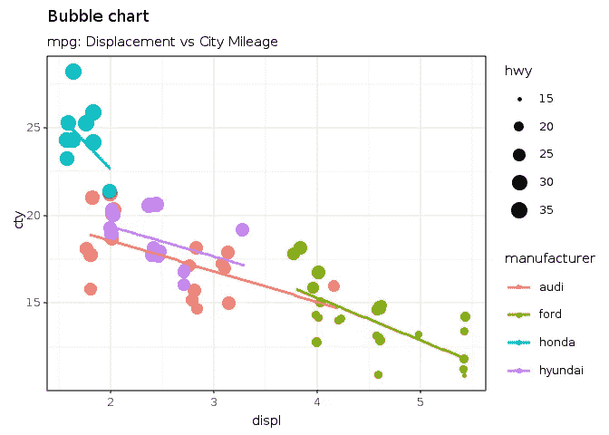
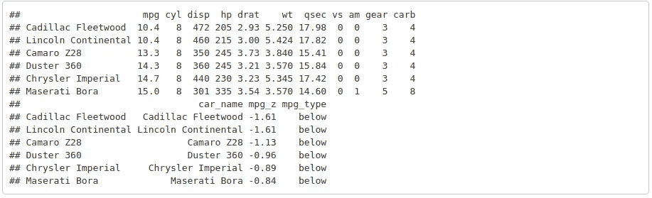
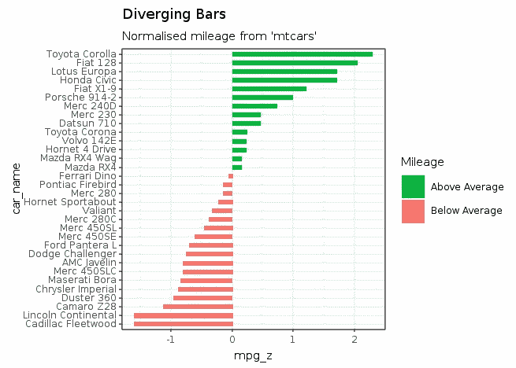
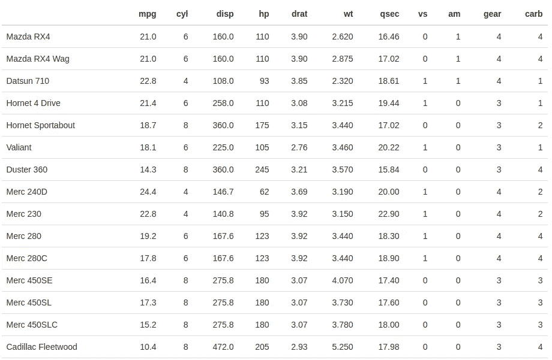
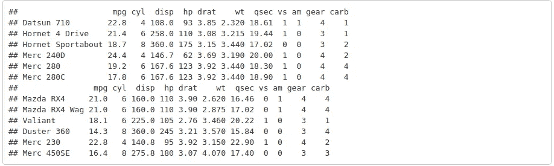

# 如何用 gKnit 在 Ruby 中进行可重复的研究

> 原文：<https://towardsdatascience.com/how-to-do-reproducible-research-in-ruby-with-gknit-c26d2684d64e?source=collection_archive---------23----------------------->

罗德里戈·博塔弗戈和丹尼尔·莫斯

[编辑:]从 gala az 0 . 4 . 10 版本开始，gKnit 将允许代码块之间的局部变量，感谢 Benoit 的评论和建议。

# 介绍

“有文化的编程”的概念是由 Donald Knuth 在 20 世纪 80 年代首次提出的(Knuth 1984)。这种方法的主要目的是开发在文档中散布宏代码片段、传统源代码和自然语言(如英语)的软件，该文档可以被编译成可执行代码，同时易于人类开发人员阅读。根据 Knuth 的说法，“有文化的编程实践者可以被认为是一个散文家，他主要关心的是阐述和优秀的风格。”

文字编程的想法演变成了可复制研究的想法，所有的数据、软件代码、文档、图形等等。需要复制的研究及其报告可以包含在单个文档或一组文档中，当分发给同行时，可以重新运行这些文档，生成相同的输出和报告。

R 社区在可重复的研究上投入了大量的努力。2002 年，Sweave 被引入，它允许混合 R 代码和 Latex 生成高质量的 PDF 文档。Sweave 文档可以包括代码、执行代码的结果、图形和文本，这样它就包含了再现研究的全部叙述。2012 年，RStudio 的 Yihui Xie 开发的 Knitr 发布，取代了 Sweave，并将 Sweave 所需的许多扩展和附加包整合到一个软件包中。

对于 Knitr， **R markdown** 也被开发出来，它是 markdown 格式的扩展。使用 **R markdown** 和 Knitr，可以生成多种格式的报告，如 HTML、markdown、Latex、PDF、dvi 等。 **R markdown** 还允许使用多种编程语言，如 R、Ruby、Python 等。在同一份文件中。

在 **R markdown** 中，文本与可以执行的代码块穿插在一起，代码及其结果都可以成为最终报告的一部分。虽然 **R markdown** 允许在同一个文档中使用多种编程语言，但是只有 R 和 Python(带有 reticulate 包)可以在块之间持久化变量。对于其他语言，比如 Ruby，每个块都将启动一个新的进程，因此所有数据都会在块之间丢失，除非它以某种方式存储在下一个块读取的数据文件中。

能够在块之间持久存储数据对于有文化的编程来说是至关重要的，否则叙事的流程会因为必须保存数据然后重新加载数据而丢失。虽然这看起来有点麻烦，但是不能在块之间持久化数据是一个大问题。例如，让我们看看下面这个简单的例子，在这个例子中我们想展示如何创建一个列表并使用它。让我们首先假设数据不能在块之间持久化。在下一个块中，我们创建一个列表，然后我们需要将它保存到文件中，但是为了保存它，我们需要以某种方式将数据整理成二进制格式:

```
lst = R.list(a: 1, b: 2, c: 3)
lst.saveRDS("lst.rds")
```

然后，在下一个使用变量' lst '的块中，我们需要读回它的值

```
lst = R.readRDS("lst.rds")
puts lst## $a
## [1] 1
## 
## $b
## [1] 2
## 
## $c
## [1] 3
```

现在，任何单个代码都有几十个变量，我们可能希望在块之间使用和重用这些变量。显然，这种方法很快变得难以控制。大概就是因为这个问题，在 Ruby 社区很少看到任何 **R markdown** 文档。

当变量可以跨块使用时，就不需要开销:

```
@lst = R.list(a: 1, b: 2, c: 3)
*# any other code can be added here*puts @lst## $a
## [1] 1
## 
## $b
## [1] 2
## 
## $c
## [1] 3
```

在 Python 社区中，在 2000 年的第一个十年左右，开始了将代码和文本集成到一个集成环境中的努力。2006 年，iPython 0.7.2 发布。2014 年，费尔南多·佩雷斯将 iPython 的 Jupyter 项目剥离出来，创建了一个基于网络的交互式计算环境。Jupyter 现在可以用于许多语言，包括带有 iruby gem 的 Ruby(【https://github.com/SciRuby/iruby】T2)。为了在 Jupyter 笔记本中拥有多种语言，SoS 内核被开发出来(【https://vatlab.github.io/sos-docs/】T4)。

# 编织文件

本文档描述了 gKnit。gKnit 基于 knitr 和 **R markdown** ，可以编织一个用 Ruby 和/或 R 编写的文档，并以 **R markdown** 的任何可用格式输出。gKnit 允许 ruby 开发人员在单个文档、文本和代码中进行有文化的编程和可重复的研究。

gKnit 运行在 GraalVM 和 gala az(Ruby 和 R 之间的集成库——见下文)之上。在 gKnit 中，Ruby 变量在块之间持久化，这使得它成为用这种语言进行文化编程的理想解决方案。此外，由于它是基于 Galaaz 的，Ruby 块可以访问 R 变量，用 Ruby 和 R 进行多语言编程是非常自然的。

Galaaz 已经在下面的帖子中描述过了:

*   [https://towardsdatascience . com/ruby-plotting-with-gala az-a-example of-tight-coupling-ruby-and-r-in-graalvm-520 b 69 e 21021](/ruby-plotting-with-galaaz-an-example-of-tightly-coupling-ruby-and-r-in-graalvm-520b69e21021)。
*   [https://medium . freecodecamp . org/how-to-make-beautiful-ruby-plots-with-gala az-320848058857](https://medium.freecodecamp.org/how-to-make-beautiful-ruby-plots-with-galaaz-320848058857)

这不是一篇关于 **R markdown** 的博文，感兴趣的用户可以通过下面的链接获得关于其功能和使用的详细信息。

*   【https://rmarkdown.rstudio.com/】T4 或者
*   [https://bookdown.org/yihui/rmarkdown/](https://bookdown.org/yihui/rmarkdown/)

在这篇文章中，我们将只描述 **R markdown** 的主要方面，这样用户就可以快速开始 gKnitting Ruby 和 R 文档。

# Yaml 标头

一个 **R markdown** 文档应该以一个 Yaml 头开始，并保存在一个带有'的文件中。Rmd '扩展。这个文档有下面的标题，用来打包一个 HTML 文档。

```
---
title: "How to do reproducible research in Ruby with gKnit"
author: 
    - "Rodrigo Botafogo"
    - "Daniel Mossé - University of Pittsburgh"
tags: [Tech, Data Science, Ruby, R, GraalVM]
date: "20/02/2019"
output:
  html_document:
    self_contained: true
    keep_md: true
  pdf_document:
    includes:
      in_header: ["../../sty/galaaz.sty"]
    number_sections: yes
---
```

有关 Yaml 标题中选项的更多信息，请查看[https://bookdown.org/yihui/rmarkdown/html-document.html](https://bookdown.org/yihui/rmarkdown/html-document.html)。

# r 降价格式

文档格式可以通过简单的标记来完成，例如:

# 头球

```
# Header 1## Header 2### Header 3
```

# 列表

```
Unordered lists:* Item 1
* Item 2
    + Item 2a
    + Item 2bOrdered Lists1\. Item 1
2\. Item 2
3\. Item 3
    + Item 3a
    + Item 3b
```

更多 R 减价格式，请转到[https://rmarkdown.rstudio.com/authoring_basics.html](https://rmarkdown.rstudio.com/authoring_basics.html)。

# r 组块

运行和执行 Ruby 和 R 代码实际上是我们真正感兴趣的是这个博客。

插入代码块的方法是将代码添加到由三个反勾号分隔的块中，后接左大括号(' { ')，后接引擎名(r、ruby、rb、include、…)、任何可选的 chunk_label 和选项，如下所示:

```
```{engine_name [chunk_label], [chunk_options]}
```
```

例如，让我们向标记为‘first _ R _ chunk’的文档添加一个 R chunk。这是一个非常简单的代码，只需创建一个变量并将其打印出来，如下所示:

```
```{r first_r_chunk}
vec <- c(1, 2, 3)
print(vec)
```
```

如果该块被添加到一个 **R 降价**文件中，结果将是:

```
vec <- c(1, 2, 3)
print(vec)## [1] 1 2 3
```

现在假设我们想在代码中做一些分析，但是只打印结果而不是代码本身。为此，我们需要添加选项“echo = FALSE”。

```
```{r second_r_chunk, echo = FALSE}
vec2 <- c(10, 20, 30)
vec3 <- vec * vec2
print(vec3)     
```
```

下面是这个块在文档中的显示方式。注意没有显示代码，我们只能在一个白色的框中看到执行结果

```
## [1] 10 40 90
```

可用组块选项的描述可在[https://yihui.name/knitr/](https://yihui.name/knitr/)中找到。

让我们添加另一个带有函数定义的 R 块。在本例中，创建了一个向量“r_vec ”,并定义了一个新函数“reduce_sum”。区块规范是

```
```{r data_creation}
r_vec <- c(1, 2, 3, 4, 5)reduce_sum <- function(...) {
  Reduce(sum, as.list(...))
}
```
```

这是它执行后的样子。从现在开始，为了简洁起见，我们将不再展示组块定义。

```
r_vec <- c(1, 2, 3, 4, 5)reduce_sum <- **function**(**...**) {
  Reduce(sum, as.list(**...**))
}
```

我们可以，可能在另一个块中，访问向量并如下调用函数:

```
print(r_vec)## [1] 1 2 3 4 5print(reduce_sum(r_vec))## [1] 15
```

# 带 ggplot 的 r 图形

在下面的块中，我们使用 ggplot 在 R 中创建了一个气泡图，并将其包含在本文档中。请注意，代码中没有包含图像的指令，这是自动发生的。“mpg”数据帧对于 R 和 Galaaz 来说也是固有可用。

对于不了解 ggplot 的读者，ggplot 是一个基于“图形语法”(Wilkinson 2005)的图形库。图形语法的思想是通过给情节添加层来构建图形。更多信息可以在[https://towardsdatascience . com/a-comprehensive-guide-the-grammar-of-graphics-for-effective-visualization-of-multi-dimensional-1 f 92 B4 ed 4149](/a-comprehensive-guide-to-the-grammar-of-graphics-for-effective-visualization-of-multi-dimensional-1f92b4ed4149)中找到。

在下图中，使用了来自基数 R 的“mpg”数据集。数据涉及城市循环油耗，单位为英里/加仑，根据 3 个多值离散属性和 5 个连续属性进行预测(昆兰，1993 年)

首先，过滤“mpg”数据集，仅从以下制造商提取汽车:奥迪、福特、本田和现代，并存储在“mpg_select”变量中。然后，选定的数据帧被传递到 ggplot 函数，该函数在美学方法(aes)中指定“位移”(disp)应绘制在“x”轴上，而“城市里程”应绘制在“y”轴上。在“实验室”层中，我们为情节传递“标题”和“副标题”。在基本图“g”中，增加了 geom_jitter，它用相同的颜色(col=manufactures)绘制来自相同制造商的汽车，汽车点的大小等于其高速公路消耗(size = hwy)。最后，最后一层是绘图仪，包含每个制造商的线性回归线(method = "lm ")。

```
*# load package and data*
**library**(ggplot2)
data(mpg, package="ggplot2")mpg_select <- mpg[mpg$manufacturer %**in**% c("audi", "ford", "honda", "hyundai"), ]*# Scatterplot*
theme_set(theme_bw())  *# pre-set the bw theme.*
g <- ggplot(mpg_select, aes(displ, cty)) + 
  labs(subtitle="mpg: Displacement vs City Mileage",
       title="Bubble chart")g + geom_jitter(aes(col=manufacturer, size=hwy)) + 
  geom_smooth(aes(col=manufacturer), method="lm", se=F)
```



# 红宝石块

在文档中包含一个 ruby 块就像包含一个 R 块一样简单:只需将引擎的名称改为“Ruby”。也可以将块选项传递给 Ruby 引擎；但是，这个版本不接受 R chunks 可用的所有选项。未来的版本将增加这些选项。

```
```{ruby first_ruby_chunk}
```
```

在这个例子中，ruby 块被称为‘first _ ruby _ chunk’。组块标签的一个重要方面是它们不能被复制。如果一个块标签被复制，gKnit 将会出错停止。

Ruby 块的另一个要点是，它们是在一个名为 RubyChunk 的类的范围内进行计算的。为了确保变量在块之间可用，应该将它们作为 RubyChunk 类的实例变量。在下面的块中，变量' @a '、' @b '和' @c '是标准的 Ruby 变量，而' @vec '和' @vec2 '是通过调用 R 模块上的' c '方法创建的两个向量。

在 Galaaz 中，R 模块允许我们透明地访问 R 函数。R 中的“c”函数是一个将其参数连接起来构成向量的函数。

需要明确的是，gknit 中并没有要求调用或使用任何 R 函数。gKnit 会编织标准的 Ruby 代码，甚至是没有任何代码的一般文本。

```
@a = [1, 2, 3]
@b = "US$ 250.000"
@c = "The 'outputs' function"@vec = R.c(1, 2, 3)
@vec2 = R.c(10, 20, 30)
```

在下一个块中，使用并打印了变量' @a '，' @vec '和' @vec2 '。

```
puts @a
puts @vec * @vec2## [1, 2, 3]
## [1] 10 40 90
```

注意，@a 是一个标准的 Ruby 数组，@vec 和@vec2 是相应的向量，其中乘法按预期工作。

# 从 Ruby 访问 R

GraalVM 上的 Galaaz 的一个优点是，可以很容易地从 Ruby 访问 R 中定义的变量和函数。下一个块从 R 中读取数据，并使用前面定义的“reduce_sum”函数。要从 Ruby 访问 R 变量，应该对代表 R 变量的 Ruby 符号应用' ~ '函数。因为 R 变量被称为“r_vec ”,所以在 Ruby 中，访问它的符号是“:r_vec ”,因此“~:r_vec”检索变量的值。

```
puts ~:r_vec## [1] 1 2 3 4 5
```

为了调用 R 函数,‘R .’模块的用法如下

```
puts R.reduce_sum(~:r_vec)## [1] 15
```

# 红宝石绘图

我们已经看到了一个用 r 绘图的例子。用 Ruby 绘图与用 r 绘图没有任何不同。在下面的例子中，我们使用 r 中的“mtcars”数据框架绘制了一个发散条形图。该数据摘自 1974 年的《美国汽车趋势》杂志，包括 32 辆汽车(1973-74 年款)的油耗和汽车设计与性能的 10 个方面。这十个方面是:

*   mpg:英里/(美国)加仑
*   cyl:气缸数量
*   disp:排量(立方英寸)
*   马力:总马力
*   drat:后桥传动比
*   重量:重量(1000 磅)
*   qsec: 1/4 英里时间
*   vs:发动机(0 = V 形，1 =直线)
*   am:变速器(0 =自动，1 =手动)
*   档位:前进档的数量
*   碳水化合物:化油器数量

```
*# copy the R variable :mtcars to the Ruby mtcars variable*
@mtcars = ~:mtcars*# create a new column 'car_name' to store the car names so that it can be*
*# used for plotting. The 'rownames' of the data frame cannot be used as*
*# data for plotting*
@mtcars.car_name = R.rownames(:mtcars)*# compute normalized mpg and add it to a new column called mpg_z*
*# Note that the mean value for mpg can be obtained by calling the 'mean'*
*# function on the vector 'mtcars.mpg'.  The same with the standard*
*# deviation 'sd'.  The vector is then rounded to two digits with 'round 2'*
@mtcars.mpg_z = ((@mtcars.mpg - @mtcars.mpg.mean)/@mtcars.mpg.sd).round 2*# create a new column 'mpg_type'. Function 'ifelse' is a vectorized function*
*# that looks at every element of the mpg_z vector and if the value is below*
*# 0, returns 'below', otherwise returns 'above'*
@mtcars.mpg_type = (@mtcars.mpg_z < 0).ifelse("below", "above")*# order the mtcar data set by the mpg_z vector from smaler to larger values*
@mtcars = @mtcars[@mtcars.mpg_z.order, :all]*# convert the car_name column to a factor to retain sorted order in plot*
@mtcars.car_name = @mtcars.car_name.factor levels: @mtcars.car_name*# let's look at the first records of the final data frame*
puts @mtcars.head
```



```
**require** 'ggplot'

puts @mtcars.ggplot(E.aes(x: :car_name, y: :mpg_z, label: :mpg_z)) +
     R.geom_bar(E.aes(fill: :mpg_type), stat: 'identity', width: 0.5) +
     R.scale_fill_manual(name: 'Mileage',
                         labels: R.c('Above Average', 
                                      'Below Average'),
                         values: R.c('above': '#00ba38', 
                                     'below': '#f8766d')) +
     R.labs(subtitle: "Normalised mileage from 'mtcars'",
            title: "Diverging Bars") + 
     R.coord_flip
```



# 内嵌 Ruby 代码

当使用 Ruby 块时，代码和输出被格式化成块，如上所示。这种格式并不总是需要的。有时，我们希望把 Ruby 评估的结果放在一个短语的中间。gKnit 允许用“rb”引擎添加内联 Ruby 代码。以下块规范将创建并内联拼音文本:

```
This is some text with inline Ruby accessing variable \@b which has value:
```{rb puts @b}
```
and is followed by some other text!
```

这是一些带有内联 Ruby 访问变量@b 的文本，该变量的值为:US$ 250.000，后面是一些其他文本！

请注意，如果我们希望所有内容都在一行中，请不要在代码块之前或之后添加任何新行，这一点很重要，这会导致以下带有内联 Ruby 代码的句子。

# “输出”功能

他之前在 Ruby 块中使用了标准的“puts”方法来产生输出。“puts”的结果，如前面所有使用它的块中所见，被格式化在代码块后面的一个白盒中。然而，很多时候，我们希望在 Ruby 块中进行一些处理，并让这个处理的结果生成并输出到文档中，就像我们在 **R markdown** 文档中输入它一样。

例如，假设我们想在文档中创建一个新的标题，但是标题短语是一些代码处理的结果:也许它是我们将要阅读的文件的第一行。方法“outputs”添加其输出，就像在 **R markdown** 文档中键入一样。

现在看看变量' @c '(它在上面的前一个块中被定义为' @ c = ' outputs '函数)。“‘outputs’函数”实际上是这个部分的名称，它是使用 Ruby 块中的‘outputs’函数创建的。

生成这个标题的 ruby 块是:

```
```{ruby heading}
outputs "### #{@c}"
```
```

三个“###”是我们在 **R markdown** 中添加标题 3 的方式。

# Ruby 块的 HTML 输出

我们刚刚看到了使用方法‘outputs’向 **R markdown** 文档添加文本。这种技术也可以用于向文档中添加 HTML 代码。在 **R markdown** 中，任何直接在文档中键入的 html 代码都会被正确呈现。

例如，下面是一个 HTML 格式的表定义及其在文档中的输出:

```
<table style="width:100%">
  <tr>
    <th>Firstname</th>
    <th>Lastname</th> 
    <th>Age</th>
  </tr>
  <tr>
    <td>Jill</td>
    <td>Smith</td> 
    <td>50</td>
  </tr>
  <tr>
    <td>Eve</td>
    <td>Jackson</td> 
    <td>94</td>
  </tr>
</table>
```

first name lastnameagejillsmith 50 eve Jackson 94

但是，手动创建 HTML 输出并不总是容易或可取的，特别是如果我们希望文档以其他格式呈现，例如 Latex。还有，上表看起来很丑。“kableExtra”库是一个创建漂亮表格的好库。看看[https://cran . r-project . org/web/packages/kable extra/vignettes/awesome _ table _ in _ html . html](https://cran.r-project.org/web/packages/kableExtra/vignettes/awesome_table_in_html.html)

在下一个块中，我们以一个格式良好的表输出 R 中的“mtcars”数据帧。注意，我们通过使用“~:mtcars”来检索 mtcars 数据帧。

```
R.install_and_loads('kableExtra')
outputs (~:mtcars).kable.kable_styling
```



# 在块中包含 Ruby 文件

r 是一种为统计学家使用起来简单快捷的语言。据我所知，它不是一种用于开发大型系统的语言。当然，R 中有大型系统和库，但是这种语言的重点是开发统计模型并将其分发给其他人。

另一方面，Ruby 是用于大型软件开发的语言。用 Ruby 编写的系统会有几十个、几百个甚至几千个文件。要用有文化的编程来记录一个大系统，我们不能期望开发人员在一个文件中添加所有的文件。Rmd '文件。gKnit 提供了“include”块引擎来包含一个 Ruby 文件，就像在。Rmd '文件。

要包含一个文件，应该创建下面的块，其中是要包含的文件的名称，而扩展名是。Rb’，不需要添加。如果不包括“relative”选项，则它被视为 TRUE。当“relative”为真时，ruby 的“require_relative”语义用于加载文件，当“relative”为假时，搜索 Ruby 的$LOAD_PATH 以找到文件，并且它是“require”d。

```
```{include <filename>, relative = <TRUE/FALSE>}
```
```

下面我们包括文件“model.rb”，它在这个博客的同一个目录中。这段代码使用 R 'caret '包来分割一个训练集和测试集中的数据集。“caret”软件包是一个非常重要的用于进行数据分析的有用的软件包，它有数百个函数用于数据分析工作流程的所有步骤。仅仅使用“插入符号”来分割数据集就像使用众所周知的大炮来杀死苍蝇一样。我们在这里使用它只是为了说明，对于 Galaaz 来说，集成 Ruby 和 R，甚至使用一个非常复杂的包作为‘caret’都是微不足道的。

给你一个建议:‘caret’包有很多依赖项，在 Linux 系统中安装它是一个耗时的操作。如果软件包尚未安装，方法“R.install_and_loads”将安装该软件包，这可能需要一段时间。

```
```{include model}
```require 'galaaz'# Loads the R 'caret' package.  If not present, installs it 
R.install_and_loads 'caret'class Model

  attr_reader :data
  attr_reader :test
  attr_reader :train #==========================================================
  #
  #==========================================================

  def initialize(data, percent_train:, seed: 123) R.set__seed(seed)
    @data = data
    @percent_train = percent_train
    @seed = seed

  end #==========================================================
  #
  #========================================================== def partition(field) train_index =
      R.createDataPartition(@data.send(field), p: @percet_train,
                            list: false, times: 1)
    @train = @data[train_index, :all]
    @test = @data[-train_index, :all]

  end

endmtcars = ~:mtcars
model = Model.new(mtcars, percent_train: 0.8)
model.partition(:mpg)
puts model.train.head
puts model.test.head
```



# 记录宝石

gKnit 还允许开发人员记录和加载不在同一目录下的文件。Rmd '文件。

下面是一个从 TruffleRuby 加载“find.rb”文件的例子。在这个例子中，relative 被设置为 FALSE，所以 Ruby 将在它的$LOAD_PATH 中查找文件，用户不需要查找它的目录。

```
```{include find, relative = FALSE}
```# frozen_string_literal: true
#
# find.rb: the Find module for processing all files under a given directory.
##
# The +Find+ module supports the top-down traversal of a set of file paths.
#
# For example, to total the size of all files under your home directory,
# ignoring anything in a "dot" directory (e.g. $HOME/.ssh):
#
#   require 'find'
#
#   total_size = 0
#
#   Find.find(ENV["HOME"]) do |path|
#     if FileTest.directory?(path)
#       if File.basename(path)[0] == ?.
#         Find.prune       # Don't look any further into this directory.
#       else
#         next
#       end
#     else
#       total_size += FileTest.size(path)
#     end
#   end
#
module Find #
  # Calls the associated block with the name of every file and directory listed
  # as arguments, then recursively on their subdirectories, and so on.
  #
  # Returns an enumerator if no block is given.
  #
  # See the +Find+ module documentation for an example.
  #
  def find(*paths, ignore_error: true) # :yield: path
    block_given? or return enum_for(__method__, *paths, ignore_error: ignore_error) fs_encoding = Encoding.find("filesystem") paths.collect!{|d| raise Errno::ENOENT, d unless File.exist?(d); d.dup}.each do |path|
      path = path.to_path if path.respond_to? :to_path
      enc = path.encoding == Encoding::US_ASCII ? fs_encoding : path.encoding
      ps = [path]
      while file = ps.shift
        catch(:prune) do
          yield file.dup.taint
          begin
            s = File.lstat(file)
          rescue Errno::ENOENT, Errno::EACCES, Errno::ENOTDIR, Errno::ELOOP, Errno::ENAMETOOLONG
            raise unless ignore_error
            next
          end
          if s.directory? then
            begin
              fs = Dir.children(file, encoding: enc)
            rescue Errno::ENOENT, Errno::EACCES, Errno::ENOTDIR, Errno::ELOOP, Errno::ENAMETOOLONG
              raise unless ignore_error
              next
            end
            fs.sort!
            fs.reverse_each {|f|
              f = File.join(file, f)
              ps.unshift f.untaint
            }
          end
        end
      end
    end
    nil
  end #
  # Skips the current file or directory, restarting the loop with the next
  # entry. If the current file is a directory, that directory will not be
  # recursively entered. Meaningful only within the block associated with
  # Find::find.
  #
  # See the +Find+ module documentation for an example.
  #
  def prune
    throw :prune
  end module_function :find, :prune
end
```

# 转换为 PDF

knitr 的一个优点是相同的输入可以转换成许多不同的输出。一种非常有用的格式，当然是 PDF。为了将一个 **R markdown** 文件转换成 PDF，需要在系统上安装 LaTeX。我们不会在这里解释如何安装 LaTeX，因为网上有大量的文档显示如何进行。

gKnit 附带了一个简单的 LaTeX 样式文件，用于将这个博客作为 PDF 文档进行 gKnit。下面是生成 PDF 格式而不是 HTML 格式的博客的 Yaml 头:

```
---
title: "gKnit - Ruby and R Knitting with Galaaz in GraalVM"
author: "Rodrigo Botafogo"
tags: [Galaaz, Ruby, R, TruffleRuby, FastR, GraalVM, knitr, gknit]
date: "29 October 2018"
output:
  pdf\_document:
    includes:
      in\_header: ["../../sty/galaaz.sty"]
    number\_sections: yes
---
```

PDF 文档可在以下网址查看:[https://www . research gate . net/publication/332766270 _ How _ to _ do _ reproducible _ research _ in _ Ruby _ with _ gKnit](https://www.researchgate.net/publication/332766270_How_to_do_reproducible_research_in_Ruby_with_gKnit)

# 结论

为了进行可重复的研究，需要的主要基本工具之一是一个允许“文化编程”的系统，在该系统中，文本、代码和可能的一组文件可以被编译成一份报告，该报告可以容易地分发给同行。对等体应该能够通过获得完全相同的原始报告，使用相同的文件集来重新运行编译。gKnit 就是这样一个针对 Ruby 和 R 的系统，它使用 **R Markdown** 来集成文本和代码块，其中代码块可以是 **R Markdwon** 文件的一部分，也可以从系统中的文件导入。理想情况下，在可重复的研究中，重建报告所需的所有文件应该很容易地打包在一起(在同一个压缩目录中)，并分发给同行以便重复执行。

Oracle GraalVM 的承诺之一是，用户/开发人员将能够使用最好的工具来完成手头的任务，而不依赖于编写该工具的编程语言。我们在 GraalVM 和 Truffle interop 消息的基础上开发和实现了 Galaaz，而用 R-gala az 包装 Ruby 或者用 gKnit 包装 Knitr 所花费的时间和精力只是实现原始工具所需时间的一小部分(一个人每天花费几个小时，大约需要六个月)。试图在 Ruby 中重新实现所有的 R 包需要付出与 Python 实现 NumPy、Pandas 和所有支持库同样的努力，这种努力不太可能实现。GraalVM 允许 Ruby“几乎免费”地从这些庞大的库和工具中获利，这些库和工具使 R 成为数据分析和机器学习中最常用的语言之一。

比用 Ruby 包装 R 库更有趣的是，Ruby 为 R 增加了价值，它允许开发人员使用强大的现代结构进行代码重用，而这并不是 R 的强项。正如在这篇博客中所示，R 和 Ruby 可以很容易地进行通信，R 可以以一种极大地扩展其功能和可读性的方式构造在类和模块中。

# 安装 gKnit

# 先决条件

*   GraalVM (>= rc15)
*   松露红宝石
*   FastR

以下 R 包将在必要时自动安装，但如果需要，也可以在使用 gKnit 之前安装:

*   ggplot2
*   gridExtra
*   针织工

R 包的安装需要一个开发环境，并且很耗时。在 Linux 中，gnu 编译器和工具应该足够了。我不确定苹果电脑需要什么。

# 准备

*   gem 安装 galaaz

# 使用

*   gknit<filename></filename>

# 参考

唐纳德·克努特，1984 年。“识字编程。” *Comput。*第 27 卷第 2 期。英国牛津:牛津大学出版社:97–111。[https://doi.org/10.1093/comjnl/27.2.97](https://doi.org/10.1093/comjnl/27.2.97)

威尔金森利兰。2005.*图形的语法(统计与计算)*。柏林，海德堡:施普林格出版社。