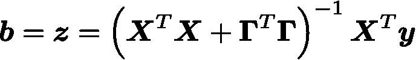
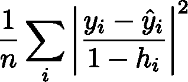
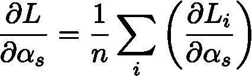
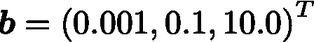
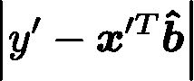

# 如何更好的做岭回归

> 原文：<https://towardsdatascience.com/how-to-do-ridge-regression-better-34ecb6ee3b12?source=collection_archive---------25----------------------->

## [优化和机器学习](https://towardsdatascience.com/tagged/optimization-and-ml)

## 使用优化器来寻找性能最佳的正则化矩阵

Photo by [Massimiliano Morosinotto](https://unsplash.com/@therawhunter?utm_source=unsplash&utm_medium=referral&utm_content=creditCopyText) on [Unsplash](https://unsplash.com/s/photos/peak?utm_source=unsplash&utm_medium=referral&utm_content=creditCopyText)

让 **X** 和 **y** 表示训练数据的样本，其中 **X** 是具有 n 行特征向量的矩阵，而 **y** 是 n 个对应目标值的向量。如果**𝐱′**是具有未知目标值 y’的样本外特征向量，那么我们可以拟合线性模型 **b̂** ，目标是最小化预期样本外误差

一种拟合模型的方法，最小二乘法，选择 **b̂** 来最小化训练数据的误差平方和

虽然在给定足够的训练数据的情况下，这可能是一个很好的选择，但如果训练数据较少、噪声较多或预测器较弱的特征较多，它可能会过度拟合数据，从而使 **b̂** 更多地反映噪声，而不是潜在的统计关系。

岭回归修正了最小二乘法以最小化

利用合适的矩阵**γ**，岭回归可以收缩或者限制 **b̂** 的系数，以减少过拟合并提高样本外预测的性能。挑战在于正确选择**γ**。

通常，**γ**仅限于形式

并且通过在训练数据的[交叉验证](https://en.wikipedia.org/wiki/Cross-validation_(statistics))上试验不同的值并挑选具有最佳分数的值来选择α。我会参考这个，或者其他类似这样的选择**γ**、的方法作为微调。调整的缺点是会导致额外的计算，并且除了最简单的**γ**的参数化之外，不能扩展到任何参数化。例如，如果我们希望每个变量都有一个单独的正则项

我们有很多变量，通过调整来设置**γ**是不可能的。

在这篇博文中，我将展示如何将某些交叉验证的性能最大化**γ**设置为适当的优化问题，其中我们计算一阶、二阶导数，并在优化器的帮助下有效地迭代到最佳性能参数。这将允许我们扩展到具有许多变量的参数化，并且经常会导致比调整方法更好的结果。

## 留一交叉验证

让

表示移除第 I 个条目的特征矩阵和目标向量

表示适合这些数据的回归量。我们将[留一交叉验证](https://en.wikipedia.org/wiki/Cross-validation_(statistics)#Leave-one-out_cross-validation) (LOOCV)定义为

并且使用有效的优化器来寻求相对于**γ**最小化该值。优化器通过对函数的导数进行局部逼近来工作。他们使用近似来采取连续的步骤来改进目标，直到达到局部最优。但是在我们计算 LOOCV 的导数以提供给优化器之前，我们需要为目标导出一个更易处理的形式。

观察

放

那么对于任何一个 **z**

使用

因此，我们可以将岭回归方程改写为

因为 **z** 和 **y** 不依赖于 **b** ，并且 **A** 是[正定](https://en.wikipedia.org/wiki/Definiteness_of_a_matrix)，因此当

因此，

像这样为每个条目求解岭回归仍然是昂贵的，但幸运的是，我们可以进一步操纵方程来实现更有效的东西。注意到

根据谢尔曼-莫里森公式，我们有

因此，

放

然后自从

我们可以将第 I 个留一岭回归解改写为

将此代入 LOOCV 的第 I 项，我们得到

LOOCV 变成了

## 计算 LOOCV 梯度

我们可以用上一节的公式来推导导数的方程。设 **α** 表示**γ**的参数向量，定义 L( **α** )为给定参数的 LOOCV，其中 **L** _i 表示 LOOCV 求和的第 I 项。我假设**γ**由对角矩阵参数化

尽管这些方程可以容易地适用于其他参数化和单变量参数化

可以简单地计算为多变量偏导数的和。

放

那么第 I 个 LOOCV 项的导数就是

和

对于 **ŷ** 的偏导数，我们有

注意:在这里，我们已经利用这个公式来微分一个逆矩阵

同样，我们可以计算出 **h** 的偏导数

结合各项并求和，则全微分为

有了导数和值的有效公式，我们可以从任何初始猜测开始，使用优化程序，快速下降到最小化 LOOCV 的参数。

注意:为优化者提供 LOOCV 二阶导数的 hessian 矩阵也是有益的。这些方程更复杂，这篇博文只导出了一阶导数，但是它们可以用类似于梯度的方式计算。

## 模拟结果

让我们比较一下使用单个正则项的岭回归和对每个回归变量使用单独正则项的岭回归的性能。

我将使用模拟

对于模拟的每次试验，模型将适合于生成的具有独立同分布随机变量的 n×3 特征矩阵的训练数据，其中

目标值将由以下各项生成

随着

试验的结果就是预测误差

在样本外数据点**𝐱′上，从与训练数据相同的分布中生成**y′**。误差是多次试运行的平均值，训练大小 n 是 varied⁴.比较的三个模型是**

*   ****LS** :最小二乘回归**
*   ****RR-1** :单正则化的岭回归，由二阶优化器拟合，以最小化训练数据上的 LOOCV 误差。**
*   ****RR-p** :针对每个特征变量使用单独正则化器的岭回归，由二阶优化器拟合，以最小化训练数据上的 LOOCV 误差。**

**下图显示了每个 n 值的模型平均预测误差，以及代表平均值 95%置信区间的误差条(使用 t 统计)。**

****

**虽然结果对模拟参数敏感，但这表明，至少对于某些问题，单独的正则化子可以提供比单个正则化子更好的性能。**

## **结论**

**我们展示了如何有效地计算岭回归的 LOOCV，并推导出其导数的方程。这允许我们使用优化器来找到最小化 LOOCV 误差的正则化参数。优化器消除了挑选和试验不同参数的工作；但最重要的是，它打开了使用正则化矩阵的更复杂的多变量参数化的大门。我们展示了一个这样的多变量参数化(对每个特征变量使用单独的正则化)如何在测试问题上产生更好的性能。**

***在下一期* [*文章*](/what-form-of-cross-validation-should-you-use-76aaecc45c75) *中，我将解释为什么留一法通常不是交叉验证的正确形式，并介绍我们应该使用的广义交叉验证。我还将在一个现实世界的问题上比较不同岭回归方法的性能。***

***如果您对自动调整正则化参数或使用多个正则化子感兴趣，请查看*[*building block . ai*](https://buildingblock.ai)*。***

**脚注**

**[1]: [sklearn.linear_model。RidgeCV](https://scikit-learn.org/stable/modules/generated/sklearn.linear_model.RidgeCV.html) (同样 [sklearn.model_selection。例如，GridSearchCV](https://scikit-learn.org/stable/modules/generated/sklearn.model_selection.GridSearchCV.html#sklearn.model_selection.GridSearchCV) )通过强力计算预先选择的参数列表的交叉验证，以找到得分最高的参数。**

**[2]:另请参见[https://github . com/rn burn/ridge-regression-doc/blob/master/notebooks/loo cv-verify . ipynb](https://github.com/rnburn/ridge-regression-doc/blob/master/notebooks/loocv-verify.ipynb)以验证 loocv 方程**

**[3]:像这样推导导数方程很容易出错，但幸运的是，使用有限差分进行测试也很容易。参见[https://github . com/rn burn/ridge-regression-doc/blob/master/notebooks/loo cv-gradient-verify . ipynb](https://github.com/rnburn/ridge-regression-doc/blob/master/notebooks/loocv-gradient-verify.ipynb)**

**[4]:完整模拟可作为笔记本:[https://github . com/rn burn/ridge-regression-doc/blob/master/notebooks/loo cv-simulation . ipynb](https://github.com/rnburn/ridge-regression-doc/blob/master/notebooks/loocv-simulation.ipynb)**