# 用十行代码实现 BERT 和 Tensorflow 文本分类

> 原文：<https://towardsdatascience.com/how-to-do-text-binary-classification-with-bert-f1348a25d905?source=collection_archive---------4----------------------->

## 免费试用 Google Colab 上最先进的语言建模技术！


# 需求

我们都知道 BERT 是一个引人注目的语言模型，已经被应用于各种下游任务，如**情感分析**和**问答** (QA)。在某些方面，它超越了人类！

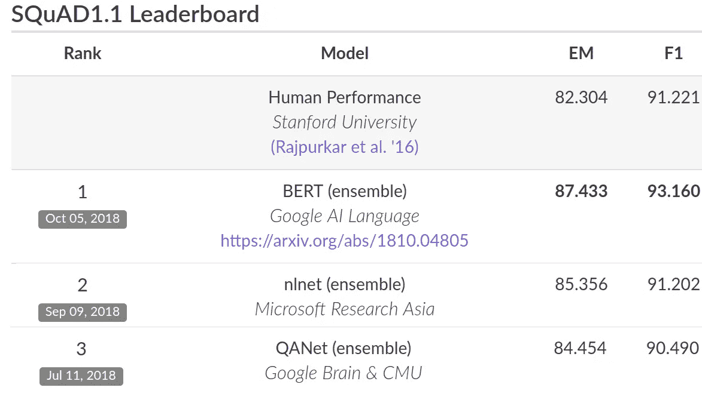

有没有在文本二元分类上尝试过？

老实说，直到最近，我的答案仍然是**不**。

为什么不呢？

因为 BERT 官方 GitHub repo 上的示例代码**不太用户友好**。

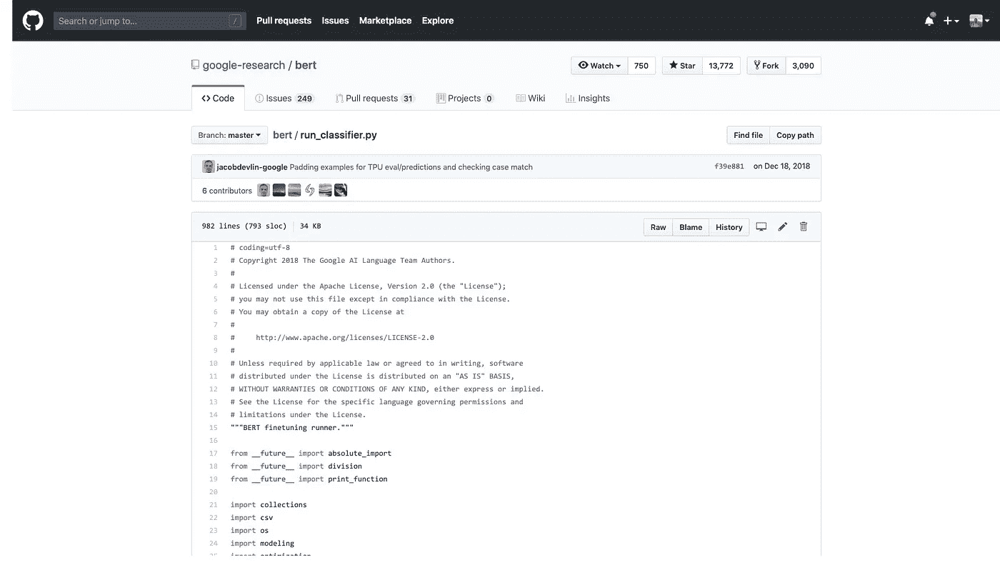

首先，我想要一个 IPython 笔记本，而不是 Python 脚本文件，因为我想在运行代码块时获得即时反馈。当然，谷歌 Colab 笔记本会更好，因为我可以通过免费的 GPU/TPU 立即使用代码。

其次，除了我在乎的人，我不想知道细节。我想控制有用的参数，比如时期数和批量大小。但是，我需要知道所有的“处理器”、“标志”和日志功能吗？

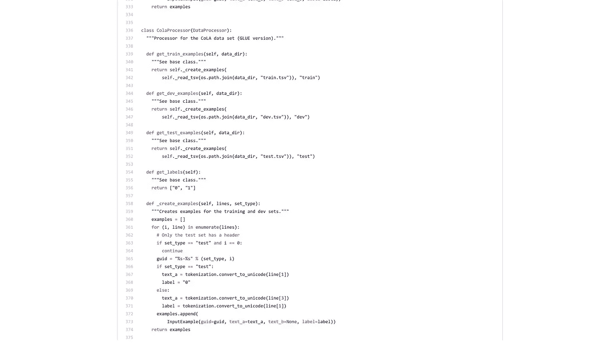

在我尝试了所有其他友好的框架之后，我是一个被宠坏的机器学习用户。

例如，在 Scikit-learn 中，如果你试图构建一个树分类器，这里(几乎)是你所有的代码。

```
from sklearn.datasets import load_iris
from sklearn import tree
iris = load_iris()
clf = tree.DecisionTreeClassifier()
clf = clf.fit(iris.data, iris.target)
```

如果想在 fast.ai 中做图像分类，需要输入这几行。

```
!git clone https://github.com/wshuyi/demo-image-classification-fastai.git
from fastai.vision import *
path = Path("demo-image-classification-fastai/imgs/")
data = ImageDataBunch.from_folder(path, test='test', size=224)
learn = cnn_learner(data, models.resnet18, metrics=accuracy)
learn.fit_one_cycle(1)
interp = ClassificationInterpretation.from_learner(learn)
interp.plot_top_losses(9, figsize=(8, 8))
```

你不仅可以得到分类结果，还可以得到激活图。

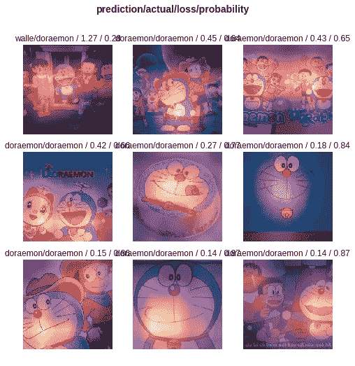

为什么 Google 开发者不能给我们一个类似的界面来使用 BERT 进行文本分类呢？

周一发现[这个 Colab 笔记本](https://colab.research.google.com/github/google-research/bert/blob/master/predicting_movie_reviews_with_bert_on_tf_hub.ipynb)。这是预测影评情绪的一个例子。

我非常兴奋，因为我知道伯特现在已经加入了 Tensorflow 中心。

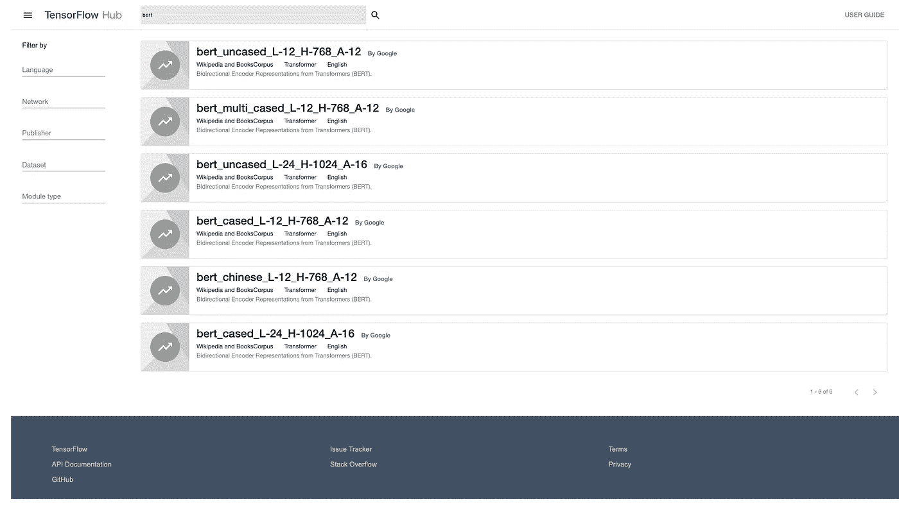

但是打开之后发现，对于一个只关心文本分类应用的用户来说，细节还是太多了。

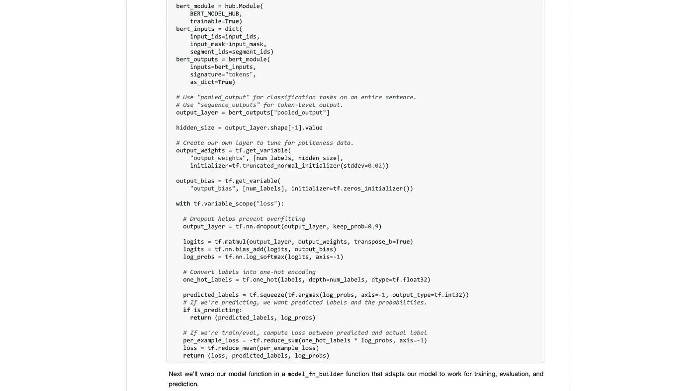

所以我试着重构代码，我做到了。

然而，原来，笔记本里还有很多代码。

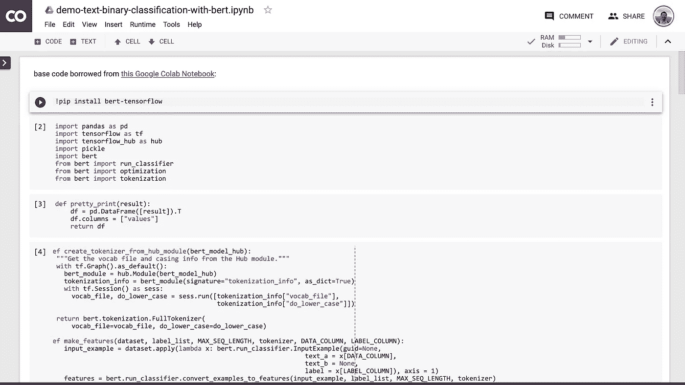

所以我让我的读者帮我打包。很快，[华中科技大学计算机科学专业研究生孙岩](https://github.com/SunYanCN?tab=repositories)就这么做了，并把它做成一个 PYPI 包，命名为`[bert-text](https://github.com/SunYanCN/bert-text)`。

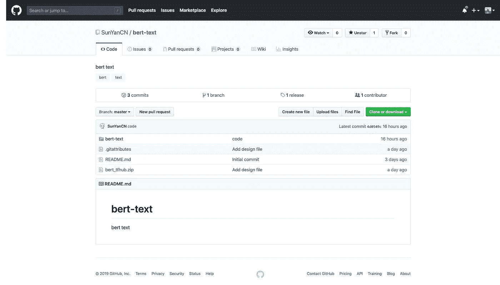

# 笔记本

请点击[这个链接](https://github.com/wshuyi/demo-text-binary-classification-with-bert/blob/master/bert_text_classification.ipynb)，你会在 github 上看到 IPynb 笔记本文件。

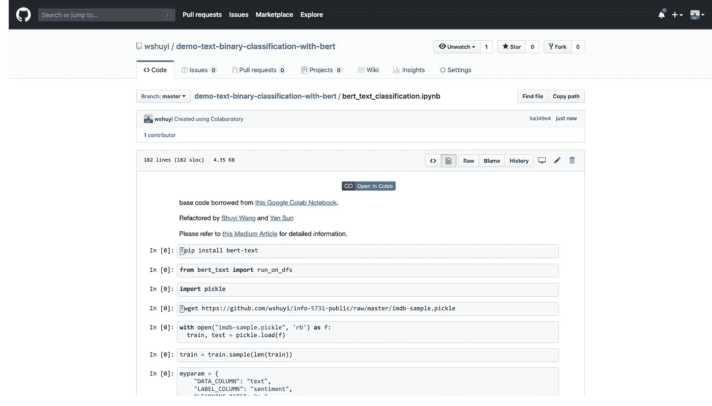

点按“在 Colab 中打开”按钮。Google Colab 会自动打开。

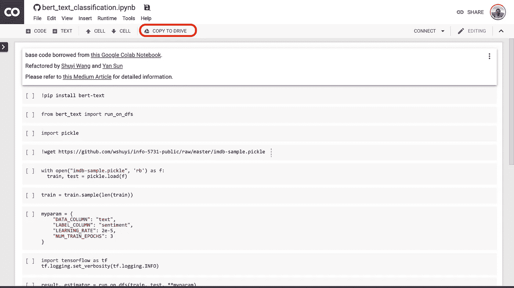

您需要**点击“复制到驱动器”按钮，将副本**保存到您自己的 Google Drive。

之后你只需要做四件事。

1.  安装必要的软件包。
2.  准备熊猫数据框格式的数据。我估计对大多数深度学习用户来说很容易。
3.  如有必要，调整四个参数。
4.  运行笔记本并显示您的结果。

让我们安装`bert-text`包并加载 API。

```
!pip install bert-text
from bert_text import run_on_dfs
```

我的例子是 IMDB 评论的样本数据集。它在训练集中包含 1000 个正样本和 1000 个负样本，而测试集包含 500 个正样本和 500 个负样本。

```
import pickle!wget https://github.com/wshuyi/info-5731-public/raw/master/imdb-sample.picklewith open("imdb-sample.pickle", 'rb') as f:
    train, test = pickle.load(f)
```

我在 UNT 大学的 INFO 5731 课堂上使用它，让学生比较 textblob 包、单词包模型、带有单词嵌入的简单 LSTM 和 ULMfit 的结果。

现在我终于可以把伯特加入名单了。

您需要运行下面一行来确保训练数据被正确地打乱。

```
train = train.sample(len(train))
```

您的数据集应存储在 Pandas 数据框中。应该有一个称为`train`的训练集和一个称为`test`的测试集。

它们都应该至少包含两列。一列用于文本，另一列用于二进制标签。强烈建议选择 0 和 1 作为标签值。

现在数据已经准备好了，可以设置参数了。

```
myparam = {
        "DATA_COLUMN": "text",
        "LABEL_COLUMN": "sentiment",
        "LEARNING_RATE": 2e-5,
        "NUM_TRAIN_EPOCHS":10
    }
```

前两个参数只是数据框的列名。您可以相应地更改它们。

第三个参数是学习率。你需要阅读原始论文，以找出如何明智地选择它。或者，您可以使用此默认设置。

最后一个参数是设置希望 BERT 运行多少个时期。我在这里选择 10，因为训练数据集非常小，我不想让它过拟合。

默认情况下，预先训练的语言模型是“`bert_uncased_L-12_H-768_A-12`”。它已经在英文维基百科和图书语料库上接受了训练。除此之外，现在还有五个选项可供你选择。

*   `bert_multi_cased_L-12_H-768_A-12`
*   `bert_uncased_L-24_H-1024_A-16`
*   `bert_cased_L-12_H-768_A-12`
*   `bert_chinese_L-12_H-768_A-12`
*   `bert_cased_L-24_H-1024_A-16`

如果您想换成另一个预先训练好的模型，比如处理法语或德语的多语言模型，请按如下方式更改`myparam`设置:

```
myparam = {
        "DATA_COLUMN": "comment",
        "LABEL_COLUMN": "sentiment",
        "LEARNING_RATE": 2e-5,
        "NUM_TRAIN_EPOCHS":3,
        "bert_model_hub":"https://tfhub.dev/google/bert_multi_cased_L-12_H-768_A-12/1"
    }
```

汉语是一个特例。您可能需要这样设置`myparam`:

```
myparam = {
        "DATA_COLUMN": "comment",
        "LABEL_COLUMN": "sentiment",
        "LEARNING_RATE": 2e-5,
        "NUM_TRAIN_EPOCHS":3,
        "bert_model_hub":"https://tfhub.dev/google/bert_chinese_L-12_H-768_A-12/1"
    }
```

如果您想看到整个输出(可选)，您应该添加下面两行代码。

```
import tensorflow as tf
tf.logging.set_verbosity(tf.logging.INFO)
```

好吧。现在你可以跑伯特了！

```
result, estimator = run_on_dfs(train, test, **myparam)
```

警告！这一行花了你一些时间来运行。

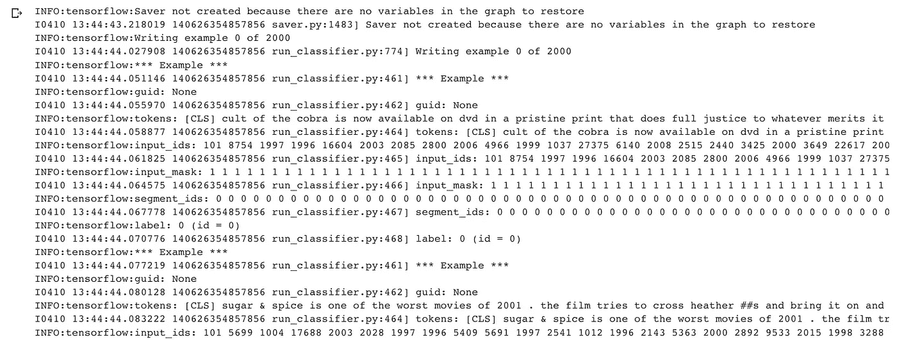

完成后，您可以运行最后一行来获得您的分类模型的评估结果(在 BERT 上)。

```
result
```

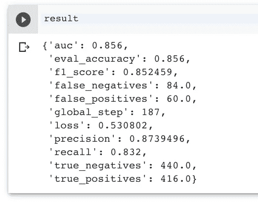

对于这么小的训练集来说，我觉得结果还是挺不错的。

仅此而已。

现在你也可以使用最先进的语言建模技术来训练你的文本二进制分类器！

# 相关博客

如果你对这篇博客文章感兴趣，你可能也想看看下面几篇:

*   [如何用 Google Colab 练习 Python？](/how-to-practice-python-with-google-colab-45fc6b7d118b)
*   [如何用 Python 和递归神经网络预测严重的交通堵塞？](/how-to-predict-severe-traffic-jams-with-python-and-recurrent-neural-networks-e53b6d411e8d)
*   [使用 Python 和 fast.ai 进行深度学习，第 1 部分:使用预训练模型进行图像分类](https://medium.com/datadriveninvestor/deep-learning-with-python-and-fast-ai-part-1-image-classification-with-pre-trained-model-cd9364107872)
*   [使用 Python 和 fast.ai 的深度学习，第 2 部分:使用迁移学习的 NLP 分类](https://medium.com/datadriveninvestor/deep-learning-with-python-and-fast-ai-part-2-nlp-classification-with-transfer-learning-e7aaf7514e04)