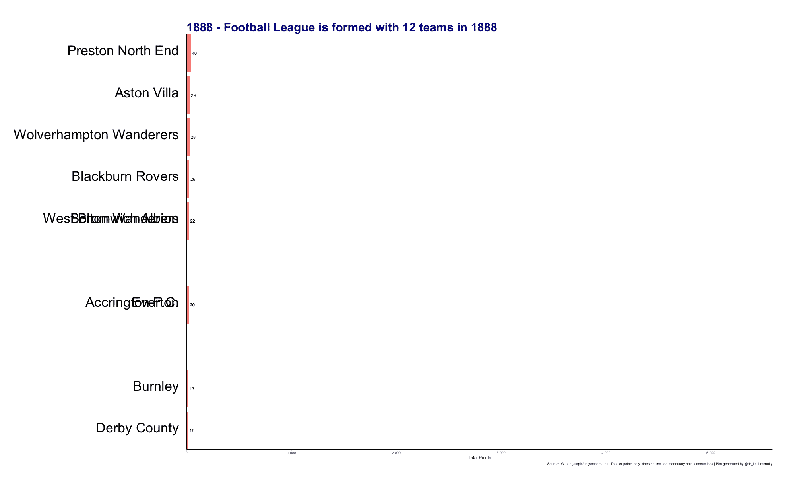
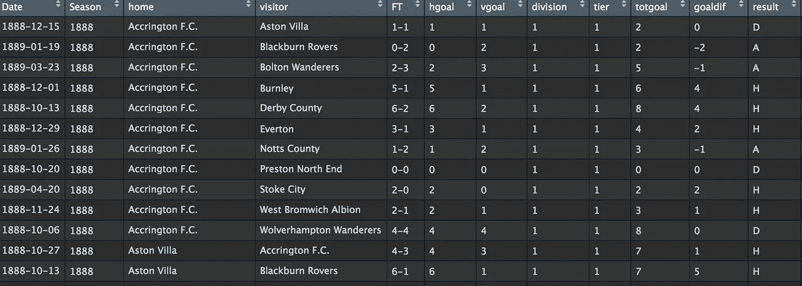
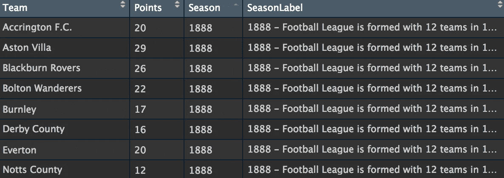

# 如何制作动画“比赛”条形图

> 原文：<https://towardsdatascience.com/how-to-do-that-animated-race-bar-chart-57f3a8ff27a8?source=collection_archive---------3----------------------->

## 探索英国足球有史以来最好的球队，并学习如何制作其中一个已经变得流行的比赛条形图

在本文中，我们将分析英国足球队自 1888 年联赛开始以来的历史表现，并使用该数据创建一个动画条形图，每年循环显示历史上前十名球队的总积分。我们还将使用标题栏来讲述这项运动在英格兰 130 年间的变化。这是成品，所有代码都在 [Github](https://github.com/keithmcnulty/english_football_league) 上:



The abbreviated history of English football

开始之前，让我们明确我们的目标。这是我们想要做的:

1.  生成一个动画，循环播放从 1888 年到 2017 年的每个足球赛季，并显示截至该年每支球队的累计总积分，显示排名前 10 的球队。我们将只考虑在英格兰足球顶级联赛(现在被称为*英超*)中获得的积分。
2.  偶尔在图表标题中加入仿真陈述，有助于讲述足球随时间的变化。

在这篇文章中，我不打算把重点放在样式和美观上，只讨论创建动画图形的基本功能。

## 准备数据

理想情况下，我们需要的是一个数据集，它能告诉我们通过历史获得的联赛积分，但我找不到那个数据集。相反，我发现了更详细、更棒的东西，这是自 1888 年以来每一场比赛的记录，以及结果和分数。我在这里[发现它是以 R dataframe 对象的形式存在的——所以我们将在 R 中这样做。这是数据的快速快照。](https://github.com/jalapic/engsoccerdata/blob/master/data/england.rda)



这个数据集相当大，自 1888 年以来，每一级都有近 200，000 场比赛。首先，我们需要将每场比赛转换为给定球队的积分分配。主队和客队之间的积分分配如下:

*   1981 赛季前冠军得 2 分。从 1981 年赛季开始，为了鼓励更多的进攻，比赛规则发生了变化，获胜者可以获得 3 分。
*   败队得 0 分。
*   如果比赛以平局结束，每人得 1 分。

因此，让我们加载我们的数据，并加载我们的`tidyverse`包进行标准的数据操作。我们将使用`result`列分配主场和客场积分，通过使用`dplyr::mutate()`创建两个新列，如下所示:

```
library(tidyverse)load("data/england.rda")# assign points to results (2 pts for a win up to 1980-81 season then 3 pts for a win afterwards)england <- england %>% 
  dplyr::mutate(
    homepts = dplyr::case_when(
      Season <= 1980 & result == "H" ~ 2,
      Season > 1980 & result == "H" ~ 3,
      result == "D" ~ 1,
      result == "A" ~ 0
    ),
    awaypts = dplyr::case_when(
      Season <= 1980 & result == "A" ~ 2,
      Season > 1980 & result == "A" ~ 3,
      result == "D" ~ 1,
      result == "H" ~ 0
    )
  )
```

现在我们已经为每场比赛分配了积分，我们需要得到每支球队和每个赛季的主场和客场总积分，记住我们只对顶级比赛感兴趣:

```
# restrict to Tier 1 and assemble into total points per seasonhome_pts <- england %>%
  dplyr::filter(tier == 1) %>% 
  dplyr::group_by(Season, home) %>% 
  dplyr::summarize(pts = sum(homepts))away_pts <- england %>%
  dplyr::filter(tier == 1) %>% 
  dplyr::group_by(Season, visitor) %>% 
  dplyr::summarize(pts = sum(awaypts))
```

现在，我们可以将这两个数据框架绑定在一起，将主客场积分相加，得出每个赛季每个球队的总积分:

```
total_pts <- home_pts %>% 
  dplyr::rename(Team = home) %>% 
  dplyr::bind_rows(
    away_pts %>% 
      dplyr::rename(Team = visitor)
  ) %>% 
  dplyr::group_by(Season, Team) %>% 
  dplyr::summarise(pts = sum(pts))
```

现在我们有了一个数据框架，显示了每支球队在每个赛季获得的积分。我们想操纵这一点，以便每个赛季显示我们所有积分的总和，包括该赛季。我们可以通过一个快速的`for`循环来实现这一点:

```
# create rolling sumstable <- total_pts %>% 
  dplyr::filter(Season == 1888) %>% 
  dplyr::select(Season, Team, Points = pts)for (i in 1889:2017) {
  table <- total_pts %>% 
    dplyr::filter(Season <= i) %>% 
    dplyr::group_by(Team) %>% 
    dplyr::summarise(Points = sum(pts, na.rm = TRUE)) %>% 
    dplyr::mutate(Season = i) %>% 
    dplyr::bind_rows(table)
}
```

我们已经做了足够的工作来获得目标 1 所需的数据。对于目标 2，我将编辑`Season`栏，加入一些关于英格兰足球联赛的重要史实。我会让每个事实显示大约三季，让它在动画中出现足够长的时间，让观众阅读。让我们称这个新编辑的专栏为`SeasonLabel`。

```
# add some historic facts to seasonstable <- table %>% 
  dplyr::mutate(
    SeasonLabel = dplyr::case_when(
      Season <= 1891 ~ paste(Season, "Football League is formed with 12 teams in 1888", sep = " - "),
      dplyr::between(Season, 1892, 1895) ~ paste(Season, "Second Division introduced in 1892", sep = " - "),
      dplyr::between(Season, 1914, 1918) ~ paste(Season, "League suspended during World War I", sep = " - "),
      dplyr::between(Season, 1920, 1924) ~ paste(Season, "Third Division North/South introduced in 1920/21", sep = " - "),
      dplyr::between(Season, 1925, 1928) ~ paste(Season, "New Offside Law introduced in 1925", sep = " - "),
      dplyr::between(Season, 1939, 1945) ~ paste(Season, "League suspended during World War II", sep = " - "),
      dplyr::between(Season, 1958, 1961) ~ paste(Season, "Regional Third Divisions amalgamated in 1958 to form Nationwide Third and Fourth Divisions", sep = " - "),
      dplyr::between(Season, 1965, 1968) ~ paste(Season, "Substitutes first allowed in 1965", sep = " - "),
      dplyr::between(Season, 1974, 1977) ~ paste(Season, "First match played on a Sunday in 1974", sep = " - "),
      dplyr::between(Season, 1981, 1984) ~ paste(Season, "Three points for a win introduced in 1981", sep = " - "),
      dplyr::between(Season, 1986, 1989) ~ paste(Season, "Play-offs introduced to decide some promotions", sep = " - "),
      dplyr::between(Season, 1992, 1995) ~ paste(Season, "Premier League formed in 1992, reducing Football League to three divisions", sep = " - "),
      dplyr::between(Season, 2004, 2007) ~ paste(Season, "Football League renames divisions in 2004 to Championship, League One and League Two", sep = " - "),
      dplyr::between(Season, 2013, 2016) ~ paste(Season, "Goal Line Technology introduced in Premier League in 2013", sep = " - "),
      1L == 1L ~ as.character(Season)
    )
  )
```

现在让我们来看看我们的数据:



现在我们有了编码动画所需的一切。让我们使用`save(table, 'data/table.RData')`保存我们的数据集，这样我们就可以在一个新文件中打开它，我们将使用它来创建动画。

## 创建动画

在[这个 StackOverflow 讨论](https://stackoverflow.com/questions/53162821/animated-sorted-bar-chart-with-bars-overtaking-each-other/53163549)的帮助下，我们将使用`ggplot2`包为这些数据设计一个静态条形图，然后我们将使用 awesome 包`gganimate`生成一个滚动动画，该动画通过每个`SeasonLabel`进行过渡并更新条形图。

让我们加载数据和一些我们需要的包。然后，首先，我们需要对每个赛季的每个球队进行排名，因为排名将决定柱线在“比赛”图中出现的顺序。我们还为每个团队创建了一个相对于排名靠前的团队的相对值，因为这将有助于衡量标准。最后，我们创建一个标签来从`Points`列中提取值。然后我们限制排名前 10 的队伍。

```
library(tidyverse)
library(ggplot2)
library(gganimate)
library(gifski)
ggplot2::theme_set(theme_classic())load("data/table.Rdata")# generate top n ranking by year groupanim_table <- table %>%
  dplyr::group_by(Season) %>%
  dplyr::mutate(
    rank = min_rank(-Points) * 1,
    Value_rel = Points / Points[rank == 1],
    Value_lbl = paste0(" ", Points)
  ) %>%
  dplyr::filter(rank <= 10) %>%
  dplyr::ungroup()
```

现在我们已经拥有了绘制静态条形图所需的一切——这只需要一串相当基本的`ggplot2`命令。我不会详细讨论这些，但是如果你需要重新熟悉这些，我推荐你从 tidyverse.org 开始。这里的要点是，我们使用`rank`作为 x 美学，`Points`作为 y 美学，然后我们分配`Team`和`Points`，然后我们翻转图表，使其水平而不是垂直。

```
# create static bar chartp <- ggplot2::ggplot(anim_table, aes(rank)) +
  ggplot2::geom_tile(aes(
    y = Points / 2,
    height = Points,
    width = 0.9,
    fill = "blue"
  ), alpha = 0.8, color = NA) +
  ggplot2::geom_text(aes(y = 0, label = paste(Team, " ")), size = 12, vjust = 0.2, hjust = 1) +
  ggplot2::geom_text(aes(y = Points, label = Value_lbl, hjust = 0)) +
  ggplot2::coord_flip(clip = "off", expand = FALSE) +
  ggplot2::scale_y_continuous(labels = scales::comma) +
  ggplot2::scale_x_reverse() +
  ggplot2::guides(color = FALSE, fill = FALSE)
```

现在是动画的主要部分。我们给静态图的标题和轴加了标签，但其中一个标签是我们将用来给图加动画的标签——即`SeasonLabel.`这被称为*过渡变量*。所以我们告诉`ggplot2`我们希望标题打印当前的过渡状态——即`SeasonLabel`在动画中旋转时作为标题。最后，我们使用`ease_aes()`来定义值在转换过程中的变化方式——这里有许多您可以尝试的缓和函数，详情请参考帮助文件。

```
# set SeasonLabel as transition state and set to animatep <- ggplot2::labs(p,
    title = "{closest_state}", x = "", y = "Total Points",
    caption = "Source:  Github(jalapic/engsoccerdata) | Top tier points only, does not include mandatory points deductions | Plot generated by [@dr_keithmcnulty](http://twitter.com/dr_keithmcnulty)"
  ) +
  ggplot2::theme(
    plot.title = element_text(color = "darkblue", face = "bold", hjust = 0, size = 30),
    axis.ticks.y = element_blank(),
    axis.text.y = element_blank(),
    plot.margin = margin(2, 2, 1, 16, "cm")
  ) +
  gganimate::transition_states(SeasonLabel, transition_length = 4, state_length = 1) +
  gganimate::ease_aes("cubic-in-out")
```

所以我们的动画情节现在作为对象`p`保存在环境中。我们现在需要做的就是把它作为一个输出文件。有许多设备可用于以各种格式呈现输出，但最常用的有:

*   `gif`输出——产生一个动画图像文件。这需要安装`gifski`包。
*   `mp4`视频输出——这需要在您的机器上安装`ffmpeg`。

在我的例子中，我将按照之前显示的图像创建一个`gif`。您可以通过使用`duration`参数来调整 gif 的速度，也可以定制图像的大小和分辨率。

```
# save as preferred rendered formatgganimate::animate(p, nframes = 200, fps = 5, duration = 100, width = 2000, height = 1200, renderer = gifski_renderer("anim.gif"))
```

根据您在`animate()`函数中设置参数的方式，文件可能需要更长时间来渲染，但是您可以在控制台中查看进度。

## 继续教育

这是一个简短的实际案例研究。它只涵盖了 r 中很小一部分动画的可能性。我鼓励你多读一些关于`gganimate`的内容，然后尝试用它来制作一些你自己的数据动画。时间序列数据尤其适合制作好的动画。R 中的`plotly`包也增加了动画功能，值得一看。

最初我是一名纯粹的数学家，后来我成为了一名心理计量学家和数据科学家。我热衷于将所有这些学科的严谨性应用到复杂的人的问题上。我也是一个编码极客和日本 RPG 的超级粉丝。在[*LinkedIn*](https://www.linkedin.com/in/keith-mcnulty/)*或*[*Twitter*](https://twitter.com/dr_keithmcnulty)*上找我。*