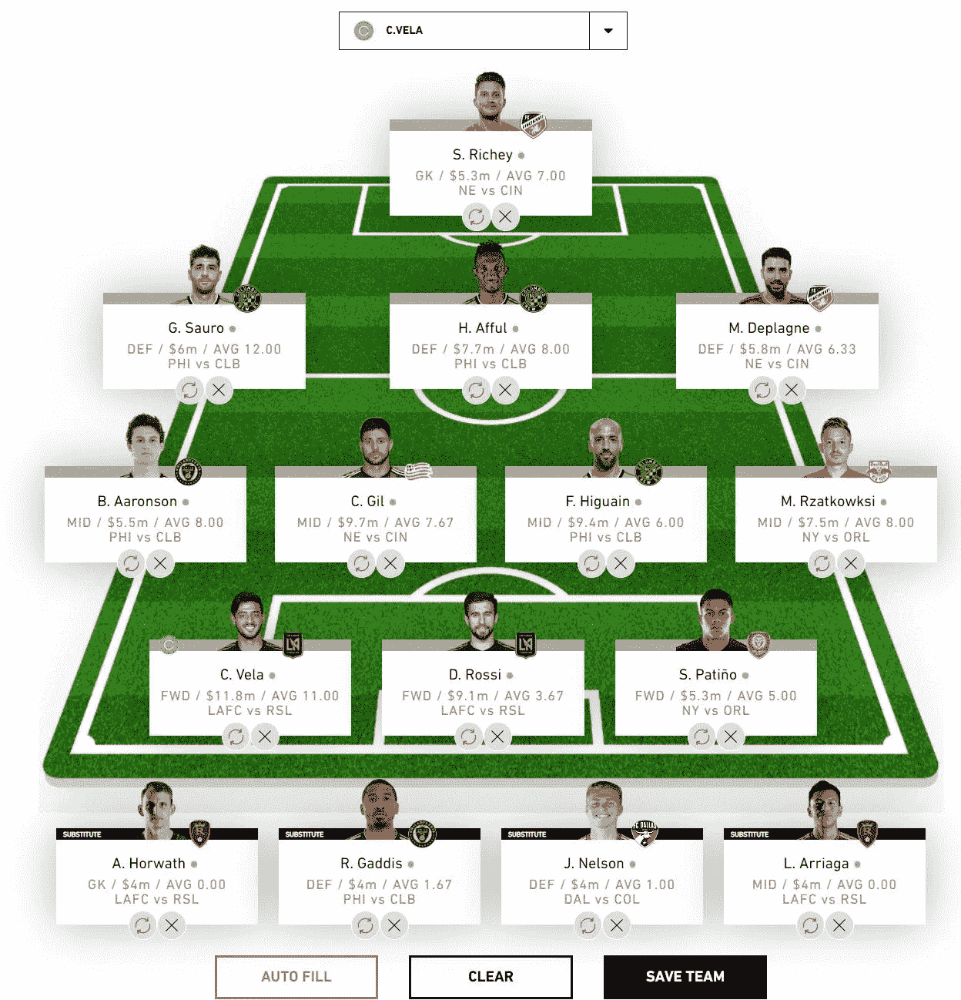

# 如何主宰 MLS 幻想

> 原文：<https://towardsdatascience.com/how-to-dominate-mls-fantasy-e60de8cae01d?source=collection_archive---------27----------------------->

## 编写 python 脚本来自动选择最佳 MLS 幻想阵容


Can algorithms really help when selecting a MLS Fantasy lineup?

# 你好，老朋友

> 所有非美国读者请注意，请原谅我把这项运动称为“英式足球”而不是“橄榄球”。尽情享受吧！

我在堪萨斯城长大，对和家人一起参加堪萨斯奇才队(现在是堪萨斯城体育队)的比赛有很多美好的回忆。作为一名足球运动员(请注意，不是很好)，我喜欢看我最喜欢的运动员在球场上一决雌雄，无休止地寻找球网的背面。为了在比赛间隙消磨时间，我经常阅读花名册的宣传信息，尽可能地了解我偶像的一切。

随着年龄的增长，我的注意力转移到了海外联赛，但随着美国职业大联盟在过去几年的复苏，我现在渴望回到我小时候喜欢的联赛。

在我退出美国职业棒球大联盟十多年的时间里，体育产业发生了巨大的变化，最大的不同是梦幻体育的引入和主导地位。这些年来，梦幻体育产业的受欢迎程度绝对呈爆炸式增长，并帮助许多粉丝了解了一项新的运动或联盟，鼓励他们在没有理由或欲望的情况下关注比赛。由于梦幻体育的包容性，我决定求助于 MLS Fantasy 来帮助我重新了解球队和明星。作为一个数据呆子，我不会让纯粹的猜测支配我的幻想阵容，而是创建一个算法，为我确定一个最佳阵容。


At the mercy of the laws of the game. Photo by [Noelle Otto](https://www.pexels.com/@noellegracephotos?utm_content=attributionCopyText&utm_medium=referral&utm_source=pexels) from [Pexels](https://www.pexels.com/photo/woman-athletes-playing-soccer-906073/?utm_content=attributionCopyText&utm_medium=referral&utm_source=pexels)

# 制定家规

在我们深入研究我使用的算法和我取得的结果之前，我们需要定义 MLS Fantasy 的规则和约束。任何有经验的人都可以跳到下一部分，因为这只是一个回顾。

MLS Fantasy 的基本前提是在每个比赛周创建一个能返还最多积分的阵容。这些分数可以通过在球场上采取积极的行动来获得，例如进球，助攻，扑救，传球等等。对球队产生负面影响的行为也会被扣分，例如乌龙球、防守失误或收到裁判的黄牌或红牌。这些分数是根据他们对比赛的影响来衡量的，所以进球得分比成功传球得分高得多。

所有球队由 2 名守门员、5 名后卫、5 名中场和 3 名前锋组成。首发阵容必须包括 11 名球员，其中 1 名是守门员。MLS Fantasy 支持很多不同的阵型，比如 3–5–2(3 个后卫，5 个中场，2 个前锋)，3–4–3，4–5–1，4–4–2，4–3–3，5–4–1，5–3–2。所有不在首发阵容中的球员都将被指定为替补(稍后会有更多)。

有趣的是，每支 MLS 梦幻球队都有 1 亿美元的比赛周预算来选择球队。每个球员都有一个基于他在联盟中相对表现的价格。例如，在撰写本文时，LAFC 的卡洛斯·贝拉是联盟中最贵的球员，身价 1180 万美元。一般来说，大多数球员的身价在 400 万美元到 1200 万美元之间。要使一个球队有效，名单上所有球员的总成本必须小于或等于 1 亿美元。低于 1 亿美元没有任何惩罚或奖励，所以建议获得一个尽可能接近最大预算的阵容，以优化团队的实力。

除了成本和位置限制之外，球队的最后一个主要限制是每支球队可以选择的球员数量。MLS Fantasy 限制同队球员的数量为 3 名，所以你不能从华盛顿联队选择超过 3 名球员。

替补队员给局面带来了一点麻烦。默认情况下，替补队员不会为你的周总成绩加分，不管他们在比赛中的个人表现如何。然而，如果你的首发球员在一周内一分钟都没有上场，替补就派上用场了。在这种情况下，你的第一个符合条件的替补名单将自动取代没有上场的球员。

一旦阵容确定，当每个玩家的游戏开始时，MLS Fantasy 将锁定你的名单，防止你在比赛开始后改变你的阵容。幻想游戏将跟踪每个玩家的表现，并计算他的分数。一旦某周的所有比赛结束，该队首发球员的所有得分之和就是你的球队的最终得分。这些分数可以与所有其他幻想玩家进行比较，赛季结束时得分最多的球队可以赢得奖品。


When in doubt, code it out! Photo by [Clément H](https://unsplash.com/@clemhlrdt?utm_source=medium&utm_medium=referral) on [Unsplash](https://unsplash.com?utm_source=medium&utm_medium=referral)

# 构建算法

既然我们已经知道了 MLS Fantasy 的规则，让我们来讨论一下我们将用来生成最佳阵容的实际算法。由于我们希望在给定预算的情况下找到返回的最大点数，线性规划最大化算法似乎是最佳选择。这种算法让我们能够识别出在我们的限制范围内能够产生最高理论点数回报的玩家。幸运的是，Python 包`PuLP`让这变得很容易。为了达到我们期望的结果，我们需要采取以下步骤。

## 从 MLS API 提取数据

首先，我们需要从 MLS API 中提取数据，其中包含所有活跃的 MLS 玩家的信息，如本赛季的总幻想点数，玩家的资格(即。如果一个球员受伤或被禁赛，他就没有资格)，获得该球员的当前价格，以及该球员状态的最近趋势。

## 根据资格过滤玩家

我们不希望包括任何受伤或停赛的球员，因为他们将在接下来的比赛周因未能参加比赛而给我们带来零分。一些球队偶尔也会有周末，不打比赛。虽然这些球队的球员在 API 中被技术上标记为合格，但我们不想将他们包括在内，因为他们在本周没有机会获得积分。

我们也应该删除那些在当前赛季中没有参加过任何比赛的球员，因为他们还没有被证实，并且可能在本周不会有太多的上场时间。任何属于上述类别之一的球员都应该从我们的名单中过滤掉，因为他们给我们的分数可能是最少的。

## 根据运动员最近的表现对他们进行分类

为了确定每个玩家产生大量幻想点数的潜力，我们需要根据玩家的总点数对他们进行分类。我选择看球员最近 5 场比赛的平均水平作为他们目前状态的基准。我认为总积分不能显示一个玩家在过去几场比赛中得分是多了还是少了。考虑到这一点，我们将 MLS 中每一个活跃的玩家按照他们在过去 5 场比赛中的平均得分进行排序，第一个玩家的平均得分最高。

## 按位置分隔玩家

拥有一个单一的球员排序列表并不能给我们带来太多好处，因为我们对每个位置可以包含的球员数量有限制。相反，我们将按照位置(守门员、后卫、中场和前锋)来划分我们的排序列表。由于我们分离了已经排序的列表，每个单独的位置列表仍将根据我们之前的算法进行排序。

## 设置我们的 LP 最大化模型

现在实际创建我们的模型。给定上面详述的 MLS Fantasy 的规则，我们的模型由以下定义:

*   目标函数:我们希望通过只选择给我们最高回报的玩家来最大化可能的点数。`Goalie1`变量是一个二元变量，表示是否应该使用一个特定的守门员(按照我们之前排序的球员名单的顺序)。其他职位也是如此。`Goalie1Pts`是`Goalie1`在过去 5 场比赛中的平均得分:

```
Score = Goalie1Pts * Goalie1 + Goalie2Pts * Goalie2 + ... \
    Def1Pts * Defender1 + Def2Pts * Defender2 + ... \
    Mid1Pts * Midfielder1 + Mid2Pts * Midfielder + ... \
    For1Pts * Forward1 + For2Pts * Forward2 + ... 
```

*   预算约束:接下来，我们需要包括我们的约束。首先是预算限制。默认情况下，我们被允许在我们的阵容上花费 1 亿美元。这个约束可以用下面的等式来表示。`Goalie1Cost`是`Goalie1`的当前成本:

```
Budget = Goalie1Cost * Goalie1 + Goalie2Cost * Goalie2 + ... \
    Def1Cost * Defender1 + Def2Cost * Defender2 + ... \
    Mid1Cost * Midfielder1 + Mid2Cost * Midfielder2 + ... \
    For1Cost * Forward1 + For2Cost * Forward2 + ...
```

*   位置约束:最后，我们有位置约束。目前，MLS Fantasy 认为，如果一个名单包括 2 名守门员，5 名后卫，5 名中场球员和 3 名前锋，则该名单符合条件:

```
Goalie1 + Goalie2 + ... == 2
Defender1 + Defender2 + ... == 5
Midfielder1 + Midfielder2 + ... == 5
Forward1 + Forward2 + ... == 3
```

## 运行模型

随着我们的模型的建立和所有约束的添加，是时候求解模型以找到最优解了。通过运行该模型，假设可以达到最优结果，达到最优结果所需的玩家被设置为值 1。

## 建立花名册

最后，我们需要打印每个位置的建议球员名单。首先，通过检查我们数据集中的每个玩家，我们识别二进制变量的值为 1 的任何玩家，并打印他的名字，因为这个玩家被建议在本周的幻想阵容中使用。


Will this algorithm gain traction on the leaderboard? Photo by [Element5 Digital](https://unsplash.com/@element5digital?utm_source=medium&utm_medium=referral) on [Unsplash](https://unsplash.com?utm_source=medium&utm_medium=referral)

# 检查结果

说到底，算法做得怎么样？请记住，由于国际比赛日的原因，在撰写本文时，许多球队和球员都没有参加比赛。考虑到可用的球员，算法选择了一个相当平衡的阵容，卡洛斯·贝拉作为我的队长，其余的球员虽然非常有天赋，在过去几周取得了令人印象深刻的回报，但并不完全是你可能期望的家喻户晓的名字。我还决定换出更便宜的替补球员，希望额外的预算可以为更强大的阵容提供更多的资金。我的完整阵容可以在下图中找到。



MLS Fantasy Lineup Game Week 4

缺少几个高水平球员的一个可能的理由是，当谈到幻想体育时，算法没有大多数人倾向于拥有的任何偏见。作为人类，我们通常选择有设计师名字的球员，这些名字每周都在联盟中闪耀。虽然这是一个聪明的举动，但它在预算中留下了很少的空间来填补阵容，迫使幻想玩家选择较弱的运动员来填补剩余的空缺。另一方面，计算机不关心运动员的遗产，也不关心他每周能得到多少报酬。他们只看到他们被展示的东西，而在我们的情况下，我们只是展示球场上的表现和幻想的价格标签。

说到底，尽管美国职业棒球大联盟因休息而平静了一周，但我的算法最终选择了一支竞争力强的球队，他们以 65 分的总成绩超过了全国 96%的人。它甚至是全国平均水平 31.5 的两倍。虽然我希望该算法将被证明是有用的，但我并不期望第一次迭代执行得如此之好，特别是考虑到我想从这里进行一些改进。


Plotting a course for the algorithm. Photo by [Daniil Silantev](https://unsplash.com/@betagamma?utm_source=medium&utm_medium=referral) on [Unsplash](https://unsplash.com?utm_source=medium&utm_medium=referral)

# 我们将何去何从？

由于该算法在第一周表现相对强劲，我计划在本赛季余下的比赛中使用它。由于我错过了游戏的前 3 周，我不指望在春季联赛中爬到排行榜的首位，或任何相对接近它的地方，但我计划利用秋季联赛，看看它在这段时间内表现如何。

由于这只是我使用的算法的第一次迭代，我仍然有很多想法让它更好地向前发展，并计划随着赛季的展开融入这些想法。以下只是其中的一些计划:

*   分析不同的小队队形
*   使用不同的方法来发现一个球员的潜力，而不仅仅是过去的 5 个平均水平
*   比起那些只安排一场比赛的球员，更喜欢一周有两场比赛的球员
*   确定在家或在路上打球的影响
*   更喜欢与排名靠后的球队对抗的球员
*   潜在地使用机器学习来预测玩家的预测得分

在接下来的几个月里，我计划半定期地更新算法的进展，以及它与其他算法相比表现如何。

这个结果是侥幸吗？我运气好吗？还是说国际比赛日给这个等式带来了一个在通常的比赛周不会出现的异常？所有这些问题的答案很可能都是“是”然而，由于 MLS Fantasy 的预算式设置，线性规划最大化算法似乎是为这个游戏量身定制的。

只有时间能证明我的计划会有多成功。对于一个完全基于数字的游戏来说，为什么不应该有一个可以利用这些数字的工具呢？