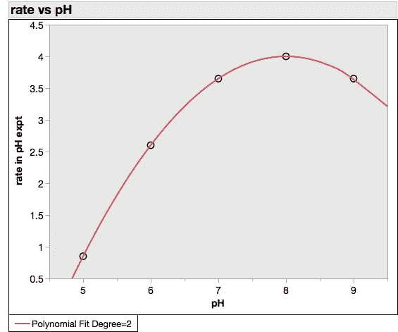
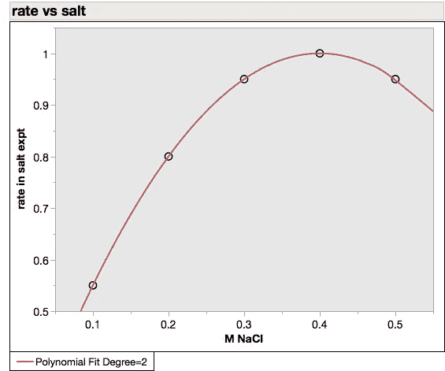
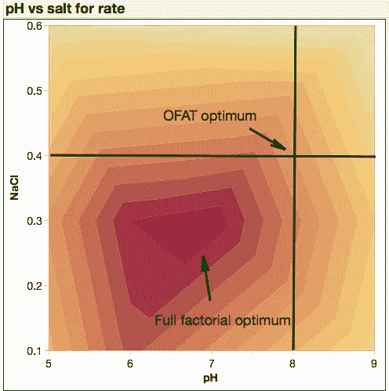
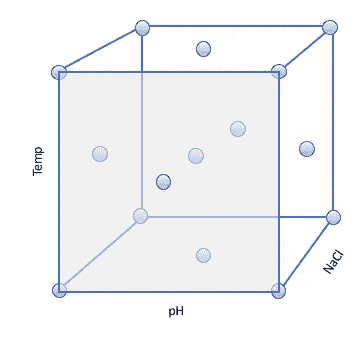
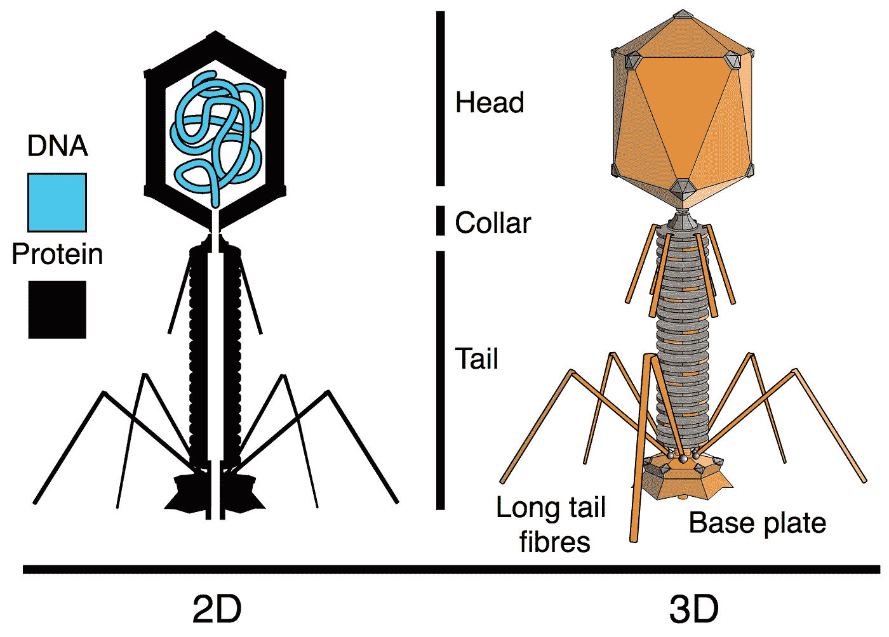
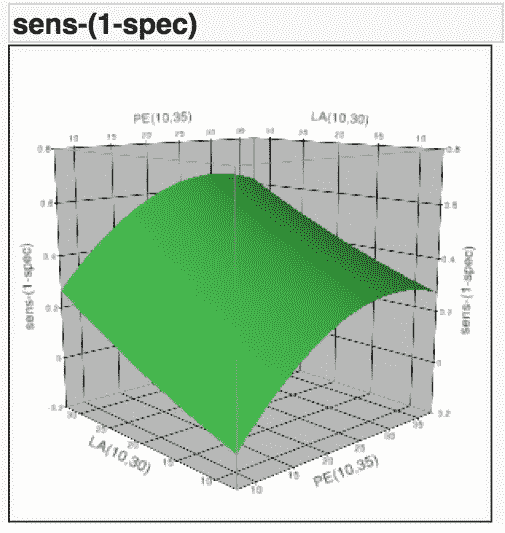

# 如何让您的 R&D 团队的生产力翻倍

> 原文：<https://towardsdatascience.com/how-to-double-the-productivity-of-your-r-d-team-3b4b103f0fd7?source=collection_archive---------26----------------------->

## 一点点数学知识可以帮助你走很长的路

1919 年，英国面临大规模饥荒。虽然赢得了战争，但却破产了。几十年来，英国一直是粮食进口国，现在既不能自己生产足够的粮食，也不能从其他国家购买。债台高筑，经济混乱，政治家们希望科学家们能收拾残局。

他们求助于成立于 1843 年的农业研究站 Rothamsted。它的使命过去是(现在也是)使用科学方法来提高农业生产率。到 1919 年，它已经积累了大量的数据。

农业研究既高度复杂又极其缓慢。许多因素都会影响结果，有些在实验者的控制范围之内，有些则不然:天气、土壤、害虫、基因、肥料等等。更糟糕的是，实验既缓慢又昂贵——实验者不能加快季节的转换，而且可以工作的土地有限。

*Winter brassica seedlings at Rothamsted* Philip White / [CC BY-SA 2.0](https://creativecommons.org/licenses/by-sa/2.0/)

Rothamsted 的主任约翰·拉塞尔希望新的统计学能有助于加速事情的进展。他雇佣了正在开发遗传统计学的[罗纳德·费雪](https://en.wikipedia.org/wiki/Ronald_Fisher)，让他重新分析农作物数据，看看是否能学到更多东西并立即投入使用。

有可能。费希尔开发了一套技术，将从给定实验中提取的信息量增加了一倍，这是一项重大突破。

为了做到这一点，他忽视了科学探究的一条基本规则，这条规则可以追溯到弗朗西斯·培根，被认为是科学方法的关键。所有科学教育级别都教授的规则是:在每个实验中，你努力创造两个只有一个因素不同的场景。做到这一点，你就可以把不同场景之间的结果差异归因于那个因素。

Fisher 展示了如何在一个实验方案中同时分析多个变量。他的方法把噪音变成了数据。不受控制的因素，如天气或土壤，不一定会掩盖来自(例如)作物品种差异的信号。取而代之的是，多元分析提取了这些信号，并额外产生了关于其他因素影响的信息，包括它们之间的相互影响。

从这种事后分析中得到的教训被扩展到实验设计中。经过适当的随机化和考虑，最佳多因素设计每次运行产生的信息是单因素设计的两倍。

但是走进任何一个生物科学实验室，无论是学术的还是工业的，询问实验的统计设计，你得到的可能只是一个无言的眼神。

生物学家是热爱科学但讨厌数学的人。我们发现图片比数字更有说服力。我们为自己对实验系统如何工作有了一种感觉而自豪。任何关于我们不知道如何恰当地设计实验，或者我们应该用统计算法来代替我们来之不易的判断的建议都可能会遭到怀疑和敌意。

但这是真的。大多数科学家不知道如何设计实验来最大化信息回报。在这个过程中，他们在浪费你的时间和金钱。

# **一个杜撰的例子**

原因如下。一次一个因素(OFAT)的实验设计只有在没有单个因素相互作用的情况下才有效。当他们这样做时，优化就变成了打地鼠游戏:解决一个问题，制造另一个问题。

假设你的团队正在优化一个酶促反应。他们知道(因为他们既聪明又有经验)pH 值和盐浓度等因素可能会影响反应速率。

他们运行一个 pH 系列，得到这样一条曲线:

现在知道了最佳 pH 值，他们在 pH8 下运行 NaCl 系列，并得到以下结果:

你现在知道最佳条件是 pH = 8 和 NaCl = 0.4。这是科学。

但是一些麻烦制造者对此表示怀疑。她熬夜观察酸碱度和盐分的每一种可能的组合。她所发现的令她震惊:

In biology, things interact.

事实证明，降低 pH 值也会降低最佳盐浓度。真正的最佳值实际上是 pH = 6.5 和 NaCl = 0.3。

太好了。但得到这个答案还是费了一番功夫。在六种 pH 水平和六种盐水平下，需要进行 36 次实验。如果她决定添加第三个变量，运行次数将会跳到 216；第四个，到 1296 年。有了更多的变量，你很快就会面临组合爆炸。

你不需要。费希尔和他的后继者表明，从优化设计中获得几乎与全因子实验(36 次运行)一样多的信息是可能的，这比 OFAT 方法(12 次运行)不需要更多的工作。

这里的关键概念是把每一个变量看作实验“空间”中的一个维度。好的实验设计在整个空间中最优地分布运行，对每个区域进行采样，并拾取由因素之间的相互作用引起的失真。对于一个有三个因素的实验，你可以把这个空间想象成一个立方体:

A central composite design for covering the experimental space among three factors. Own work.

像这样的统计设计确保您覆盖实验空间，并且(通过几次迭代)保证您找到一个最优值，不管您的系统行为有多复杂。

当然，像 salt vs pH 这样的简单系统并不是你需要高级设计算法的原因。任何半途而废的团队都可以在一些容易改变的因素中进行优化，即使他们的优化过程是不稳定和低效的。

但是[生物科学正在从分子等简单的还原实体向复杂的细胞、组织和器官链转移。影响这些实体的因素的数量以及它们之间的相互作用导致了潜在响应的组合爆炸(通常是非线性的),这是 OFAT 方法所不能涵盖的。](https://tincture.io/why-medicine-is-moving-on-from-molecules-854b0c918263)

# **现实世界的例子**

我在 MicroPhage 的经历很能说明问题。我们的技术使用细菌病毒(噬菌体)来检测病原体*金黄色葡萄球菌*并确定其抗生素敏感性。噬菌体是用于诊断测试中非常复杂的实体。它们由数百种单独的蛋白质加上一个 DNA 基因组组成，为了产生信号，它们需要宿主细菌中几十种不同蛋白质的作用。该宿主(*金黄色葡萄球菌*)有数百种变异菌株，它们与噬菌体表现出不同的相互作用。更糟糕的是，样本基质(病人血液和培养液的混合物)本身就非常复杂多变。

Bacteriophage — a complex nanomachine for diagnostics. Pbroks13 (redraw) [CC BY-SA 2.5 ([https://creativecommons.org/licenses/by-sa/2.5](https://creativecommons.org/licenses/by-sa/2.5))]

当我接管 R&D 团队时，他们已经用 OFAT 的方法转了几年的轮子，优化了一个方面的性能，却发现另一个方面降级了。按顺序测试变量意味着将一些团队成员的想法排在其他人之前，这恰恰对人际关系动态产生了你所期望的影响。

我们梳理了科学文献(所有 100 年的文献),写下了每一个可能影响性能的合理因素，确保包括每个人最喜欢的想法。我相信这个列表大概有 42 个不同的变量。我们使用统计设计一次筛选出所有人。再过一周。每个人都有贡献，没有人的想法被冷落。

六个因素被证明是重要的，我们继续优化它们，使用一类被称为响应面的设计。以下是对其中两个因素的分析示例:

Non-linearity in action

我们系统地优化了各种测试条件下的性能，以确保我们的产品能够从实验室过渡到临床。最终结果是一项一流的测试，在 5 个小时内(而不是通常的 3 天)识别出*金黄色葡萄球菌*血流感染并确定其抗生素敏感性，准确率达到 98%。

我们花了大约 2000 万美元在 3 年内获得了 FDA 的批准。像我们这样的新诊断技术的通常数字更像是 5 年和 5000 万美元。但是有了像噬菌体这样的复杂实体作为关键成分，我非常怀疑我们使用 OFAT 的方法是否能成功。尽管噬菌体科学已有一百年的历史，但微噬菌体测试是第一个(也是唯一一个)FDA 批准的基于噬菌体的诊断方法。

虽然这是一次技术上的成功，但却是一次商业上的失败；先进的实验设计无法帮助营销工作。但是，如果你的技术包括相互作用的复杂组件，那么你肯定会发现自己被 OFAT 设计的局限性所困扰。实验的统计设计是你走出陷阱的方法。