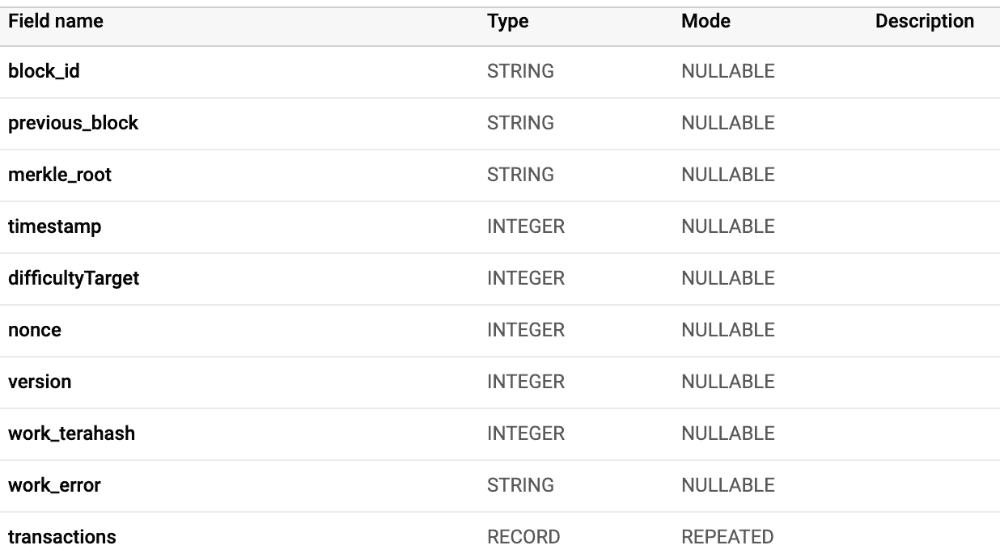
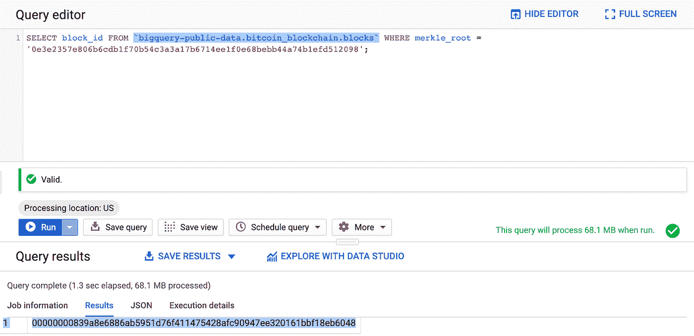
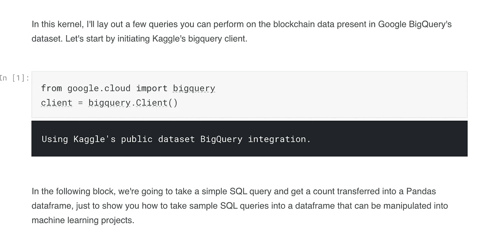

# 如何通过机器学习从加密货币中获得洞察力

> 原文：<https://towardsdatascience.com/how-to-draw-insights-from-cryptocurrencies-with-machine-learning-52ef318c4c1f?source=collection_archive---------31----------------------->

## 一个方便的教程，总结了你可以做些什么来加载，处理和制作加密货币数据集的有用模型。

Source: Pixabay

加密货币热潮催生了各种各样的用例以及大量有趣的数据。由于默认情况下，支持这些加密货币的许多区块链都是公开的，因此不同区块链之间会产生大量数据。由于每个数据点都创造了经济价值，因此有各种各样的项目和参与者在研究这项技术，从税务监管机构到那些希望预测未来加密货币价格的人。

我是第一批为 TechCrunch 和 VentureBeat 撰写新加密货币以及比特币在汇款支付中的使用的人之一。我对这个主题很熟悉，我也是一个数据科学爱好者，曾帮助跳板公司在[的机器学习训练营工作，并有工作保障](https://www.springboard.com/workshops/ai-machine-learning-career-track/)，所以我一直在寻找方法，将加密货币产生的大量数据与你可以在这些数据基础上建立的具有现实意义的机器学习项目结合起来。

幸运的是，谷歌大查询[可以轻松地免费处理一些世界领先的基于比特币的加密货币的](https://cloud.google.com/blog/products/data-analytics/introducing-six-new-cryptocurrencies-in-bigquery-public-datasets-and-how-to-analyze-them)数据，从比特币到 Zcash。

谷歌能够建立一个简单的分类器，检测交易是否来自于矿池。[你可以在 iPython 笔记本](https://www.kaggle.com/wprice/bitcoin-mining-pool-classifier)中导入一个库，并开始使用 SQL 查询这个庞大的数据集。让我们用一些样本数据查询来找点乐子，看看我们能用谷歌手头的[比特币数据](https://console.cloud.google.com/bigquery?p=bigquery-public-data&d=crypto_bitcoin&page=dataset&pli=1)做些什么。

模式中有两个主要的表需要检查:一个“blocks”表和一个“transactions”表，它们是可连接的。

以下是块表的模式:

Source: Author screenshot

在这里，我们需要知道几个基本的定义。区块链由一系列包含交易数据的数据块组成，这些数据块在一段时间后按顺序确认。使用 block_id 查询，我们实际上可以缩小到区块链中的特定块。

让我们用这个探险家来玩转一下区块链的基本概念。查看第一块，我们看到第一块有 50 个比特币输出。区块高度(1)表示它是比特币 mainnet 区块链中挖掘和验证的第一个区块，这是比特币的生产版本，人们使用它在彼此之间进行金融价值交易(与测试网相反，测试网仅用于暂存目的)。

您可以使用 previous_block 变量查询区块链中的前一个 block_id。在这种情况下，块高度为 1，没有 previous_block 引用。但是，如果您查看块高度为 2 的块，那么 previous_block 将引用 genesis 块/块高度为 1 的块。

Merkle root 是一个块中所有散列事务的[散列，它允许您以低得多的计算成本来验证整个块的完整性。](https://bitcoin.stackexchange.com/questions/10479/what-is-the-merkle-root)

每个数据块还有一个[时间戳](https://en.bitcoin.it/wiki/Block_timestamp)，它有一个相对准确的度量标准，用于验证数据块的有效性，并作为一个额外的认证层来抵御区块链攻击者。每个区块中的[难度目标](https://en.bitcoin.it/wiki/Difficulty)是开采一个区块需要多少计算能力的度量:每 2016 个区块调整一次难度，以确保每 10 分钟开采一个区块的持续平衡速率。由于比特币是一个[工作验证](https://en.wikipedia.org/wiki/Proof_of_work)系统，挖掘区块是允许系统就其当前状态达成共识的东西，无论存在多少节点和交易。

每个块都有一个满足网络要求的[随机数](https://en.bitcoin.it/wiki/Nonce)，这意味着该块可以被挖掘。有一个版本标记，讲的是比特币代码的核心配置的[版本，可以作为一个区块是在什么条件和具体规则下被挖掘的标记。](https://bitcoin.org/en/version-history)

Work_terahash 表示贡献和挖掘一个块需要多少计算能力。以现在的比特币为例，认真的矿工会运行 terahashes(万亿次尝试的比特币问题解决方案)——每秒高达 13 次。该度量可以作为挖掘一个块需要多少计算资源的代理(连同难度等级)。

您可以在 [BigQuery explorer](https://console.cloud.google.com/bigquery?) 上试验不同的查询来测试它们，尽管您会受到速度的限制，尤其是对于返回千兆字节数据的大型数据查询。这个限制很容易与丰富的区块链数据发生冲突。

Google BigQuery 有一个特殊的函数，在这个函数中，您需要使用反斜杠(`)将表名括起来，这样它也是一个有效的查询。

作为第一个查询，我们可以看看比特币中的[第一块](https://www.blockchain.com/btc/block-height/1)，也就是[创世纪块](https://en.bitcoin.it/wiki/Genesis_block)。我们看到它的 Merkle 根是“0 E3 e 2357 e 806 b 6 CDB 1 f 70 b 54 c 3a 17 b 6714 ee 1 f 0 e 68 bebb 44 a 74 B1 EFD 512098”。为该 Merkle 根选择 block_id 将得到 genesis 块的 block_id，[00000000839 A8 e 6886 ab 5951d 76 f 411475428 AFC 90947 ee 320161 bb f18 EB 6048](https://www.blockchain.com/btc/block/00000000839a8e6886ab5951d76f411475428afc90947ee320161bbf18eb6048)。当我们检查区块链资源管理器中的 block_id 时，我们看到它保存的块高度为 1，这证实了这实际上是比特币中开采的第一个块。

Source: Author screenshot

在分析了所有的块变量之后，我们可以进入交易级别的变量——不同比特币用户之间的交易量。

通过交易表的主键 transaction_id，我们可以解锁一个块内单个交易的信息:从每个块内每笔交易的代码输出到 [satoshis](https://www.investopedia.com/terms/s/satoshi.asp) (1 亿 satoshis 等于一个比特币)的金额的一切。区块将有许多交易，这些交易是比特币的生命线，即不同账户之间的价值转移。

coinbase 还包含与传输的 satoshis 无关的代码和输出——这可以用于识别[挖掘池](https://en.wikipedia.org/wiki/Mining_pool)之类的事情，这些挖掘池聚合计算能力，然后在个体贡献者之间分配加密货币挖掘的收益，这些贡献者明确地将他们的签名作为输出放在块 coinbase 上以识别他们自己。

在体验了不同的 SQL 查询和 Google BigQuery 接口提供的不同概念之后，我们可以使用 Kaggle 的 BigQuery 客户端工具及其内核接口直接导入到 iPython 笔记本中，然后还可以执行聚合函数、子函数以及 SQL 提供的所有功能，以获取数据块及其包含的事务的准确数据量。

让我们对比特币区块链数据 [**中包含的每个数据块进行计数，并使用 iPython 和 Kaggle 内核**](https://www.kaggle.com/rogerdata/crypto-tutorial-for-towards-data-science?scriptVersionId=19801402) 中的接口进行一些不同的查询，我们可以通过它们与 BigQuery 的集成轻松获得数据。

Source: Author screenshot

利用这种在比特币区块链和不同加密货币上获取丰富数据的能力，我们可以在机器学习中做些什么？

**对矿工是否属于矿池进行分类**

谷歌发布了一个样本项目，该项目能够对给定的交易是否由[矿池](https://en.wikipedia.org/wiki/Mining_pool)生成进行分类，这是一种将几个实体和个人的计算能力聚合在一起的努力，目的是鉴于比特币和其他加密货币的难度，试图成功挖掘它们。

下面的查询[从给定特定地址和空闲时间的输出得到 26 个特征向量](https://gist.github.com/allenday/16cf63fb6b3ed59b78903b2d414fe75b)。使用一个简单的随机森林分类器和 coinbase 中的矿工分类，谷歌能够训练和标记一个模型，帮助确定交易是否可能作为采矿池的一部分产生。

**将加密货币的兴趣和难度与价格水平相关联并进行预测**

你可以考虑各种因素，如区块链的难度和哈希能力，以及链条上的交易活动量，并将其与[历史价格数据](https://coinmarketcap.com/)相关联，看看你是否可以根据时间序列分析和链条因素预测未来价格——目前这可能是一项非常有利可图的投资。

**根据属性对不同的区块链进行分类**

你可以从不同的区块链中获取不同的属性，例如矿工奖励的[基尼系数](https://en.wikipedia.org/wiki/Gini_coefficient)，就像在对 Kaggle**上的[以太坊经典的分析中所做的那样，然后使用它来分析基于不同特征的不同区块链之间的相似性，例如采矿奖励的集中程度，或者难度水平或版本历史变化——或者你可以找到的任何其他东西。](https://www.kaggle.com/yazanator/analyzing-ethereum-classic-via-google-bigquery)**