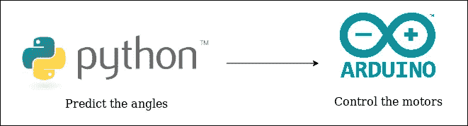
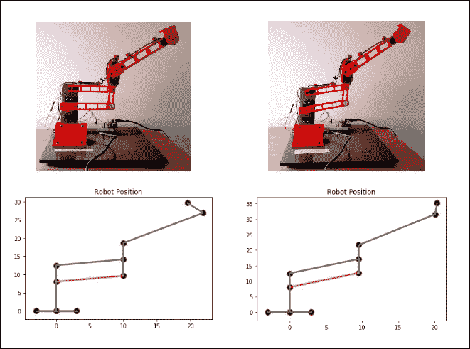

# 如何用 Python 驱动你的 Arduino 推进的机械臂

> 原文：<https://towardsdatascience.com/how-to-drive-your-arduino-propulsed-robot-arm-with-python-4e428873237b?source=collection_archive---------19----------------------->

Arduino 微控制器是一个漂亮的电子产品。开箱即用，它可以驱动您的大多数设备和原型。GPIO 的数量、用户友好的 IDE 和低廉的价格**给现代原型方法**带来了重大变化。然而，这种怪物不能解决强大的计算过程。由于机器人涉及复杂的算法，你应该考虑 Python 和 Arduino 的合作来让它活起来。

这是“从零开始设计机器人手臂”系列的第二篇文章。

在第一篇文章中，我们获得了一个相当有用的 Keras 模型，并在模拟中对其进行了图形化测试。

**现在我非常兴奋能在真正的原型上使用这个模型！**我们希望评估它与模拟结果相比有多好，并得出关于我们的接近值的第一个结论。最后的工作将是设计一些方法来最小化误差。

## Python 和 Arduino 之间的串行链接。

为了连接它们，我想使用 pySerial 库，它使我们能够通过 Arduino 的串行端口进行通信。

基本上，当 Arduino 通过串口监听时，python 脚本会同时向他发送一些信息。这种基本的通信过程使我们能够向机器人发送我们预测的角度三元组，以便将它驱动到希望的位置。



Serial Communication Process

在端口参数中，您需要输入 Arduino 卡使用的通信端口。波特率应该与 Arduino 脚本中的波特率相同。

Code on the python-side

在 Serial.begin(9600)行中，您正在设置波特率。

Code on the Arduino-side

## 使用模型生成推论(预测需求角度)

多亏了 Keras 图书馆，这项工作才得以完成。你只需要使用函数

```
model.predict
```

您还可以决定创建两个不同的脚本:一个将训练模型，另一个将利用它。为此，您需要在第一个脚本中保存模型，并在第二个脚本中加载它。

很明显 Keras 已经帮你做了。以下是主要功能:

```
model.save(“model.h5”)
```

并且加载它:

```
model = load_model(“model.h5”)
```

现在你真的离你预想的很近了。现在的任务是设置你的伺服系统，为你的(X，Y)坐标生成预测，并将预测的角度发送给机器人——享受结果。



非常感谢您的阅读，如果您有任何问题，或者您有合理的批评，或者只是想交流您的项目，请随时联系我们。

下一篇文章将会比较模拟和应用程序的健壮性。为此，我使用 CNN 通过视觉识别来检测机器人的位置。

敬请期待！！

这是完整的 Python 脚本。

这是完整的 Arduino 脚本。

为了更好地理解，你应该读一下上一篇文章:

“一种高效快速控制机器人的方法。真的。”https://link.medium.com/LIGf4r3k5Z

**参考文献**:

张量流:[https://en.wikipedia.org/wiki/TensorFlow](https://en.wikipedia.org/wiki/TensorFlow)

https://en.wikipedia.org/wiki/NumPy[号](https://en.wikipedia.org/wiki/NumPy)

https://en.wikipedia.org/wiki/Matplotlib

https://en.wikipedia.org/wiki/Keras