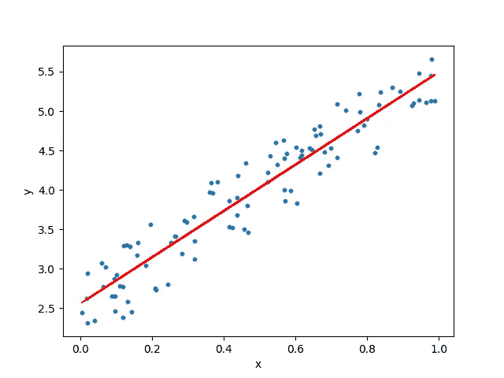

# 如何使用 Flask 轻松部署机器学习模型

> 原文：<https://towardsdatascience.com/how-to-easily-deploy-machine-learning-models-using-flask-b95af8fe34d4?source=collection_archive---------0----------------------->

## 把你的模型从 jupyter 笔记本带到生产中


Photo by [SpaceX](https://unsplash.com/@spacex?utm_source=unsplash&utm_medium=referral&utm_content=creditCopyText) on [Unsplash](https://unsplash.com/s/photos/rocket-launch?utm_source=unsplash&utm_medium=referral&utm_content=creditCopyText)

被困在付费墙后面？点击[这里](https://medium.com/p/how-to-easily-deploy-machine-learning-models-using-flask-b95af8fe34d4?source=email-c3f5233f3441--writer.postDistributed&sk=9db80eba5a150458734179050ddcab1c)阅读完整故事与我的朋友链接！

当数据科学家/机器学习工程师使用 Scikit-Learn、TensorFlow、Keras、PyTorch 等开发机器学习模型时，最终目标是使其在生产中可用。很多时候，当我们从事机器学习项目时，我们会把很多精力放在探索性数据分析(EDA)、特征工程、超参数调整等方面。但我们往往会忘记我们的主要目标，即从模型预测中提取真正的价值。

部署机器学习模型或将模型投入生产意味着将您的模型提供给最终用户或系统。然而，在机器学习模型的部署中存在复杂性。这篇文章旨在让你开始使用 Flask API 将训练好的机器学习模型投入生产。

我将使用线性回归来预测第三个月的销售额，使用前两个月的利率和销售额。

# 什么是线性回归

线性回归模型的目标是找到一个或多个特征(自变量)和一个连续目标变量(因变量)之间的关系。当只有一个特征时，称为*单变量*线性回归，如果有多个特征，称为*多元*线性回归。

# 线性回归假设

线性回归模型可以由下面的等式表示


*   *Y* 是预测值
*   θ ₀是偏差项。
*   *θ* ₁,…， *θ* ₙ为模型参数
*   *x* ₁、 *x* ₂,…、 *x* ₙ为特征值。



Linear regression illustrated

# 为什么是烧瓶？

*   好用。
*   内置开发服务器和调试器。
*   集成单元测试支持。
*   RESTful 请求调度。
*   大量记录。

# 项目结构

该项目有四个部分:

1.  model.py 它包含机器学习模型的代码，用于根据前两个月的销售额预测第三个月的销售额。
2.  app . py——它包含 Flask APIs，通过 GUI 或 API 调用接收销售细节，根据我们的模型计算预测值并返回。
3.  request.py —它使用请求模块调用 app.py 中定义的 API，并显示返回值。
4.  HTML/CSS —它包含 HTML 模板和 CSS 样式，允许用户输入销售详细信息，并显示第三个月的预测销售额。


Pipeline for deployment of a Machine Learning model

# 环境和工具

1.  sci kit-学习
2.  熊猫
3.  numpy
4.  瓶

# 代码在哪里？

事不宜迟，让我们从代码开始吧。github 上的完整项目可以在[这里](https://github.com/abhinavsagar/Machine-Learning-Deployment-Tutorials)找到。

让我们从使用 HTML 为用户输入值制作前端开始。有三个字段需要用户填写——利率、第一个月的销售额和第二个月的销售额。

接下来，我使用 CSS 对输入按钮、登录按钮和背景进行了一些样式设计。

我为这个项目创建了一个自定义销售数据集，它有四列——利率、第一个月的销售额、第二个月的销售额和第三个月的销售额。

我们现在做一个机器学习模型来预测第三个月的销量。首先让我们用熊猫来处理缺失值。当没有为一个或多个项目提供信息时，可能会出现数据缺失。如果没有提供值，我用零填充比率列，用该列的平均值填充第一个月的销售额。我用线性回归作为机器学习算法。

# 序列化/反序列化

简而言之，序列化是一种在磁盘上编写 python 对象的方法，该对象可以传输到任何地方，稍后可以由 python 脚本反序列化(读取)回来。


Serialization, De-Serialization

我使用 pickling 将 python 对象形式的模型转换为字符流。这个想法是，这个字符流包含在另一个 python 脚本中重建对象所需的所有信息。

下一部分是制作一个 API，它通过 GUI 接收销售细节，并根据我们的模型计算预测的销售值。为此，我以 python 对象的形式反序列化了 pickled 模型。我用`index.html`设置了主页面。在使用 POST 请求向`/predict`提交表单值时，我们得到预测的销售额。

可以通过向`/results.`发出另一个 POST 请求来显示结果，它接收 JSON 输入，使用训练好的模型进行预测，并以 JSON 格式返回预测，可以通过 API 端点访问该格式。

最后，我使用请求模块来调用在`app.py`中定义的 API。它显示第三个月返回的销售额。

# 结果

使用此命令运行 web 应用程序。

```
$ python app.py
```


在您的网络浏览器中打开 [http://127.0.0.1:5000/](http://127.0.0.1:5000/) ，应出现如下所示的 GUI。


Graphical user interface

# 结论

本文展示了一种部署机器学习模型的非常简单的方法。我使用线性回归来预测第三个月的销售额，使用利率和前两个月的销售额。人们可以利用在这个博客中获得的知识制作一些很酷的模型，并把它们投入生产，这样其他人就可以欣赏他们的工作。

# 参考资料/进一步阅读

[](/writing-a-simple-flask-web-application-in-80-lines-cb5c386b089a) [## 用 80 行代码编写一个简单的 Flask Web 应用程序

### 快速入门示例教程

towardsdatascience.com](/writing-a-simple-flask-web-application-in-80-lines-cb5c386b089a) [](https://www.coursera.org/learn/deploying-machine-learning-models) [## 部署机器学习模型| Coursera

### 从加州大学圣地亚哥分校学习部署机器学习模型。在本课程中，我们将了解…

www.coursera.org](https://www.coursera.org/learn/deploying-machine-learning-models) [](/simple-way-to-deploy-machine-learning-models-to-cloud-fd58b771fdcf) [## 将机器学习模型部署到云的简单方法

### 使用简单的技术堆栈将您的第一个 ML 模型部署到生产环境中

towardsdatascience.com](/simple-way-to-deploy-machine-learning-models-to-cloud-fd58b771fdcf) [](https://www.kdnuggets.com/2019/06/approaches-deploying-machine-learning-production.html) [## 在生产中部署机器学习模型的不同方法概述

### 将模型投入生产的方法有很多种，不同的方法会带来不同的好处

www.kdnuggets.com](https://www.kdnuggets.com/2019/06/approaches-deploying-machine-learning-production.html) 

# 在你走之前

相应的源代码可以在这里找到。

 [## abhinavsagar/机器学习部署教程

### 从数据收集到将模型投入生产的端到端项目示例…

github.com](https://github.com/abhinavsagar/Machine-Learning-Deployment-Tutorials) 

# 联系人

如果你想了解我最新的文章和项目[，请关注我的媒体](https://medium.com/@abhinav.sagar)。以下是我的一些联系人详细信息:

*   [个人网站](https://abhinavsagar.github.io/)
*   [领英](https://in.linkedin.com/in/abhinavsagar4)
*   [中等轮廓](https://medium.com/@abhinav.sagar)
*   [GitHub](https://github.com/abhinavsagar)
*   [卡格尔](https://www.kaggle.com/abhinavsagar)

快乐阅读，快乐学习，快乐编码。