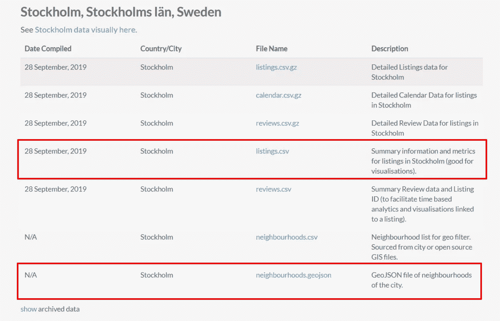
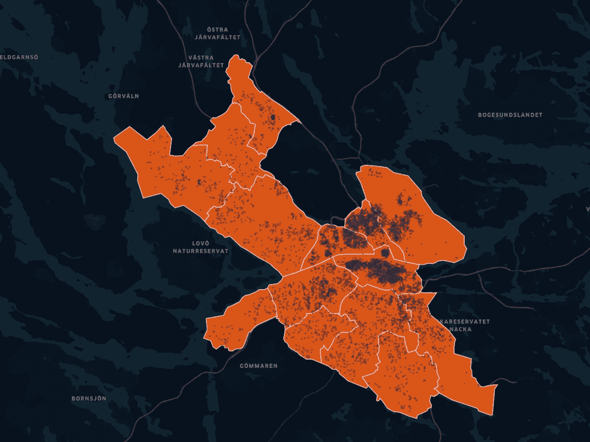
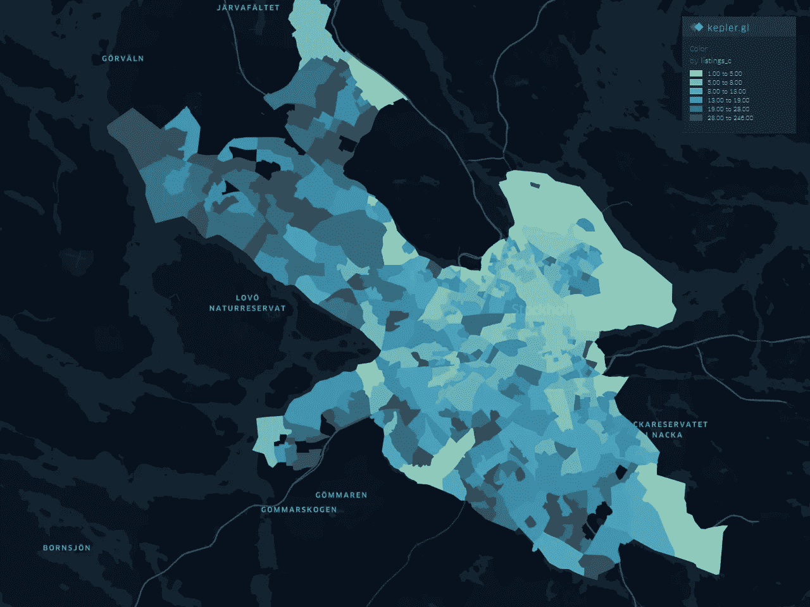

# 如何在 Python 中通过位置快速连接数据—空间连接

> 原文：<https://towardsdatascience.com/how-to-easily-join-data-by-location-in-python-spatial-join-197490ff3544?source=collection_archive---------7----------------------->

## 如何在 Python 中轻松地进行空间连接，以及为什么它是数据科学中经常被忽略的强大工具。

如果你使用了熊猫图书馆，你很有可能已经加入了两个表。令人难以置信的是，将两个共享列的不同数据集组合起来是如此容易。但是您知道有一种基于位置连接表(数据帧)的简单方法吗？


Spatial join example

我向您展示了一种使用**空间连接**来连接表的有效方法。空间连接类似于通过属性连接数据。关键区别仅在于表是基于它们在空间连接中的位置进行连接的。要执行按属性连接，两个表中必须有匹配的键；相反，您需要位置(纬度&经度)来执行空间连接。

空间连接的用例很多。假设您将学校作为点，将学区作为面(多边形)，您想要确定每个学区有多少所学校。通过执行空间连接，可以快速将点表转换为面积表，反之亦然。

## 实际应用:以 Airbnb 数据集为例

足够的概念和假设的例子。让我们举一个具体的例子。我想知道每个投票区有多少 Airbnb 房源。在本教程中，我使用了斯德哥尔摩的 [Airbnb 数据集](http://insideairbnb.com/get-the-data.html)。高亮显示的数据集用于演示空间连接。



Airbnb Dataset Stockholm — [Source](http://insideairbnb.com/get-the-data.html)

让我们像往常一样用`.read_csv()`先读熊猫里的表格。在第 2 步中，我们使用 Geopandas 将纬度和经度转换成几何图形。邻域数据在 Geojson 中，因此我们可以直接在 Geopandas 中读取。Geopandas 是一个高级的 pandas 库，可以轻松处理位置数据。

```
import pandas as pd
import geopandas as gpd# 1-  Listing points
listings = pd.read_csv(“data/stockholm_listings.csv”)# 2 - convert to Geopandas Geodataframe
gdf_listings = gpd.GeoDataFrame(listings,   geometry=gpd.points_from_xy(listings.longitude, listings.latitude))# 3 - Neighbourhoods
geojson_file = “data/stockholm_neighbourhoods.geojson”
neighborhoods = gpd.read_file(geojson_file)
```

`gdf_listings` 表中每个属性有不同的列，包括主机名、邻居、纬度和经度。Geopandas 转换增加了几何列，允许我们进行空间连接。


Airbnb Listings table

另一方面，Geojson 邻域文件保存了邻域的名称和几何图形。


Neighbourhood table

两个数据集都有邻域列，如果你将它们重叠绘制，它们会很好地对齐(如下图)，我们可以很容易地分组，并根据每个邻域的大小来计算每个邻域中的列表数。



Airbnb Listing as Points and Neighborhoods as Areas

但是，假设您有一组不同的邻域(多边形)。假设投票区(较小的区域)提供了更好的粒度，并具有其他有趣的属性，如人口总数。让我先用 Geopandas 读取数据。

```
stockholm_areas = gpd.read_file(“data/stockholm_areas.geojson”)
stockholm_areas.head()
```


每个投票区都有一个保存该区代码的`Deso`列和一个保存每个区总人口的`Total`列。这些新的粒度(更小)区域也完全覆盖了点数据集，**但问题是我们不知道该点属于哪个投票区。**该数据仅来自“邻居”列


Listings map — Points of listings and voting districts

## 空间连接

假设我们对计算每个投票区域(投票区)的列表数量感兴趣。尽管在我们的专栏中不容易获得，但我们可以很容易地做到这一点，这就是空间连接派上用场的地方。只需一行代码，您就可以确定哪个点在每个投票区内。

```
sjoined_listings = gpd.sjoin(gdf_listings, stockholm_areas, op=”within”)sjoined_listings.head()
```

上面的代码根据位置将`gdf_listings`和`stockholm_areas`连接起来。`op`参数决定了你想要什么样的连接。在这种情况下，我们提供了“在内”，这决定了点属于哪个区域。下面是来自连接表的 5 行示例。


Spatial join table

正如您所看到的，这个表根据它们的位置将两者连接起来。我们知道点的属性以及点属于哪个区域。现在用熊猫分组功能很容易统计每个区域有多少房源。我们可以像这样执行 pandas Groupby，以获得每个投票选区中有多少列表。

```
grouped = sjoined_listings.groupby(“Deso”).size()
df = grouped.to_frame().reset_index()
df.columns = [‘Deso’, ‘listings_count’]
```

我们以地区代码`Deso`的数据框架结束，并列出每个地区的计数。


Grouped-by Dataframe — number of listings per voting district

请注意，这个分组数据是一个数据帧。如果你想用投票区数据集，你可以简单地使用 pandas 合并功能，基于两个数据帧上的“Deso”列。

```
merged_areas = stockholm_areas.merge(df, on=’Deso’, how=’outer’)
```

合并的结果是地理数据框架，您可以在地理上对其进行绘制。以下是各投票区列表数量的 Choroplpleth 地图。



Choropleth map — Number of listings per voting district

如果您有一些想法，请尝试空间连接，否则请尝试连接您选择的城市和不同区域的 Airbnb 数据集。

# 结论

空间连接是数据科学中不常用的强大工具。在 Geopandas 的帮助下，用 Python 实现这一点非常直观和简单。在本教程中，我们使用 Airbnb 数据集通过一个实际示例执行了空间连接。我希望您发现这有助于将它添加到您的数据科学技能中。

本教程的代码可以在这个 GitHub 存储库中找到。

[](https://github.com/shakasom/spatialjoin) [## shaka som/空间连接

### 如果你使用了熊猫图书馆，你很有可能已经加入了两个表。令人难以置信的是，这是多么容易…

github.com](https://github.com/shakasom/spatialjoin) 

如果您想直接运行本文的代码，github 存储库中还包含一个 google colab 笔记本。