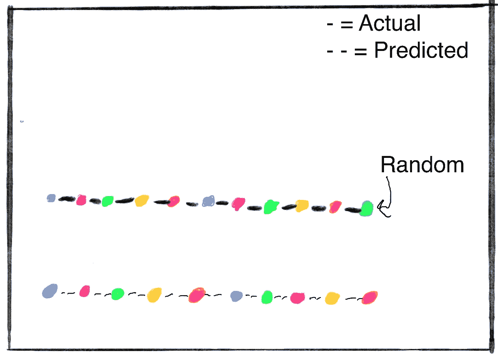

# 如何轻松地教孩子数据科学

> 原文：<https://towardsdatascience.com/how-to-easily-teach-your-kids-data-science-4df1944338be?source=collection_archive---------10----------------------->

父母总是在寻找新的方法让他们的孩子“迷上”科学、技术、数学或工程(STEM)学科。与其说是早期灌输工程学的乐高玩具，不如说是编程的树莓 pi 或 arduino，或者是激发数学和技术兴趣的书籍和玩具，似乎有各种各样的材料可供父母一夜之间将他们的孩子变成 STEM 明星。

不久前在一次飞行中，我邻座的人问我是做什么工作的。我解释说，我本质上是一名数据科学家。他们问我那具体是什么，我没有深究其中的细节，只是说那是“一个质疑数据以寻求答案的人。”这可能不是最好的解释，但他们点点头，继续问我问题。“什么类型的数据？”他们好奇地问，因为他们盯着他们的蔓越莓苹果。我回答说:“天气和气候，但我偶尔也会涉足其他领域，比如能源。”他们接着问，“金融方面呢？”我摇摇头，但接着说“检查财务数据对我来说并不难。数据科学实际上是了解何时使用某些模型，以及哪些功能最适合该模型。”然后，不知从哪里冒出来的，这个人说了一句让我思考了一整天的话:“伙计，我希望我的孩子也能成为那样的人。听起来真的很有挑战性。”我继续解释说，数据科学并不难，寻找(现实的、可验证的)模式才是这个领域的核心。孩子们已经很有能力这样做了。

所以我想，“怎样才能让孩子们成为数据科学家？”结果如下:

请注意，这种方法已经在两个 8 岁和 11 岁的孩子身上进行了测试。

1.  )获得 11 个不同形状、颜色、气味或质地的物体。

就我个人而言，我回想起小时候老师给我们彩虹糖来练习算术的日子。在这里，Skittles 也能很好地工作，只要确保你使用了所有的颜色，但是保留一种颜色作为“随机”或“黑天鹅”数据点。任何可以得到的东西都可以。

2.)在活页夹或其他分隔物(任何不让你的孩子看到的东西)后面，只用你收集的 5 个物体做一个图案(所以如果你有一便士、五分、一角、二角五分和一美元，你可以按你喜欢的任何顺序排列它们)。让你的小科学家看看你做了什么图案，然后添加你的下 5 个对象。

3.)揭秘:问你的小科学家你认为接下来的 5 个物体会是什么图案。如果他们猜对了，显示图案，但将第 11 个(之前未介绍的对象)添加到对象行中。如果他们没有猜对，让他们继续猜，直到他们猜对为止。暗示他们可能已经看过这些物品。

4.)随机性:在处理数据时，随机性或“噪音”是很重要的。人们可能认为它“没什么”,但调查它是非常重要的，而不是它真的“没什么”,或者它是否是一个独特的事件。未引入的对象产生随机性。起初，这会让你的小科学家感到困惑，但是你做得越多，他们就越有可能期待你这样做。

5.)预测:让你的小科学家告诉你下一个 5 天体的顺序会是什么。(做一个假设)将你使用的前 5 个物品放在你在第 3 步中放置的 6 个物品之前。你的孩子应该猜对了，甚至可能猜到你已经将“随机”对象添加回模式中。

6.)下一轮:确保你指出接下来的 5(或 6)个物体将与他们已经看过的图案相似。一旦他们记下了那个模式，你可以通过尝试不同的模式来混合它，或者混合对象来使它变得更复杂。

7.)形象化它:当你进行的时候，让你的小科学家画出物体顺序和它们的预测顺序的图表。这可以通过拿起一支铅笔，写下何时何地出现了什么样的物体来完成——如下图所示。你也应该保持跟踪以验证结果。

How the game should be “playing” out. Image made by author.

8.游戏结束:自然，这是一个可以永远继续下去的游戏，老实说，那样会更有趣。但是，你至少可以在三个回合后结束游戏。匹配它，看看他们做得有多好！

使用你家周围的材料，你可以很容易地教你的孩子关于模式，随机性和数据可视化。我使用这种方法是因为我认为对于父母来说，寻找一种快速、简单的游戏来和他们的孩子一起玩而不需要购买任何东西会更容易。你可以出去让你的孩子看看树叶上的虫子，但是大自然比客厅要复杂一点，你可能不会在虫子身上找到很多图案。不用大词，你已经很容易地向你的孩子灌输了模式、概率和随机性的概念。这些是数据科学家的核心概念，早期理解将使您的小科学家更有可能在以后的其他领域和应用中理解这些东西。

免责声明:这个游戏不会让你的孩子成为数据科学天才，但它将有助于开发一些早期的基础知识。如果你有任何其他方法想要分享，请在下面的回复中发表。