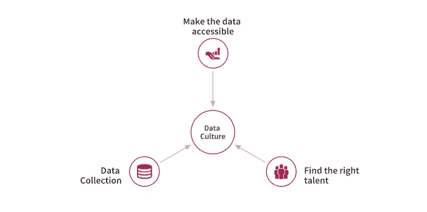
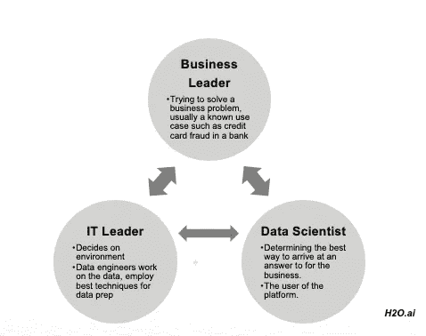
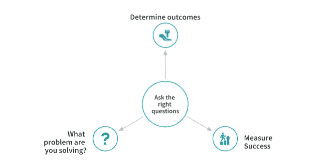
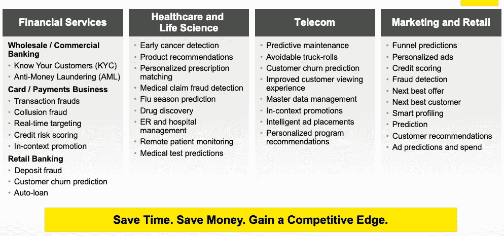
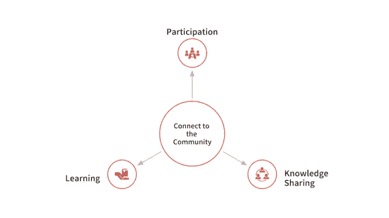
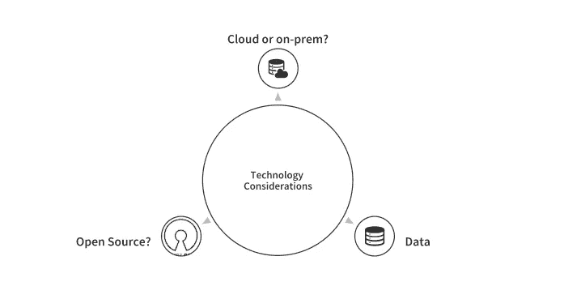

# 如何在你的业务中有效地运用人工智能策略

> 原文：<https://towardsdatascience.com/how-to-effectively-employ-an-ai-strategy-in-your-business-d43f41aa3b04?source=collection_archive---------14----------------------->

## 今天的首席管理人员的 5 个关键人工智能要点

人工智能已经从一个时髦的词发展成为今天的现实。拥有机器学习系统专业知识的公司正在寻求转向基于人工智能的技术。尚不具备机器学习文化的企业正试图设计一种策略来实现这种文化。在这种炒作和被抛在后面的恐惧中，你将如何在你的公司中着手一项人工智能战略？今天，这似乎是一个反复出现的常见问题。本文试图更深入地探讨企业在实施人工智能战略时面临的一些挑战、机遇和可能性。

# 当今人工智能的关键挑战:3t

在一家公司中创建人工智能生态系统会面临很多挑战。所有这些挑战可以归结为三个主要方面:

*   **人才:**组建一个人才团队是当今许多企业最关心的问题之一。
*   **时间:**另一个关键要素是时间。重要的是要看看通过实施人工智能战略，你能以多快的速度获得业务成果。
*   **信任:**信任是指对你的机器学习模型的信任，以及你向监管者和利益相关者解释你的模型结果的能力。

这里有一些解决这些问题的建议，这些建议是通过多年来与大量 H2O.ai 的客户和用户交谈而形成的。

# 1.构建数据文化

为了利用产生的大量数据并理解它们，公司需要首先建立一种数据文化。在一家公司建立数据驱动的文化时，应该记住以下三个要点:

*   **数据采集**

要建立数据文化，首先需要主动收集数据。今天的数据可以从各种来源获得，如市场营销部门、销售部门、产品监控、客户分析等。这实质上形成了基础。

*   **使数据可访问**

已经收集的数据需要向人们公开。这意味着数据应该是这样一种格式，这使得人们可以轻松地处理数据并从中获得有意义的见解。

*   **找到合适的人才**

**数据本质上是一项团队运动**。这意味着，尽管公司需要专家来创建模型和算法，但他们也需要具有不同技术能力的人，这些人可以在将数据传递给专家之前，从数据中发现有用的见解。为此，我们可以培训现有的员工，因为他们拥有这项工作所必需的领域经验。机器学习既是一种文化转型，也是一种商业转型。因此，公司可以雇佣一些数据科学家，并利用现有的经验丰富的员工来协助他们，而不是从头开始创建一个新团队。

# 2.问正确的问题

提出正确的问题是在公司中创造数据文化的必要条件。我如何获得下一个客户，谁是下一个客户，我如何优化我的供应链是当今大多数企业需要回答的一些问题。有时候，将业务问题公式化可以作为实现人工智能的垫脚石。为了能够提出相关的问题，公司需要有****分析型*** 思维定势的人，以及有 ***数据*** 支持的解决方案，而不是直觉。*

*   *你正在解决什么问题？*

*如今，人工智能和机器学习几乎被用于所有行业。一些众所周知的例子如下。*

**

*在这些行业中使用人工智能的想法是为了节省时间和金钱，并获得相对于其他人的竞争优势。如果您的公司处理上述任何用例或一些类似的业务问题，而您只依靠传统方法，您一定会落后。*

*   ***决定结果***

*问正确的问题决定了它能产生什么样的结果。关键思想是将贵公司的高层次目标转化为业务问题，然后确定其结果。*

*   ***衡量成功***

*公司也需要拿出衡量他们成功的标准。不同的公司对成功的定义可能不同，但最终目标是相同的，即盈利和创造价值。*

# *3.连接到社区*

**

*社区在推动任何公司的变革中扮演着至关重要的角色。有在线(网络研讨会)和离线(聚会)两种方式与社区联系。组织聚会、网络研讨会和培训会议可以让一个人交流知识并向他人学习。**向他人学习**，**参与**会议，**分享**相关知识是联系社区的好方法。你在哪里不重要。世界各地都有机器学习社区，可能就在你家旁边就有一个地方分会。*

*连接到社区的另一个重要原因是，今天的大多数数据科学家和研究人员都希望与其他人合作。人工智能领域的技术正在飞速发展，通过连接，人们希望提出所有正确的问题，与他人分享，参与其中，并向每个人学习。不用说，在最近十年中，大多数前沿研究都来自学术界和开源社区。*

# *4.技术考虑*

**

*决定使用哪种技术是一个重要的考虑因素，会对您的业务产生深远的影响。*

*   ***开源还是闭源？***

*如果公司正在开始人工智能之旅，他们可能需要决定是使用开源软件还是开源软件，或者两者兼而有之。机器学习和人工智能领域的许多现有先驱定期开源他们的技术，这可以成为其他人的良好起点。一旦这些新的人工智能玩家成熟了，他们可能需要一个供应商来支持他们。你也可以选择一个本身就是软件包维护者的供应商，例如，对于开源的 H2O-3，H2O.ai 既是维护者也是供应商。*

*   ***云还是本地？***

*这个问题的答案取决于你想以多快的速度开始。如果您刚刚开始，并且没有现成的开发-运营系统，那么开始使用云会更容易。这将消除购买硬件、安装软件、安全、基础设施和维护问题的需要。但是，如果您已经有了一个不错的 DevOps 基础架构，内部部署选项有助于优化成本。许多公司也更喜欢混合模式，无论他们是根据自己的要求在云和本地之间切换，这都是一种很好的做法。*

*   ***数据***

*同样，正如已经提到的，数据是一个关键点。了解如何生成、保存和访问数据至关重要。数据隐私、数据治理和数据传承等是公司需要适当解决的一些问题。*

# *5.信任人工智能*

**

*机器学习模型不应被视为“黑盒”。这意味着我们应该能够清楚地解释或识别他们预测背后的逻辑。能够充分地描述模型的决策，拥有健全的文档，从结果中消除偏见是一些重要的考虑因素，这些都是公司在向人工智能灌输信任元素时需要回答的。*

# *你从这里去哪里？*

*那么，你将何去何从？通过深思熟虑以上五个要点，并与你的团队讨论，公司可以从哪里开始他们的旅程获得一种感觉或方向。思考并确定你目前试图解决的问题，看看你如何使用机器学习和人工智能来给你带来优势。人工智能文化需要发展，就像每一项重要任务一样，需要时间、耐心和资源。*