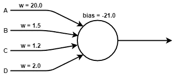
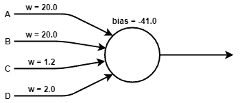
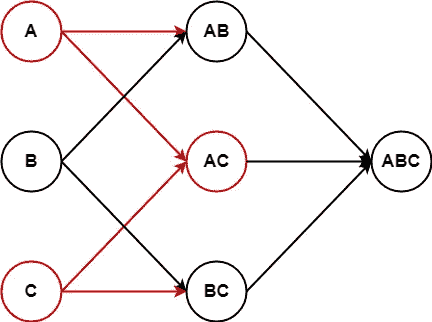

# 如何在大规模神经网络中有效地传播激活

> 原文：<https://towardsdatascience.com/how-to-efficiently-propagate-activations-in-a-massive-neural-network-3faed60cb8f5?source=collection_archive---------40----------------------->

## 事件驱动的方法

在使用 sigmoid 激活函数的传统神经网络中，所有神经元都或多或少地被激活。这里没有不活跃神经元的明确例子。如果你想计算非常大的网络，这可能会有问题，因为在每一轮中，你必须更新所有的神经元。直觉上，只更新那些与当前输入数据集有关系的神经元会更理想。例如，如果你试图处理一只猫的图像，为什么所有与识别宇航员相关的神经元也要活跃呢？实现这个目标的一个先决条件是选择一个合适的激活函数。这种激活函数应该为所有负输入值返回零。人们可以使用 [ReLU](https://en.wikipedia.org/wiki/Rectifier_(neural_networks)) 作为激活函数或双曲正切函数的正半部分。利用这样的激活函数，通过使用零阈值，有可能清楚地区分活跃和不活跃的神经元。既然我们不想更新所有的神经元，那么我们如何决定哪些神经元应该更新呢？一种简单的方法是使用队列。如果一个神经元被激活，只需将所有通过传出突触连接的神经元添加到队列中。然后，在每个处理步骤中，从队列中取出一个神经元，更新它，如果它被激活，就再次将传出神经元添加到队列中。

但是，即使使用这种优化的算法，我们也可能会计算太多的更新操作。大多数更新的神经元在更新后仍将保持不活动。如果在我们真正更新神经元之前，我们就能决定它是否有机会变得活跃，那会怎么样？

让我们仔细看看一个神经元可以拥有的不同权重模式。这里可能有像这样的分离神经元:

在这种情况下，每一个输入神经元的激活都需要一个当前神经元的更新。但是可能会有更多像这样的连接神经元:

这里，输入 **A** 必须在当前神经元有机会激活自己之前被激活。因此，当前神经元的更新仅需要在输入 **A** 被激活之后发生。但是在下面的情况下会发生什么呢？

在这种情况下，在当前神经元需要更新之前，两个输入 **A** 和 **B** 都必须有效。这可以通过需要联合触发的三个或四个输入来进行。那么，我们如何利用这些知识来防止神经元过早更新呢？

这可以通过引入逻辑节点来实现，逻辑节点仅用于确定接下来需要更新哪个神经元。有了这些逻辑节点，我们突然进入了[专家系统](https://en.wikipedia.org/wiki/Expert_system)的领域，尽管我们是从我们的突触权重间接获得我们的知识库。这种基于逻辑的系统的好处是它们允许一些很好的优化。一种这样的优化是将较大的连接节点分割开，并在模式网格中表示它们:

在这样的网格中，如果无法激活节点，激活不需要传播到最特定的节点。例如，如果在这个点阵中只有两个输入 **A** 和 **C** 被激活，那么激活只需要传播到相对一般的节点 **AC** ，而不需要传播到更具体的节点 **ABC** 。因此，在这种情况下，与节点 **ABC** 相关联的神经元不需要更新。当然，这些逻辑节点可以由几个神经元共享。

## 代理对象

使用大型网络结构时出现的另一个问题是如何将它们放入主存。如果模型变得太大，唯一的解决方案是在外部存储模型的一部分。当然，这会造成性能损失，但这真的有那么糟糕吗？如果只有很少使用的神经元和逻辑节点(大多数通常都是这样)被存储在外部，那么这种损失对于大多数应用程序来说应该是可以接受的。延迟参数可用于确定未使用的神经元在被移除之前应在内存中停留多长时间。使用该参数，可以在性能和内存消耗之间进行权衡。

为了能够从网络中移除单个神经元或逻辑节点，可以使用代理对象。代理对象能够从外部源加载神经元，并在需要时将其恢复到主内存中。当然，所有的突触都需要链接这些代理对象，因为一些链接的神经元可能还不在内存中。代理对象简单地提供了一个 *get()* 函数，然后该函数返回对主对象的引用。

当在外部存储器中存储神经元时，区分连接和分离神经元是重要的。根据它们所代表的类别，分离的神经元可能拥有非常大的一组输入突触。为了防止这些大型数据结构需要一次性加载，可以将分离的突触存储在输入神经元侧。

目前，我们正在一个拥有约 2000 万个神经元的网络上使用这种算法，对于一个给定的文档，平均有几千个神经元被激活。一份文件的处理时间约为 100 毫秒至 200 毫秒。

这种方法的一个实现可以在 [**GitHub**](https://github.com/aika-algorithm/aika) 上的 [**AIKA**](http://aika.network) 开源项目中找到。