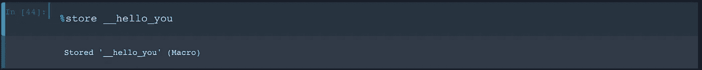

# 技巧、窍门、诀窍和魔法:如何毫不费力地优化您的 Jupyter 笔记本电脑

> 原文：<https://towardsdatascience.com/how-to-effortlessly-optimize-jupyter-notebooks-e864162a06ee?source=collection_archive---------3----------------------->

## 让 Jupyter 笔记本变得更好、更快、更强、更光滑、更棒的完整初学者指南


Image by [peter_pyw](https://pixabay.com/users/peter_pyw-2946451/?utm_source=link-attribution&utm_medium=referral&utm_campaign=image&utm_content=3232570) from [Pixabay](https://pixabay.com/?utm_source=link-attribution&utm_medium=referral&utm_campaign=image&utm_content=3232570)

科技真正酷的地方在于有多少人在努力工作，让你的生活变得更有趣。每一天的每一分钟，都有人把他们的血汗和眼泪投入到工具中，让你的程序、软件包、应用程序和生活运行得更顺畅。

举例来说，你可能会认为一旦你有了 Jupyter 笔记本电脑，就万事大吉了。如果成功了，你就完了！你可能没有意识到的是，有几乎无穷无尽的方法可以定制你的笔记本电脑。安装程序或软件包仅仅是开始！

为什么不花几分钟时间放松一下，做一些改进呢？有很多简单的方法可以让你的 Jupyter 笔记本变得更好、更快、更强、更性感、更有趣。

> 本指南假设您对 Jupyter 笔记本相当陌生。在进入更酷的技巧之前，我们将从初学者真正基础的东西开始。如果您真的是新手，并且在安装和运行 Anaconda 时遇到了困难，您可能想看看这篇文章:

[](/how-to-successfully-install-anaconda-on-a-mac-and-actually-get-it-to-work-53ce18025f97) [## 如何在 Mac 上成功安装 Anaconda(并让它实际工作)

### 正确安装 Anaconda 和修复可怕的“找不到 conda 命令”错误的快速而简单的指南

towardsdatascience.com](/how-to-successfully-install-anaconda-on-a-mac-and-actually-get-it-to-work-53ce18025f97) 

## 重要的事情先来

在你安装好所有东西后，任何时候你想启动 Jupyter 笔记本，你只需要打开你的终端并运行

```
jupyter notebook
```

你就可以开始工作了！

GIF via [GIPHY](https://media.giphy.com/media/D5WcVz5LsoZOg/giphy.gif)

## 更改您的笔记本主题

人们想在 Jupyter 笔记本上改变的第一件事就是主题。人们为黑暗模式疯狂！这非常简单，你可以随时切换。

首先，转到您的终端并安装 Jupyterthemes

```
pip install jupyterthemes
```

现在你可以安装超级流行的黑暗主题

```
jt -t chesterish
```


随时使用恢复主题

```
jt -r
```

点击[此处](https://github.com/dunovank/jupyter-themes)查找 Jupyterthemes GitHub 回购。

## 基本命令

*   您可以使用命令选项板快速访问键盘快捷键。只需键入`Ctrl + Shift + P`或`Cmd + Shift + P`即可进入一个对话框，这很像 Mac 上的 Spotlight Search。它可以帮助你运行任何命令的名字，这是伟大的，如果你不知道键盘快捷键。


*   `Shift + Enter`让您运行当前单元格
*   `Esc`进入命令模式。现在你可以用箭头键在你的笔记本上导航了！

在命令模式下，使用

*   `A`在当前单元格上方插入新单元格
*   `B`在当前单元格下方插入新单元格
*   `M`将当前单元格改为降价
*   `Y`改回代码单元格
*   `D + D`删除当前单元格(按两次键)
*   `Enter`将您从命令模式带回到编辑模式

也

*   `Shift + Tab`将向您显示您刚刚在代码单元格中键入的对象的文档。(您可以持续按下此按钮在几种模式之间循环。)
*   `Esc + F`帮助你查找和替换代码中的信息(不是输出中的)
*   `Esc + 0`切换单元格输出
*   `Shift + J`或`Shift + Down`向下选择下一个单元格。`Shift + K`或`Shift + Up`向上选择单元格。选择单元格后，您可以批量删除/复制/剪切/粘贴/运行它们。当您需要移动笔记本电脑的部件时，这真是太棒了！
*   `Shift + M`允许您合并多个单元格。(如果你只是试图点击你想要工作的单元格，你会有麻烦。按住 shift 键并单击要合并的单元格。然后，在您仍然按住 shift 键的同时，按 m 键。)


*   此外，如果在开头加上感叹号，您可以在笔记本中运行 bash 命令。例如:`!pip install numpy`
*   您可以通过在最后一行代码的末尾添加分号来随时取消该函数的输出。

## 注释和取消注释代码块

您可能希望在工作时添加新的代码行并注释掉旧的代码行。如果您正在提高代码的性能或试图调试它，这是非常好的。

首先，选择您想要注释掉的所有行。

下一步点击`cmd + /`注释掉高亮显示的代码！


## 乳液

您可以随时在 Markdown 单元格中编写 LaTex，它将呈现为一个公式。

这改变了这一点

```
$P(A \mid B) = \frac{P(B \mid A)P(A)}{P(B)}$
```

变成这样


## 漂亮地打印所有单元格输出

通常只打印单元格中的最后一个输出。其他的都要手动添加`print()`，也可以但不是超级方便。您可以通过在笔记本顶部添加以下内容来进行更改:

```
from IPython.core.interactiveshell import InteractiveShellInteractiveShell.ast_node_interactivity = "all"
```

这意味着，虽然通常只打印一个输出


现在您将看到两个输出！


任何时候你想回到原来的设置，只要运行

```
from IPython.core.interactiveshell import InteractiveShellInteractiveShell.ast_node_interactivity = "last_expr"
```

请注意，您必须在单独的单元中运行设置更改，以使其在下一次单元运行时生效。

## 扩展ˌ扩张

因为它是一个开源的网络应用程序，已经为 Jupyter 笔记本开发了大量的扩展。你可以在这里找到[官方的 iPython 扩展列表](https://github.com/ipython/ipython/wiki/Extensions-Index)。这是[另一个流行的扩展包](https://github.com/ipython-contrib/jupyter_contrib_nbextensions)。

您可以随时从命令行安装 Nbextensions，如下所示

带 **pip**

```
pip install jupyter_contrib_nbextensions
jupyter contrib nbextension install --user
```

或者用**蟒蛇**

```
conda install -c conda-forge jupyter_contrib_nbextensions
conda install -c conda-forge jupyter_nbextensions_configurator
jupyter contrib nbextension install --user
```

安装完成后，您会看到一个 Nbextensions 选项卡。继续探索！


[点击这里阅读更多关于扩展的内容，以及如何启用、禁用它们，等等](https://github.com/ipython-contrib/jupyter_contrib_nbextensions)。

关于添加和启用扩展以及如何使用它们，我不会讲太多的细节，因为在你的 Jupyter 笔记本里已经有了很好的解释！只需点击屏幕顶部的“Nbextensions”，点击你感兴趣的扩展，然后向下滚动，找到你需要的信息和一个正在运行的扩展的 GIF！


## 流行的扩展

*   **Scratchpad —** 这太棒了。它允许您创建一个临时单元格来进行快速计算，而无需在工作簿中创建新的单元格。这是一个巨大的时间节省！
*   **腹地** —这将为代码单元格中的每次按键启用代码自动完成菜单，而不仅仅是使用 tab 键
*   **片段** —添加一个下拉菜单，将片段单元格插入当前笔记本。
*   **Autopep8** —这是一个自动格式化 Python 代码以符合 pep8 风格指南的工具。太方便了！确保您已经在本地机器上运行了`pip install autopep8 --user`。这将确保您遵循正确的 python 编码约定。
*   **拆分单元格笔记本** —启用 Jupyter 笔记本中的拆分单元格。进入命令模式，使用`Shift + S`将当前单元格切换为拆分单元格或全角单元格。
*   **目录** —这个扩展使你能够收集所有正在运行的标题，并把它们显示在一个浮动窗口中，作为一个侧边栏，或者带有一个导航菜单。
*   **一个代码美化器—** 清理、格式化和缩进你的代码，所以你不需要这么做。
*   **Notify —** 当您的内核空闲时，它会显示一个桌面通知。当您运行需要几秒钟以上才能完成的代码时，这是非常棒的。
*   **代码折叠—** 在编辑模式下，一个三角形出现在装订线中，用于折叠您的代码。当你有大的函数需要隐藏以提高可读性时，这是个好方法。
*   **禅模式—** 让事情变得不那么杂乱。确保关闭设置中的背景。

## 魔法

当你想执行特定的任务时，魔法是方便的命令，使生活变得更容易。它们通常看起来像 unix 命令，但都是用 Python 实现的[。外面有一大堆魔法！](https://github.com/ipython/ipython/tree/master/IPython/core/magics)

有两种魔法:线魔法(在一条线上使用)和单元格魔法(适用于整个单元格)。线条魔术以百分比字符`%`开始，单元格魔术以两个字符`%%`开始。要查看可用的魔法，请运行:

```
%lsmagic
```


## 设置环境

使用`%env`，你可以轻松管理笔记本的环境变量，而无需重启任何东西。如果您不带任何变量运行它，它将列出您的所有环境变量。


## 插入代码

您可以使用`%load`从外部脚本插入代码。(下面有更多这方面的内容，但它很棒，所以我把它加在这里)例如:

```
%load basic_imports.py
```

将抓取 basic_imports.py 文件并加载到您的笔记本中！

## 导出单元格的内容

这非常有帮助。几乎不费吹灰之力，你就可以用`%%writefile`随时导出单元格内容。例如

```
%%writefile thiscode.pyyou'd write some cool code or function in here
    that you'd want to export
    and maybe even use later!
```

您是否发现自己在每台笔记本上运行相同的导入或一直添加相同的功能？现在可以一次写，到处用！

您可以编写一个包含以下代码的文件`basic_imports.py`:

```
%writefile basic_imports.pyimport pandas as pd
import numpy as np
import matplotlib.pyplot as plt
```

这将创建一个包含基本导入的. py 文件。

您可以随时通过编写以下内容来加载它:

```
%load basic_imports.py
```

执行此操作会用加载的文件替换单元格内容。

```
# %load imports.pyimport pandas as pd
import numpy as np
import matplotlib.pyplot as plt
```

现在我们可以再次运行单元来导入我们所有的模块，我们准备好了。


## 存储和重用代码:%macro Magic

像大多数人一样，你可能会发现自己一遍又一遍地写着同样的任务。也许有几个方程你发现自己在重复计算，或者有几行代码你已经产生了无数次。Jupyter 允许你将代码片段保存为可执行的宏！宏只是代码，所以它们可以包含在执行前必须定义的变量。来定义一个吧！

比方说

```
name = 'Kitten'
```

现在，为了定义一个宏，我们需要一些代码来使用。我们可以保存几乎任何东西，从字符串到函数，或者你需要的任何东西。

```
print('Hello, %s!' % name)**Hello, Kitten!**
```

我们使用`%macro`和`%load`魔法来建立一个可重用的宏。以双下划线开始宏名以区别于其他变量是很常见的。

```
%macro -q __hello_you 32
```

这个`%macro`魔术需要一个**名称**和一个**单元号**(或者数字)，我们也传递了`-q`以使它不那么冗长。`%store`允许我们保存任何变量，以便在其他会话中使用。这里我们传递了我们创建的宏的名称，这样我们可以在内核关闭后或在其他笔记本中再次使用它。

要加载宏，我们只需运行:

```
%load __hello_you
```

为了执行它，我们可以运行一个包含宏名的单元格。

```
__hello_you**Hello, Kitten!**
```


Image by [Ilona Ilyés](https://pixabay.com/users/ilyessuti-3558510/?utm_source=link-attribution&utm_medium=referral&utm_campaign=image&utm_content=2059668) from [Pixabay](https://pixabay.com/?utm_source=link-attribution&utm_medium=referral&utm_campaign=image&utm_content=2059668)

成功！

让我们修改我们在宏中使用的变量。

```
name = 'Muffins'
```

当我们现在运行宏时，我们修改后的值被选中。

```
__hello_you**Hello, Muffins!**
```


这是因为宏在单元格范围内执行保存的代码。如果`name`没有定义，我们会得到一个错误。


Image by [Helga Kattinger](https://pixabay.com/users/HelgaKa-2849566/?utm_source=link-attribution&utm_medium=referral&utm_campaign=image&utm_content=4279713) from [Pixabay](https://pixabay.com/?utm_source=link-attribution&utm_medium=referral&utm_campaign=image&utm_content=4279713)

**想要在所有笔记本上使用相同的宏吗？**

## 商店魔术

`%store`允许您存储宏并在所有 Jupyter 笔记本上使用。



现在你可以打开一个新的笔记本，用`%store -r __hello_you`试试。把婴儿装上车，你就可以出发了！

```
%store -r __hello_you
name = 'Rambo'
%load __hello_you**Hello, Rambo!**
```


Image by [Winsker](https://pixabay.com/users/Winsker-31470/?utm_source=link-attribution&utm_medium=referral&utm_campaign=image&utm_content=2442332) from [Pixabay](https://pixabay.com/?utm_source=link-attribution&utm_medium=referral&utm_campaign=image&utm_content=2442332)


## 运行魔法

magic 将执行您的代码并显示任何输出，包括 Matplotlib 图。你甚至可以这样执行整个笔记本。

`%run`可以从执行 python 代码。py 文件。它还可以执行其他 Jupyter 笔记本。

## Pycat 魔法

如果您不确定脚本中有什么，您可以随时使用`%pycat`来显示脚本的内容。

```
%pycat basic_imports.py
```


## 自动保存

这个魔术可以让你改变你的笔记本自动保存到检查点文件的频率。

```
%autosave 60
```

这将设置你每 60 秒自动保存一次。

## 显示打印图像

```
%matplotlib inline
```

你可能已经知道这个，但是`%matplotlib inline`会在你的单元格输出中显示你的 Matplotlib 绘图图像。这意味着您可以在笔记本中包含 Matplotlib 图表和图形。在笔记本的开头，也就是第一个单元格中运行这个是有意义的。


## 时机

有两个 IPython 神奇的命令对计时很有用— `%%time`和`%timeit`。当您有一些缓慢的代码，并且您试图确定问题在哪里时，这些非常有用。它们都有行模式和单元模式。

`%timeit`和`%time`的主要区别在于`%timeit`多次运行指定代码并计算平均值。

`%%time`会给你单元格内单次运行代码的信息。

`%%timeit`使用 Python [timeit 模块](https://docs.python.org/3.5/library/timeit.html)，该模块运行一条语句无数次，然后提供结果的平均值。您可以使用`-n`选项指定运行次数，使用`-r`指定重复次数，等等。

## 从不同的内核运行代码

您也可以使用指定的语言执行单元格。有多种语言的扩展。你有如下选择

*   `%%bash`
*   `%%HTML`
*   `%%python`
*   `%%python2`
*   `%%python3`
*   `%%ruby`
*   `%%perl`
*   `%%capture`
*   `%%javascript`
*   `%%js`
*   `%%latex`
*   `%%markdown`
*   `%%pypy`

例如，要在笔记本中呈现 HTML，您可以运行:

```
%%HTML
This is <em>really</em> neat!
```


你也可以随时直接使用[乳胶](https://www.latex-project.org/)

```
%%latex
This is an equation: $E = mc^2$
```


## 谁会魔法

不带任何参数的`%who`命令将列出全局范围内存在的所有变量。传递一个类似于`str`的参数将只列出该类型的变量。所以如果你输入类似

```
%who str
```

在我们的笔记本里，你会看到


## 普伦魔法

`%prun`显示你的程序在每个函数上花了多少时间。使用`%prun statement_name`会给出一个有序的表格，显示每个内部函数在语句中被调用的次数、每次调用所用的时间以及函数所有运行的累计时间。

## Python 调试器魔术

Jupyter 有自己的 Python 调试器接口。这使得有可能进入函数内部，看看那里发生了什么。您可以通过运行单元格顶部的`%pdb`来打开它。

## 高分辨率绘图

IPython magic 的一个简单行将为您提供 Retina 屏幕的双倍分辨率图形输出。请注意，这不会在非视网膜屏幕上呈现。

```
%config InlineBackend.figure_format ='retina'
```

## 跳过一个单元格不运行

只需在单元格顶部添加`%%script false`

```
%%script falseyou'd put some long 
    code here that you don't want to run 
    right now
```

## 提醒我

这实际上是 Python 的一个技巧，但是当你运行的代码需要花费很长时间时，你可能需要它。如果你不想整天盯着你的代码，但是你需要知道它什么时候完成，你可以让你的代码在完成的时候发出“警报”!

**在 Linux(和 Mac)上**

```
import os
duration = 1  *# second*
freq = 440  *# Hz*
os.system('play --no-show-progress --null --channels 1 synth %s sine %f' % (duration, freq))
```

**在 Windows 上**

```
import winsound
duration = 1000  *# millisecond*
freq = 440  *# Hz*
winsound.Beep(freq, duration)
```

为了使用这个，你需要安装`sox`，你应该能够做到

```
brew install sox
```

…假设你安装了自制软件。如果您还没有花时间定制和改进您的终端，您可能想看看这篇文章！

[](/trick-out-your-terminal-in-10-minutes-or-less-ba1e0177b7df) [## 在 10 分钟或更短时间内搞定你的终端

### 如何在短短几分钟内打造一个更好、更快、更强、更性感的终端

towardsdatascience.com](/trick-out-your-terminal-in-10-minutes-or-less-ba1e0177b7df) 

## 现在玩得开心！

这应该足以让你开始！如果你知道任何你认为可以帮助其他初学者的技巧和诀窍，请在下面的评论中让每个人都知道。你在这里的选择是无限的！

如果你真的想让事情更上一层楼，你可能想看看这篇文章:

[](/speed-up-jupyter-notebooks-20716cbe2025) [## 优化 Jupyter 笔记本电脑—全面指南

### 根据我在过去一年中得到的一些提示，找到瓶颈并大幅提高速度。

towardsdatascience.com](/speed-up-jupyter-notebooks-20716cbe2025) 

如果您对构建交互式仪表盘感兴趣，请查看这个:

[](https://blog.dominodatalab.com/interactive-dashboards-in-jupyter/) [## 用 Jupyter 构建交互式仪表盘

### 欢迎来到“高级 Jupyter 笔记本技巧”的第二部分在第一部分，我描述了魔术，以及如何计算笔记本…

blog.dominodatalab.com](https://blog.dominodatalab.com/interactive-dashboards-in-jupyter/) 

感谢阅读！如果你想接触或者找到更多很酷的文章，请来[内容简约](https://contentsimplicity.com/articles/)和我一起吧！

[](https://contentsimplicity.com/articles/)