# 如何在你的 Azure 数据科学项目中嵌入安全性

> 原文：<https://towardsdatascience.com/how-to-embed-security-in-your-azure-data-science-project-55ef3f2ab47?source=collection_archive---------13----------------------->

## 使用 Azure 数据块和 Azure 安全服务和技术

# 1.介绍

许多公司努力将他们的数据科学项目投入生产。在之前的[博客](/how-to-bring-your-data-science-project-in-production-b36ae4c02b46)中，讨论了如何为数据科学项目建立构建/发布管道。这使得公司能够 1)端到端地跟踪模型，2)建立对模型的信任，从而 3)避免模型预测令人费解的情况。

在每个构建/发布管道中，安全性都是一个重要的主题。常见的安全方面如下:

*   对数据和端点的身份验证和授权
*   数据和端点的网络隔离
*   保险库中密钥的安全存储和密钥滚动过程

***2020 年 9 月 17 日更新:本博客专用的博客和 gitrepo 不维护，不能 1 对 1 使用。不过，这些想法仍然有效。一个工作实例，见我之前的*** [***博客***](/how-to-bring-your-data-science-project-in-production-b36ae4c02b46)

# 2.目标

在本教程中，将创建一个机器学习模型的构建/发布管道，用于预测一个人的收入阶层。在这种情况下，一个模型被构造成 Azure Databricks，然后这个模型被部署在一个 Web 应用中，这个 Web 应用充当 HTTPS 端点。构建/发布管道中包含以下安全方面:

*   数据存储在 Azure Storage gen 2 中，服务端点指向 VNET
*   密钥存储在密钥库中，密钥翻转是构建步骤的一部分。
*   Azure Active Directory 用于对 Web 应用程序进行身份验证
*   (可选)Web 应用程序是在 VNET 应用程序服务环境(ASE)中创建的

这可以在下面的体系结构概述中描述:

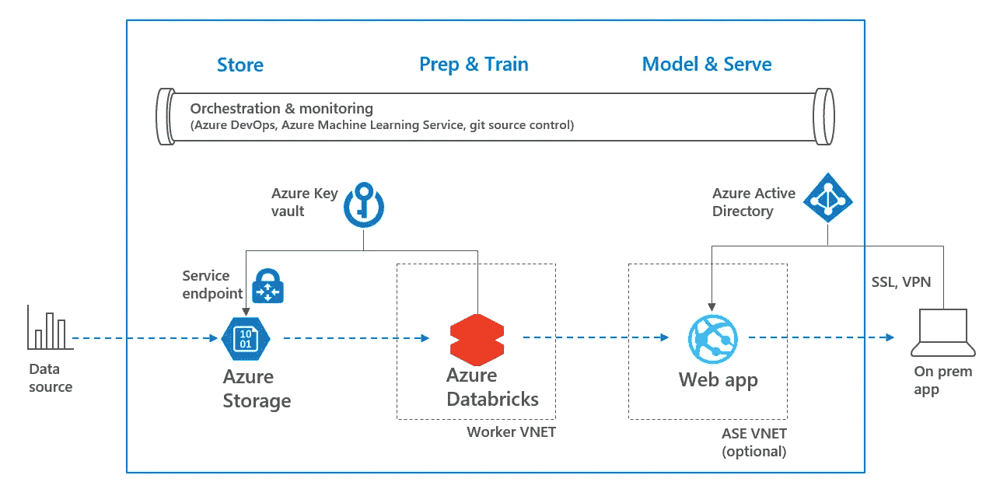

2\. Architecture overview

在本博客的剩余部分，将执行以下步骤:

*   3.先决条件
*   4.创建机器学习模型
*   5.在 Azure DevOps 中构建模型
*   6.发布模型 Azure DevOps
*   7.结论

这是一个独立的教程，但是，现在的重点将是安全性，而不是机器学习模型。如果你对 ML 更感兴趣，建议做以前的博客，[这里](/how-to-bring-your-data-science-project-in-production-b36ae4c02b46)或者使用 scikit-learn，这里看[。](https://medium.com/devopslinks/enable-ci-cd-for-data-science-projects-4f5b61acbfc9)

# 3.先决条件

需要在同一资源组和同一位置创建以下资源。

*   [Azure CLI](https://docs.microsoft.com/en-us/cli/azure/install-azure-cli?view=azure-cli-latest)
*   [天蓝色钥匙金库](https://docs.microsoft.com/en-us/azure/key-vault/quick-create-cli)
*   [Azure Data 湖存储账户第二代](https://docs.microsoft.com/en-us/azure/storage/blobs/data-lake-storage-quickstart-create-account?toc=%2Fazure%2Fstorage%2Fblobs%2Ftoc.json#create-an-account-using-azure-cli)
*   [Azure Databricks 工作区](https://docs.azuredatabricks.net/getting-started/try-databricks.html#step-2-create-a-databricks-workspace)。如果您想要在您的存储帐户上设置防火墙规则(请参见步骤 4d)，请在自己的 VNET 中部署数据块，请参见此处的
*   [Azure 机器学习服务](https://docs.microsoft.com/en-us/azure/machine-learning/service/quickstart-get-started)
*   [蔚蓝 DevOps](https://azure.microsoft.com/en-us/services/devops/)

# 4.创建机器学习模型

这一部分将执行以下步骤。请注意，尽可能使用 Azure CLI。

*   4a。将存储密钥添加到密钥库
*   4b。在 Azure 数据块中创建秘密范围
*   4c。向存储帐户添加数据
*   4d。(可选)存储帐户的网络隔离
*   4e。在 Azure Databricks 上运行笔记本

## 4a。将存储密钥添加到密钥库

在此步骤中，使用 Azure CLI 将存储帐户的密钥添加到密钥库中。按如下方式复制密钥:

```
az login
az storage account keys list -g <<resource group>> -n <<stor name>>
```

现在，使用以下代码将存储帐户名称和存储帐户密钥添加到 Azure 密钥库中。建议在整个教程中使用相同的**粗体名称**，因为这些名称在 Azure DevOps 构建步骤中用作变量。确保用于登录 Azure CLI 的用户有足够的权限在密钥库中创建/列出/获取密钥。

```
az keyvault secret set -n **stor-key** --vault-name <<vault name>> --value <<stor key>>
```

## 4b。在 Azure 数据块中创建秘密范围

在数据块中创建 Azure Key Vault 支持的机密范围。这使得您可以将您的秘密存储在密钥库中，而不必再将密钥存储在笔记本中。将秘密范围命名为: **devaisec**

[](https://docs.azuredatabricks.net/user-guide/secrets/secret-scopes.html#create-an-azure-key-vault-backed-secret-scope) [## 秘密范围-数据块文档

### 管理机密从创建机密范围开始。秘密作用域由其名称来标识，在一个…

docs.azuredatabricks.net](https://docs.azuredatabricks.net/user-guide/secrets/secret-scopes.html#create-an-azure-key-vault-backed-secret-scope) 

## 4c。向存储帐户添加数据

在您的电脑上从[https://amldocker datasets . azure edge . net/adultcensus income . CSV](https://amldockerdatasets.azureedge.net/AdultCensusIncome.csv)下载数据文件。然后将数据添加到存储容器，如下所示:

```
az storage container create -n **dbrdata** --account-name <<stor name>>
az storage blob upload -f <<...\AdultCensusIncome.csv>> 
-c **dbrdata** -n **AdultCensusIncome****.csv** --account-name <<stor name>>
```

## 4d。(可选)存储帐户的网络隔离

只有当您在自己的 VNET 中部署了 Databricks 工作空间时，这一步才是可能的，参见[此处](https://docs.azuredatabricks.net/administration-guide/cloud-configurations/azure/vnet-inject.html)。转到您的存储帐户，选择防火墙，然后添加您在其中部署了 Databricks 工作区的 VNET。

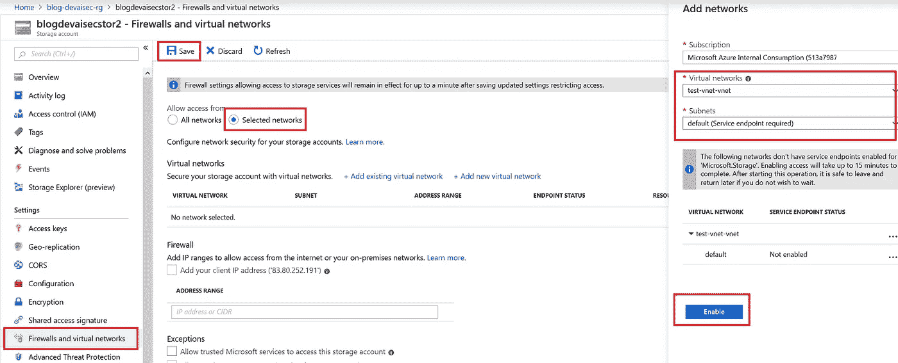

4d1\. Add VNET to storage account

确保 Databricks VNET 的私有和公共子网都已添加到存储帐户的防火墙中。

## 4e。在 Azure Databricks 上运行笔记本

转到您的 Azure Databricks 工作区，右键单击，然后选择导入。在单选按钮中，选择使用 URL 导入以下笔记本:

```
[https://raw.githubusercontent.com/rebremer/devopsai_databricks/master/project/modelling/](https://raw.githubusercontent.com/rebremer/devopsai_databricks/master/project/modelling/1_IncomeNotebookExploration.py)1_incomeNotebookExploration_sec.py
```

用您自己的变量替换下列变量

```
storageAccountName = "<<stor name>>"                   #see step_3
azureKevVaultstor2Key = **"stor-key"** # see step_4a
secretScope = **"devaisec"** # see step_4b
storageContainer = **"dbrdata"** # see step_4c
fileName = **"AdultCensusIncome.csv"** # see step_4c
```

确保笔记本电脑可以连接的群集正在运行。可以使用默认设置创建集群。然后运行 notebook 来创建 ML 模型。

# 5.在 Azure DevOps 中构建模型

Azure DevOps 是一个工具，可以持续地构建、测试和部署你的代码到任何平台和云。需要完成以下工作:

*   5a。在数据块中创建令牌
*   5b。创建 Azure DevOps 项目并添加存储库
*   5c。创建服务连接
*   5d。向项目添加秘密变量
*   5e。向项目添加其他变量
*   5f。创建和构建管道

## 5a。在数据块中创建个人访问令牌

以编程方式访问 Azure 数据块需要令牌。进入 Azure Databricks，点击右上角的人物图标。选择用户设置，然后生成新令牌。

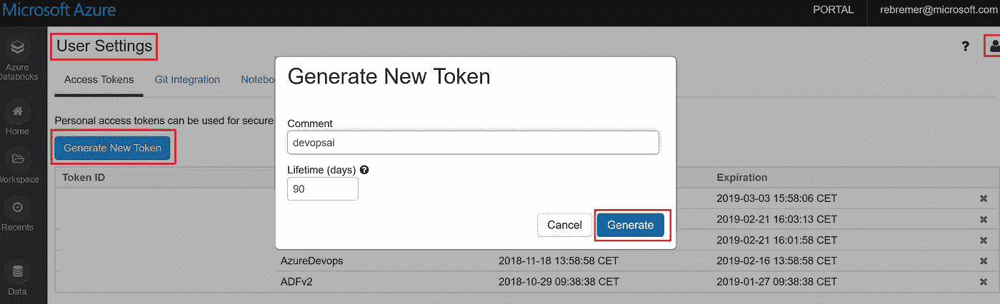

5a1\. Generate Databricks Access Token

再次将密钥添加到 Azure 密钥库:

```
az keyvault secret set -n **dbr-token** --vault-name <<vault name>> --value <<token_id>>
az keyvault secret set -n **dbr-key** --vault-name <<vault name>> --value <<key value>>
```

另外，将 subscription_id 的值添加到密钥库中。

```
az keyvault secret set -n **subscription-id** --vault-name <<vault name>> --value <<subscription_id>>
```

个人访问令牌将作为构建管道的一部分进行滚动。

## 5b。创建 Azure DevOps 项目并添加存储库

按照这个[链接](https://docs.microsoft.com/en-us/azure/devops/organizations/projects/create-project?view=azure-devops&tabs=new-nav&viewFallbackFrom=vsts)创建一个新的 Azure DevOps 项目。创建新项目后，单击存储库文件夹并选择导入以下存储库:

```
[https://github.com/rebremer/devopsai_databricks.git](https://github.com/rebremer/devopsai_databricks.git)
```

## 5c。创建服务连接

从 VSTS 访问资源组中的资源需要一个服务连接。转到项目设置、服务连接，然后选择 Azure 资源管理器。

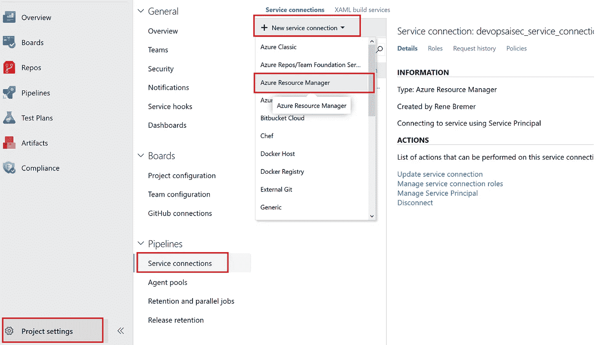

5c1\. Go to Service Connection

选择服务主体身份验证，并将范围限制到您的资源组。将连接命名为**devopsaisec _ service _ connection**

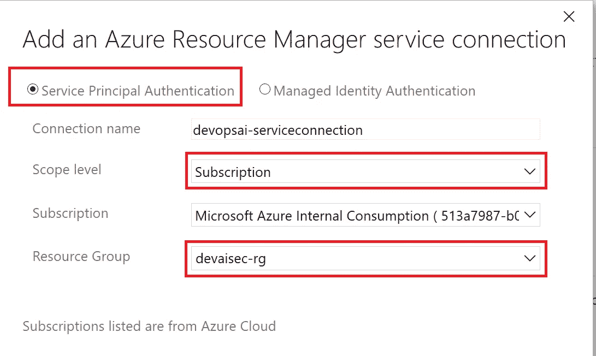

5c2\. Create Azure Resource Manager service connection

要从 Azure DevOps 管道配置密钥滚动，服务主体需要拥有对 Azure 密钥库的访问权限。因此，通过点击服务连接来查找服务连接的应用 id，然后选择“更新服务连接”，然后点击链接“使用服务连接对话框的完整版本”。

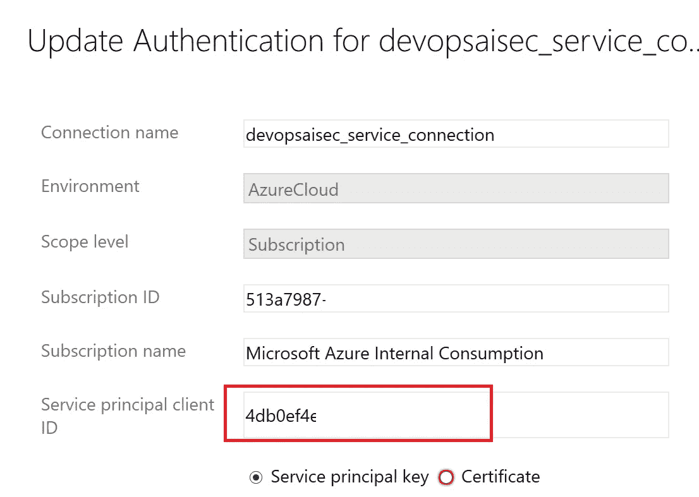

5c3\. Application id of service connection

最后，授予服务主体对密钥库中机密的 set 权限(服务连接已经拥有 get 和 list 权限)。

```
az keyvault set-policy --name <<vault name>> 
--resource-group <<resource group>>
--secret-permissions get list set 
--spn <<application id>>
```

## 5d。向项目添加秘密变量

在步骤 4a 中，存储密钥被添加到 Azure 密钥库中。随后，在步骤 5a 中添加了 Databricks 访问令牌和 subscription_id。

我们的 Azure DevOps 项目需要这些秘密。因此，单击库并选择将 Azure Key Vault 中的机密链接到项目。选择在步骤 5b 中创建的服务连接和存储机密的密钥库，然后单击 authorize。

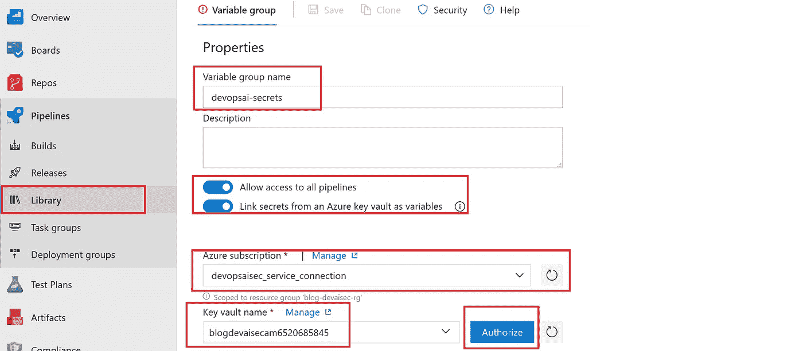

5c1\. Authorize to key vault

最后，将秘密变量“dbr-key”、“dbr-token”和“subscription-id”添加到项目中，然后单击 save。

## 5e。向项目添加其他变量

除了秘密变量，Azure DevOps 项目运行还需要其他配置。同样，转到库，允许访问所有管道，并使用您自己的值作为组添加以下变量:

```
**amls-name**         <<azure ml_service name>>
**dbr-secretscope**   **devaisec** <<see step_4b>>
**dbr-url**           <<dbr_url, <<your region>>.azuredatabricks.net>>
**rg-name **          <<resource group>>
**stor-container **   **dbrdata** <<see step_4c>>
**stor-name  **       <<store name>>
**keyvault-name **    <<vault name>>
```

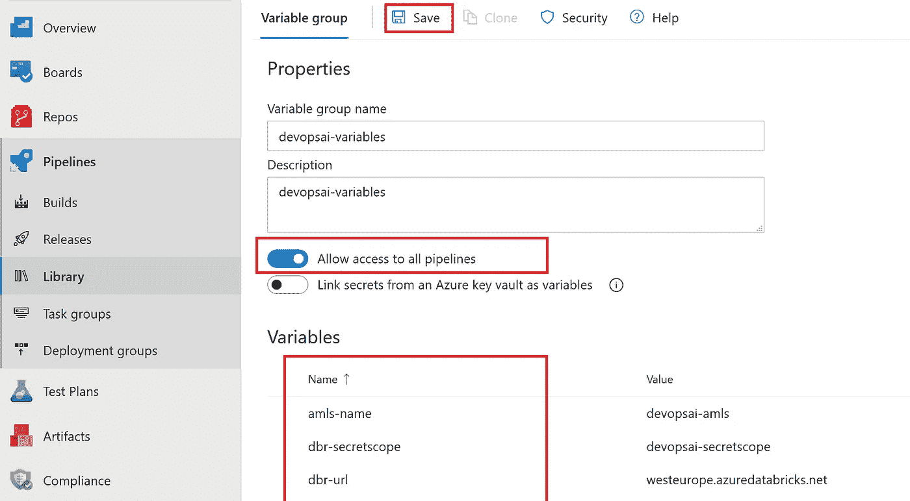

5e1\. Create secret variable group to be used in project

## 5f。创建和构建管道

在这一步中，将创建构建管道。单击“管道”，选择“新建”，然后选择“新建管道”。保留默认值，然后单击“继续”。在下一个屏幕中，选择“配置为代码”并单击“应用”。

选择作为代理池以拥有“托管的 Ubuntu 1604”并选择作为文件路径:**project/config code _ build _ sec . yml**。然后单击保存，另请参见下面的屏幕

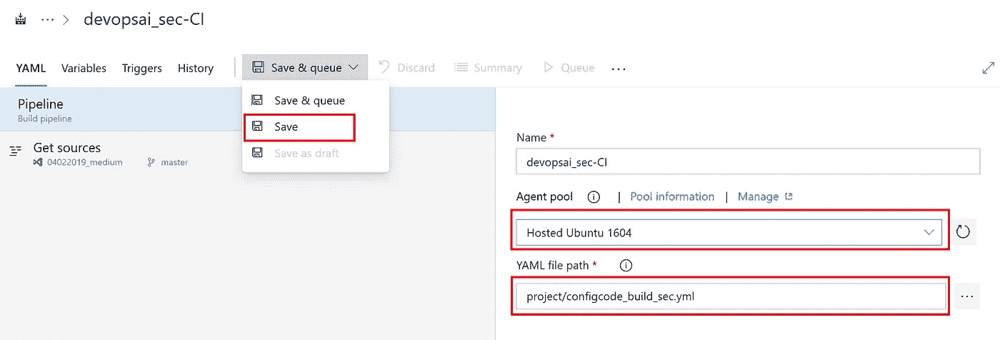

5f1\. Configuration as code

最后，链接前面创建的秘密变量组。因此，单击变量组，链接 5d 中创建的秘密变量组和 5e 中的其他变量组，并单击保存和队列开始构建。

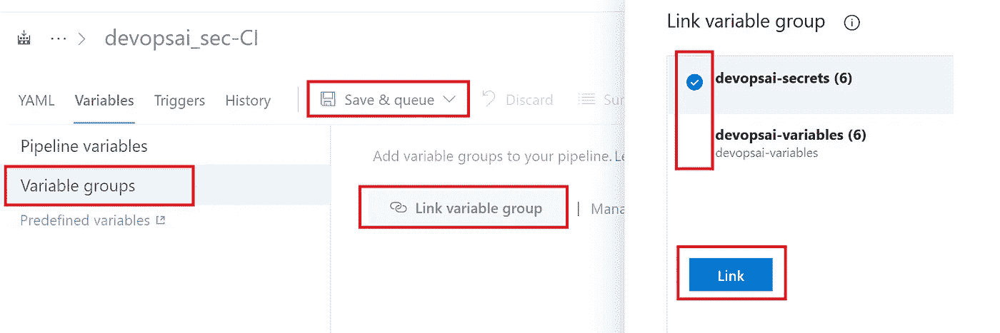

5f2\. Link variables group to build pipeline and build

成功执行 run 后，您可以看到构建、首次运行和最终结果。

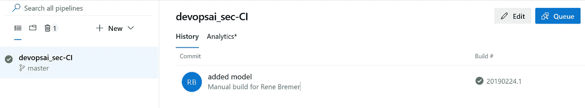

5f3\. Succesfull build

在这个构建管道中，执行以下步骤:

*   通过运行 notebook 使用 Azure Databricks 创建模型。
*   从将在发布步骤中部署的模型创建 docker 映像
*   执行 Databricks 令牌的密钥翻转，以最大限度地降低风险
*   创建用作发布管道输入的构建工件

# 6.Azure DevOps 中的发布模型

下一部分是关于创建一个发布管道。在这种情况下，它将机器学习模型部署为 web 应用程序上的容器。

*   6a。(可选)创建应用服务环境
*   6b。创建 web 应用和应用服务计划
*   6c。创建发布管道
*   6d。将容器部署到 web 应用程序
*   6e。在 web 应用中启用 Azure Active Directory 身份验证
*   6f。在 Postman 中设置对 web 应用程序的身份验证

## 6a。(可选)创建应用服务环境

为了实现对您的 web 应用程序的完全网络隔离，应使用应用程序服务环境。在应用服务环境中部署的所有 web 应用和应用服务计划。

[](https://docs.microsoft.com/en-us/azure/app-service/environment/create-ilb-ase) [## 使用应用服务环境 Azure 创建内部负载平衡器

### 关于如何创建和使用互联网隔离的 Azure 应用服务环境的详细信息

docs.microsoft.com](https://docs.microsoft.com/en-us/azure/app-service/environment/create-ilb-ase) 

请注意，应用服务环境的成本可能很高。本教程的其余部分也可以使用未部署在私有 ASE 中的 web 应用来完成，但是，web 应用将拥有一个公共 IP。

## 6b。使用 Azure CLI 创建 web 应用程序

执行以下命令行在 linux 中创建 Azure web。

```
az appservice plan create -g <<resource group>> -n devaisec-plan --is-linux --sku S1
az webapp create -n devaisec-app -g <<resource group>> 
-p devaisec-plan -i elnably/dockerimagetest
```

## 6c。创建发布管道

在这一步中，容器被部署到 web 应用程序。转到“Pipelines”，选择“Releases”，然后选择“empty job”作为模板。更改名称，然后单击保存。

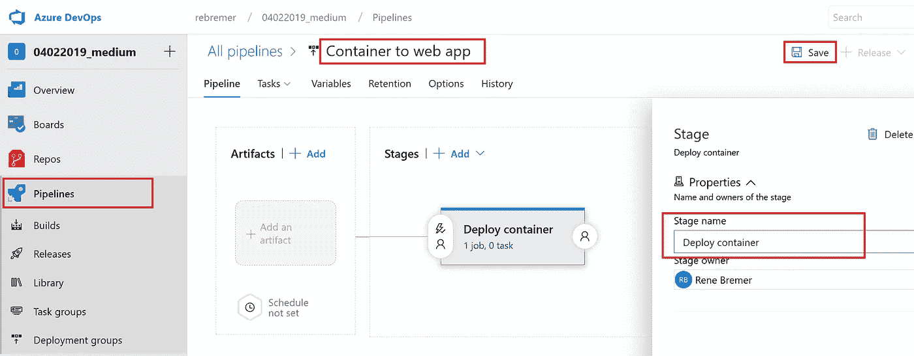

6c1\. Create release pipeline

添加您想要在此管道中发布的工件。在这种情况下，选择从构建管道中创建的工件。确保您始终选择默认版本:最新

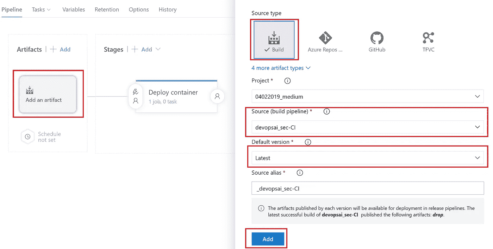

6c2\. Add release artifact

最后，将两个变量组(在步骤 5c 和 5d 中创建的)也添加到发布管道中。转到发布管道中的变量，并链接两个组，就像在构建管道中所做的那样。

## 6d。将容器部署到 web 应用程序

转到发布管道并选择添加任务。然后，您将看到一个包含代理作业的屏幕。同样，您需要将代理池更改为 Hosted Ubuntu 1604。

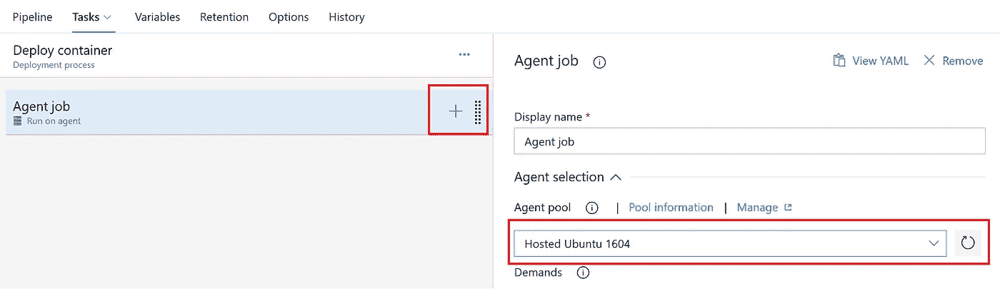

6d1\. Agent pool Ubuntu 1604

随后，通过搜索 Azure CLI 添加新任务。选择**devopsaisec _ service _ connection**作为服务连接，引用“41_deployImageToWebapp_sec.sh”作为脚本路径。然后通过引用变量$(rg-name)使用以下 3 个由空格分隔的参数:webapp 的名称、容器注册表的名称和资源组的名称。

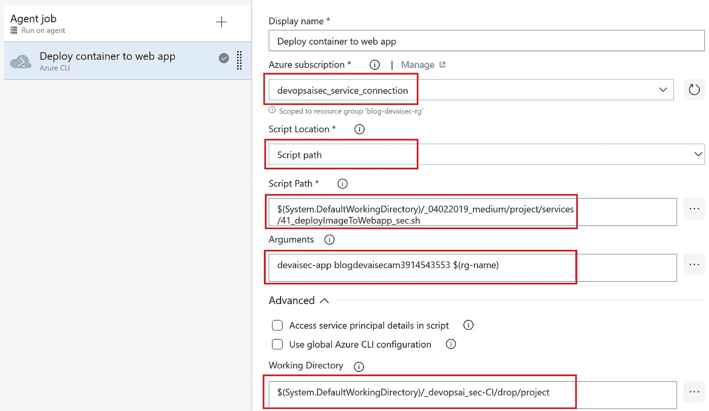

6d2\. Azure CLI to deploy container to web app

保存并关闭，然后选择创建发布管道。填写变量以创建发布。然后通过点击 deploy 按钮来部署发布。等待 5 分钟，然后检查状态是否从“未部署”变为“成功”。

## 6e。在 web 应用中启用 Azure Active Directory 身份验证

在此步骤中，使用 Azure 门户在 web 应用中启用 Azure Active Directory 身份验证。转到您的 web 应用，选择身份验证/授权，然后选择 Azure Active Directory。然后选择快速并使用与您的 web 应用程序相同的名称创建新的应用程序注册

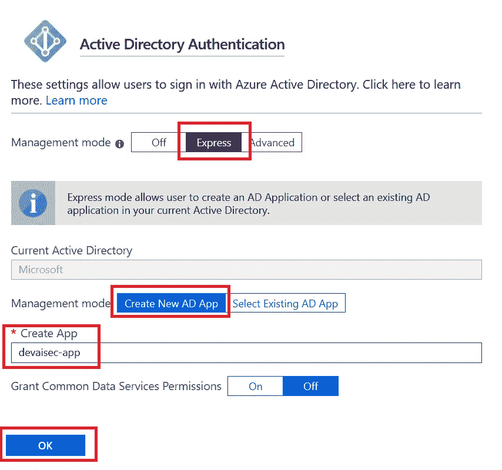

6e1\. Set up AAD authentication in web app

在此步骤之后，web 应用程序 URL 需要身份验证，并且不能被使用。

## 6f。在 Postman 中设置对 web 应用程序的身份验证

最后一步是设置工具[邮差](https://www.getpostman.com/)来验证网络应用。在下面的[教程中，解释了如何做到这一点。](https://blogs.msdn.microsoft.com/aaddevsup/2018/05/23/using-postman-to-call-the-microsoft-graph-api-using-authorization-code-flow/)

在 Postman to the 应用程序中设置 Postman 和客户端身份验证后，可以使用 HTTPS 端点来创建预测。可以在项目中的项目/services/50_testEndpoint.py 中找到一个示例负载。在本例中，预测了三个人的收入等级。

*   对第一个人的预测是收入高于 50k，
*   对于另外两个人，预测值低于 50k。

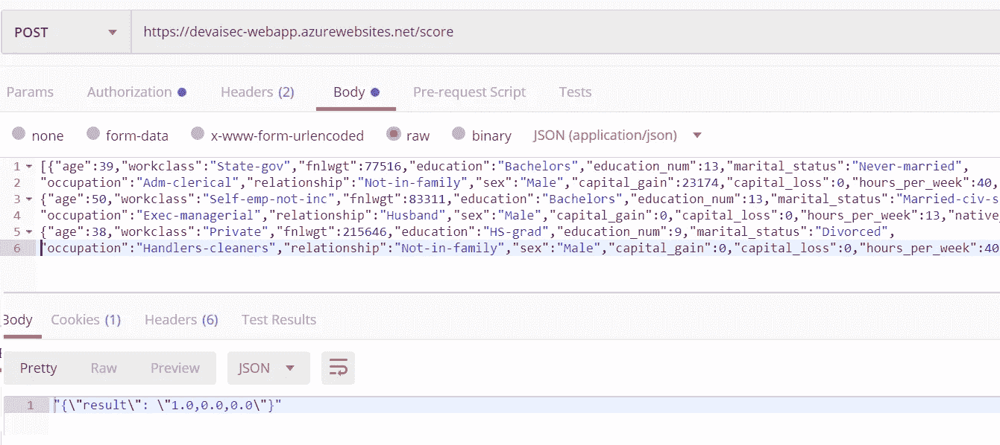

6f1\. Postman with bearer authentication to consume API for predictions

# 7.结论

在本教程中，将为机器学习项目创建一个安全的端到端管道。在这个项目中，Azure Databricks 被用来创建一个机器学习模型，并将其作为一个端点部署在一个 web 应用程序上。端到端管道的保护如下:

*   使用 Azure Active Directory 对 Web 应用程序进行身份验证和授权
*   存储帐户和 Web 应用程序的网络访问控制列表
*   在 Azure 密钥库中安全存储密钥，并在构建管道中添加密钥滚动过程

这使公司能够 1)端到端地跟踪模型，2)建立对模型的信任，3)避免模型预测莫名其妙的情况，最重要的是 4)使用 AAD、VNETs 和密钥库保护数据、端点和秘密，另请参见架构概述:


7\. Architecture overview

***注来自《走向数据科学》的编辑:*** *虽然我们允许独立作者根据我们的* [*规则和指导方针*](/questions-96667b06af5) *发表文章，但我们不认可每个作者的贡献。你不应该在没有寻求专业建议的情况下依赖一个作者的作品。详见我们的* [*读者术语*](/readers-terms-b5d780a700a4) *。*