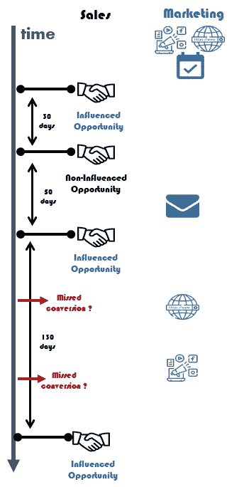

# 如何评价 B2B 行业营销对销售的整体影响？🤑

> 原文：<https://towardsdatascience.com/how-to-evaluate-marketing-in-the-b2b-retail-industry-5a183510006?source=collection_archive---------29----------------------->

Photo by [Merakist](https://unsplash.com/@merakist?utm_source=medium&utm_medium=referral) on [Unsplash](https://unsplash.com?utm_source=medium&utm_medium=referral)

## #营销# b2b #数据科学#归属#购买行为

本文旨在解决 B2B 行业的营销归因问题，其中客户有购买频率(家具，it 材料等)。

# 营销归因

如果你是 B2B 行业的营销人员，你可能很难找到正确的指标来评估你的活动对销售的影响。有时营销活动可以促进销售，有时可以向销售团队介绍新客户，有时客户会直接致电销售团队，而不会受到任何营销活动的激励。

处理这种销售和营销与客户互动的大熔炉的一个众所周知的方法是利用渠道&由机会产生的收入，这些机会开始于通过营销活动中的行动号召产生的线索。这些都是很好的指标，但是您可能想要创建新的指标来查看整体情况，例如对客户群销售的支持和协助。这是为什么呢？因为，你可能错过了一部分你也影响了的收入和渠道，这一部分可能是巨大的。

让我解释一下，在某些时候，潜在客户会转化为分配给销售代表的客户。因此，在一次活动中，每当向他们发出行动呼吁时，他们可以:

*   转换并进入营销漏斗，将他们重新引导到一个队列中，有望引导到他们的销售代表。
*   直接打电话给他们的销售代表。

简而言之，如果您使用每当客户或潜在客户点击您的活动行动号召时创建的线索标识符来评估营销对销售的影响，那么您主要是在评估您的部门将新的潜在客户转化为客户的能力。

# **影响管道&收入**

T 这些是基于归因问题的旅程方法的简单指标，旨在描绘营销可以获得信贷的机会。

A simple attribution model

上图所示的方法在一定程度上运行良好。如果客户流失，去购买他的竞争对手的家具，然后决定再次购买你的业务，下面的错误归因问题将会发生。

A simple representation of the attribution problem

在上图中，你可以清楚地理解我们正在处理的问题:每当在与你的活动进行一次或多次互动后产生管道，你都会将其归因于营销努力，即使这没有意义。

每个客户都有自己的购买频率，如果你能接近它，你就知道在客户层面上，将机会归因于之前的营销活动是否有意义。

# **为您的机会创建受影响的标志(python 语言)**

## 1.导入库

## **2。负载**

首先，从 salesforce 或任何其他 B2B CRM 加载所有已关闭的机会。在这些字段中，您只需要三个字段:客户 id、机会 id、结束日期(如果您在此字段中有许多 NAs，您可以用最后修改日期来替换它们😉).

## **3。计算购买频率**

您可以通过计算帐户级别的连续机会之间的时间范围来计算购买频率。

你应该保留每个客户的第一次机会。我们当时对客户知之甚少，因此我们无法知道机会的创造是否受到营销的影响(我们可以，但不是使用这种方法，而是使用线索生成分析)，他可能与营销活动互动过多次，目的是创造机会，但最终在您的企业为他创造第一个机会之前就去了竞争对手那里。根据您的关注点，我们将在后面看到如何处理这些问题。

现在，从这些时间范围，你可以使用 [K 均值算法](/the-5-clustering-algorithms-data-scientists-need-to-know-a36d136ef68)，推断出一些关于你的人口购买行为的有趣行为。

## **4。找到拟合数据的最佳聚类数&**

K-means 算法是无监督的模型，它从一维或多维(结构化)数据中形成组。核心概念是根据两个规则形成组:

*   每个点到其聚类质心的距离被最小化。
*   这些点到其他簇的质心的距离被最大化。

为了找出你应该形成多少个聚类，你可以计算一个聚类数范围的 [SSE](https://hlab.stanford.edu/brian/error_sum_of_squares.html) (误差平方和= >点到它们的组均值的距离)和/或[剪影分数](https://scikit-learn.org/stable/auto_examples/cluster/plot_kmeans_silhouette_analysis.html)。

一旦找到了最佳的聚类数，就可以训练模型，确保多次运行拟合过程，并选择 SSE 最低的版本，否则您的算法可能会收敛到局部最优。完成后，您可以预测每个计算时间范围的聚类。

为了让定义每个聚类的值具有完整的意义，我们应该根据它们的平均值对它们进行重命名。聚类“0”应该是包含较慢购买频率的聚类，而聚类“k”应该是包含最快购买频率的聚类。

## **5。在账户级别标记购买频率群的变化**

在客户层面，在连续的机会之间，购买频率群变得更慢是一个时期流逝的迹象。

对于每个客户，您可以在失效期后的第一个机会上轻松标记失效期(也就是从一个集群到另一个集群的变化，由连续机会之间较慢的平均购买频率定义)。

## **6。创建一组临时的假数据点来表示错过的转换**

为了避免出现的错失归因问题，你可以利用目前收集的信息，创建一组与错失机会相对应的虚假记录。为此，您只需选择所有被标记的机会，并将它们的购买频率分别除以最后一个机会的聚类平均购买频率，这将为您提供在逝去期间错过的机会的**近似**数量。

对于每个标记机会，迭代错过的转换数，每次增加在先前机会日期的数据集中错过的转换的新观察，加上其分类的平均购买频率乘以迭代器索引。为所有创建的错过的机会分配一个唯一的机会 id。

## **7。处理客户的首次机会**

您可以在每个帐户的第一个机会放回。根据分析结果，您还可以假设您无法理解第二次销售之前的任何购买行为，将他们排除在分析之外，并使用其他指标来评估营销能力，以转化新的潜在客户。如果你这样做，不要忘记正确过滤你的营销数据集。

## **8。将受影响的标志映射到机会**

引入营销参与数据，并将其叠加到机会数据集中。按客户和日期对数据集进行排序，并在客户级别向后传播机会 id。

此外，禁止错过机会和机会结束日期与其结束日期之间的约定。正如图*中所示，这些业务可能会引入有偏见的归因，这是归因问题的一个简单表示。*

根据机会 id 进行分组，如果您获得的观察数量大于 1(则您在机会之前有营销互动)，您可以将标志“受影响”归属于该机会。

现在，对于每个机会，您都有一个标志，可以用来评估受影响的渠道和收入。

您可以在我的 [Github](https://github.com/leopoldavezac/Mapping-Influenced-Opportunities) 上找到本文中的所有代码。

# 最后的想法

在提议的实现中，我使用了机会结束日期，假设结束日期和创建日期相对接近。虽然在某些行业可能是这样，但并不是所有行业都是这样。如果您的业务机会结束日期和创建日期相差很远，一个解决方案是将结束日期用于除步骤 8 之外的所有流程，在步骤 8 中，您可以在(实际)业务机会中更改创建日期的结束日期。

如果您觉得这很有趣，并且有一些改进的想法，请[联系](https://www.linkedin.com/in/leopolddavezac/)。总有改进的余地。