# 使用 Python 浏览和可视化数据集

> 原文：<https://towardsdatascience.com/how-to-explore-and-visualize-a-dataset-with-python-7da5024900ef?source=collection_archive---------4----------------------->

## 或者如何学习用 Python——一个代码向导——创建漂亮而有洞察力的图表

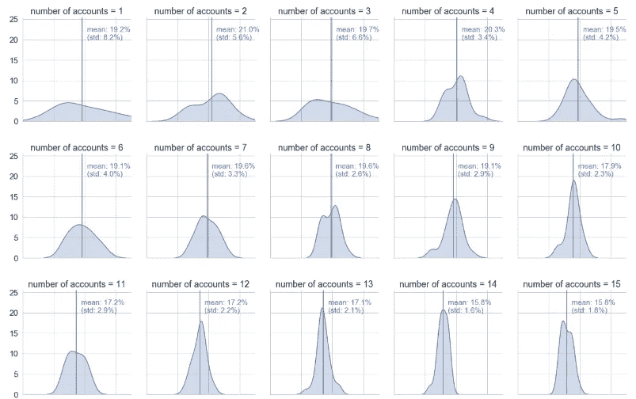

在上周的故事“用 Python 从各种工作表中提取数据”中，您了解了如何从不同来源(Google Sheets、CSV 和 Excel)检索和统一数据。这两个故事都是独立的故事，所以如果你跳过了上周的那篇，也不用担心。

[](/replacing-sheets-with-python-f1608e58d2ca) [## 用 Python 从各种工作表中提取数据

### 或者如何学习统一 Google 工作表、Excel 和 CSV 文件——代码指南

towardsdatascience.com](/replacing-sheets-with-python-f1608e58d2ca) 

## 在今天的故事中，你会学到:

*   如何组合和争论数据，
*   如何探索和分析数据，
*   如何创建漂亮的图表来可视化您的发现

## 这篇文章是写给谁的:

*   经常与数据打交道的人
*   对 Python 和熊猫有基本了解的人

# 概述一下情况:

你的任务是找出如何提高你的销售团队的业绩。在我们假设的情况下，潜在客户有相当自发的需求。发生这种情况时，您的销售团队会在系统中输入一个订单线索。然后，您的销售代表会尝试在订单线索被发现时安排一次会议。有时在之前，有时在之后。你的销售代表有一个费用预算，并且总是把会议和他们付钱的一顿饭结合在一起。销售代表报销他们的费用，并将发票交给会计团队处理。在潜在客户决定是否接受你的报价后，勤奋的销售代表会跟踪订单线索是否转化为销售。

对于您的分析，您可以访问以下三个数据源:

*   order_leads *(包含所有订单线索和转换信息)*
*   sales_team *(包括公司和负责的销售代表)*
*   发票*(提供发票和参与者的信息)*

# 导入和设置:

使用的库相当标准。但是，您可能需要在笔记本中运行以下命令来安装 seaborn。

```
!pip install seaborn
```

# 加载数据:

你可以下载并组合上周文章中展示的数据，也可以从[这里](https://github.com/FBosler/Medium-Data-Exploration)下载文件并把它们载入你的笔记本。

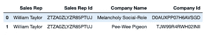

first two rows of sales_team Dataframe

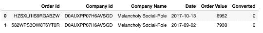

first two rows of order_leads Dataframe

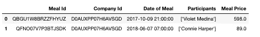

first two rows of invoices Dataframe

# 让我们开始探索:

# 总体转换率发展:

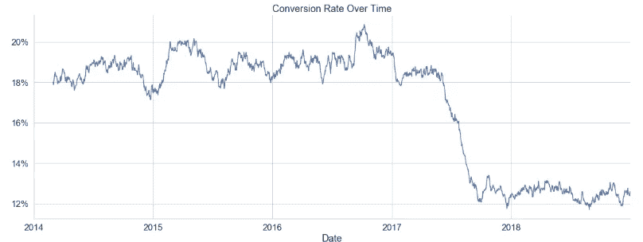

Conversion rate development over time

显然，事情似乎在 2017 年初开始走下坡路。在与首席销售官核实后，发现大约在那个时候有一个竞争对手进入了市场。很高兴知道，但是我们现在在这里什么也做不了。

1.  我们使用下划线`_`作为临时变量。我通常会对那些我以后不会再使用的变量这样做。
2.  我们在`order_leads.Date`上使用了`pd.DateTimeIndex`,并将结果设置为索引，这允许我们
3.  使用`pd.Grouped(freq='D')`将我们的数据按天分组。*或者，您可以将频率更改为 W、M、Q 或 Y(表示周、月、季度或年)*
4.  我们计算每天“已转换”的平均值，这将给出当天订单的转换率。
5.  我们使用`.rolling(60)`和`.mean()`来获得 60 天的滚动平均值。
6.  然后，我们格式化 yticklables，使它们显示一个百分号。

# 销售代表之间的转换率:

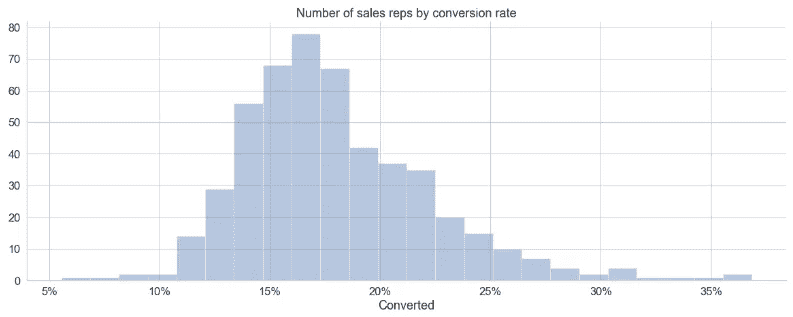

看起来销售代表之间存在相当大的差异。让我们对此进行更深入的调查。

就所使用的功能而言，这里没有多少新东西。但是请注意我们如何使用 sns.distplot 将数据绘制到轴上。

如果我们回忆一下 sales_team 数据，我们会记得并非所有销售代表都有相同数量的客户，这肯定会有影响！让我们检查一下。

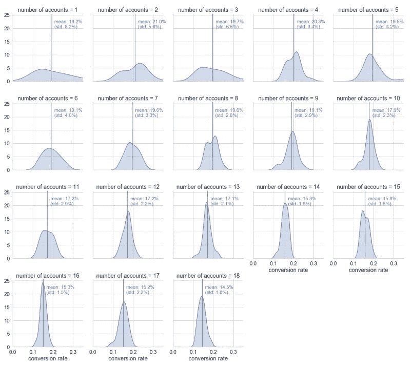

Distributions of conversion rates by number of assigned accounts

我们可以看到，转换率数字似乎与分配给销售代表的客户数量成反比。转换率下降是有道理的。毕竟，销售代表拥有的客户越多，他花在每个客户身上的时间就越少。

这里，我们首先创建一个助手函数，它将把垂直线映射到每个子图中，并用数据的平均值和标准偏差来注释这条线。然后我们设置一些 seaborn 绘图默认值，比如更大的 *font_scale* 和 whitegrid 作为 *style* 。

# 膳食的影响:


sample meals data

看起来我们已经有了吃饭的日期和时间，让我们快速看一下时间分布:

```
out:
07:00:00    5536
08:00:00    5613
09:00:00    5473
12:00:00    5614
13:00:00    5412
14:00:00    5633
20:00:00    5528
21:00:00    5534
22:00:00    5647
```

看起来我们可以总结如下:

请注意我们在这里如何使用`pd.cut`来给我们的数字数据分配类别，这是有意义的，因为毕竟，早餐是在 8 点还是 9 点开始可能并不重要。
另外，请注意我们如何使用. dt.hour，我们只能这样做，因为我们之前已经将`invoices['Date of Meal']`转换为 datetime。`.dt`就是所谓的存取器，有三个那些`cat, str, dt`。如果您的数据具有正确的类型，您可以使用这些访问器和它们的方法进行简单的操作(计算效率高且简洁)。

不幸的是，`invoices['Participants']`是一个字符串，我们必须先将它转换成合法的 JSON，这样我们才能提取参与者的数量。

现在我们来结合数据。为此，我们首先通过 order_leads 上的`Company Id`左连接所有发票。然而，合并数据会导致所有餐都加入到所有订单中。也把古代的餐点改成了更近的订单。为了减轻这种情况，我们计算了用餐和订购之间的时间差，并且只考虑订购前后五天的用餐。
仍有一些订单被分配了多餐。当同时有两份订单和两份餐时，可能会发生这种情况。然后，两餐将被分配给两个订单线索。为了删除重复的内容，我们只保留最接近订单的食物。

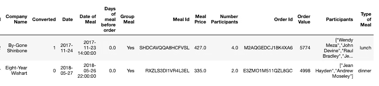

part of the combined data frame

我创建了一个已经包含一些样式的绘图栏函数。通过该功能绘图使得目视检查更快。我们马上就要用到它了。

## 膳食类型的影响:

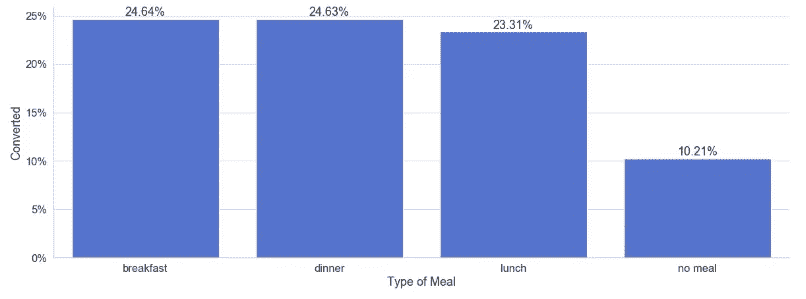

**哇！**有餐点的订单和没有餐点的订单之间的转换率差异非常大。不过，看起来午餐的转化率比晚餐或早餐略低。

## 时间的影响(即用餐发生在订单引导之前还是之后):

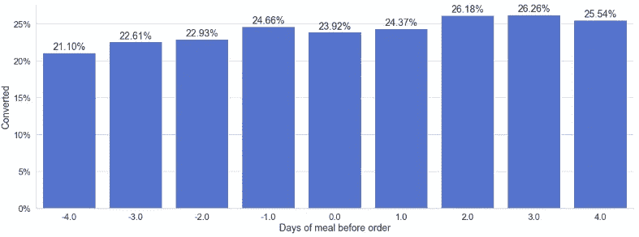

`'Days of meal before order'`的负数意味着用餐发生在订单线索进来之后。我们可以看到，如果用餐发生在订单线索出现之前，似乎会对转化率产生积极影响。看起来对订单的预先了解给了我们的销售代表优势。

## 将这一切结合起来:

现在，我们将使用热图来同时显示多个维度的数据。为此，让我们首先创建一个助手函数。

然后，我们应用一些最终数据争论来额外考虑与订单价值相关的餐费，并将我们的交付周期划分为`Before Order, Around Order, After Order`,而不是从负四天到正四天，因为解释起来会有些忙。

运行下面的代码片段将生成一个多维热图。

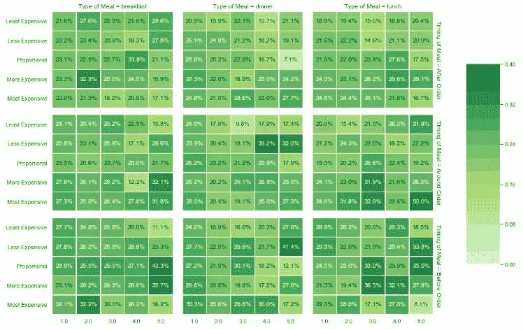

Heatmap to visualize four dimensions in one graphic

热图当然很漂亮，尽管一开始有点难读。所以让我们过一遍。该图表总结了 4 个不同维度的影响:

*   用餐时间:点餐后、点餐前后、点餐前**(外排)**
*   用餐类型:早餐、晚餐、午餐**(外列)**
*   餐费/订单值:最便宜、不太贵、成比例、较贵、最贵**(内排)**
*   参加人数:1，2，3，4，5 **(内列)**

很明显，图表底部的颜色更深/更高，这表明

*   当用餐发生在点菜之前时，转化率更高
*   当只有一个参与者时，晚餐的转化率似乎更高
*   看起来与订单价值相比，更贵的饭菜对转化率有积极的影响

# 调查结果:

1.  不要给你的销售代表超过 9 个账户(因为转化率会迅速下降)
2.  确保每笔订单都伴随着一次会面/用餐(因为这将使转化率提高一倍以上
3.  当客户只有一名员工时，晚餐是最有效的
4.  你的销售代表应该支付大约订单金额 8%到 10%的餐费
5.  时机是关键，理想情况下，你的销售代表尽可能早地知道交易即将到来。

点击此处获取代码: [GitHub Repo/Jupyter 笔记本](https://github.com/FBosler/Medium-Data-Exploration)

*热图备注:*

要解决可能不可靠的格式，您可以通过先卸载(您必须在终端中完成)然后运行以下命令，将 matplotlib 降级到版本 3.1.0:

```
!pip install matplotlib==3.1.0
```

如果你对此有问题，请告诉我