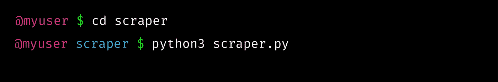

# 如何使用 Python 提取在线数据

> 原文：<https://towardsdatascience.com/how-to-extract-online-data-using-python-8d072f522d86?source=collection_archive---------8----------------------->


Photo by [Aaron Burden](https://unsplash.com/@aaronburden?utm_source=unsplash&utm_medium=referral&utm_content=creditCopyText) on [Unsplash](https://unsplash.com/?utm_source=unsplash&utm_medium=referral&utm_content=creditCopyText)

## 关于 HTML、XPath、Scrapy 和 spiders 的基本概念

她的一位同事说:“我希望能拥有网站的所有文件。”

“是的，这能给我们提供很多信息”——另一位同事说

*“你会做刮刀吗？”他们都转头看着她*

"*嗯……我可以……她开始喃喃自语*

*【完美】*——他们都说

*“…。她说完了，但为时已晚*

她一生中从未用过刮刀。所以她当时不知所措。

*“我不知道该怎么办”* —她哭着给我打电话— *“我觉得这对我来说太难了”*

*“你别担心！我们可以一起做”*——我说

我完全理解她。第一次我不得不为一个 scraper 编码时，我也感到很失落。

就像我在看一场魔术表演。我记得当我开始阅读刮痧时。

*“Web scrapers*…mm…*HTML 标签…mm…蜘蛛* … *什么…?"对我来说，这听起来像是一门外语*

但我读得越多，就越开始明白，就像魔术一样，你需要知道要寻找什么才能理解其中的诀窍。

到底什么是 web 刮刀？web scraper 是一种从网站上自动收集数据的程序。

我们可以收集网站的所有内容，或者只是关于某个主题或元素的特定数据。这将取决于我们在脚本中设置的参数。这种多功能性是 web 刮刀的魅力所在。

我们举个假设的例子。我们想从一个网址为`https://www.mainwebsite.com`的网站上抓取数据。特别是，这个网站包含不同的文件。我们对获取他们的文本感兴趣。

在主页中，我们可以找到三个子部分，如下图所示。


例如，点击`topic1`，我们将进入另一个页面(`https://www.mainwebsite.com/topic1`，在那里我们可以找到我们感兴趣的文档列表。


如果我们点击`document1`，我们将进入另一个页面(`https://www.mainwebsite.com/topic1/document1/date`)，在那里我们可以获得该文档的内容。


如果我们要手动操作，我们会将内容复制并粘贴到文件中。相反，我们将自动化这一过程。

我们看到了获取数据所需遵循的路径。现在，我们应该找到一种方法来告诉 web scraper 在哪里寻找信息。

网站上有很多数据，比如图片、其他页面的链接、标题，我们都不感兴趣。因此，我们需要非常具体。

这是我们开始揭开魔术的地方。那我们解剖一下吧。

1HTML 代表超文本标记语言。它与层叠样式表(CSS)和 Javascript 一起，用于在交互式网站上构建和呈现内容。

你不需要学习如何使用 HTML 编码来构建一个 scraper。但是你应该知道如何识别 HTML 标签和元素。

为什么？因为数据会有一个特定的 HTML 标签。我们可以通过向 scraper 显示正确的 HTML 元素来提取这些数据。

一个 *HTML 标签*由一个用尖括号括起来的标签名组成。通常，您需要一个开头和一个结尾标签来框定一段特定的文本。

开始标记由一个名称和可选属性组成。结束标签由相同的名称加上一个正斜杠(`/`)组成。

每个标签名称都指一个特定的元素。我们会注意下面的标签:`<p>`用于段落；`<a>`或锚标记为超链接；``为图片；`<h1>`、`<h2>`等。对于文本标题；`<div>`为分隔线，`<tr>`为表格行，`<td>`为表格列。

大多数标签还带有`id`或`class`属性。`id`为 HTML 文档中的 HTML 标签指定了一个惟一的 id。`class`用于定义标签将采用的样式。

让我们观察一个 HTML 元素:


在这种情况下，我们希望提取 HTML 元素的内容“2019 年 6 月 28 日版”。我们会告诉 scraper:寻找所有的

###### 元素，给我一个带有类“text-primary”的元素。

如果有一个以上的元素具有这些特征，我们就需要更加具体。指示 ID 属性可以实现这一点。

好的。但是我在网站上哪里可以找到这些信息呢？

这是一个简单的步骤:右击网页上的任何地方。将出现一个小窗口。接下来，你点击*检查*，如下图所示。


你可以访问网站的源代码，图片，CSS，字体和图标，Javascript 代码。

此外，您可以使用光标选择器(*见*下面的图片)选择网站中的项目。


因此，对应于所选项目的 HTML 元素将被突出显示。


在上图中，我们可以观察到一个典型的 HTML 结构是什么样子。

正常情况下，所有内容都包含在开始和结束`body`标签中。每个元素都有自己的标签。

一些 HTML 元素嵌套在其他元素中，形成层次结构。这可以用树来表示。


如果我们在树中从左向右移动，我们向前移动了几代。如果我们从上到下移动，我们会在同一代之间移动，或者在来自同一个父元素的兄弟元素之间移动。

注意两个`<div>`元素。他们是兄弟姐妹，因为他们共享`<body>`作为父母。他们是`html`元素的第二代传人。他们每个人都有孩子。第一只`<div>`有两个孩子。它的第一个孩子是一个包含“网页抓取有用！”元素。然而，这个元素并不是第二个`<div>`的后代。这是因为您不能沿着从这个 div 元素到 paragraph 元素的路径。

这些关系也将有助于我们向 web scraper 指示所需的元素。

2XPath 代表 XML 路径语言。跟网页抓取有什么关系？我们将学习如何识别 HTML 元素。但是现在出现的问题是*我如何向刮刀指出元素？答案是 XPath。*

XPath 是一种特殊的语法，可用于浏览 XML 文档中的元素和属性。此外，它将帮助我们获得某个 HTML 元素的路径并提取其内容。

让我们看看这个[语法是如何工作的](https://devhints.io/xpath)。

`/`用于向前移动一个代，`tag-names`给出哪个元素的方向，`[]`告诉我们选择哪个兄弟元素，`//`查找所有后代，`@`选择属性，`*`是通配符，表示我们希望忽略标记类型。

如果我们看到下面的 XPath:

```
Xpath = '//div[@class="first"]/p[2]'
```

我们会理解，从所有(`//`)`div`元素中带`class`"*"*"(`div[@class="first"]`)，我们要第二个(`[2]`)段落(`p`)元素。

幸运的是，web 浏览器有一种简单的方法来获取元素的 XPath。


检查网站时，右键单击突出显示的元素。将显示一个小窗口。然后可以复制 *XPath* 。

3Scrapy 是一个 Python 框架，专为抓取网站和提取结构化数据而设计。它是专门为网络抓取而设计的，但是现在它也可以通过 API 来提取数据。

为了安装 Scrapy，你需要安装 Python。建议只使用 Python 3。Python 2 将于 2020 年 1 月弃用。

要安装 Scrapy，您可以使用 pip:

```
pip install Scrapy
```

或者使用康达

```
conda install -c conda-forge scrapy
```

Scrapy 的一个重要方面是它使用了 Twisted，这是一个流行的 Python 事件驱动网络框架。Twisted 为并发性异步工作*。*

*这是什么意思？同步意味着您必须等待一个作业完成，以便启动一个新作业。异步意味着您可以在前一个作业完成之前移动到另一个作业。*

*44**蜘蛛。**因为这个特点，Scrapy 可以在很短的时间内抓取一组 URL。因此，Scrapy 与蜘蛛合作，而不是在一个网站上抓取。*

*蜘蛛是我们定义的类，Scrapy 使用它来抓取多个页面的链接并抓取信息。*

## **蜘蛛结构:**

*蜘蛛必须满足某些要求才能正常工作。他们必须子类化`***scrapy.Spider***`，并定义要发出的初始请求。此外，他们还可以决定如何在页面中跟随以及如何解析下载的页面内容。*

*让我们详细看看这些要求:*

1.  *每个蜘蛛必须是`***scrapy.Spider***`类的子类:这意味着它必须把它作为一个参数。*
2.  *蜘蛛的`***name***`在一个项目中必须是唯一的。*
3.  *他们必须定义最初的请求:必须有一个方法调用`***start_requests()***`。Scrapy 将总是寻找它来发起请求。它还必须返回一系列请求，蜘蛛将从这些请求开始爬行。*
4.  *他们可以决定如何解析下载的内容:通常会定义一个`***parse()***`方法。我们调用它来处理为每个请求下载的响应。parse()方法通常会解析响应，提取抓取的数据，还会找到新的 URL 并根据它们创建新的请求。*
5.  *我们也可以找到`**allowed_domains**`名单。这告诉蜘蛛什么是允许抓取的域名。*
6.  *此外，我们可以设置一个列表。用来指定我们要刮什么网站。默认情况下，Scrapy 使用 HTTP 协议。还得改成 https。*

*现在，我们已经剖析了 web 刮刀的所有组件。*

***→该写了！！←***

*我们将带来 URL 为`https://www.mainwebsite.com`的网站的初始示例。*

*让我们回顾一下事实:*

*   *我们有一个主网站，有三个链接到三个不同的部分。*
*   *在每个部分中，我们都有一个文档链接列表。每个部分都有一个特定的 URL，例如`https://www.mainwebsite.com/topic1`。*
*   *每个链接都将我们带到我们感兴趣的文档内容。我们可以在每个部分的 HTML 结构中找到每个链接。*

*首先，我们将设计我们的文件架构。*

**

*让我们探索一下我们的*文件夹*。*

*我们已经创建了一个名为`scraper`的主文件夹，在这里我们将存储与我们的刮刀相关的所有文件。*

*然后，我们将收集 JSON 文件中的所有数据。这些文件都将保存在`JSON`文件夹中。*

*常用文件夹还有一个文件夹叫`spiders`。在那里，我们将为每个蜘蛛保存一个文件。我们将为每个主题创建一个蜘蛛。所以，总共三只蜘蛛。*

*现在，是时候了解我们创建的文件了。*

*先从`settings.py`说起吧。Scrapy **设置**允许我们定制所有 Scrapy 组件的行为，包括核心、扩展、管道和蜘蛛本身。*

*在那里，我们可以指定由 Scrapy 项目实现的 bot 的名称，Scrapy 将在其中寻找蜘蛛的模块列表，以及 HTTP 缓存是否将被启用，等等。*

*现在，我们到达主要的两个文件。*

*我们先从`**topic1.py**` **蜘蛛**开始。我们将只研究一个例子，因为它们都非常相似。*

*我们需要做的第一件事是导入所有需要的库。*

*显然，我们需要导入 `scrapy`。模块将允许我们使用正则表达式提取信息。`json`模块将在保存信息时帮助我们。`os`模块对于处理目录很有用。*

*我们之前说过，蜘蛛必须继承`***scrapy.Spider***` ***。*** 所以我们将创建一个名为`FirstSpider` 的类来继承它。我们将指定`**name**` 主题 1。然后，我们将定义`**allowed_domains**`列表。*

*我们还需要创建`**start_request()**`方法来初始化请求。在这个方法中，我们为请求定义了一个 URL 列表。在我们的例子中，这个列表只包含 URL `[www.mainwebsite.com/topic1](http://www.mainwebsite.com/topic1.)` [。](http://www.mainwebsite.com/topic1.)然后，我们要用`scrapy.Request`提出请求。*

*我们将用`[yield](https://pythontips.com/2013/09/29/the-python-yield-keyword-explained/)`代替`return`。我们将告诉 scrapy 使用回调参数中的`**parse()**`方法来处理下载的内容。*

*到目前为止，你可能认为关于 HTML 和 XPath 的解释是没有用的。现在是我们需要它的时候了。*

*在我们定义了启动初始请求的方法之后，我们需要定义处理下载信息的方法。*

*换句话说，我们需要决定如何处理这些数据。哪些信息值得保存。*

*为此，让我们假设这是我们网站的 HTML 结构。*

**

*正如您在图片中看到的，突出显示的元素是我们提取链接所需的元素。*

*让我们建造到达那里的路径。从所有(`//`)具有`class` col-md-12 ( `div[@class='col-md-12']`)的`div`元素中，我们需要来自`a`子元素(`a/@href`)的属性`href`。*

*因此，我们有了 XPath: `//div[@class='col-md-12']/a/@href`。*

*在我们的`parse`方法中，我们将使用`response.xpath()`来指示路径，使用`extract()`来提取每个元素的内容。*

*我们期待得到一个链接列表。我们希望提取那些链接中显示的内容。蜘蛛需要跟踪它们中的每一个，并使用我们称之为`parse_first`的第二种解析方法解析它们的内容。*

*注意，这次我们在响应变量中使用`follow`发送链接，而不是创建一个请求。*

*接下来，必须定义`parse_first`方法来告诉蜘蛛如何跟踪链接。*

*我们将提取文档的标题和正文。*

*在探索了一个文档的 HTML 结构之后，我们将得到任何一个`id`为 *titleDocument、*的元素，以及任何一个`id`为 *BodyDocument 的元素的子元素的所有段落。**

*因为我们不关心他们有哪个标签，所以我们将使用`*`。*

*得到每个段落后，我们将把它们添加到一个列表中。*

*之后，我们将把文本列表中的所有段落连接在一起。我们会提取日期。最后，我们将使用`date`、`title`和`text`定义一个字典。*

*最后，我们将数据保存到一个 JSON 文件中。*

*这里是函数`extractdate`的定义，我们将使用正则表达式来提取日期。*

*现在，我们的蜘蛛完成了。*

*B 该调查`**scraper.py**`文件了。我们不仅需要创造蜘蛛，还需要发射它们。*

*首先，我们将从 Scrapy 导入所需的模块。`CrawlerProcess`将启动抓取过程，而`settings`将允许我们安排设置。*

*我们还将导入为每个主题创建的三个蜘蛛类。*

*之后，我们启动一个爬行过程*

*我们告诉进程使用哪些蜘蛛，最后，我们将开始爬行。*

*完美！我们现在有我们的铲运机了！！！*

*但是等等，我们实际上如何开始抓取我们的网站呢？*

*在终端中，我们通过命令行导航到 scraper 文件夹(使用`cd`)。一旦进入，我们就用图中看到的`python3`命令启动蜘蛛。*

**

*然后*瞧啊*！蜘蛛正在爬网站！*

**

*在这里，我列出了一些非常好的资源和课程来学习更多关于网络抓取的知识:*

1.  *数据营课程。*
2.  *[网页抓取教程](https://realpython.com/python-web-scraping-practical-introduction/)*
3.  *[刺儿头文档](https://docs.scrapy.org/en/latest/)*
4.  *[HTML 长](https://medium.com/actualize-network/modern-html-explained-for-dinosaurs-65e56af2981)和[短](https://www.freecodecamp.org/news/learn-html-in-5-minutes-ccd378d2ab72/)解释*