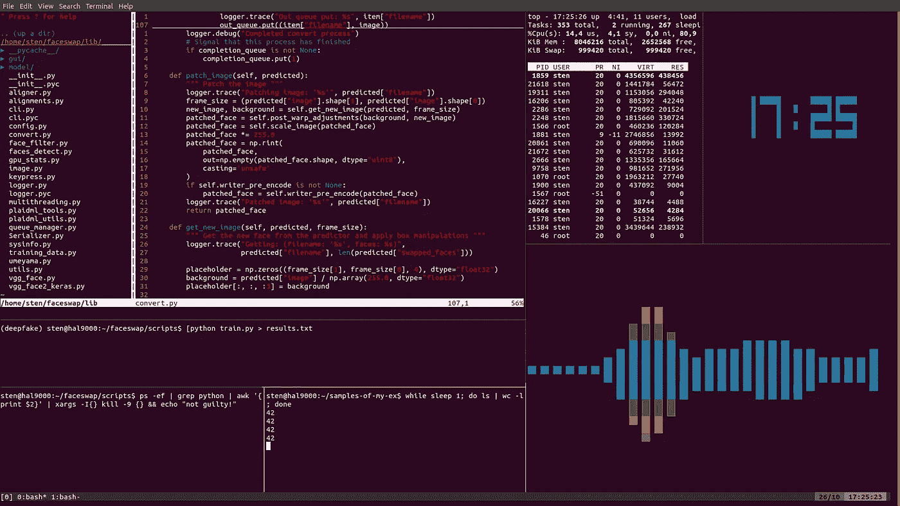
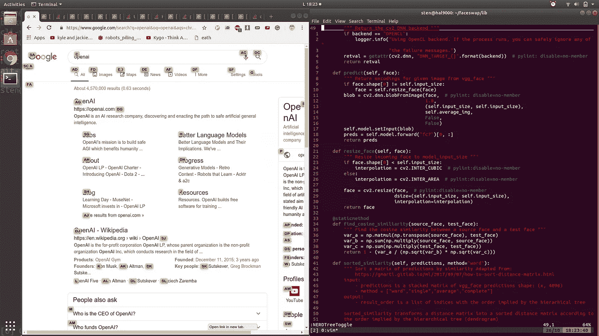

# 如何假装成为一名优秀的程序员

> 原文：<https://towardsdatascience.com/how-to-fake-being-a-good-programmer-cbef2c39764c?source=collection_archive---------0----------------------->

## 秘密就在光学中

Photo by [Braydon Anderson](https://unsplash.com/@braydona?utm_source=unsplash&utm_medium=referral&utm_content=creditCopyText) on [Unsplash](https://unsplash.com/s/photos/glasses-animal?utm_source=unsplash&utm_medium=referral&utm_content=creditCopyText)

程序员是巫师——贫穷、衣衫褴褛的角色将咖啡变成代码。我不懂魔术，我只是个魔术师。我的工作是做一个假程序员比做真正的程序员更真实。

我很擅长我的工作，一个十足的江湖骗子。我骗过一些商人，让我成为他们的技术合伙人。我骗过了工程师，让他们向我咨询人工*通用*智能。我的行为如此真实，以至于司法部曾经征求我的建议，用 Visual Basic 创建一个 [GUI 界面来追踪一个连环杀手的 IP 地址](https://www.youtube.com/watch?v=hkDD03yeLnU)。

秘诀:重要的不是你知道什么，而是你表现出什么。

真正的工程师缓慢而乏味，因为他们被现实所拖累。一个魔术师只受他的想象力的限制。他可以自由地表演最复杂的场景，越色情越好。公众对黑客的认知是由[狂欢](https://www.youtube.com/watch?v=uxKmDWDUZ5A)和[口交](https://www.youtube.com/watch?v=rUY8HysBzsE)的场景塑造的——成为利用他们错误观念的罕见个体，允许门外汉沉迷于他们的幻想，你将被誉为英雄。

一场令人信服的表演需要一个精心设计的舞台，因为它会分散观众的注意力，让他们意识不到你缺乏深度。在电影中，软件是通过将 [3D 块](https://www.youtube.com/watch?v=u1Ds9CeG-VY)堆叠在彼此之上，或者通过抚摸一些[全息图](https://www.youtube.com/watch?v=Ddk9ci6geSs)来编写的。当然，这是幻想。在现实生活中，最接近它的方法是结合使用三种古老的技术，这些技术都是几十年前发明的。

首先，你有 **vim** ，**一个高度可配置的文本编辑器，很难使用[数百万开发者](https://stackoverflow.blog/2017/05/23/stack-overflow-helping-one-million-developers-exit-vim/)无意中被困在它的爪子里，无法弄清楚如何关闭这个该死的东西。你大胆使用它的事实提升了你在同事中的地位。你似乎是彻头彻尾的神话，就神圣的[编辑战争](https://en.wikipedia.org/wiki/Editor_war)这样的历史主题启发他人，并激起对你讨伐 Emacs 教会的支持。**

第二，tmux 是一个允许你在一个终端窗口中打开多个窗格的工具。这意味着您可以在一个面板中编写代码，在另一个面板中运行终端命令，并在剩下的面板中打开完全无用的插件，如音频声谱图和超大时钟。一般来说，你希望尽可能多的窗格打开，用这种突兀的景象压倒观众的感官。我自己强调永远不要关闭窗格，因为没有功能的代码不会老化。

给你一个例子，这是我生成一些 deepfakes 时的屏幕快照:

Spectrogram credit: M.O.P. — Ante Up

最后，最重要的是你要掌握 bash，一种直接在命令行中使用的脚本语言。了解 bash 可以让你最大限度地利用在终端的时间——在表演中途离开是一种亵渎，相当于在电影中途打开电影院的灯。需要计算一些东西吗？给你:`echo "scale=0; 2 + 2" | bc`。想知道自己的 CPU 使用率？命令如下:`mpstat | grep -A 5 "%idle" | tail -n 1 | awk -F " " '{print 100 - $ 12}'a`。你明白了。

比离开终端更糟糕的事情是离开键盘。使用光标会显得无能。如果你有一台个人电脑，立即把你的牙齿咬进人体工程学的怪物——鼠标的尾巴。如果你使用笔记本电脑，在触摸板上粘上砂纸——你想把它的使用与鲜血和痛苦联系起来。

现在，当你在终端时，敲击键盘很容易。要继续在浏览器中聊天，请使用 **Vimium** ，这是一个 Chrome 扩展，可以在不使用鼠标的情况下帮助浏览网页。它通过一系列按键突出显示网站上的每个链接，按下这些按键会模拟鼠标点击，从而打开所需的页面。它看起来是这样的:

Vimium

作为一个专业提示，请注意我是如何在浏览互联网时打开终端的。正如剧作家约翰·海伍德所说，“半块面包总比没有好”。此外，仔细看看我的 Chrome 标签，可以发现 arXiv 论文和堆栈溢出帖子的混合。这不是偶然的。战略性编排的标签阵列传达出你已经跨坐在令人垂涎的*机器学习工程师*的椅子上，一条腿在理论上摇摆，另一条在实践中摇摆。

T2:舞台布置好了，表演可以开始了。你的一举一动都表明你最不需要一只老鼠。也许你可以靠在椅子上，把腿放在桌子上，把键盘放在腿上。我自己在离我的 40 英寸显示器 10 英尺远的豆包里晒太阳。

至于行为本身，记住:这是巴洛克风格，不是极简主义。你想用你敏捷的手指动作和复杂的过渡来吸引观众。在 vim 中，您从一行跳到另一行，从一个函数跳到另一个函数，速度之快，旁观者几乎没有注意到。就在他们的眼睛开始适应，就在他们要理解你的废话的时候——很少有任何一行真正包含有效的代码——你切换到另一个 tmux 面板，他们的斗争重新开始。

一场好的演出是由它引起的混乱和沮丧的程度来衡量的。伟大的表演令人作呕。它简直让观众神魂颠倒——他们情不自禁地抽搐着倒在地上，垂涎三尺。

也许你认为这样的权谋策略太天真和不真诚，浮夸太轻浮。你宁愿保持低调，专注于这门手艺，希望在努力、诚实工作的最后，你会得到认可。

也许会，但为什么要浪费你生命中最美好的十年去辛苦工作呢？为什么不把你的脚放在桌子上，马上表现得像个高手？让我告诉你，做一个假的大人物比做一个真正的无名小卒要好。