# 如何以正确的方式“养殖”Kaggle

> 原文：<https://towardsdatascience.com/how-to-farm-kaggle-in-the-right-way-b27f781b78da?source=collection_archive---------3----------------------->

## 本文描述了如何有效地使用 Kaggle 作为竞争平台，以最大的效率和盈利能力提高数据科学从业者技能的建议和方法。

**农场(farming)** —一种游戏策略，玩家通过重复动作来获得经验、点数或某种形式的游戏内货币。


# 描述

这些方法帮助我在六个月内获得了 [Kaggle 竞赛大师](https://www.kaggle.com/progression)的称号，仅仅是在单人模式下参加了三场比赛。当我在 Kaggle 上登上[200 强世界排名时(在撰写 2018-10-18 原文时)，他们也帮助了我。我希望这回答了我为什么冒昧地写这样一篇文章的问题。](https://www.kaggle.com/kruegger/competitions)

# 介绍

最近(2019 年 2 月 11 日)新一期[关于机器学习的惊人课程](https://mlcourse.ai/)已经上线。这门课程是英文的，它是根据一群 Kaggle 大师的意见创建的，我强烈推荐它作为任何想在数据科学领域开始职业生涯的人的入门课程。像往常一样，在完成这门课程(或任何这方面的课程)后，学生中出现了一个问题:我们在哪里以及如何获得实践经验来巩固新获得的理论知识。如果你在任何相关论坛上问这个问题，答案很可能是“Kaggle”。好吧，Kaggle 不错，但是从哪里入手，如何最高效的利用这个平台进行实践技能的提升呢？在本文中，我将根据自己的经验尝试给出这些问题的答案，并描述如何避免竞争数据科学领域的一般错误，并在过程中获得乐趣的同时加快提振您技能的过程。

关于[课程](https://mlcourse.ai/)的创始人的几句话:

mlcourse.ai 是 OpenDataScience 社区的主要活动之一。 [Yury Kashnitskiy(约尔科)](https://habr.com/ru/users/yorko/) *& Co. (~60 多人)*表明原则上不需要大学就能获得现代技术技能；此外，你可以完全免费这样做。这门课程的主旨是理论和实践的最佳结合。一方面，基本概念的介绍涉及一些数学知识，另一方面，在你的努力下，课堂竞赛和项目中的大量作业、*将提高你的机器学习技能。更不用说这门课程的竞争性质了——互动的学生评分让参与变得有趣，并激励他们坚持到最后。此外，该课程发生在一个真正充满活力的社区。*

在课程进行期间，有几场班级竞赛。两者都非常有趣，都是必需的特性工程。第一个是在 [*上，通过*](https://www.kaggle.com/c/catch-me-if-you-can-intruder-detection-through-webpage-session-tracking) *访问站点的顺序进行用户识别。第二种尝试* [*预测媒体文章的流行度*](https://www.kaggle.com/c/how-good-is-your-medium-article) *。在一些作业中，你需要尽最大努力在这些比赛中超越基线。*

向课程和它的创造者致敬，我们继续我们的故事…

我记得一年半前的自己，当我通过[来自吴恩达的第一版 ML 课程](https://www.coursera.org/learn/machine-learning)，完成 [MIPT 专精](https://www.coursera.org/specializations/machine-learning)，读了堆积如山的书……不用说，我有很多理论知识，但是当我试图从现实生活中解决一个基本任务时，我碰壁了。我不知道从哪里开始。我知道如何解决这个问题，知道使用哪些算法，但是写代码非常困难，必须不断地搜索提示，查看 sklearn 帮助等。为什么？因为我没有完成这样一项任务的工作流程和实践经验。

这样是行不通的，我想，然后走向卡格尔。从排名赛开始很吓人，第一个目标是入门赛“[房价:高级回归技术](https://www.kaggle.com/c/house-prices-advanced-regression-techniques)”。在进行这项竞赛的过程中，形成了高效的 kaggle 农业方法，本文对此进行了描述。

本文中描述的方法并不是唯一的，也没有“诀窍”，所有的方法和技术都是众所周知和简单明了的，但是这并没有降低它们的有效性。这些方法帮助我在六个月内获得了 [Kaggle 竞赛大师](https://www.kaggle.com/progression)的称号，仅仅是在单人模式下参加了三场比赛。当我在 Kaggle 上登上[200 强世界排名时(在撰写 2018-10-18 原文时)，他们也帮助了我。我希望这回答了我为什么冒昧地写这样一篇文章的问题。](https://www.kaggle.com/kruegger/competitions)

# 一言以蔽之，Kaggle 是什么？


Kaggle 是举办数据科学竞赛的最著名平台之一。在每场比赛中，赞助商主持真正的任务，提供任务的描述、任务的数据、用于评估解决方案的指标，还设置截止日期和奖金。参与者通常每天有 3 到 5 次机会“提交”该任务的解决方案。

数据分为训练集和测试集。您将获得培训部分的目标变量的值，而不是测试部分的目标变量的值。参与者应该创建一个模型，当对数据的训练部分进行训练时，该模型在测试集上实现最大结果(根据所选的度量)。

每个参与者对一个测试集进行预测，并将结果发送到 Kaggle 上，然后机器人(它知道测试集的目标变量)评估收到的结果，对其进行评分，并将其显示在排行榜上。

但事情没这么简单，测试数据依次按一定比例分为公共部分和私人部分。在比赛期间，根据测试集公共部分的既定指标对提交的解决方案进行评估，并将结果放在“公共”排行榜上，参与者可以在比赛期间评估他们模型的质量。最终解决方案(通常是参与者选择的两个)在测试数据的私人部分进行评估，结果将进入私人排行榜，该排行榜仅在比赛结束后才可见，实际上，最终评级将根据该排行榜进行评估，并分发奖品和奖牌。

因此，在比赛期间，参与者只知道他们的模型在测试数据的公开部分表现如何(产生的结果或分数)。如果在真空中的球形鸡的情况下，数据的私人部分具有与公共部分相同的分布和统计，那么一切都可能是好的。如果不是这样，那么这个被证明对测试集的公共部分有好处的模型可能会在私有部分失败。这被称为“在公共董事会上过度配合”。这导致了“排行榜外逃”，当公共排行榜上排名第 10 位的人在私人部分跌至 1000–2000 位，因为他们选择的模型过度拟合，无法在看不见的数据上给出所需的准确性。

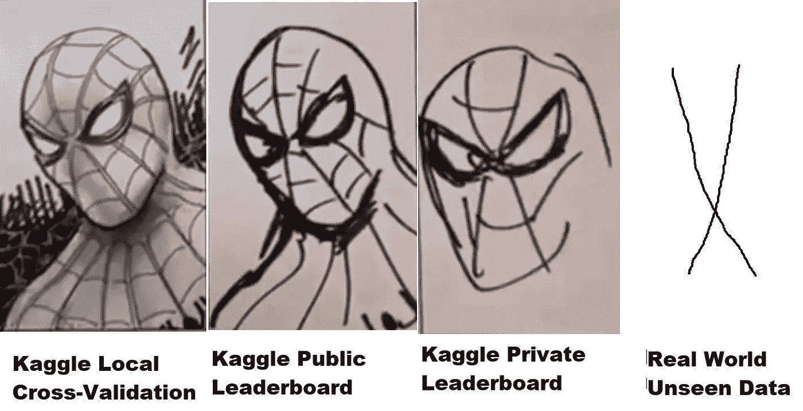

如何避免？首先，您需要建立一个适当的验证方案，这是几乎所有数据科学课程的第一课。为什么这么重要？好吧，如果你的模型不能对之前从未见过的数据集做出正确的预测，那么无论你使用什么样的技术或者你的神经网络有多复杂都没有用。您不能在生产中发布这样的模型，因为看不见的数据的结果将是没有价值的。

对于每场比赛，Kaggle 管理员都创建了自己的独立页面，其中包含数据、时间表、指标描述以及对我们来说最有价值的部分——论坛和内核。

论坛是一个标准的论坛，人们可以在这里讨论和分享想法。但是内核更有趣。事实上，是运行您的代码直接访问 Kaggle 云中的竞争数据(类似于 AWS、GCE 等)的机会。)每个内核的计算资源都是有限的，所以如果数据集不太大，你可以直接在 Kaggle 网站的浏览器上使用它。您可以编写代码、执行代码、调试代码，当然还可以提交结果。两年前，Kaggle 被谷歌收购，因此“引擎盖下”这一功能使用谷歌云引擎并不奇怪。

此外，还有几个竞赛(例如, [Mercari](https://www.kaggle.com/c/mercari-price-suggestion-challenge) )要求你只能通过内核处理数据。这是一种令人兴奋的格式，它补偿了参与者之间的硬件差异，并让您在代码优化和方法的主题上使用您的大脑，因为内核当时对资源有硬性限制(4 个内核/ 16 GB RAM / 60 分钟运行时间/ 1 GB 暂存磁盘空间和输出)。在这次比赛中，作者学到了比任何理论课程都多的关于神经网络优化的知识。得分比黄金级低一点，在单人模式中排名第 23，但获得了很多经验和快乐…

我很高兴借此机会再次感谢 ods.ai 的同事们——[亚瑟·斯特塞潘尼卡(亚瑟)](https://www.kaggle.com/kingarthur7)、[康斯坦丁·洛普欣(科斯蒂亚)](https://www.kaggle.com/lopuhin)、[谢尔盖·菲罗诺夫(谢尔盖夫)](https://www.kaggle.com/sergeifironov)对本次比赛的建议和支持。总的来说，有许多有趣的时刻，[Konstantin Lopuhin(kostia)](https://www.kaggle.com/lopuhin)，他在这次比赛中与[pawejankiewicz](https://www.kaggle.com/paweljankiewicz)一起获得了[第一名](https://www.kaggle.com/c/mercari-price-suggestion-challenge/discussion/50256)，随后[做了被称为“75 行参考羞辱”的帖子](https://www.kaggle.com/lopuhin/mercari-golf-0-3875-cv-in-75-loc-1900-s)，他们发布了 75 行内核，给出了黄金排行榜区的结果。你真得去看看！

好吧，让我们回到比赛上来。人们编写代码并发布带有解决方案、有趣想法等的内核。在每次比赛中，通常在比赛开始后的几周内，都会出现一两个漂亮的 EDA(探索性数据分析)内核，其中包含对数据集、属性统计、特征等的详细描述。和几个基线内核(基本解决方案)，当然，它们不会在排行榜上显示最佳结果，但您可以使用它们作为创建自己的解决方案的起点。

# 为什么是 Kaggle？

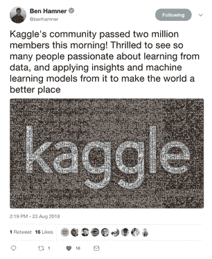

其实玩什么平台没什么区别。Kaggle 只是第一个也是最受欢迎的一个，有很棒的社区和舒适的环境(我希望他们会为了稳定性和性能而修改内核。许多人还记得在墨卡里发生的事情，但是，总的来说，这个平台是非常方便和自给自足的，卡格尔等级(大师)仍然很有价值。

在竞争数据科学的主题上有点偏离主题。很多时候，在文章、对话和其他交流中，人们认为比赛中获得的经验不能用于现实生活中的问题，所有这些人都只调了分数的第五位小数，这是疯狂的，离现实太远了。让我们更仔细地看看这个问题:

作为一名实践数据科学的专业人士，与来自学术界和科学界的人相比，我们应该并将在工作中解决实际的业务问题。换句话说，(这里引用的是 [CRISP-DM](https://wikipedia.org/wiki/CRISP-DM) )要解决这个问题有必要:

*   为了理解业务问题
*   评估数据以确定它是否能解决这个业务问题
*   如果现有数据不足以得到答案，则收集额外的数据
*   选择[最接近业务目标的指标](https://medium.com/usf-msds/choosing-the-right-metric-for-machine-learning-models-part-1-a99d7d7414e4)
*   并且只有在选择了一个模型之后，才转换所选模型的数据并“堆栈 xgbosts”。

这个列表中的前四项在任何地方都没有教授(如果有这样的课程，请纠正我——我会立即报名参加)，唯一的方法是从在特定行业工作的同事那里学习经验。但是最后一条——从选择车型开始，你可以，也应该在比赛中提高。

在任何比赛中，赞助商已经为我们完成了大部分工作。我们已经有了业务目标、选定的近似度量、收集的数据，我们的任务是从所有这些中构建一个工作管道。这里是技能需要改进的地方——如何处理缺失值，如何为神经网络和树准备数据(以及为什么神经网络需要一种特殊的方法)，如何建立一个验证方案，如何不过度拟合，如何选择合适的超参数，以及许多其他“如何做”,在我们的专业中，专家与路人之间的区别在于其执行能力。

# 你可以在 Kaggle 上“耕种”什么

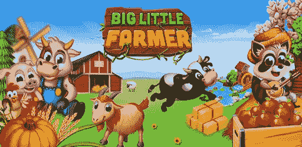

基本上，所有的新人来到 Kaggle 都是为了提高他们的实践经验，但不要忘记，除此之外，至少还有两个额外的目的:

*   农场奖章和军衔
*   Kaggle 社区的农场声誉

> ***需要记住的关键一点是，这三个目标是完全不同的，实现它们需要不同的方法，尤其是在初始阶段，不应该混淆！***

请注意单词**、【初始阶段】、**，因此当你提高技能时——这三个目标将合并为一个，并平行实现，但当你刚刚开始时——**不要把它们混淆**！这样你将避免痛苦、挫折和对这个不公正世界的怨恨。

让我们自下而上简要介绍一下目标:

*   **声誉** —通过在论坛上写好的帖子(和评论)和创建有用的内核来提高声誉。比如 EDA 内核(见上)，有创新技术描述的帖子等。
*   **奖牌** —一个非常有争议的话题，但是……它可以通过混合公共内核(*)、加入经验不平衡的团队，当然也可以通过创建自己的顶级解决方案来改进
*   **经验** —通过对决策和错误的分析得到增强。

(*) *混合公共内核—获得奖牌的技术，当选择公共排行榜上得分高的内核时，对它们的预测进行平均(混合)，并提交结果。通常，这种方法会导致在公共排行榜上很难超配，但有时会让你几乎获得银牌。在初始阶段，作者不推荐这种方法(阅读下面关于腰带和裤子的内容)。*

我建议首先选择“体验”目标，并坚持下去，直到你觉得准备好同时为两三个目标努力。

还有两件事值得一提[(Vladimir Iglovikov(tern aus)](https://www.linkedin.com/in/iglovikov/)——感谢提醒)。

**第一个**是将在 Kaggle 投入的精力转化为一份新的、更有趣和/或报酬更高的工作。对于理解题目的人来说，简历中的那一行“Kaggle 竞赛大师”和其他成就还是有价值的。

为了说明这一点，你可以阅读两个采访([一个](https://dev.by/news/angarsk-minsk)，[两个](https://dev.by/news/zachem-pobeditel-kaggle-i-topcoder-pereehal-v-minsk)，*请注意，这些采访是用俄语进行的*)与我们的同事[谢尔盖·穆欣斯基(切佩拉 _ 昂)](https://habr.com/users/cepera_ang/)和[亚历山大·布斯拉耶夫(阿尔布)](https://habr.com/users/albu/)

还有 Valeriy Babushkin (venheads) 的意见:

valeriy Babushkin——X5 零售集团数据科学负责人(领导一个 50 多人的团队，分为 5 个部门:CV、机器学习、数据分析、NLP 和 Ad Hoc)，*Yandex Advisor 分析团队负责人*

**Kaggle 竞赛大师是评估未来团队成员的一个很好的替代指标。当然，由于最近的事件是 30 人一组，而且几乎没有人做任何事情，这就需要比以前更仔细地研究这个轮廓，但这仍然只是几分钟的事。获得大师头衔的人，很有可能能够写出至少一般质量的代码，精通机器学习，能够清理数据并构建可持续的解决方案。如果你没有硕士学位，仅仅参与的事实也是一个加分项，至少候选人知道 Kaggle 的存在，并花了一些时间来熟悉它。如果他贡献的解决方案不仅仅是一个公共内核(这很容易检查)，这是一个关于技术细节的具体对话的好机会，这比传统的应届毕业生求职面试好得多，也更有趣，因为后者提供的信息少得多，不知道未来人们将如何在工作中取得成功。我们唯一需要担心的是，我遇到的是一些人认为数据科学工作与 Kaggle 相同，这完全不是事实。很多认为数据科学=机器学习，这也是错误的。**

***第二点**许多任务可以以预印本或文章的形式安排，一方面，它允许集体智慧在竞争中获得的知识不会在论坛的荒野中消亡，另一方面，它为作者的作品集增加了另一条线，为可见性增加了+1，这在任何情况下都会对职业生涯和引用指数产生积极影响。*

*例如，这是我们同事在几个比赛结束时的作品列表:*

*   *[使用深度卷积神经网络的卫星图像特征检测:Kaggle 竞赛](https://arxiv.org/abs/1706.06169)*
*   *[TernausNet:带有 VGG11 编码器的 U-Net，在 ImageNet 上预先训练，用于图像分割](https://arxiv.org/abs/1801.05746)*
*   *[使用深度卷积神经网络的血管发育异常检测和定位](https://arxiv.org/abs/1804.08024)*
*   *[机器人辅助手术中的自动器械分割使用深度学习](https://arxiv.org/abs/1803.01207) [用于从卫星图像中自动提取道路的全卷积网络](http://openaccess.thecvf.com/content_cvpr_2018_workshops/papers/w4/Buslaev_Fully_Convolutional_Network_CVPR_2018_paper.pdf)*
*   *[Ternausnetv2:全卷积网络实例分割](http://openaccess.thecvf.com/content_cvpr_2018_workshops/papers/w4/Iglovikov_TernausNetV2_Fully_Convolutional_CVPR_2018_paper.pdf)*
*   *[用于多级土地分割的特征金字塔网络](http://openaccess.thecvf.com/content_cvpr_2018_workshops/papers/w4/Seferbekov_Feature_Pyramid_Network_CVPR_2018_paper.pdf)*
*   *[使用深度卷积神经网络进行儿科骨龄评估](https://doi.org/10.1007/978-3-030-00889-5_34)*
*   *[使用卷积神经网络的摄像机型号识别](https://arxiv.org/abs/1810.02981)*
*   *[理解简单语音命令的深度学习方法](https://arxiv.org/abs/1810.02364)*
*   *[用于乳腺癌组织学图像分析的深度卷积神经网络](https://doi.org/10.1007/978-3-319-93000-8_83)*
*   *[通过集成深度学习分类框架进行糖尿病视网膜病变检测](https://doi.org/10.1101/225508)*
*   *[使用 U-Net 和 Lovasz-Softmax Loss 对卫星图像进行土地覆盖分类](http://openaccess.thecvf.com/content_cvpr_2018_workshops/papers/w4/Rakhlin_Land_Cover_Classification_CVPR_2018_paper.pdf)*
*   *[超像素土地覆盖分类和 Jaccard 指数后优化](http://openaccess.thecvf.com/content_cvpr_2018_workshops/papers/w4/Davydow_Land_Cover_Classification_CVPR_2018_paper.pdf)*
*   *[使用复合损失函数从卫星图像中检测建筑物](http://openaccess.thecvf.com/content_cvpr_2018_workshops/papers/w4/Golovanov_Building_Detection_From_CVPR_2018_paper.pdf)*
*   *[用卷积神经网络检测北大西洋露脊鲸叫声](http://lsis.univ-tln.fr/~glotin/icml4b_material_bck/ICML4B_short_Smirnov_CNN_RightWhale.pdf)*
*   *[奔跑，骨骼，奔跑:基于物理的模拟中的骨骼模型](https://arxiv.org/abs/1711.06922)*
*   *[学习运行挑战解决方案:适应神经肌肉骨骼环境的强化学习方法](https://arxiv.org/abs/1804.00361)*
*   *【ImageNet 分类的正则化方法与深度卷积神经网络的比较*
*   *[面向人脸表征学习的重身幽灵挖掘](http://openaccess.thecvf.com/content_ICCV_2017_workshops/w27/html/Smirnov_Doppelganger_Mining_for_ICCV_2017_paper.html) [具有辅助嵌入的硬示例挖掘](http://openaccess.thecvf.com/content_cvpr_2018_workshops/w1/html/Smirnov_Hard_Example_Mining_CVPR_2018_paper.html)*
*   *[在 Kaggle 竞赛框架内使用 WaveNet 进行销售预测](https://arxiv.org/abs/1803.04037)*

# *如何避免失去奖牌的痛苦*

**

> ***别管他们！***

*让我解释一下。实际上，在每一场接近尾声的比赛中，都有人用一个解决方案编写了公共内核，让整个排行榜上升，但你用你的解决方案却下降了。每次在论坛上痛苦就开始了！“哦，在这里我有一个银的解决方案，现在我甚至不在铜。到底是怎么回事，我们把东西都拿回来。”*

*请记住，Kaggle 是竞争数据科学，你在排行榜上的位置只取决于你自己。不是来自发布内核的人，也不是来自聚集在一起或不聚集在一起的明星，只是取决于你在决策中投入了多少努力，以及你是否使用了所有可能的方法来改进它。*

> ****如果公共内核把你从排行榜上抢走了——那不是你的位置。****

*而不是不得不为这个世界的不公倾吐痛苦——感谢这个家伙。说真的，比你的解决方案更好的公共内核意味着你在自己的管道中错过了一些东西。找到它，改进它，并以相同的分数绕过所有的仓鼠。记住，要回到原来的位置，你只需要比这个公共内核好一点点。*

*在第一场比赛的这个时刻，我是多么的沮丧！我的手开始下垂，我准备放弃了。刚才你还在银牌级别，而现在你在……排行榜的末尾。没关系，我只需要让自己明白在哪里错过了什么，就可以改变我的决定，回到比赛中来。*

*此外，这一时刻只会出现在你竞争过程的早期。你越有经验，就越感受不到发表的内核和明星的影响。在最近的一次比赛([谈话数据](https://www.kaggle.com/c/talkingdata-adtracking-fraud-detection)，我们的团队[获得第八名](https://www.kaggle.com/c/talkingdata-adtracking-fraud-detection/leaderboard))中有这样的内核，但在我们的团队聊天中，来自[的 Pavel Pleskov (ppleskov)](https://www.kaggle.com/ppleskov) 在一行文字中提到了它:“伙计们，我把它与我们的解决方案混合在一起，它变得更糟了，所以我把它扔掉了”。这意味着内核从数据中提取的所有有用信号都已经被我们的模型提取出来了。*

*顺便说一句，关于奖牌，请记住:*

> ****“没有技能的腰带只起到撑住裤子的作用”****

# *在哪里以及如何编写代码*

*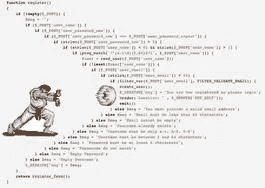*

*我推荐的是**Ubuntu**下 **jupyter 笔记本**的 **python 3.6** 。鉴于大量的库和社区，Python 已经成为数据科学中事实上的标准。Jupyter，尤其是有了**jupyter _ contrib _ nb extensions**的存在，对于快速原型制作、分析和数据处理非常方便。Ubuntu 本身很简单，而且数据处理部分有时用 bash 比用 python 更自然。*

*在安装了**jupyter _ contrib _ nb extensions**之后，我建议启用:*

*   ****可折叠标题*** *(真正有助于组织代码块)**
*   ***(同)***
*   ****(如果你需要调试什么东西的话很有用)****

**你的生活会变得更加舒适和愉快。**

**一旦您的管道变得或多或少稳定，我建议将您的代码转移到单独的模块中。相信我——你会重写不止一次两次甚至五次，这没关系。**

**有一种相反的方法，参与者试图尽可能少地使用 jupyter notebook，并且只在必要时使用，他们更喜欢通过脚本编写管道。(这个选项的内行，比如[(弗拉基米尔·伊格洛维科夫(ternaus)](https://www.linkedin.com/in/iglovikov/) )。你也可以阅读[“与卡格尔大师弗拉基米尔·伊格洛维科夫(Vladimir I. Iglovikov)的任意提问环节”](/ask-me-anything-session-with-a-kaggle-grandmaster-vladimir-i-iglovikov-942ad6a06acd)，在那里他描述了这种方法。**

**还有人试图将 jupyter 与任何 IDE 结合起来，比如 Pycharm。**

**每种方式都有存在的权利，各有利弊，就像他们说的，口味不同。选择你觉得舒服的工作。**

**但是在任何情况下，记住这条规则**

> *****保存每次提交/OOF 的代码。*(见下文)****

***(*)*[*OOF—out of folds*](https://image.slidesharecdn.com/kaggle-presentation-160918221740/95/kaggle-presentation-37-638.jpg?cb=1474237144)*，一种使用交叉验证为数据集的训练部分获取模型预测的技术。对于几个解决方案的进一步组合是至关重要的。***

**怎么会？嗯，至少有三种选择:**

*   **对于每个竞赛，我们在 [GitHub](https://github.com/) 或 [BitBucket](https://bitbucket.org/) 上创建一个单独的存储库，并为我们提交到存储库的每个代码提交一个注释，其中包含获得的分数、模型参数等。**
*   **每一次提交后的代码被组合成一个单独的档案，其文件名包含所有元信息(获得的分数、选项等)。)**
*   **使用了用于数据科学任务的专用版本控制系统。比如说 [DVC](https://dvc.org/) 。**

**一般来说，在社区中，有一种逐渐过渡到第三种选择的趋势，因为第一种和第二种都有缺点，但它们简单可靠，老实说，对 Kaggle 来说，它们绰绰有余。**

**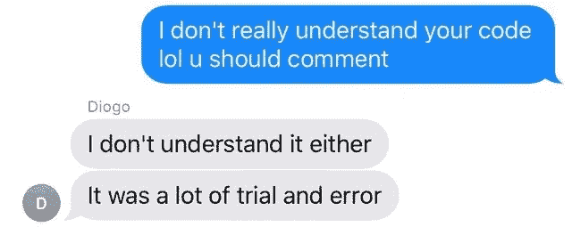**

**对于不是程序员的人，再多说几句 python。不要害怕。你的任务是理解基本的代码结构和语言的基本本质。它将使你能够理解别人的内核代码，并编写自己的库。在互联网上有许多优秀的初学者课程，也许在评论中，有人会给你链接。不幸的是(或者幸运的是)我不能评价这些课程的质量，所以我不会把这些链接放在文章里。**

# **好了，我们去框架**

**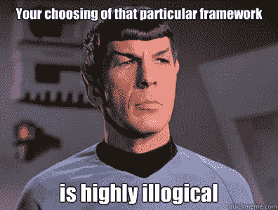**

> **本文中描述的所有技术都基于处理表格和文本数据。使用图片是一项独立的任务，具有独立的框架。在基本层面上，能够与它们一起工作是很好的，至少可以运行像 ResNet/VGG 这样的东西并获得特性，但是与它们进行更深入、更微妙的工作是一个单独的、非常广泛的主题，不在本文中讨论。**

**我不太擅长处理影像数据。唯一一次尝试是在比赛[相机识别](https://www.kaggle.com/c/sp-society-camera-model-identification)中，顺便说一下，在比赛中，带有**【ODS . ai】**标签的团队炸毁了整个[排行榜](https://www.kaggle.com/c/sp-society-camera-model-identification/leaderboard)，所以 Kaggle 管理员必须来我们的松弛区检查一切是否符合规则。在这次比赛中，我以第 46 名的成绩获得银牌，但当我阅读了我们同事对顶级解决方案的描述后，我明白这是我最好的地方，因为他们使用了一个真正的黑魔法，增加了图片，增加了 300 多 GB 的数据，牺牲了其他东西。例如，您可以阅读来自[Vladimir Iglovikov(tern aus)](https://www.linkedin.com/in/iglovikov/)的关于[“数据增强的重要性”](/forensic-deep-learning-kaggle-camera-model-identification-challenge-f6a3892561bd)的帖子。**

**一般来说，如果你想开始使用图像，那么你需要其他的框架和指南。**

# **主要目标**

**你的主要任务是为以下任务编写管道(以 jupyter 笔记本+模块的形式下发):**

*   **探索性数据分析。这里有必要做一个评论，Kaggle 上有专门训练过的人:)，他们每次比赛都写出非常好看和全面的 EDA 内核。击败他们很难，但理解如何看待数据仍然是必要的，因为在你的工作任务中，这个经过特殊训练的人就是你。所以你需要研究方法和途径，扩大你的图书馆。**
*   **数据清理—数据清理的所有方面。处理缺失值、异常值等。**
*   **数据准备就是为模型准备数据。多个块(通用，用于回归/神经网络，用于树模型，特殊(时间序列，图像， [FM/FFM](https://www.analyticsvidhya.com/blog/2018/01/factorization-machines/) )，文本([矢量器，TF-IDF](https://medium.com/@iamHarin/feature-extraction-from-text-e5f5c1b36fe9) ，[嵌入](https://machinelearningmastery.com/what-are-word-embeddings/)))**
*   **模型(线性模型、树形模型、神经网络、外来(调频/FFM))**
*   **特征选择**
*   **超参数搜索**
*   **全体**

**在公共内核中，所有这些任务通常都集中在一个代码中，但是我强烈建议为这些子任务中的每一个创建单独的笔记本和单独的模块(或模块集)。这个方法以后会对你有帮助。**

**为了防止可能的圣战，请记住——这个框架的结构并不是最后一个实例的真相，还有许多其他方式来构建管道，这只是其中之一。**

**数据以 CSV 或 feather/pickle/hdf 格式在模块之间传输，这是您喜欢的方式，也是您习惯或喜欢做的事情。**

**其实很多还是要看数据量。例如，在 TalkingData 竞赛中，[我必须通过 memmap](https://www.kaggle.com/c/talkingdata-adtracking-fraud-detection/discussion/56105) 来避免在为 lgb 创建数据集时出现内存不足的错误。**

**在其他情况下，主数据存储在 hdf/feather 中，这是 CSV 中的一个小文件(如所选属性集)。我重复一遍——没有模板，这只是可能的方式之一。你应该尝试所有的方法，选择最适合你的一个。**

# **初始阶段**

****

**从任何入门竞赛开始(如前所述，我从[房价:高级回归技术](https://www.kaggle.com/c/house-prices-advanced-regression-techniques)开始)，开始创建你的管道和笔记本。读取公共内核，复制代码片段、过程、方法等。，然后运行您的数据管道，提交—查看结果，改进，清洗并重复。**

> *****这一阶段的主要任务是创建一个高效运行的全周期管道——从读取和清理数据到创建最终提交。*****

**在进行下一步之前，应准备好并 100%工作的样本列表:**

*   **EDA(数据集统计、图表、一系列类别等)**
*   **数据清理(使用 fillna 填充缺失，清理类别，合并类别)**
*   **数据准备(通用(处理类别-标签/ohe/频率，数值到分类的投影，数值转换，宁滨)，用于回归(不同的比例))**
*   **模型(线性模型(不同的回归-岭/逻辑)，树模型(lgb))**
*   **特征选择(网格/随机搜索)**
*   **集合(回归/ lgb)**

# **投入战斗**

**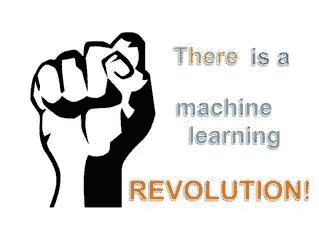**

**选择任何你喜欢的比赛，让我们开始…**

*   **查看数据，阅读论坛，建立一个强大的验证方案。如果没有强大的验证，你将在排行榜上落榜，就像在梅赛德斯、桑坦德和其他公司的竞争中发生的那样。例如，看看[梅赛德斯](https://www.kaggle.com/c/mercedes-benz-greener-manufacturing/leaderboard)和[讨论](https://www.kaggle.com/c/mercedes-benz-greener-manufacturing/discussion/36103)的排行榜(绿色箭头和数字表示与公众相比，人们在排行榜中上升的位置数，红色表示下降的位置数)**

***此时(2018-02-10)箭头从所有比赛的排行榜中移除。我不知道原因，但希望它会回来。***

*   **还有，我推荐阅读[文章(Rus)](https://habr.com/company/ods/blog/336168/)[演讲(Rus)](https://www.youtube.com/watch?v=HT3QpRp2ewA)[丹尼拉·萨文科夫(danila_savenkov)](https://www.kaggle.com/daniel89) :**
*   **此外，课程[如何赢得数据科学竞赛:向顶尖高手学习](https://www.coursera.org/learn/competitive-data-science)也很好地涵盖了这一主题**

> *****不要继续，直到您构建了一个健壮的验证模式——！！！*****

**好了，你得到了可靠的验证，下一步做什么？**

*   **运行您的管道并提交结果**
*   **抓住你的头，吓坏了，冷静下来…并继续…**
*   **阅读所有内核/论坛，了解使用的技术和方法**
*   **用新技术重建你的管道**
*   **转到步骤 1**

**记住你这个阶段的目标是获得经验！我们必须用工作方式和方法填充我们的管道，用工作代码填充我们的模块。不要担心奖牌——我的意思是，如果你能立即在排行榜上占据一席之地，那就太好了，但如果不能，也不要沮丧。我们来这里才五分钟，所以勋章和军衔不会去任何地方。**

**好了，比赛结束了，你在排行榜的某个位置，你学到了一些东西，想去参加下一场比赛？**

> *****不！*****

***下一步做什么:***

*   **等五天。不要看论坛，暂时忘记 Kaggle。让大脑休息一下，让眼睛有机会重新磨砺。**
*   **然后回到比赛中。在这五天中，根据礼仪规则，所有顶级团队都将在论坛上发布他们的解决方案，以帖子、内核或 GitHub 资源库的形式。**

***这里你的个人地狱开始了***

*   **你拿几张 A4 纸，在每张纸上写上来自上述框架的模块名称(EDA/Preparation/Model/Ensemble/Feature selection/Hyperparameters search/…)**
*   **然后坚持阅读所有高层决策，并用新的技术、方法和途径填写相应的表格。**

***还有最差的:***

*   **对于每个模块，您依次编写这些方法的实现，扩展您的管道和库。**
*   **然后运行更新后的管道并提交解决方案。**
*   **重复这个过程，直到你在排行榜的黄金区域找到解决方案，或者直到你失去耐心和勇气。**

> *****只有在那之后才能进入下一场比赛。*****

**不，我没开玩笑。是的，你可以做得更容易。由你来决定。**

**为什么要等 5 天，而不立即阅读论坛？嗯，你正在失去问一些问题的机会，但在这个阶段(在我看来)，最好是阅读已经形成的讨论解决方案的线索，然后问一些别人已经问过的问题，或者最好不要问，自己寻找答案。**

**你为什么要这么做？好吧，再说一遍——这个阶段的目的是开发你自己的解决方案、方法和途径的数据库。创造一个有效的渠道。所以在下一场比赛中，你不要浪费时间，只要说——是的，[的意思是这里可以使用目标编码](https://www.coursera.org/learn/competitive-data-science/lecture/b5Gxv/concept-of-mean-encoding),顺便说一下，我有正确的代码，它使用了折叠中的折叠。或者，我记得在那个任务中，最好的方法是使用 scipy.optimize 使用 ensemble，顺便说一下，我已经为它准备好了代码。**

**差不多吧…**

# **进入工作模式**

**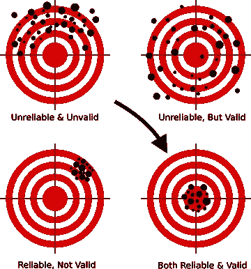**

**用同样的方法，你应该参加一些其他的比赛。每次我们注意到工作表中的条目越来越少，而模块中的代码越来越大。渐渐地，分析的任务收敛到确保你阅读解决方案的描述，说耶，地狱耶！并在你的库中添加一两种新的方法或途径。**

**此后，学习模式变为纠错模式。基础库已经准备好了，现在只需要正确使用了。每次比赛后，你都会阅读解决方案的描述，看看你做了什么，哪些地方可以做得更好，你错过了什么，或者你具体哪里搞砸了，就像我在[有毒](https://www.kaggle.com/c/jigsaw-toxic-comment-classification-challenge)中做的那样。我在黄金地带的下腹部走得很好，私下跌了 1500 点。这简直是侮辱到流泪…但我冷静下来，找到了一个 bug，在我们的 Slack 社区写了一个帖子——并吸取了教训。**

**建立工作模式的一个标志是，顶级解决方案的一个描述将写在你的昵称下。**

**粗略地说，在这个阶段结束时，您的管道中应该有什么:**

*   **预处理和创建数字特征的各种方法—投影、关系**
*   **关于如何处理类别的不同方法—意味着以正确的形式、频率、标签/ ohe 进行目标编码**
*   **文本的各种嵌入方案(Glove、Word2Vec、Fasttext)**
*   **文本的各种矢量化方案(计数、TF-IDF、哈希)**
*   **几个验证方案(N*M 代表标准交叉验证，基于时间，按组)**
*   **贝叶斯优化/超点/超参数选择的其他方法**
*   **用于特征选择的洗牌/目标排列/博鲁塔/ RFE**
*   **线性模型—编写代码，在一个处理过的数据集上以相同的风格运行不同的模型**
*   **LGB/XGB/Catboost —编写一个代码，在一个处理过的数据集上以相同的风格运行不同的模型**

***作者为具有相同外部接口的线性和基于树的模型分别创建了几个元类，以中和模型库的不同实现之间的 API 差异。但是现在他可以通过一行代码在一个处理过的数据集上运行同一类型的不同模型(例如 LGB 或 XGB)。***

*   **几个不同类型的神经网络(不用于图片)——文本的嵌入/CNN/RNN，序列的 RNN，其余的前馈。理解和实现[自动编码器](/deep-inside-autoencoders-7e41f319999f)是很好的。**
*   **基于 lgb/regression/scipy 的集成—分别用于回归和分类任务。**
*   **能够使用[遗传算法](/genetic-algorithm-implementation-in-python-5ab67bb124a6)很好，有时它们工作得相当好。**

# **总结**

**正如在任何运动中一样，在竞争数据科学中，有大量的汗水和大量的工作。这不好也不坏，这是事实。参加比赛(如果你正确地对待这个过程)会大大提高技术技能，而且或多或少会培养一种体育精神——当你真的不想做某事，但你拿起笔记本电脑，重建模型并运行它来提高你分数的这该死的第五位小数时。**

**所以去玩 Kaggle 吧——收获经验、奖牌和乐趣！**

# **关于作者的管道说几句话**

**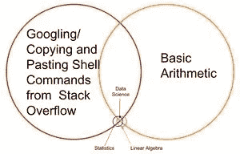**

**在这一节中，我将尝试描述一年半以来我收集的管道背后的基本思想。同样，这种方法并不要求普遍性或独特性，但也许您会发现它很有用。**

*   **除了平均目标编码之外，特征工程的所有代码都作为函数写在一个单独的模块中。我试图通过对象来实现，但结果很麻烦，在这种情况下没有必要。**
*   **特征工程的所有函数都采用相同的风格，并具有相同的调用签名和返回:**

```
**def do_cat_dummy(data, attrs, prefix_sep=’_ohe_’, params=None):
 *# do something*
return _data, new_attrs**
```

**输入是数据集、属性、新属性的前缀和附加参数。输出是具有新属性的新数据集和这些属性的列表。此外，这个新数据集存储在一个单独的 pickle/feather 中。**

**它提供了什么—我们能够从预先构建的部件快速组装工作数据集。例如，我们对类别进行了三种不同的处理——标签编码/ OHE /频率，并将它们存储在三个单独的羽毛中，然后在建模阶段，我们需要做的只是玩这些块，通过一个优雅的动作创建不同的数据集进行训练。**

```
**pickle_list = [
 ‘attrs_base’,
 ‘cat67_ohe’,
 # ‘cat67_freq’,
 ]
short_prefix = ‘base_ohe’

_attrs, use_columns, data = load_attrs_from_pickle(pickle_list)
cat_columns = []**
```

**如果有必要组装另一个工作数据集—我们只需要替换 pickle_list，重新加载并使用新的数据集。**

**表格数据(实数和分类数据)的一组基本函数包括各种类别编码、数字属性到分类数据的投影以及各种转换。**

```
**def do_cat_le(data, attrs, params=None, prefix=’le_’):
def do_cat_dummy(data, attrs, prefix_sep=’_ohe_’, params=None):
def do_cat_cnt(data, attrs, params=None, prefix=’cnt_’):
def do_cat_fact(data, attrs, params=None, prefix=’bin_’):
def do_cat_comb(data, attrs_op, params=None, prefix=’cat_’):
def do_proj_num_2cat(data, attrs_op, params=None, prefix=’prj_’):**
```

**Universal Swiss army knife 用于组合属性，它将源属性列表和转换函数列表作为输入，其输出通常是数据集和新属性列表。**

```
**def do_iter_num(data, attrs_op, params=None, prefix=’comb_’):**
```

**加上各种附加的特定转换器。**

**为了处理文本数据，使用了单独的模块，包括预处理、标记化、词条化/词干化、频率表中的翻译等不同方法。，使用 sklearn，nltk 和 keras。**

**时间序列在一个单独的模块中处理，该模块具有为常见任务(回归/分类)以及序列到序列任务转换源数据集的功能。感谢 Franç ois Chollet 对 keras 的更新，所以现在[构建 seq-2-seq 模型](https://blog.keras.io/a-ten-minute-introduction-to-sequence-to-sequence-learning-in-keras.html)看起来不像是恶魔召唤的巫毒仪式。**

**顺便说一下，在同一个模块中还有传统的序列统计分析功能——平稳性测试、STL 分解等。在分析的初始阶段“感受”时间序列并了解它实际上是什么是非常有用的。**

*   **不能立即应用于整个数据集的函数，以及您需要在折叠交叉验证中使用的函数，被移到单独的模块中:**
*   **平均目标编码**
*   **上采样/下采样**
*   **它们在训练阶段被传递到模型类的内部(见下文)。**

```
**_fpreproc = fpr_target_enc
 _fpreproc_params = fpr_target_enc_params

 _fpreproc_params.update(**{
 ‘use_columns’ : cat_columns,
 })**
```

*   **对于建模，创建了新的元类，它用抽象方法概括了模型的概念:fit/predict/set_params/ etc。对于每个库(LGB、XGB、Catboost、SKLearn、RGF……)来说，已经创建了这个元类的单独实现。**

**换句话说，为了与 LGB 合作，我们创建了一个模型**

```
**model_to_use = ‘lgb’
model = KudsonLGB(task=’classification’)**
```

**对于 XGB:**

```
**model_to_use = ‘xgb’
metric_name= ‘auc’
task=’classification’

model = KudsonXGB(task=task, metric_name=metric_name)**
```

**现在在我们的代码中，我们可以通用地操作这个模型。**

*   **为了验证，创建了几个函数，一个为几个种子同时计算预测和 OOF，另一个是使用 train_test_split 的基本验证，等等。所有函数都使用元模型方法进行操作，这提供了与模型无关的代码，并方便了与任何其他库的管道连接**

```
**res = cv_make_oof(
model, model_params, fit_params, dataset_params,     XX_train[use_columns], yy_train, XX_Kaggle[use_columns], folds, scorer=scorer, metric_name=metric_name, fpreproc=_fpreproc, fpreproc_params=_fpreproc_params, model_seed=model_seed, silence=True
)score = res[‘score’]**
```

*   **对于特征选择——没有什么有趣的，只是标准的 RFE，以及我最喜欢的所有可能方式的混合排列**
*   **为了找到超参数，我主要使用贝叶斯优化，再次以标准化的形式能够运行任何模型的搜索(通过交叉验证模块)。这段代码驻留在建模笔记本中**
*   **对于系综，创建了几个函数，根据岭/对数、LGB、神经网络和我最喜欢的 scipy.optimize 对回归问题和分类进行了标准化**
*   **稍微解释一下——管道中的每个模型都生成两个文件作为输出:sub_xxx 和 oof_xxx，分别表示测试集的预测和训练集的 oof 预测。接下来，在 ensemble 模块中，这些文件(来自所有模型)从指定目录加载到两个数据帧中— df_sub / df_oof。然后我们查看相关性，选择最好的，然后在 df_oof 上建立第二级模型并应用于 df_sub**
*   **有时候用[遗传算法](/genetic-algorithm-implementation-in-python-5ab67bb124a6)搜索模型的最佳子集会产生极好的结果(我用的是[这个库](https://github.com/DEAP/deap)，有时候[卡鲁阿纳](https://www.cs.cornell.edu/~caruana/ctp/ct.papers/caruana.icml04.icdm06long.pdf)的一个方法效果很好。在最简单的情况下，标准回归和 scipy.optimize 可以完成这项工作。**
*   **神经网络生活在一个独立的模块中，我在[中使用](https://keras.io/getting-started/functional-api-guide/) [keras](https://keras.io/) 一个函数风格，是的，我知道，它不如 [pytorch](https://pytorch.org/) 灵活，但也足够了。同样，通用的训练函数被编写，对网络的类型是不变的**

**这一管道在最近的 [Home Credit](https://www.kaggle.com/c/home-credit-default-risk) 的比赛中再次得到了检验，所有模块和模块的谨慎和准确应用为作者带来了第 94 名和一枚银牌。**

**作者其实很愿意表达一个煽动性的想法，对于表格数据和体面的管道，任何比赛的最终结果都必须在排行榜的前 100 名。当然也有例外，但总的来说，这种说法似乎是正确的。**

# **关于团队合作**

****

**如何解决 ka ggle——在团队或 solo 中——主要取决于一个人(和一个团队),但我对刚开始的人的建议是——尝试开始 solo。为什么？我会试着解释我的观点:**

*   **首先，你会看到自己的优势和劣势，并能够评估自己作为一名数据科学家的总体潜力。**
*   **其次，即使是在一个团队中工作(除非是一个建立良好的、角色分离的团队)，团队仍然会等待你的一个完成的解决方案。所以你必须有工作管道来很好地合作。**
*   **第三，最理想的是，当团队中球员的水平差不多时(并且足够高)，你可以学到一些真正有用的东西。在弱队(没有什么贬义，我说的是 Kaggle 上的训练水平和经验)IMHO 学点东西很难，不如看论坛和内核。是的，这是有可能的农场奖牌，但看到以上关于目标和一个腰带保持你的裤子**

# **来自明显队长的好建议和承诺的一般错误地图:**

**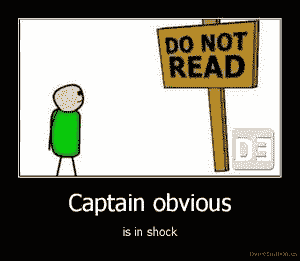**

> *****这些小技巧反映了作者的经验，可以(也应该)通过自己的实验来验证*****

*   **总是从建立一个健壮的验证方案开始——否则，所有其他的努力都是徒劳的。再看看[奔驰](https://www.kaggle.com/c/mercedes-benz-greener-manufacturing/leaderboard)的排行榜。**

***令作者非常高兴的是，在这次比赛中，他建立了一个强大的交叉验证方案(3x10 倍)，保持了一个分数，并获得了第 42 名。***

*   **如果你已经建立了一个可靠的验证——永远相信你的验证结果。如果你的模型的分数因为验证而提高，但是在公共排行榜上变得更差，相信验证是更明智的。在分析中，只考虑数据，这是一个公共排行榜作为另一个折叠。你不会想让你的模型在一个单一的折叠上过度拟合，对吗？**
*   **如果模型和方案允许-始终进行 OOF 预测并将其保存在模型旁边。在合奏阶段，你永远不知道什么最有帮助。**
*   **总是将代码保存在结果/OOF 旁边，以便重新创建它们。在哪里保存并不重要——在 GitHub，本地，任何地方。有两次，我发现最好的模型是两周前开箱的，而且没有保存代码。痛苦。**
*   **放弃选择交叉验证的“正确”种子。最好选择任意三个一，做 3хN 交叉验证。结果会更稳定。**
*   **不要追逐集合中模型的数量——越少越好，但要更加多样化——在模型、预处理和数据集方面多样化。例如，在最坏的情况下，在参数中，一个深树具有硬正则化，一个浅树。**
*   **对于特征选择，使用无序排列/博鲁塔/ RFE，记住在不同的基于树的模型中，特征的重要性是一袋锯屑中鹦鹉的度量。**
*   **作者个人意见(可能与读者意见不一致)[贝叶斯优化](https://github.com/fmfn/BayesianOptimization/blob/master/README.md) >随机搜索> [超视](https://github.com/hyperopt/hyperopt)对于超参数的选取。("> " ==更好)**
*   **如果您在公共排行榜上看到分数更高的公共内核，最好的处理方式是:**

1.  **如果您有时间，看看有什么新内容，更新您的渠道**
2.  **更少的时间-为您的验证方案重建它，运行，获得预测-并在您的集合中使用它**
3.  **没有时间—只要混合您的最佳解决方案并查看分数。**

*   **如何选择两个最终的提交——当然是凭直觉。但说真的，通常每个人都会实践以下方法:**

1.  **保守提交(可持续模式)/风险提交。**
2.  **在验证/公共排行榜上获得最高分**

> *****记住——你周围的一切都是数字，使用它们的可能性只取决于你的想象力。用分类代替回归，把序列当成图片等等。*****

**最后:**

*   **加入 [ods.ai](http://ods.ai/) ，享受数据科学和生活带来的乐趣！**

# **有用的链接**

****

**请注意，下面的一些材料是俄语的，**

## **普通的**

**[http://ods.ai/](http://ods.ai/)—面向那些想要加入最好的数据科学社区的人**

**【https://mlcourse.ai/ —尼斯机器学习课程网站**

**https://www.Kaggle.com/general/68205——在 Kaggle 上发布关于课程的帖子(上一个链接)**

**总的来说，我强烈推荐使用本文描述的方法观看[系列视频 ml training(Rus)](https://www.youtube.com/channel/UCeq6ZIlvC9SVsfhfKnSvM9w/videos)，其中有许多有趣的方法和技巧。**

## **录像**

*   **[关于如何成为大师的非常好的视频:](https://www.youtube.com/watch?v=fXnzjJMbujc)[帕维尔·普莱斯科夫](https://www.kaggle.com/ppleskov)**
*   **[来自](https://www.youtube.com/watch?v=g335THJxkto)[Stanislav semen ov(stasg 7)](https://www.kaggle.com/stasg7)的关于黑客攻击、非常规方法和目标手段编码的视频，以法国巴黎银行竞赛为例**
*   **[斯坦尼斯拉夫斯基的另一个视频《卡格尔教什么》](https://www.youtube.com/watch?v=GT4G7Vawt0Q)**

## **课程**

**你可以从这个[专业化](https://www.coursera.org/specializations/aml) — [如何赢得数据科学竞赛:向顶尖 kaggler](https://www.coursera.org/learn/competitive-data-science)学习的第二个课程中学到更多在 Kaggle 上解决问题的方法和途径。**

## **额外阅读:**

*   **[Laurae++，XGBoost/LightGBP 参数](https://sites.google.com/view/lauraepp/parameters)**
*   **[FastText —脸书文本的嵌入](https://github.com/facebookresearch/fastText)**
*   **[WordBatch/FTRL/FM-FTRL —一套库](https://github.com/anttttti/Wordbatch)来自 [@anttip](https://www.kaggle.com/anttip)**
*   **[FTRL 的另一种实现](https://github.com/alexeygrigorev/libftrl-python)**
*   **[用于选择超参数的贝叶斯优化库](https://github.com/fmfn/BayesianOptimization/blob/master/README.md)**
*   **[正规化贪婪森林(RGF)库——另一种树法](https://github.com/RGF-team/rgf)**
*   **[凯格勒模型堆叠实践指南](http://blog.kaggle.com/2016/12/27/a-kagglers-guide-to-model-stacking-in-practice/)**
*   **[ELI5 是一个很棒的库，用于可视化来自](https://github.com/TeamHG-Memex/eli5)[Konstantin Lopuhin(kostia)](https://www.kaggle.com/lopuhin)的模型的重量**
*   **[功能选择:目标排列，并跟随](https://www.kaggle.com/ogrellier/feature-selection-target-permutations)中的链接**
*   **[树模型的特征重要性度量](https://medium.com/the-artificial-impostor/feature-importance-measures-for-tree-models-part-i-47f187c1a2c3)**
*   **[重要性为零的特征选择](https://www.kaggle.com/ogrellier/feature-selection-with-null-importances)**
*   **[自动编码器简介](https://www.kaggle.com/shivamb/how-autoencoders-work-intro-and-usecases)**
*   **[幻灯片共享上关于 Kaggle 的演示](https://www.slideshare.net/markpeng/general-tips-for-participating-kaggle-competitions)**
*   **[又一个](https://www.slideshare.net/HJvanVeen/kaggle-presentation?qid=9945759e-a06f-447d-bcfb-2a15592f30b6&v=&b=&from_search=11)**
*   **这里有很多有趣的东西**
*   **[ka ggle 比赛获奖方案](https://www.kaggle.com/sudalairajkumar/winning-solutions-of-kaggle-competitions)**
*   **[ka ggle 上的数据科学术语表](https://www.kaggle.com/shivamb/data-science-glossary-on-kaggle-updated/)**

# **结论**

**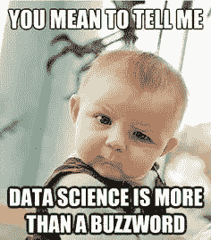**

**一般来说，数据科学的主题，特别是竞争数据科学的主题是*“像原子一样永不枯竭”*。在这篇文章中，作者仅仅触及了使用竞争平台提升实践技能这个主题的表面。如果你感兴趣——在 Kaggle 上注册，考察它，收集经验——写你自己的文章。好内容的数量越多，对我们大家越好！**

**不，作者的管道和库还没有公开。**

**非常感谢来自 [ods.ai](http://ods.ai) 的同事们:[弗拉迪米尔·伊格洛维科夫(特尔瑙斯)](https://www.linkedin.com/in/iglovikov/)，[尤里·卡什尼茨基(约尔科)](https://habr.com/users/yorko/)，[瓦列里·巴布什金(文海德)](https://www.linkedin.com/in/venheads/)，[阿列克谢·普龙金(普龙金 _ 阿列克谢)](https://www.linkedin.com/in/avpronkin/)，[德米特里·彼得罗夫(德米特里 _ 彼得罗夫)](https://habr.com/users/dpetrov_ml/)，[阿图尔·库津(n01z3)](https://www.kaggle.com/drn01z3)**

**特别感谢[Nikita Zavgorodnii(njz)](https://www.linkedin.com/in/nikita-zavgorodnii/)—最后的校对。**

**也感谢[阿列克谢·伊斯克洛夫](https://www.linkedin.com/in/iskrov)和[弗拉德·伊凡诺夫【命运】](http://www.kaggle.com/fatefulstudent)对翻译的修改。**

**感谢您的关注，希望这篇文章对某人有用。**

**我在*ka ggle*/*ODS . ai*:**kruegger****

***本文原文为俄语，* [*发表于 2018 年 10 月 18 日 habr.com*](https://habr.com/ru/company/ods/blog/426227/)*。***